# 在PowerBI中创建层次结构

> 原文：<https://www.tutorialgateway.org/create-hierarchy-in-power-bi/>

高级商业智能层次结构为您提供了深入查看商业智能报告的操作。让我用一个例子向您展示如何在 Power BI 报告中创建层次结构。

## 如何在PowerBI中创建层次结构

为了演示 Power BI 中层次结构的创建，我们将使用我们在[合并多个表](https://www.tutorialgateway.org/combine-multiple-tables-in-power-bi/)一文中创建的表。

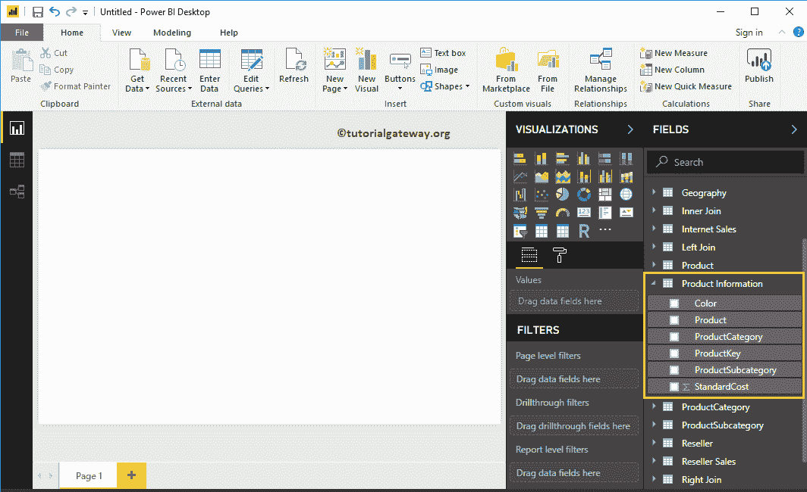

有几种方法可以创建层次结构

### PowerBI中创建层次结构的第一种方法

要在 Power BI 中创建新的层次结构，请将一个字段拖放到另一个字段上。它会自动为您创建一个层次结构。为了在 [Power BI](https://www.tutorialgateway.org/power-bi-tutorial/) 中演示相同的内容，我们将产品子类别拖到产品类别字段中。

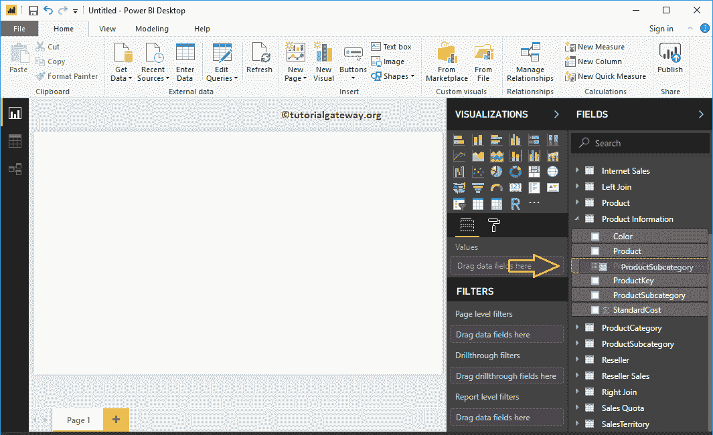

现在，您可以看到新创建的层次结构。

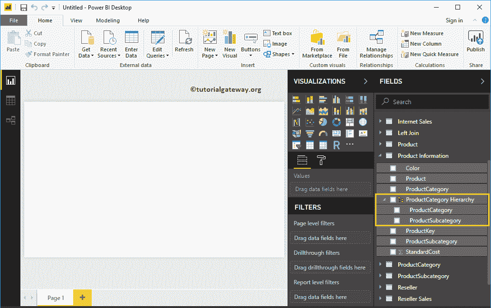

#### 向 Power BI 层次结构添加字段的第一种方法

将所需字段拖放到新创建的层次结构中。让我拖动颜色字段。

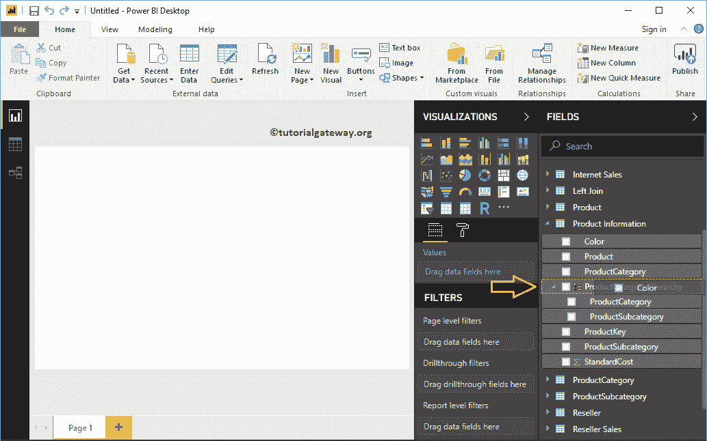

现在，您可以在层次结构中看到颜色字段。

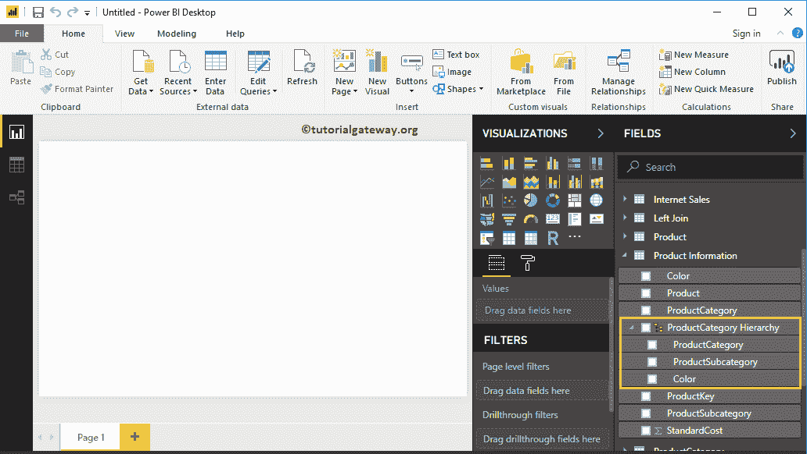

#### 将字段添加到 Power BI 层次结构可视化的第二种方法

请选择您要添加的字段(让我选择产品)，右键单击它将打开上下文菜单。选择添加到层次结构，然后选择名称(产品类别)

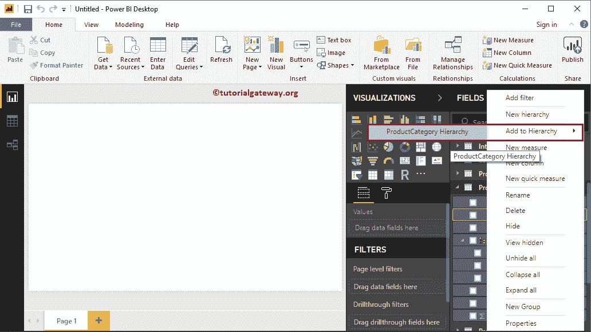

现在，您可以在层次结构下看到产品。

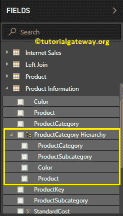

#### 更改PowerBI中的层次级别

配置层次级别时请小心。例如，如果国家/地区上方有“州”列，则级别 1 是州，级别 2 是国家/地区。

请选择要更改职位或级别的字段。接下来，右键单击它并从上下文菜单中选择上移选项(或下移)。或者，将字段拖放到所需位置。

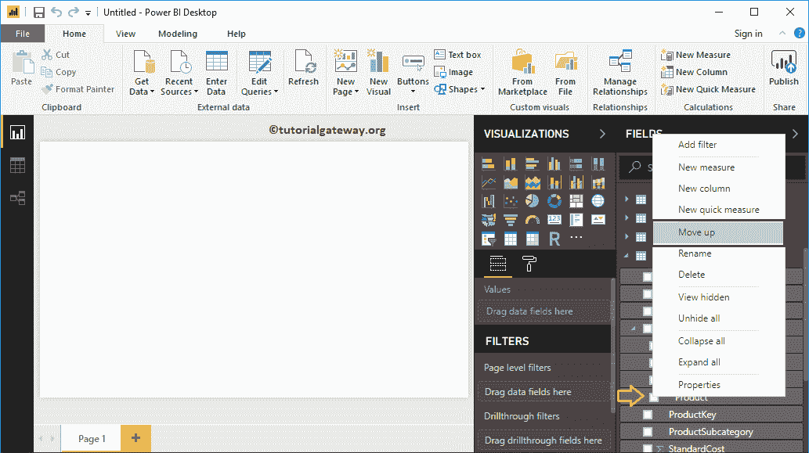

现在你可以在第三个位置

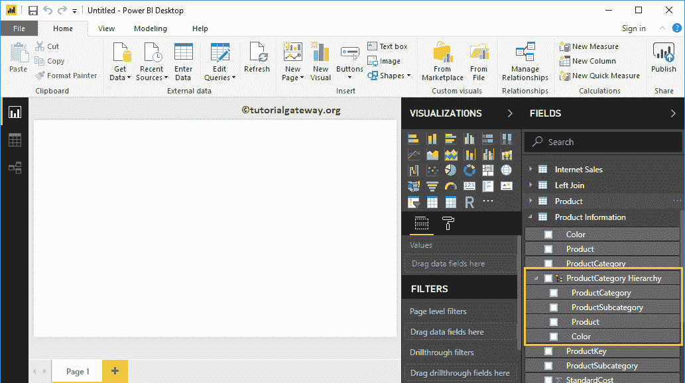

看到产品

#### 在PowerBI中重命名层次结构

请选择您创建的层次结构，右键单击它将打开上下文菜单。从上下文菜单中选择重命名选项。或者，您可以双击名称

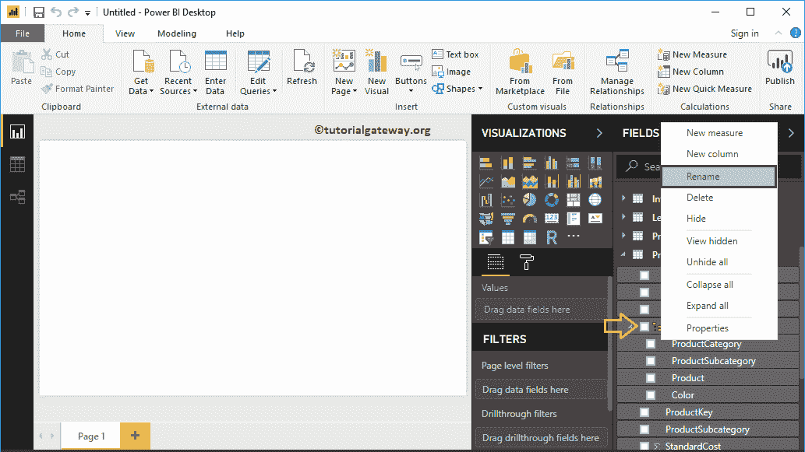

让我把它重新命名为产品

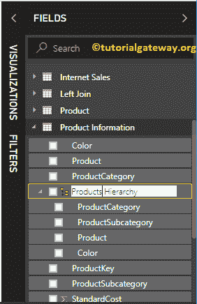

现在你可以看到新名字

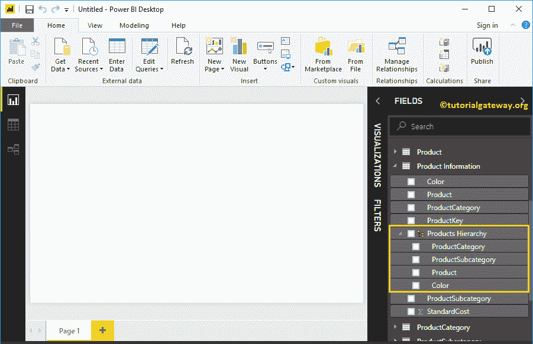

#### 删除PowerBI中的层次结构

选择要删除的层次结构，然后右键单击它打开上下文菜单。请从上下文菜单中选择删除选项。

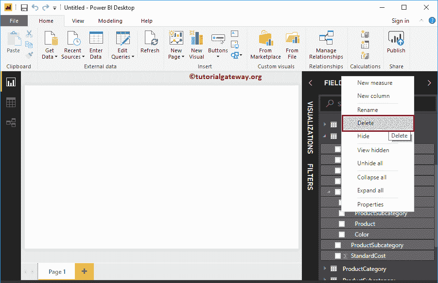

单击删除按钮确认删除操作。

### 在PowerBI中创建层次结构的第二种方法

请选择您要在其中使用的字段，右键单击它将打开上下文菜单。从上下文菜单中选择“新建层次结构”选项。

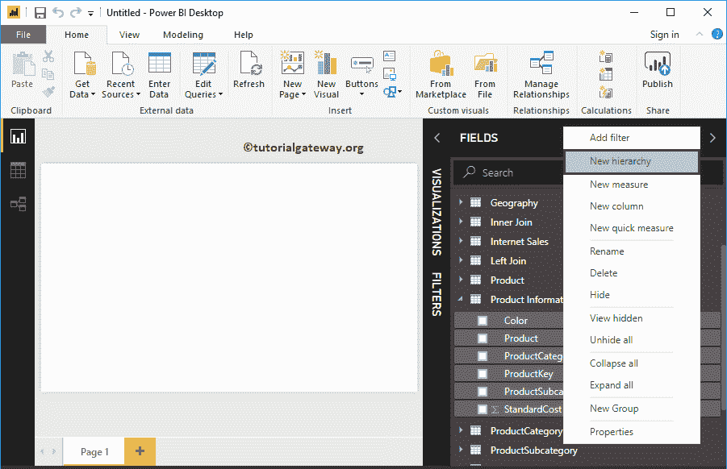

它为你创造了一个新的。

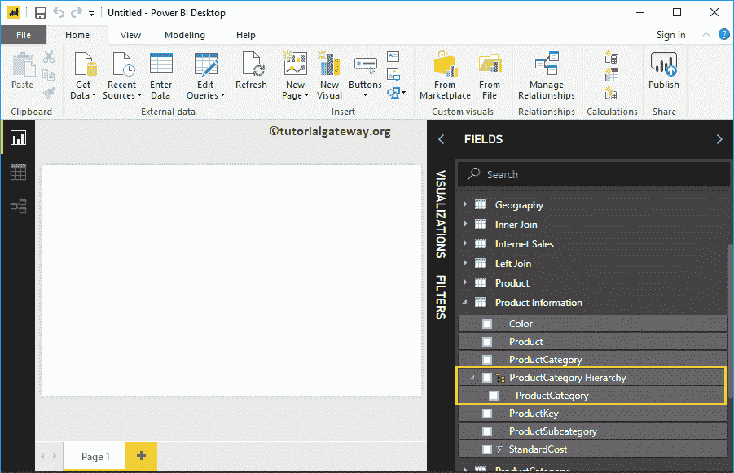

让我再添加几个字段

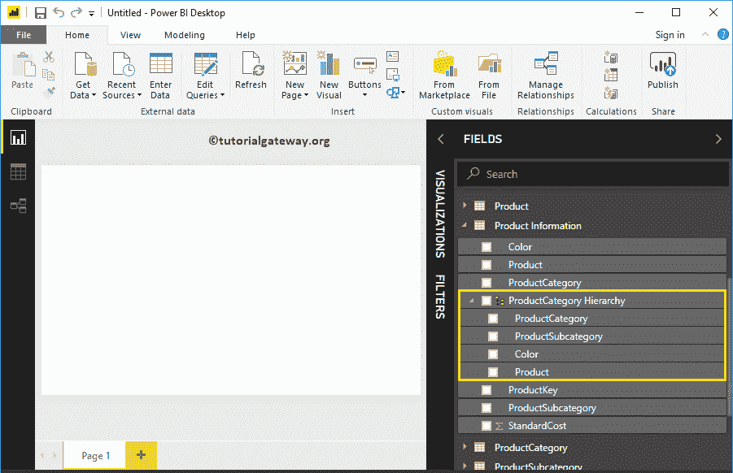

#### 从层次结构中删除字段

请选择要从层次结构中删除的字段。接下来，右键单击它并从上下文菜单中选择删除选项。

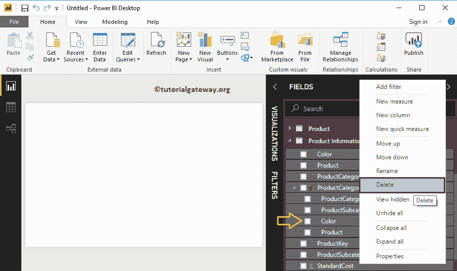

单击删除按钮从其中删除颜色字段。

你可以在下面的截图

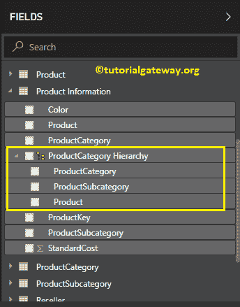

中看到同样的情况

同样，我们添加了颜色字段，并将其重命名为产品信息。

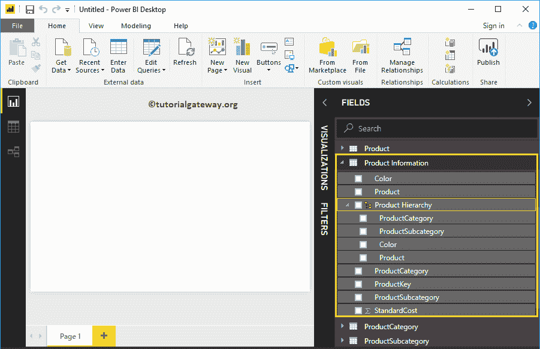