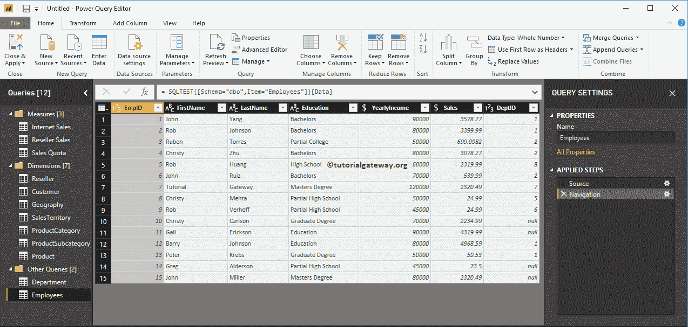
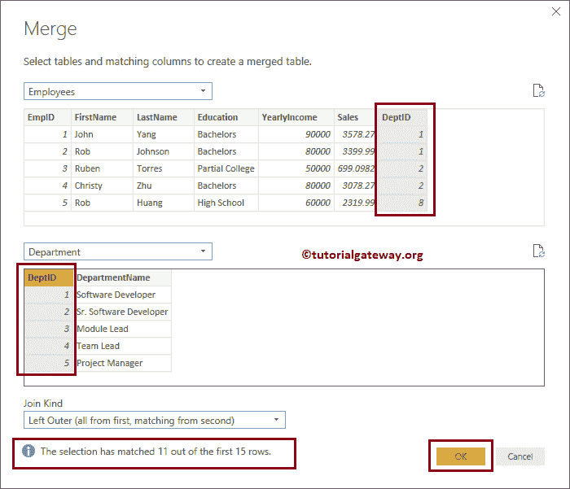

# 加入 PowerBI

> 原文：<https://www.tutorialgateway.org/joins-in-power-bi/>

Power BI 支持 SQL 中可用的所有主要连接。让我用一个例子向您展示如何在 Power BI 中使用联接来联接多个表。以下联接类型是 Power BI 和 SQL 中的标准联接类型

1.  [内部连接](https://www.tutorialgateway.org/sql-inner-join/):仅当匹配时才返回左表和右表中的行。否则，它将返回零条记录。
2.  [全外连接](https://www.tutorialgateway.org/sql-full-join/):返回左右表中的所有行。
3.  [左外连接](https://www.tutorialgateway.org/sql-left-join/):返回左表中存在的所有行和右表中匹配的行(如果有)。
4.  [右外连接](https://www.tutorialgateway.org/sql-right-join/):返回左表中匹配的行(如果有)，以及出现在 [SQL](https://www.tutorialgateway.org/sql/) 右表中的所有行。

## 如何在 PowerBI 中执行连接

为了演示 Power BI 连接类型，我们将使用我们在[从多个数据源](https://www.tutorialgateway.org/load-data-from-multiple-data-sources-in-power-bi/)加载数据文章中导入的表。

要显示对现有表的连接操作，请单击“主页”选项卡下的“编辑查询”选项。

以下 [Power BI](https://www.tutorialgateway.org/power-bi-tutorial/) 截图为您展示了

员工表中的数据

下面的截图显示了部门表中的数据。

要对任何表执行 Power BI Join 操作，我们必须使用主页选项卡

中的合并查询按钮

该下拉列表有两个选项:

*   合并查询:它合并原始表中的第二个表。
*   将查询合并为新查询:它创建一个新表，其结果是连接第一个和第二个表。

让我选择雇员表，并选择合并查询作为新选项，因为我们不想打扰原始表

将打开以下窗口。使用此窗口选择两个表中的第二个表、连接类型和标准列字段。

我们选择部门表作为第二个表。

现在，您可以看到支持连接类型的列表。

### PowerBI 中的左外连接

现在，我们选择左外连接

接下来，我们从员工和部门表中选择部门代码作为常用字段

现在，您可以看到名为 Merge1 的新表，其中包含来自 Employees 表的所有字段以及一个额外的值字段表

点击表上任意一行显示你各自的表信息

请点击部门列标题的右上角。这将打开以下窗口。使用此窗口从部门表中选择必填字段。

让我从部门表中选择部门名称，点击【确定】

现在，您可以看到部门名称与雇员表合并。

### PowerBI 中的右外连接

让我选择雇员表作为第一个表，部门表作为第二个表。部门标识是公共字段，右外连接是连接类型。

现在你可以看到

Power BI 右外连接的新表结果

### PowerBI 中的全外连接

让我选择雇员表作为第一个表，部门表作为第二个表。这里，我们选择部门标识作为公共字段，选择全外连接作为连接类型。

现在你可以在一个新的表

中看到 Power BI Full 外连接的结果

### PowerBI 中的内部连接

让我选择员工和部门表，部门标识作为公共字段，内部连接作为连接类型

现在你可以在新的表

中看到 Power BI 内部连接的结果