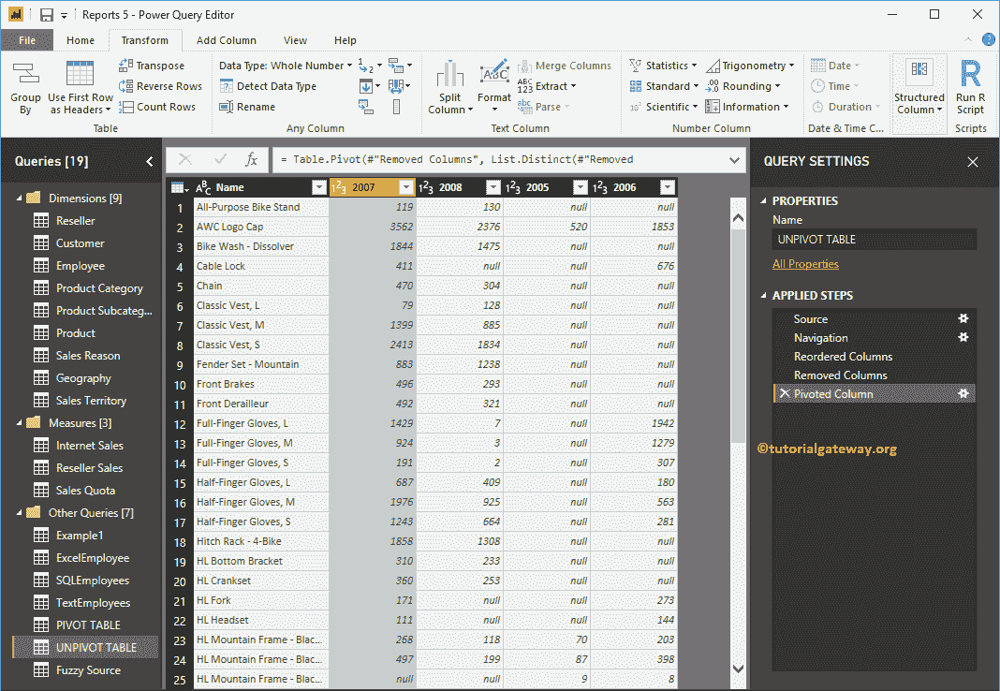

# PowerBI数据透视表

> 原文：<https://www.tutorialgateway.org/pivot-table-in-power-bi/>

Power BI 透视表选项将选定的行转换为列。让我用一个例子向您展示如何在 Power BI 中创建一个数据透视表，或者如何将未透视的数据转换为数据透视表。

## 如何创建PowerBI数据透视表

要创建 Power BI 透视表或转换透视，请单击“主页”选项卡下的“编辑查询”选项。

单击编辑查询选项将打开一个名为 [Power BI](https://www.tutorialgateway.org/power-bi-tutorial/) Power 查询编辑器的新窗口。

在本 Power BI 透视表示例中，我们将根据订单数量透视日历年列。

要将逆透视转换为透视表，请转到“转换”选项卡。在该选项卡下，您可以找到透视列按钮，如下所示。

单击透视列按钮将打开以下窗口。

让我选择订单数量作为值列

接下来，我们选择总和作为聚合函数值

现在可以看到

的 Power BI 透视表

如果您的表有多个静态列(在透视过程中不会改变的列)会怎么样？为此，我们在该表中添加了一个名为“产品标识”的列。

让我选择订单数量列作为数值列，总和作为聚合函数

现在，您可以在 Power BI 中看到数据透视表。请记住，拥有多个不变的静态列对创建它没有任何影响。

接下来，点击主页选项卡下的关闭并应用选项来应用这些更改。

从下面的截图中，您可以看到透视列。

