# 在Power BI 中删除或重新排序列

> 原文：<https://www.tutorialgateway.org/remove-or-reorder-columns-in-power-bi/>

一般来说，我们从源中获得的数据可能很少有不需要用于分析目的的列。让我用一个例子向您展示在 Power BI 中删除或重新排序列所需的步骤。

## 如何删除或重新排序 Power BI 中的列

要对列重新排序，或从现有的 Power BI 表中删除不需要的列，请单击“主页”选项卡下的“编辑查询”选项。

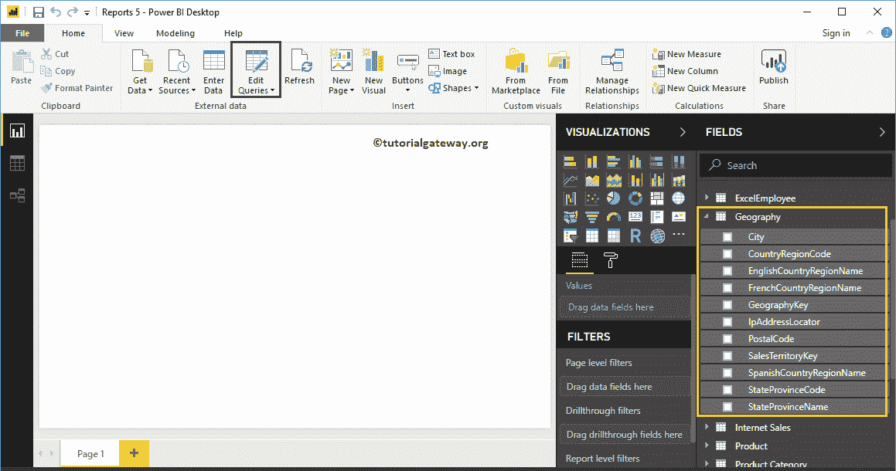

单击编辑查询选项将打开一个名为超级查询编辑器的新窗口。

从下面的 [Power BI](https://www.tutorialgateway.org/power-bi-tutorial/) 截图中，可以看到有国家代码，国家代码，分析目的不需要。因此，让我从这个 PowerBI 地理表

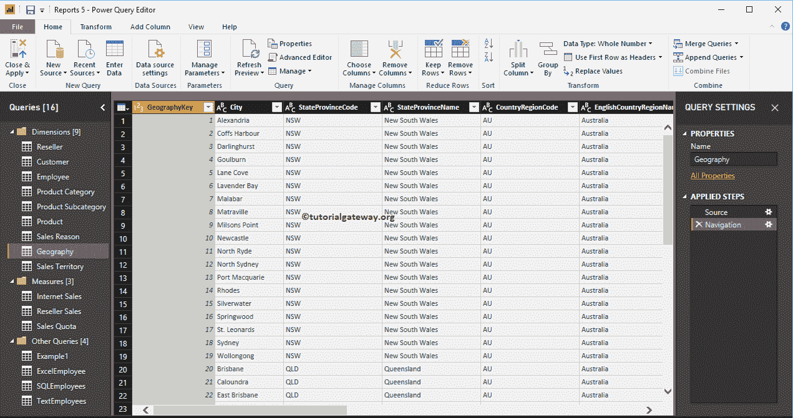

中删除这些列

### 删除 PowerBI 中的列

要删除 Power BI 列，请选择要删除的列，然后右键单击它打开上下文菜单。从上下文菜单

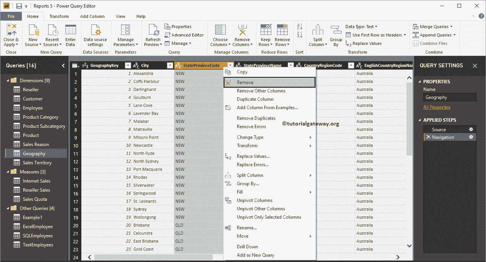

中选择移除选项

现在，您可以看到州-省代码列从表中删除了。您可以在“应用的步骤”部分看到相同的内容。

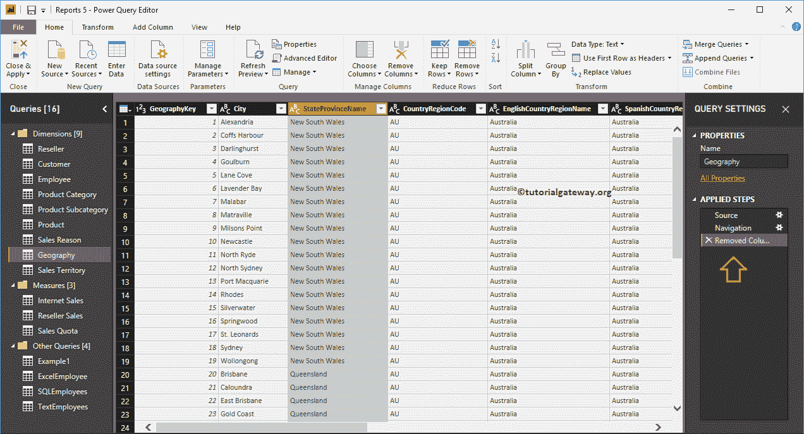

使用“删除其他列”选项从表中删除除选定列之外的所有列。

出于演示目的，我选择了城市，并从上下文菜单中选择了删除其他列选项。

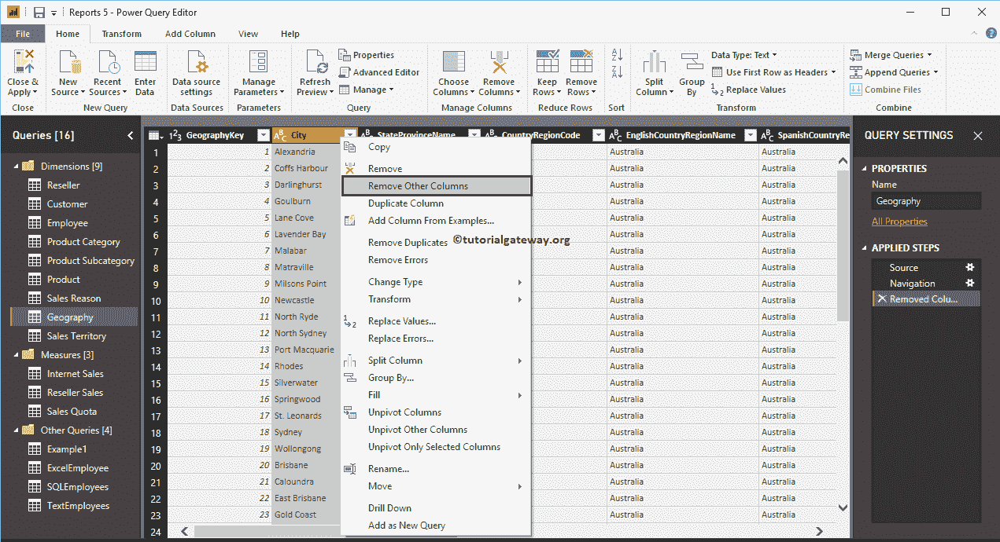

如您所见，除“城市”之外的所有其他列都已从“地理”表中删除。

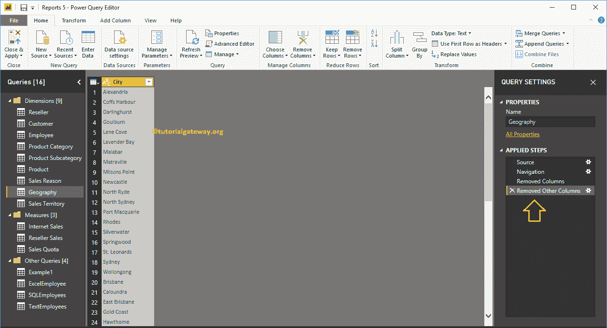

或者，您可以单击主页选项卡

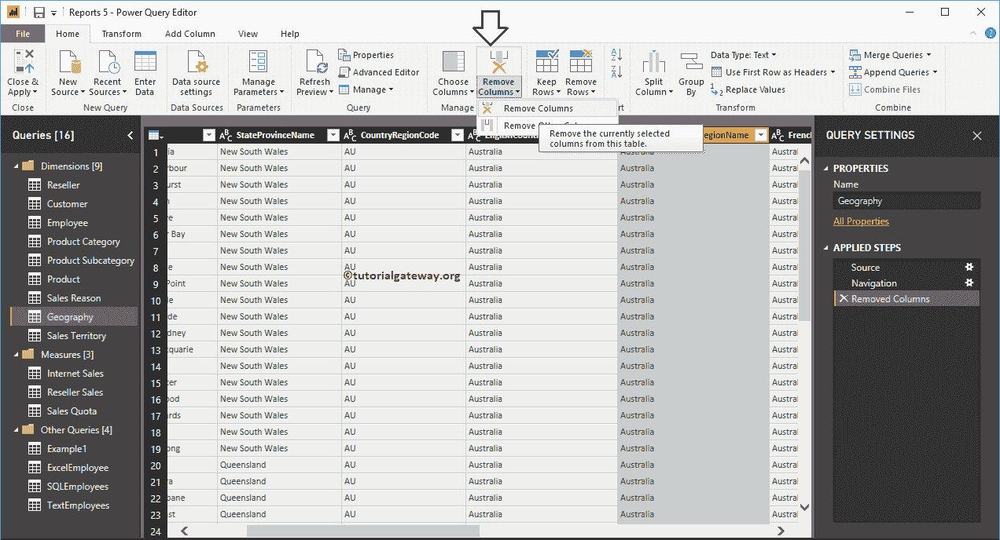

下的删除列按钮

同样，我们删除了剩余的不需要的列。

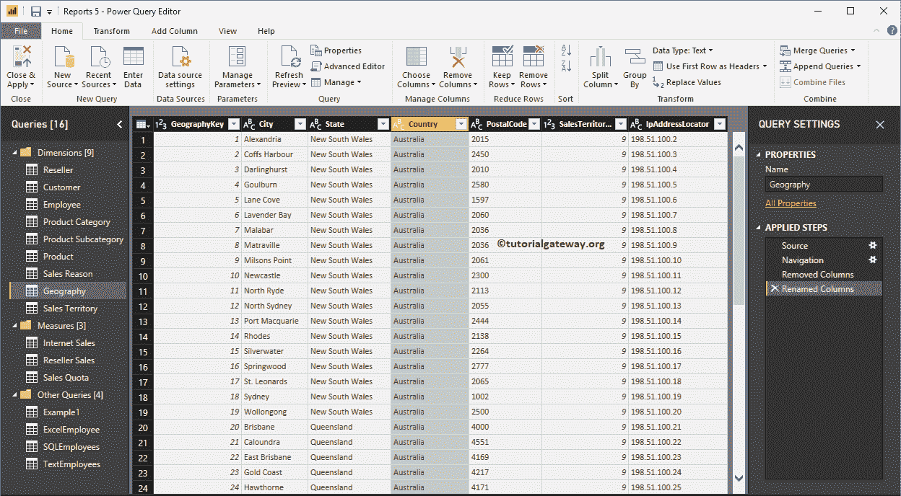

### 对 Power BI 中的列进行重新排序

将所需的列拖放到您想要放置的位置。出于 Power BI 重新排序列的演示目的，我们将国家/地区列拖到第二个位置(在地理键之后)。

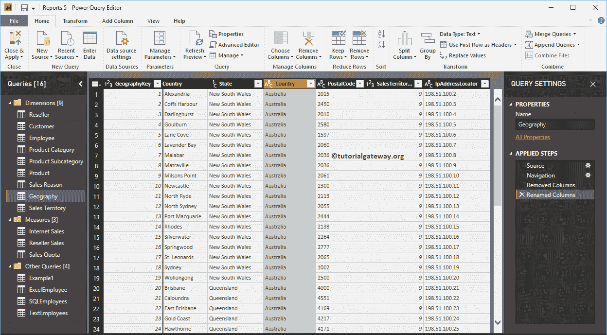

现在你可以在第二个位置

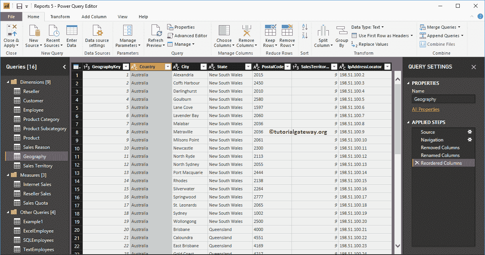

看到国名

或者，右键单击要移动的列名将打开上下文菜单。请选择移动，然后选择右、左、结束或开始选项

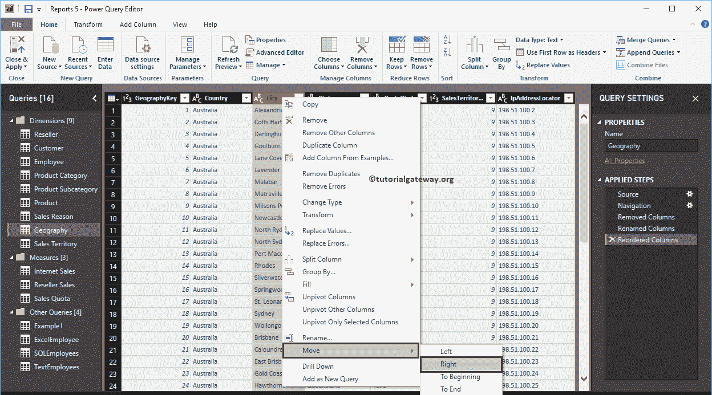

现在你可以看到国家在第三个位置。接下来，点击主页选项卡下的关闭并应用选项来应用这些更改。

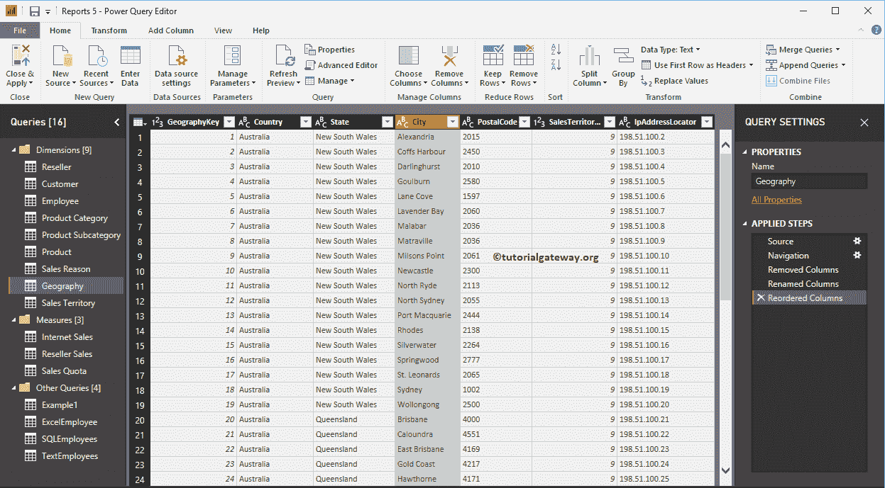

请等到更改后的应用

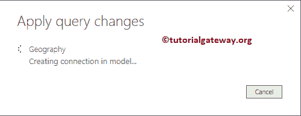