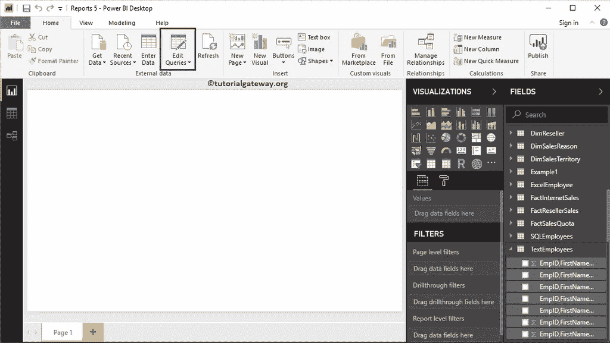
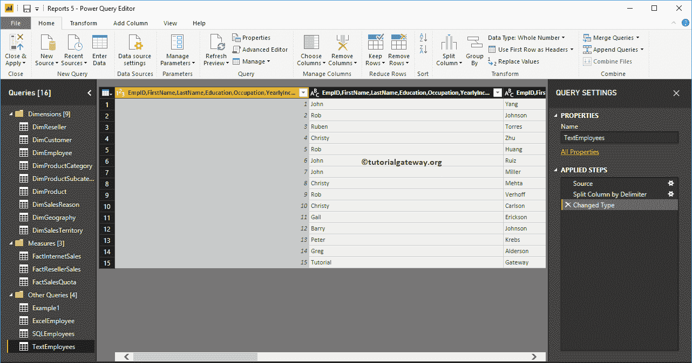
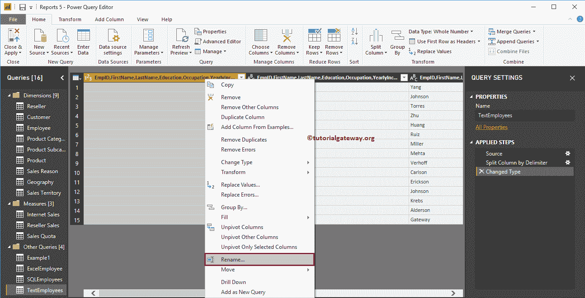
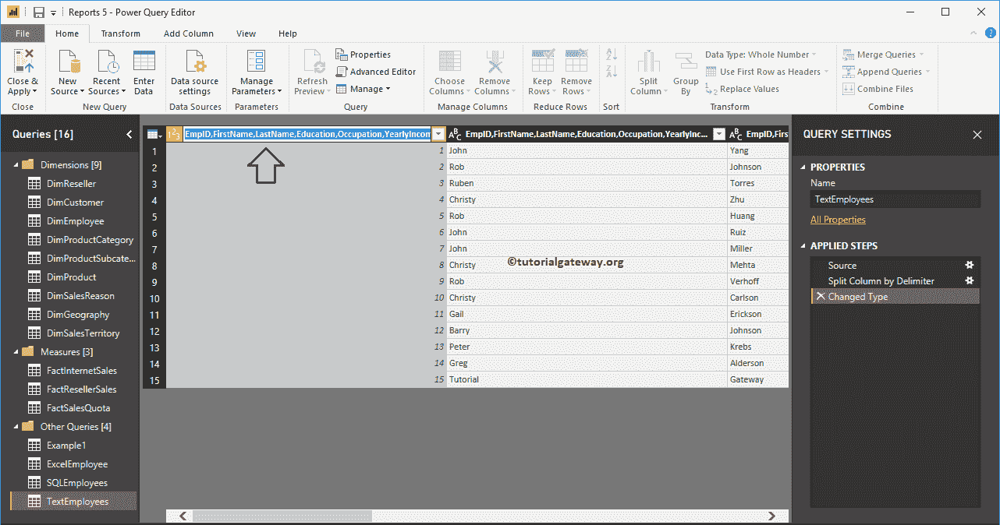
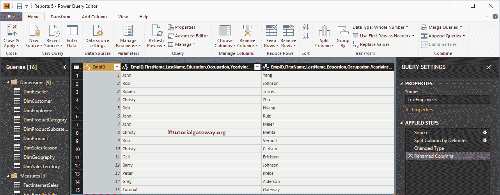
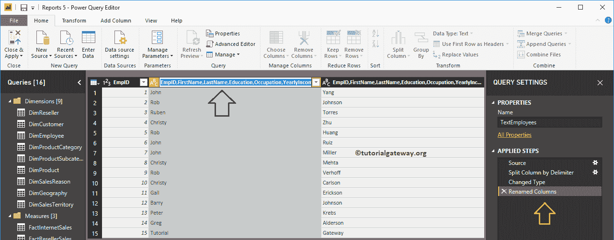
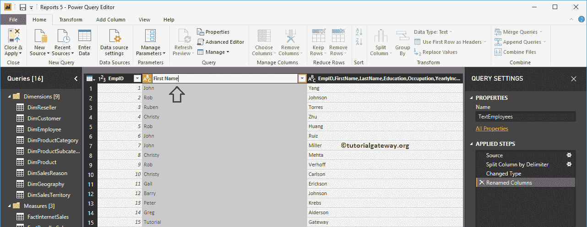
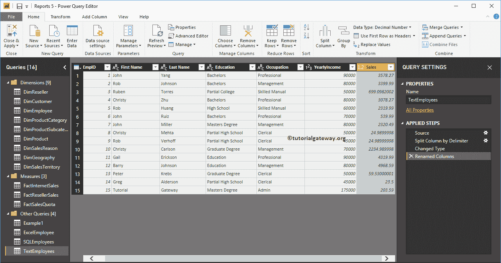
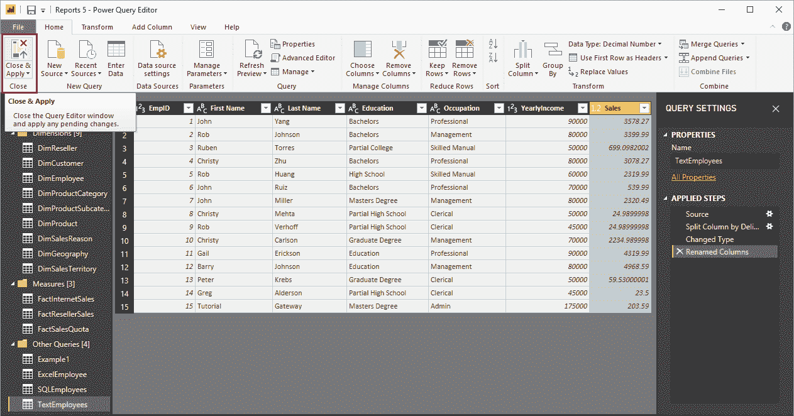
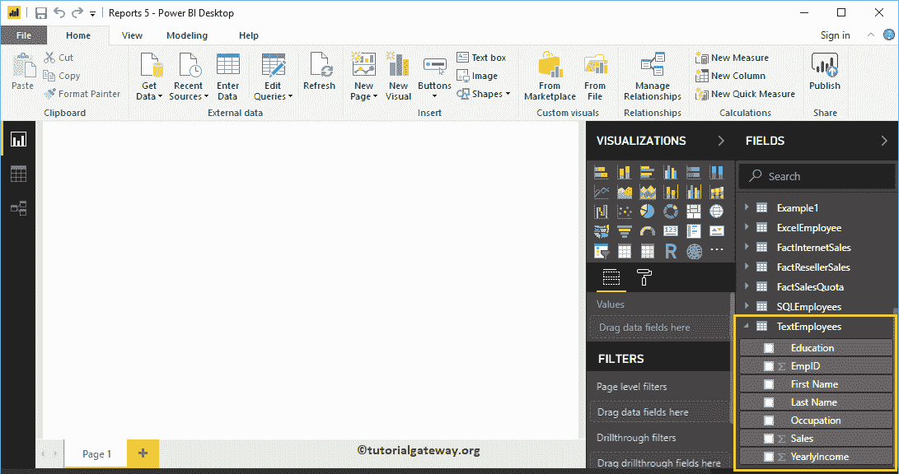

# 如何在 Power BI 中重命名列名

> 原文：<https://www.tutorialgateway.org/how-to-rename-column-names-in-power-bi/>

让我们通过一个例子来看看如何在 Power BI 桌面中重命名列名。通常，从数据源加载数据时，会得到数据源中可用的列名。在设计报告时，您可能需要更有意义的名称。在这些情况下，您可以使用 Power BI 重命名列名选项。

## 如何在 Power BI 中重命名列名

为了演示重命名列名选项，我们将使用在[输入数据](https://www.tutorialgateway.org/how-to-enter-data-into-power-bi/)中导入的文本员工表，并在[拆分列](https://www.tutorialgateway.org/how-to-split-columns-in-power-bi/)文章中进行了修改。

要重命名现有表中的列名，请单击“主页”选项卡下的“编辑查询”选项。

单击编辑查询选项将打开一个名为 [Power BI](https://www.tutorialgateway.org/power-bi-tutorial/) Power 查询编辑器的新窗口。从下面的截图中，您可以看到该表中的列有一个共同的名称。

有两种方法可以重命名 Power BI 表格报告中的列名

要重命名表中的列，右键单击要重命名的列将打开上下文菜单。请选择重命名选项。

它允许您重命名列。让我把它改名为 EmpID。

现在你可以看到栏名为

或者，您可以双击列标题。

如你所见，我们将其改名为

同样，我们将剩下的栏目

重新命名

无论您做了什么更改，在您点击“应用”之前都不会影响。让我点击主页选项卡下的关闭并应用选项。

请等到更改后的应用

现在你可以看到更有意义的名字

