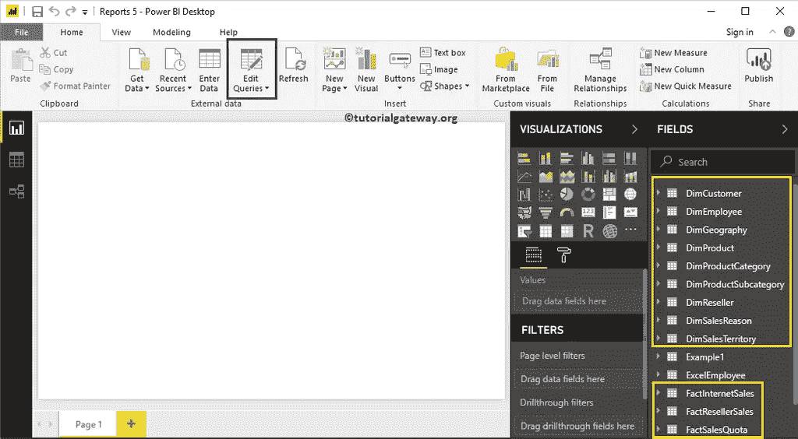
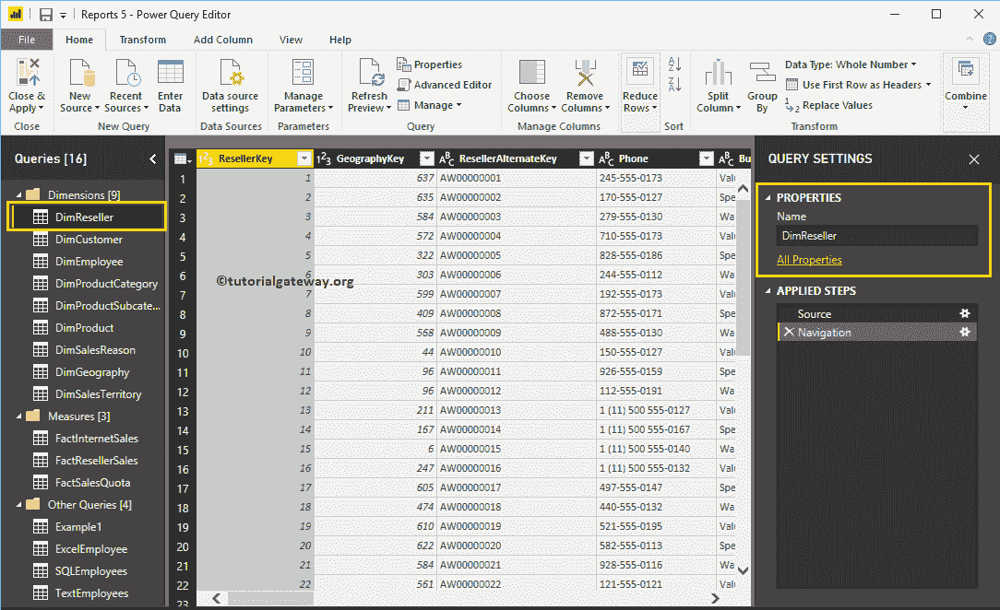
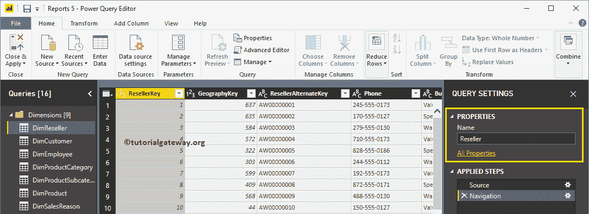
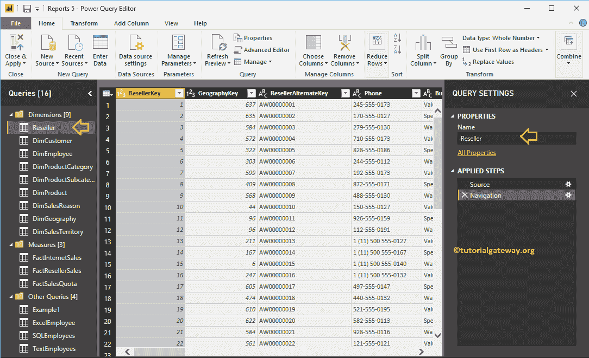
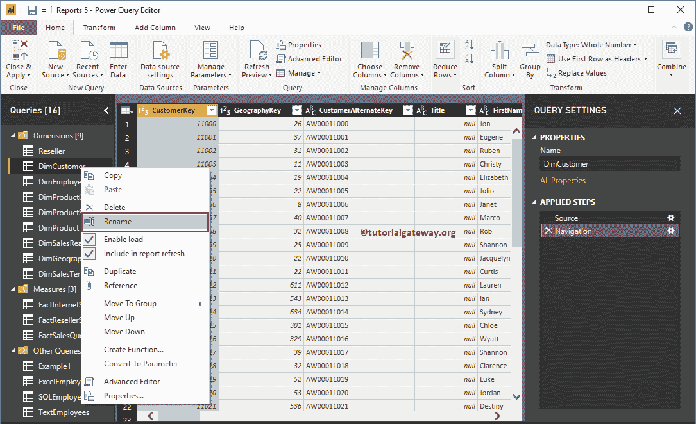
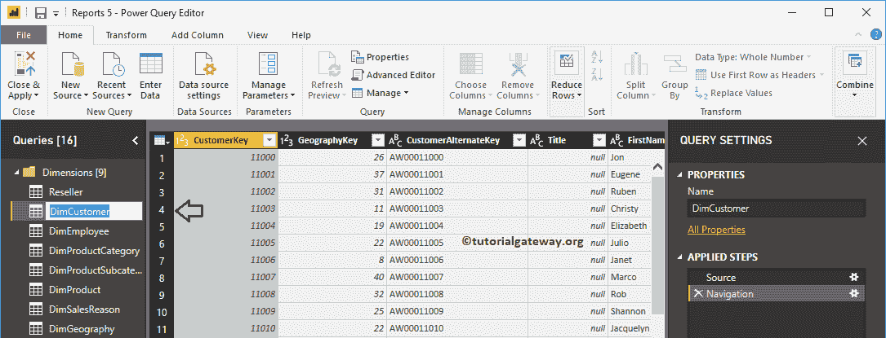
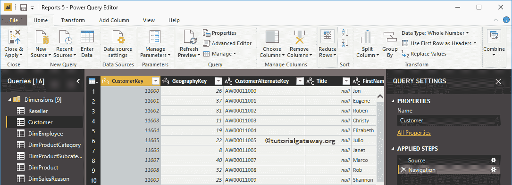
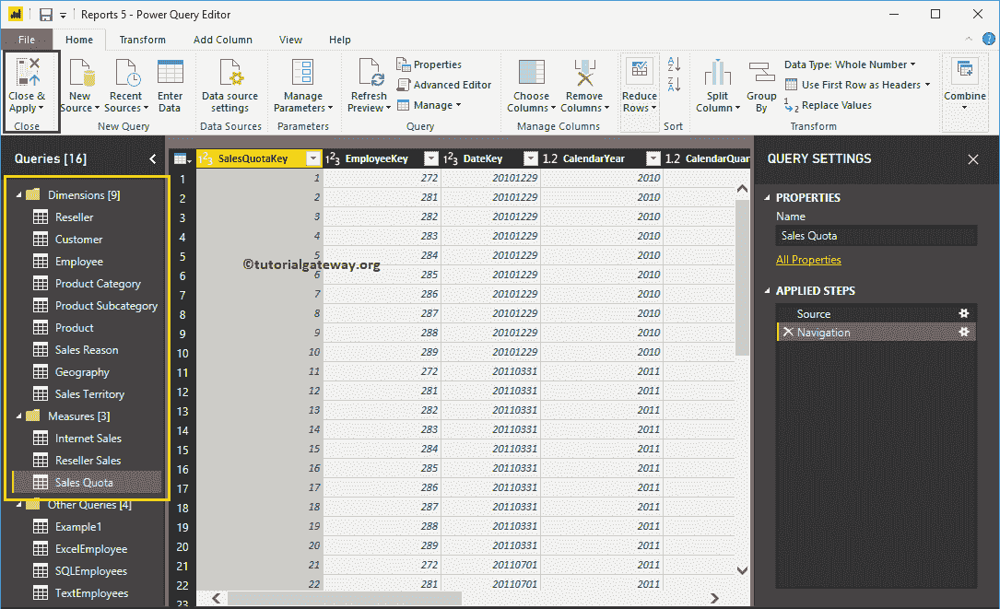
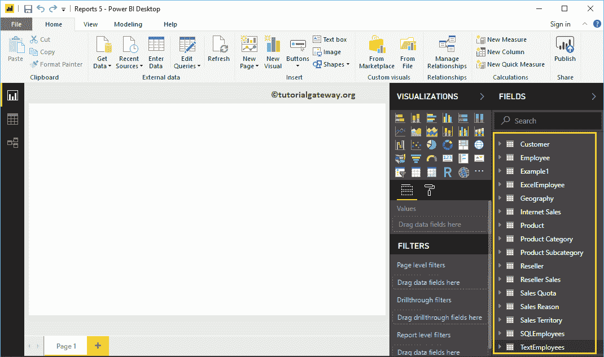

# 如何在PowerBI中重命名表名

> 原文：<https://www.tutorialgateway.org/how-to-rename-table-names-in-power-bi/>

让我用一个例子向您展示如何在 Power BI 中重命名表名。通常，从数据源加载数据时，会直接从数据源获取表名。当您使用转换时，您可能需要更有意义的名称。在这些情况下，您可以使用 Power BI 重命名表名选项。

## 如何在PowerBI中重命名表名

为了演示这个 Power BI 重命名表名选项，我们将使用我们在[连接到 SQL](https://www.tutorialgateway.org/connect-power-bi-to-sql-server/) 文章中导入的表。

要重命名表名，请单击主页选项卡下的编辑查询选项。

单击编辑查询选项将打开一个名为 [Power BI](https://www.tutorialgateway.org/power-bi-tutorial/) Power 查询编辑器的新窗口。

从下面的截图中，你可以看到，当你选择表的时候。您可以在属性部分看到一个表名。您可以使用此部分来重命名表。

使用属性窗口，我们将经销商表名重命名为经销商

现在你可以看到同样的

或者，您可以右键单击表名，并从上下文菜单中选择重命名选项。

让我将其重命名为客户

现在可以看到表名已经更改

同样，我们重命名了剩余的表。接下来，点击主页选项卡下的关闭并应用选项来应用这些更改。

请等到更改后的应用

现在，您可以看到更有意义的表名。

