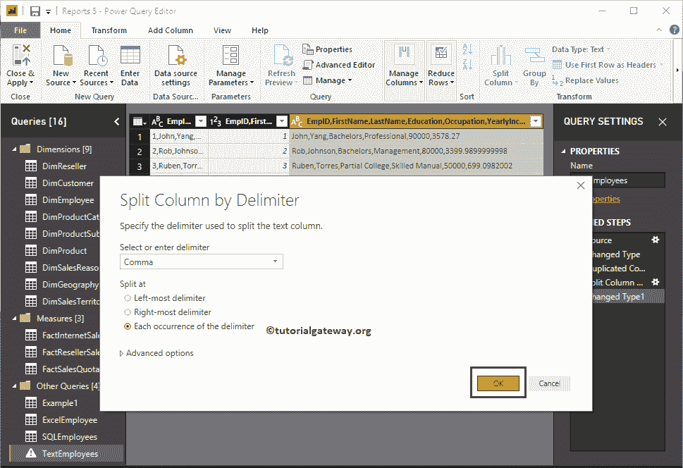
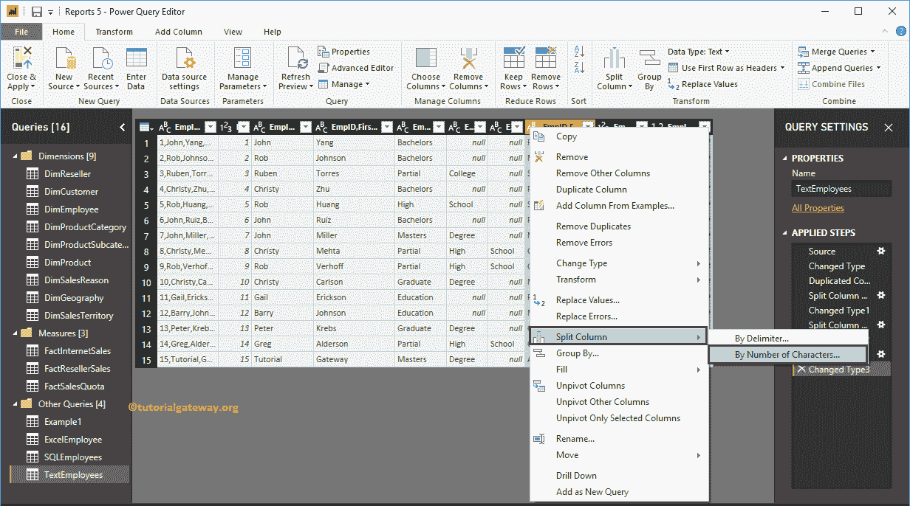

# 如何在 PowerBI 中拆分列

> 原文：<https://www.tutorialgateway.org/how-to-split-columns-in-power-bi/>

实时情况下，您可能会得到合并了列的数据(一列包含太多信息)。在这种情况下，您可以使用 Power BI 拆分列选项将该列拆分为多个列。本文通过示例向您展示了如何在 Power BI 中拆分列。

## 如何在 PowerBI 中拆分列

为了演示这个 Power BI 分栏选项，我们将使用我们在[输入数据](https://www.tutorialgateway.org/how-to-enter-data-into-power-bi/)文章中导入的文本员工表。

要拆分现有表中的列，请单击“主页”选项卡下的“编辑查询”选项。

单击编辑查询选项将打开一个名为超级查询编辑器的新窗口。从下面的截图可以看到 [Power BI](https://www.tutorialgateway.org/power-bi-tutorial/) 表只有一列。

在我们开始拆分 Power BI 中的列之前，让我复制这个列。为此，右键单击列名，并从上下文菜单中选择“复制列”选项。

现在你可以看到

重复栏

要拆分 Power BI 表中的列，请右键单击要拆分的列，打开上下文菜单。请选择“拆分列”，然后选择“按分隔符”选项。

选择“按分隔符”选项将打开以下窗口。

*   选择或输入分隔符:从下拉列表中，请选择要用作拆分字符的分隔符。如果列表中没有该字符，请选择“自定义”选项并指定该自定义字符。
*   最左边的分隔符:该选项在第一个分隔符之前拆分最左边的字符串。
*   最右边的分隔符:该选项在最后一个分隔符后拆分最右边的字符串。
*   分隔符的每次出现:分隔符每次出现时拆分的文本。

我们选择逗号作为分隔符。请记住，在“高级”部分下，您可以指定列数或行数。

让我选择最左边的分隔符选项，点击【确定】

现在，您可以看到员工标识与原始列分开，并放在新列中。

这一次，我们在分隔符选项每次出现时选择拆分。

现在您可以看到，逗号每次出现时的文本都从原始列中分离出来，并放在新列中。

让我试试另一个分隔符。对于 Power BI 拆分列演示，我们选择以下列，并使用空格分隔符拆分该列。

现在，您可以在每次出现空格时看到存储拆分文本的不同列。

### 按字符数划分列的 PowerBI

右键单击要拆分的列将打开上下文菜单。请选择“拆分列”，然后选择“按字符数”选项。

选择按字符数选项将打开按字符数拆分列窗口。

*   字符数:请指定用于拆分列的字符数。
*   一次，尽可能靠左:该选项在字符数之前拆分最左边的字符串。
*   一次，尽可能向右:该选项在字符数后拆分最右边的字符串。
*   重复:文本每 5 个字符拆分一次。

现在可以在 Power BI 查询编辑器

中看到拆分列

无论您做了什么更改(在 Power BI 中拆分列)都不会影响，直到您点击“应用”。让我点击主页选项卡下的关闭并应用选项。

现在，您可以在文本员工表中看到 11 列。

