# PowerBI 中的拆线表

> 原文：<https://www.tutorialgateway.org/unpivot-table-in-power-bi/>

Power BI Unpivot 表选项将选定的列转换为行。让我们通过一个例子来看看如何在 Power BI 中创建一个 unpivot 表，或者如何将透视表转换成 Unpivot 表。

## 如何在 PowerBI 中创建无人值守表

要创建透视表或将透视表转换为逆透视表，请单击“主页”选项卡下的“编辑查询”选项。

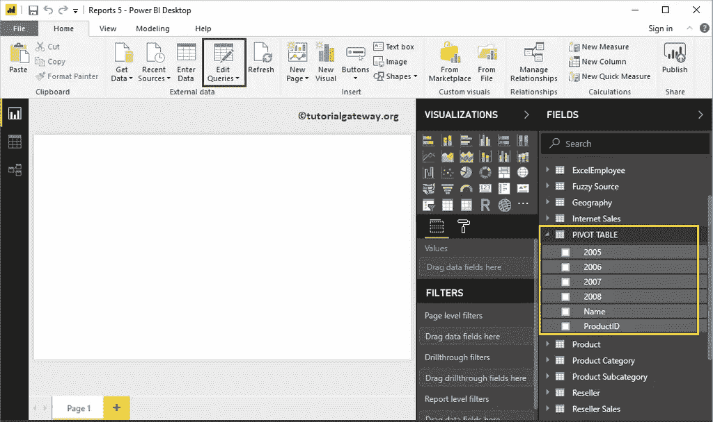

单击编辑查询选项将打开一个名为 [Power BI](https://www.tutorialgateway.org/power-bi-tutorial/) Power 查询编辑器的新窗口。

在本例中，我们将取消对 2005、2006、2006 和 2007 列的透视。

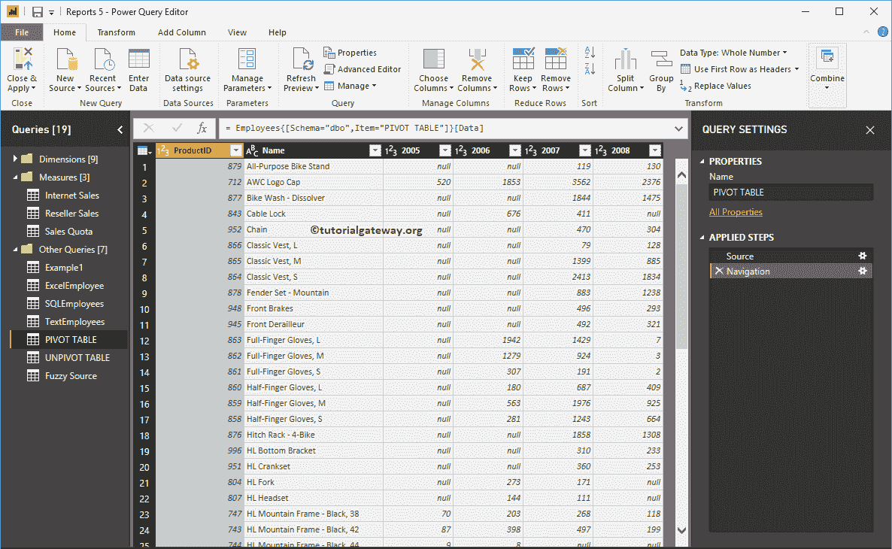

有几种方法可以做到这一点

### PowerBI 中解固定表的第一种方法

请选择您不想取消固定的列，或者您想保持它们不变，将打开上下文菜单。选择取消固定其他列选项。这将取消除选定列之外的所有列。

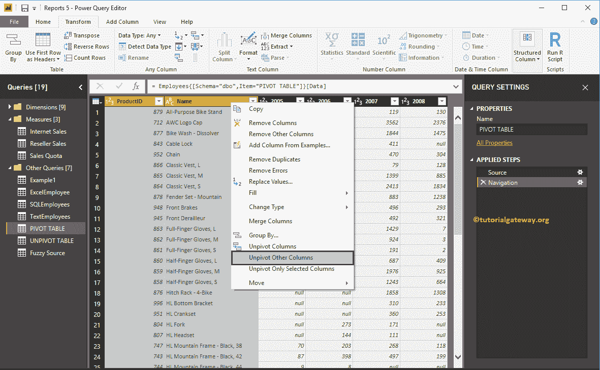

现在你可以看到无人驾驶的表

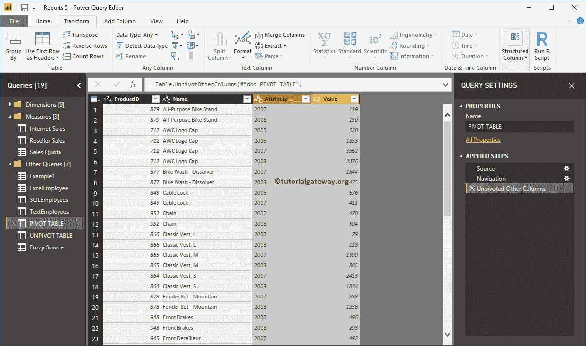

### PowerBI 中解固定表的第二种方法

请选择要使用的列，右键单击它们将打开上下文菜单。选择仅取消固定选定列选项。这将取消所有选定列的锁定。

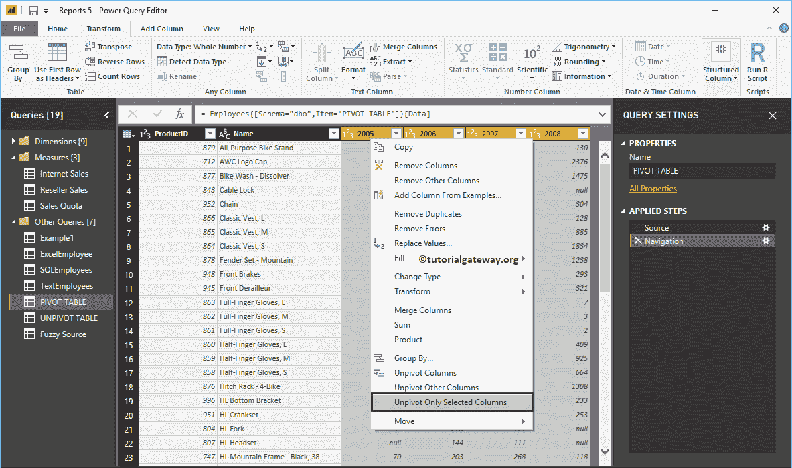

现在你可以看到无人驾驶的表

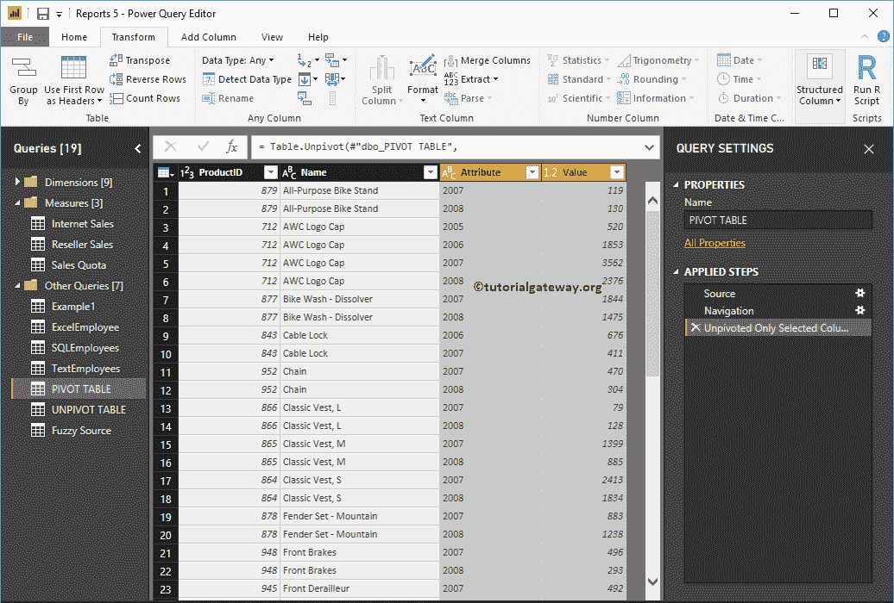

### 第三种方法

要转换数据透视表，请转到转换选项卡。在此选项卡下，您可以找到如下所示的取消固定列按钮。

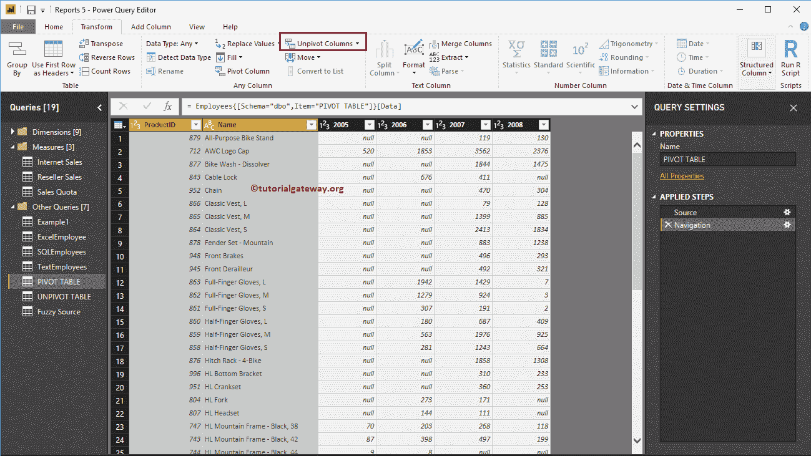

使用下拉列表执行此操作。出于演示目的，我们选择了“产品标识”和“名称”列，然后选择了“取消固定其他列”选项。

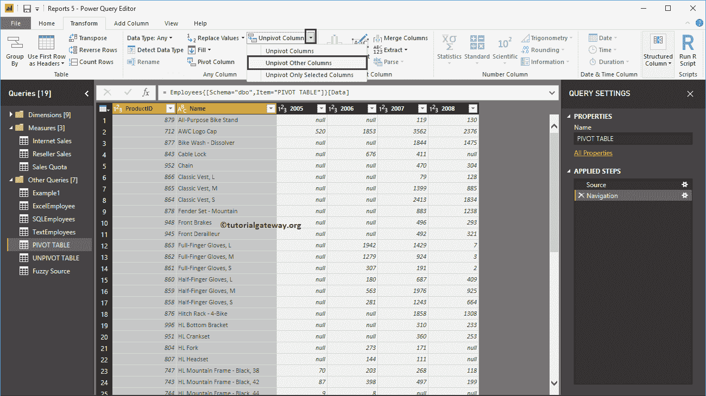

现在，您可以看到未固定的表。

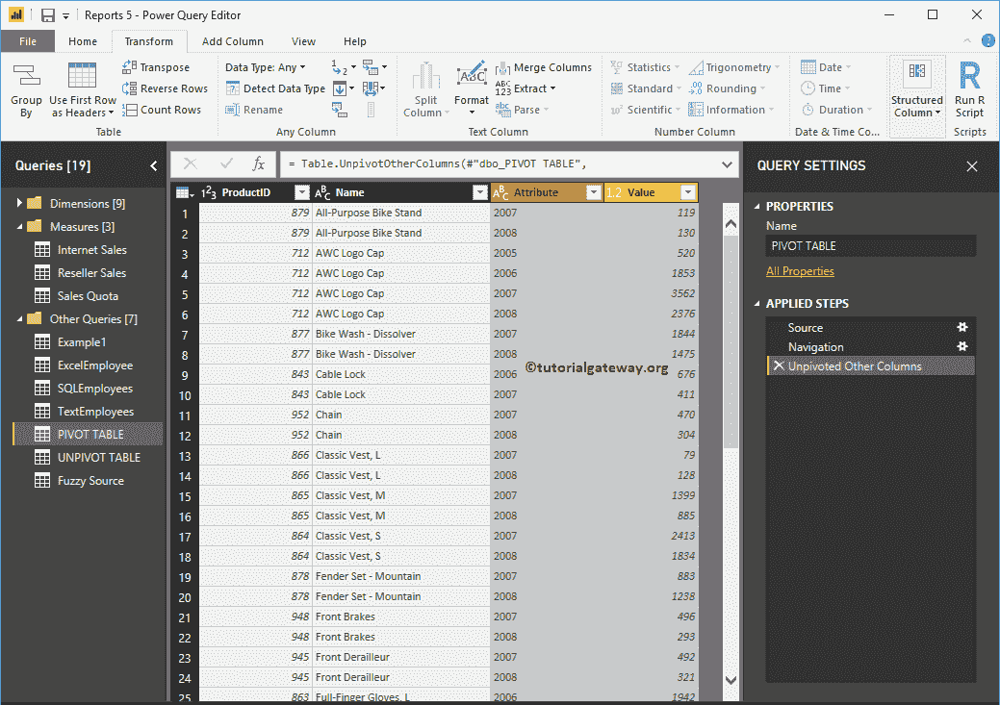

我们[将栏目](https://www.tutorialgateway.org/how-to-rename-column-names-in-power-bi/)改名为更有意义的栏目。接下来，点击主页选项卡下的关闭&应用选项来应用这些更改。

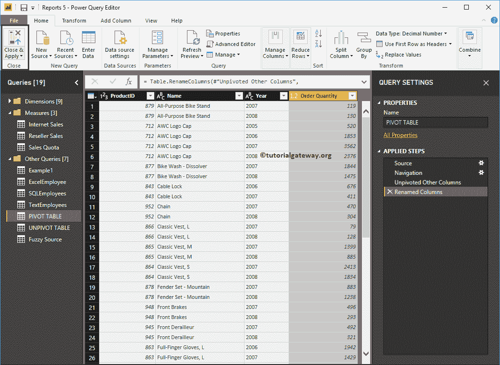

从下面的截图中，你可以看到右边的那些。

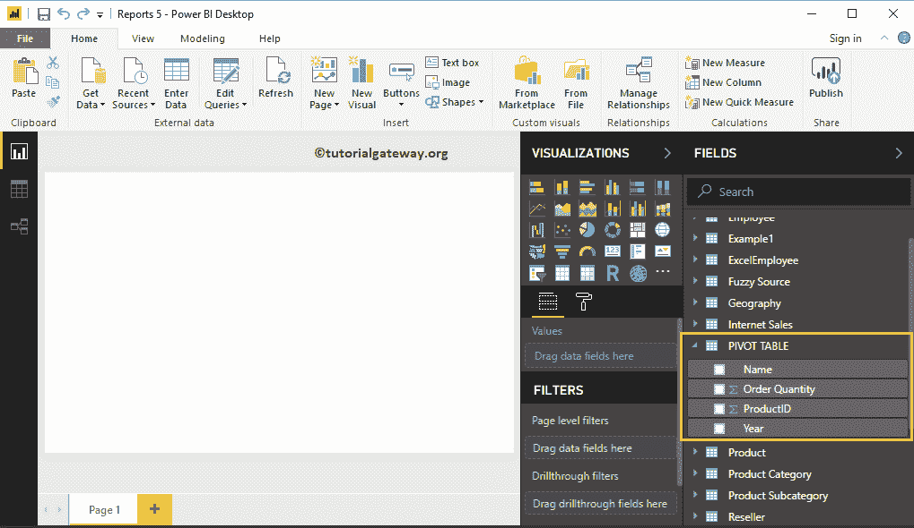