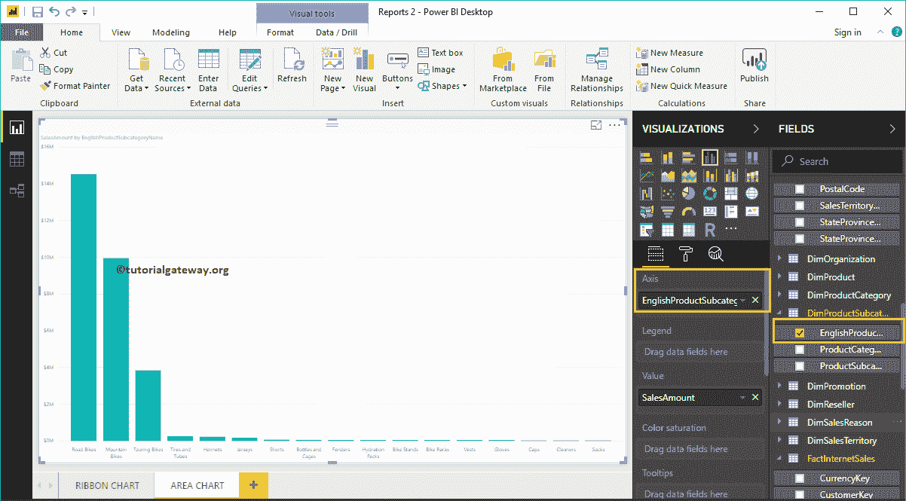

# PowerBI 中的区域图

> 原文：<https://www.tutorialgateway.org/area-chart-in-power-bi/>

Power BI 区域图与折线图相同，在折线图中，X 轴和直线之间的面积用一种颜色填充。让我用一个例子向您展示如何在 Power BI 中创建区域图。

在这个 Power BI 区域图演示中，我们将使用我们在上一篇文章中创建的 SQL 数据源。

请参考[将 Power BI 连接到 SQL Server](https://www.tutorialgateway.org/connect-power-bi-to-sql-server/) 一文，了解 [Power BI](https://www.tutorialgateway.org/power-bi-tutorial/) 中的数据源。也可以参考[折线图](https://www.tutorialgateway.org/create-a-power-bi-line-chart/)一文。

## 如何在 PowerBI 中创建区域图

要在 Power BI 中创建区域图，首先将销售额从字段部分拖放到画布区域。它会自动创建一个[柱形图](https://www.tutorialgateway.org/column-chart-in-power-bi/)，如下图所示。

接下来，让我将英文产品子类别名称添加到 Axis 部分。

请点击可视化部分下的区域图。它会将柱形图转换为区域图。从下面的截图中，您可以看到显示按产品子类别划分的销售额的 Power BI 区域图。

### 在 PowerBI 方法 2 中创建区域图

首先，单击可视化部分下的区域图。它将创建一个带有虚拟数据的区域图，如下图所示。

为了向 PowerBI 区域图添加数据，我们必须添加必需的字段:

*   轴:请指定代表区域的列名。
*   值:任何数值，如销售额、总销售额等。

让我将“销售额”从“字段”部分拖到“值”字段。

接下来，让我将州/省名称添加到轴部分。您可以通过将省/市/自治区拖到“轴”部分来完成此操作，或者只需选中省/市/市/自治区列。

让我按州/省名称对数据进行排序(默认情况下，它按销售额排序)。为此，单击右上角的… (3 个点)，并选择“按州/省名称排序”选项，如下所示。

现在可以看到更有意义的区域图

将鼠标悬停在任何位置都会显示销售金额的工具提示，以及州/省名称

通过在图例部分添加产品颜色，它会将 PowerBI 区域图转换为[堆叠区域图](https://www.tutorialgateway.org/stacked-area-chart-in-power-bi/)。

让我从“图例”部分删除“颜色”字段，然后再添加一个字段，即“产品总成本与价值”部分。它将销售金额与产品总成本进行比较。

将鼠标悬停在任何位置都会显示销售金额和产品总成本的工具提示

让我快速格式化一下这个 PowerBI 区域图

注:建议大家参考[格式化区域图](https://www.tutorialgateway.org/format-power-bi-area-chart/)一文，了解格式化区域图标题、绘图区域、线条颜色等涉及的步骤。

