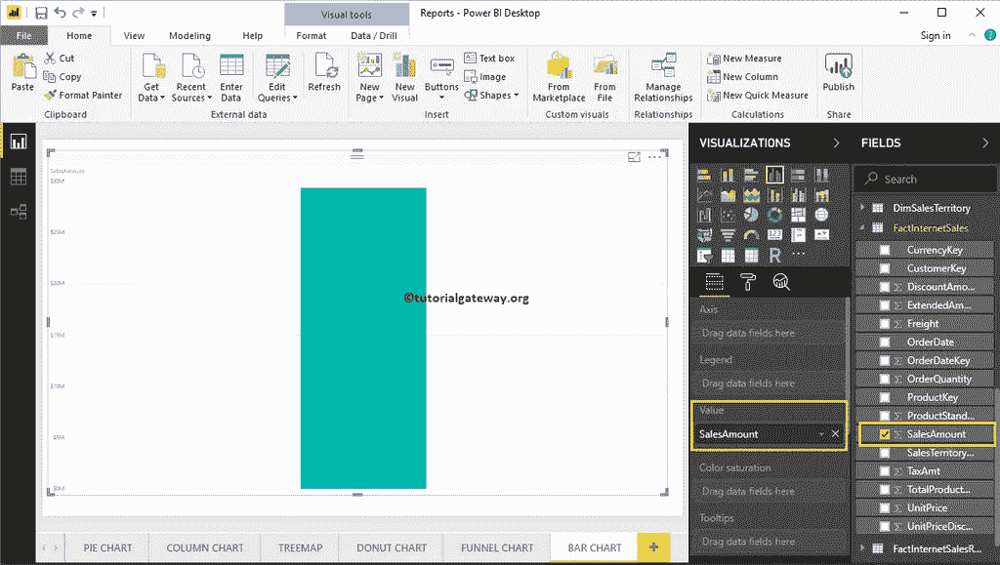
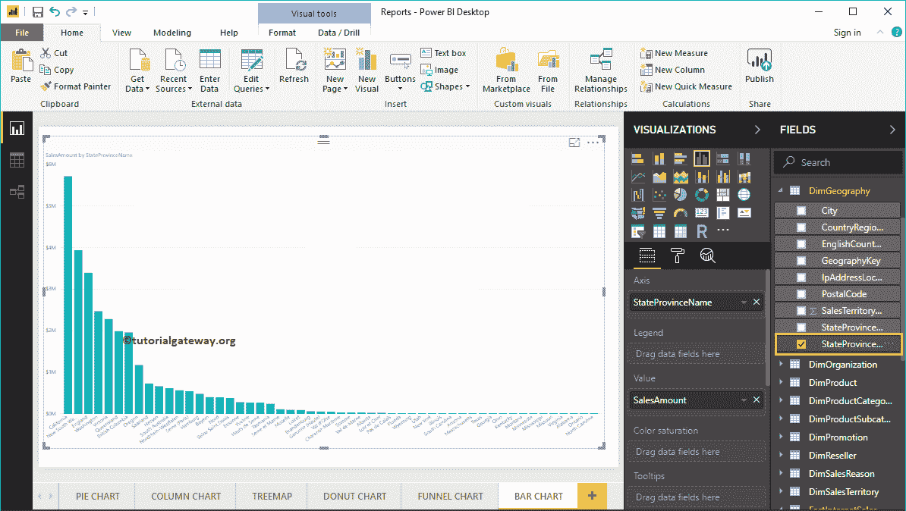
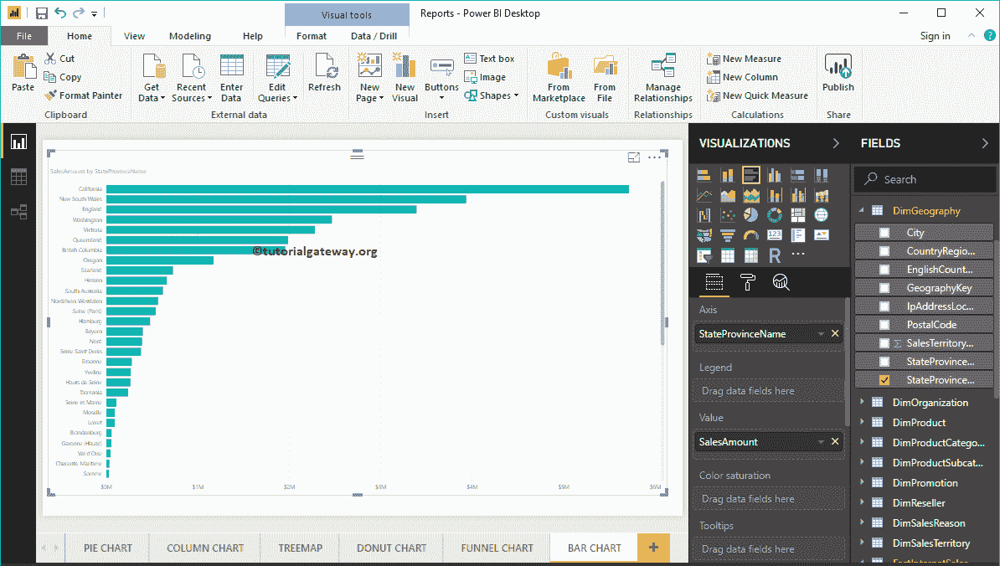
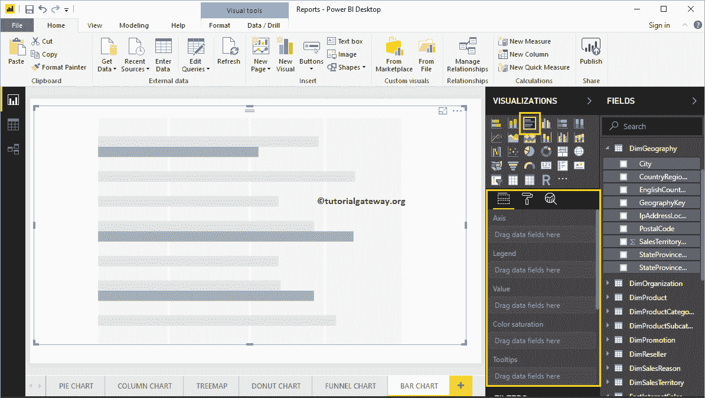
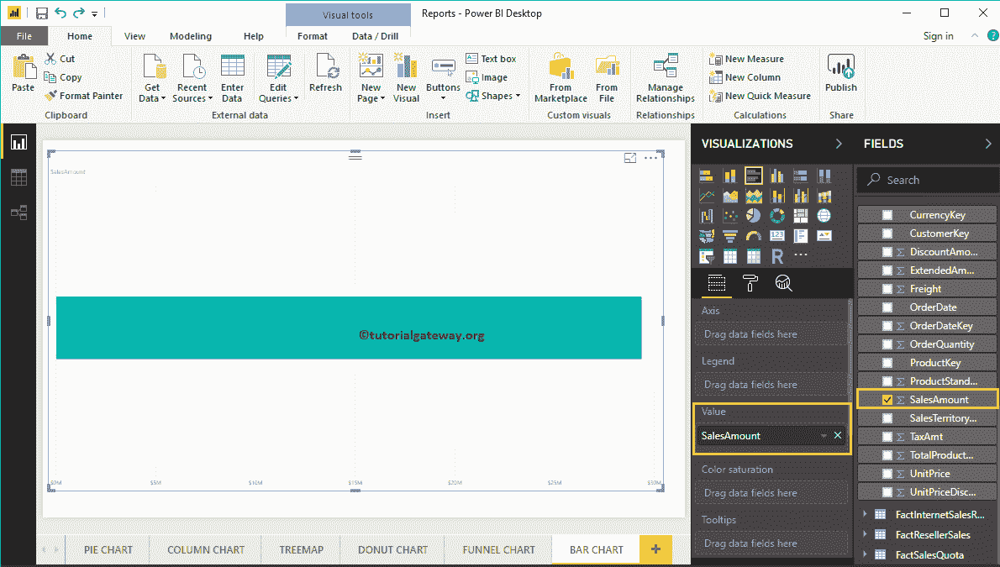
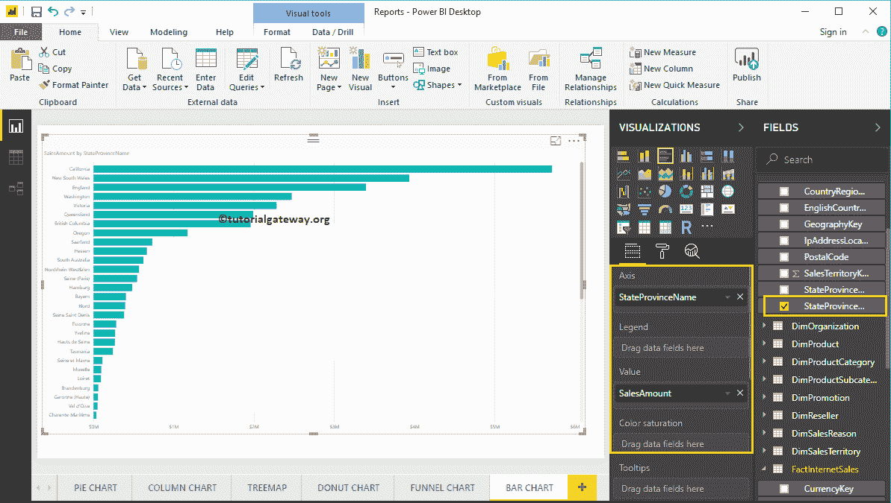
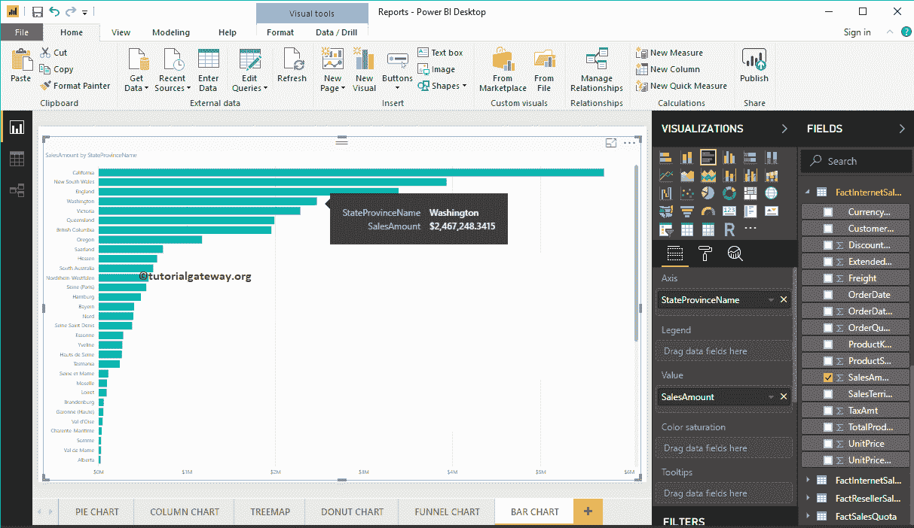
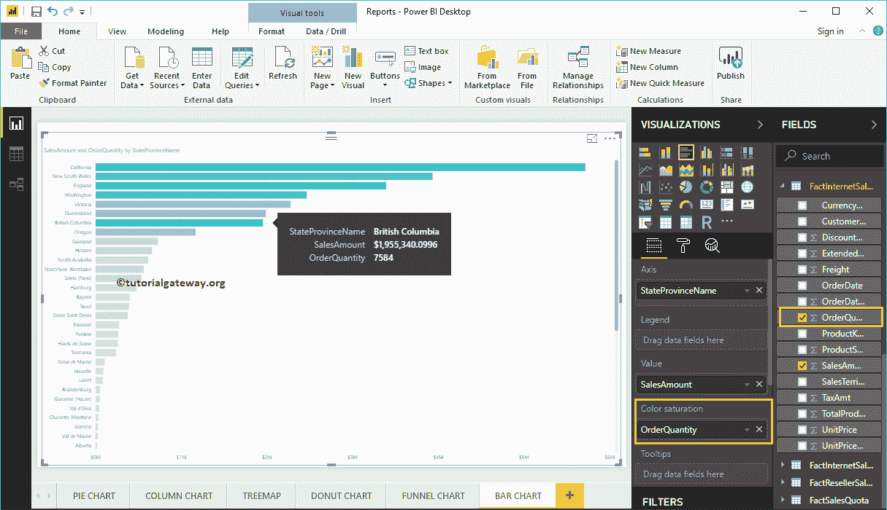
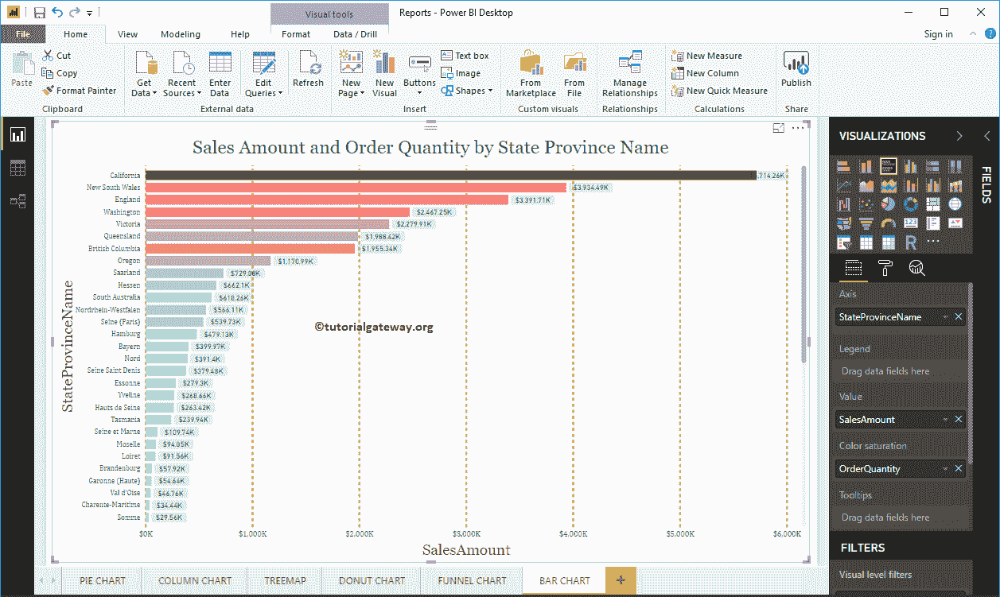

# PowerBI 条形图

> 原文：<https://www.tutorialgateway.org/power-bi-bar-chart/>

Power BI 条形图或水平条形图对于数据比较非常有用。例如，您可以按颜色、地区或产品组等比较销售额。让我用例子展示如何在 Power BI 中创建条形图。

在这个 Power BI 条形图演示中，我们使用了我们在上一篇文章中创建的 SQL 数据源。所以，请参考[将 Power BI 连接到 SQL Server](https://www.tutorialgateway.org/connect-power-bi-to-sql-server/) 文章，了解 [Power BI](https://www.tutorialgateway.org/power-bi-tutorial/) 数据源。

## 如何在 PowerBI 中创建条形图

要创建 Power BI 条形图，首先将销售额从字段部分拖放到画布区域。它会自动创建一个[柱形图](https://www.tutorialgateway.org/column-chart-in-power-bi/)。

接下来，让我将州/省名称添加到轴部分，以创建一个按州/省显示销售金额的柱形图。

点击可视化部分下的条形图，将柱形图转换为条形图

### 在 Power BI 中创建条形图–方法 2

首先，点击可视化部分下的[聚类条形图](https://www.tutorialgateway.org/clustered-bar-chart-in-power-bi/)。它会自动创建一个带有虚拟数据的 PowerBI 条形图。

为了将数据添加到 Power BI 条形图中，我们必须添加必需的字段:

*   轴:请指定代表水平条的列。
*   值:任何数值，如销售额、总销售额等。

让我将“销售额”从“字段”部分拖到“值”字段。

接下来，将“地理”表中的州/省名称添加到“轴”部分。您可以通过将州省拖到轴部分来完成此操作，或者只需选中州省列

现在，您可以看到一个条形图，表示按州/省划分的销售额。将鼠标悬停在任意栏上会显示州/省名称及其销售额的工具提示

Power BI 条形图还有一个称为“色彩饱和度”的属性。它会根据“颜色饱和度字段”值向各个条添加颜色。让我添加订单数量，使颜色从浅到深变得饱和。

从下面的截图中，您可以看到条形的颜色根据其订单数量发生了变化。

让我做一些快速格式化这个 PowerBI 条形图

注:我建议您参考[格式化条形图](https://www.tutorialgateway.org/format-bar-chart-in-power-bi/)文章，了解格式化条形图标题、条形图颜色、数据颜色、背景颜色、轴字体和颜色所涉及的步骤。

