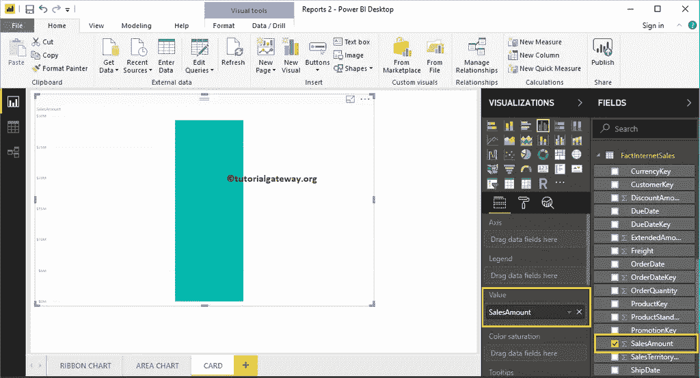
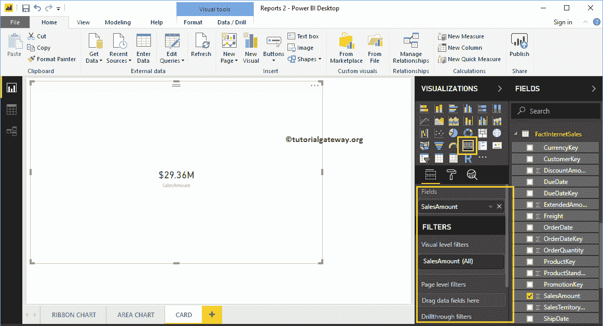
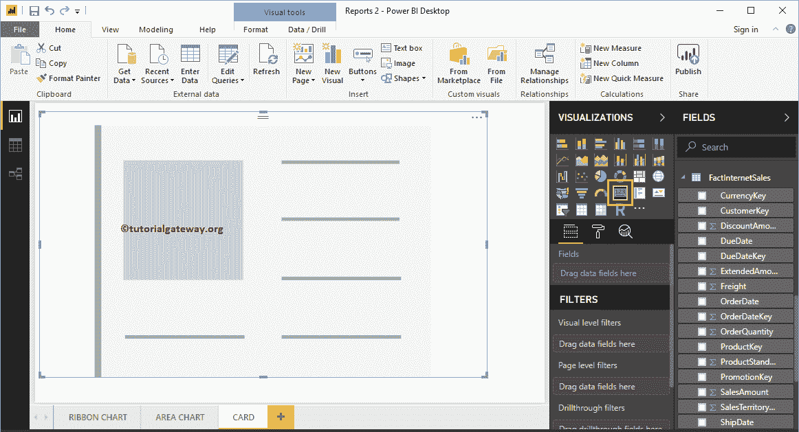
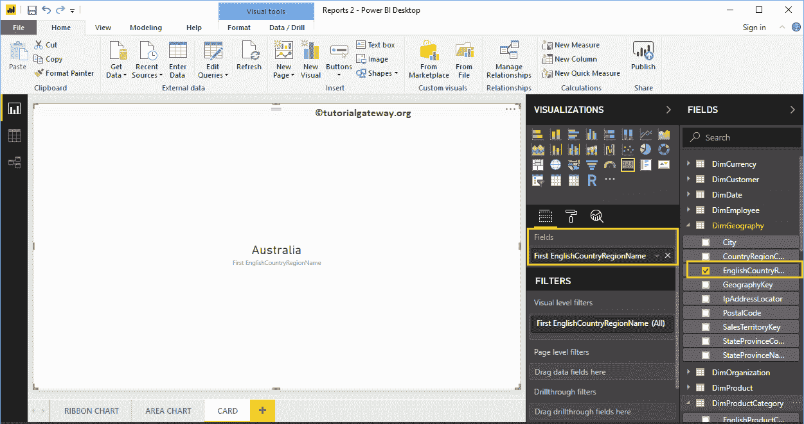
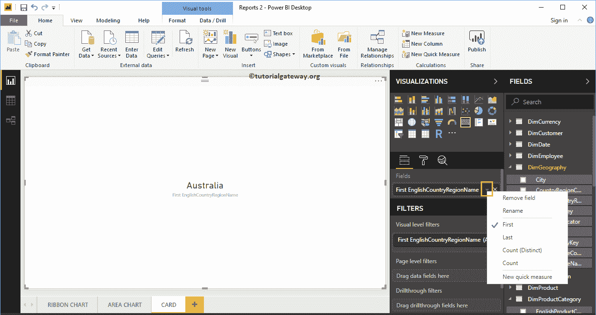
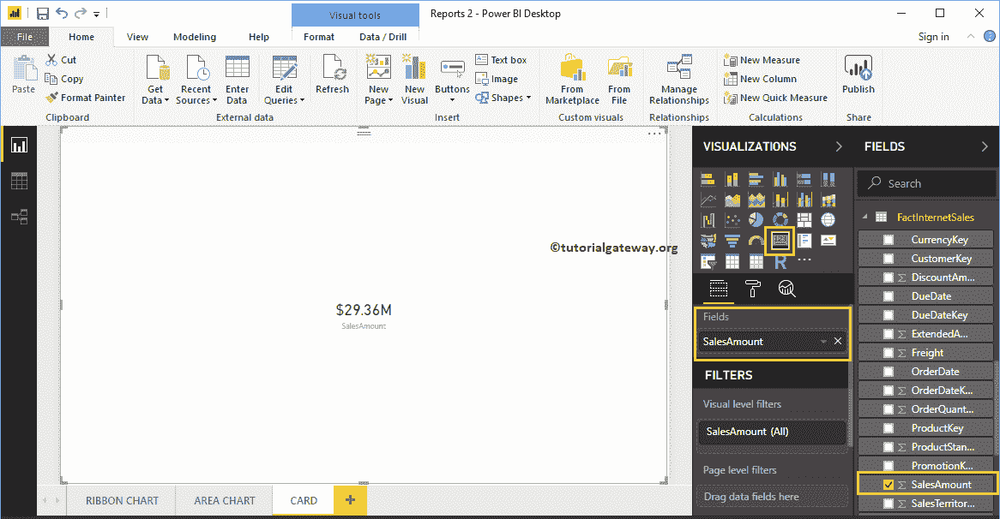
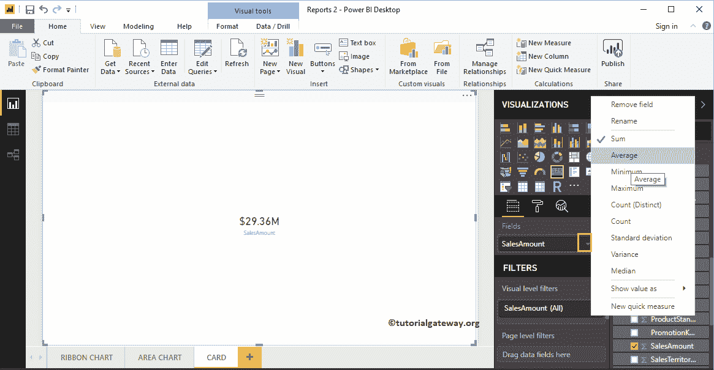
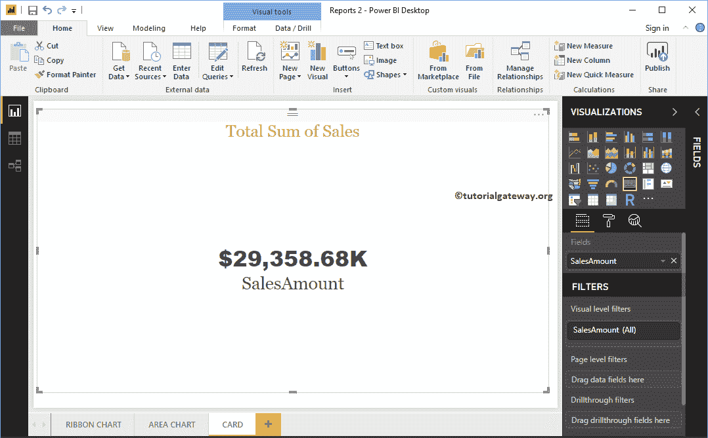

# 在 PowerBI 中创建卡

> 原文：<https://www.tutorialgateway.org/create-a-card-in-power-bi/>

让我用一个例子向你展示如何在 Power BI 中创建一张卡片。Power BI 卡用于显示单个数字(或公制值)。例如，如果我们想要跟踪我们发送的总订单、总销售额或总报价，那么我们可以使用这种 Power BI Card 可视化。

对于这个 Power BI 卡演示，我们将使用我们在上一篇文章中创建的 SQL 数据源。所以，请参考[将 Power BI 连接到 SQL Server](https://www.tutorialgateway.org/connect-power-bi-to-sql-server/) 文章，了解 [Power BI](https://www.tutorialgateway.org/power-bi-tutorial/) 数据源。

## 如何在 PowerBI 中创建卡

将“字段中的销售额”部分拖放到画布上，自动创建一个柱形图，如下图所示。

单击可视化部分下的卡片。它会自动将柱形图转换为卡片。从下面的截图中，您可以看到显示总销售额的卡片。

## 在 Power BI 方法 2 中创建卡

要创建 PowerBI 卡，首先，单击可视化部分中的卡。它将创建一个带有虚拟数据的卡片，如下图所示。

让我将英文国家/地区名称(维度数据)拖到字段部分。如您所见，Power BI 桌面中的卡将“第一国家/地区名称”显示为卡值。

您可以将第一个功能更改为任何其他 Power BI 支持功能。

接下来，让我删除国家/地区名称，并将销售金额添加到字段部分。

默认情况下，它使用名为 SUM 的默认[聚合函数](https://www.tutorialgateway.org/sql-aggregate-functions/)。但是，您可以根据公司的要求更改此聚合函数。

让我快速格式化这张卡片。

注:我建议您参考[格式卡](https://www.tutorialgateway.org/format-power-bi-card/)一文，了解可用的格式选项。

