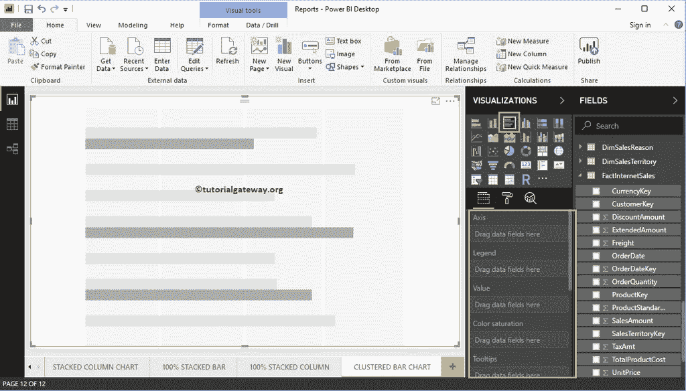
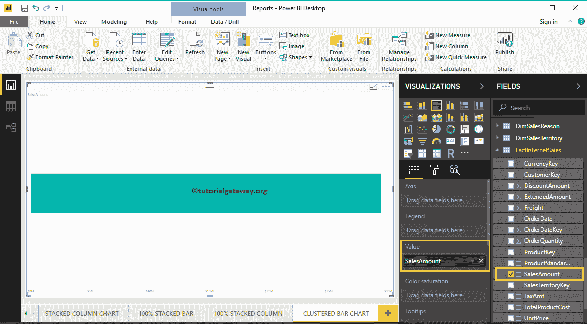
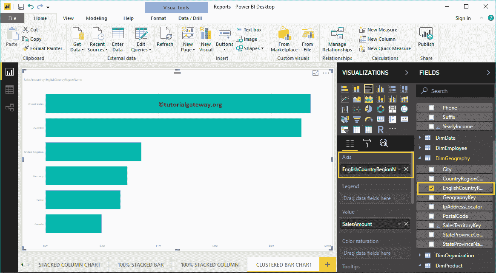
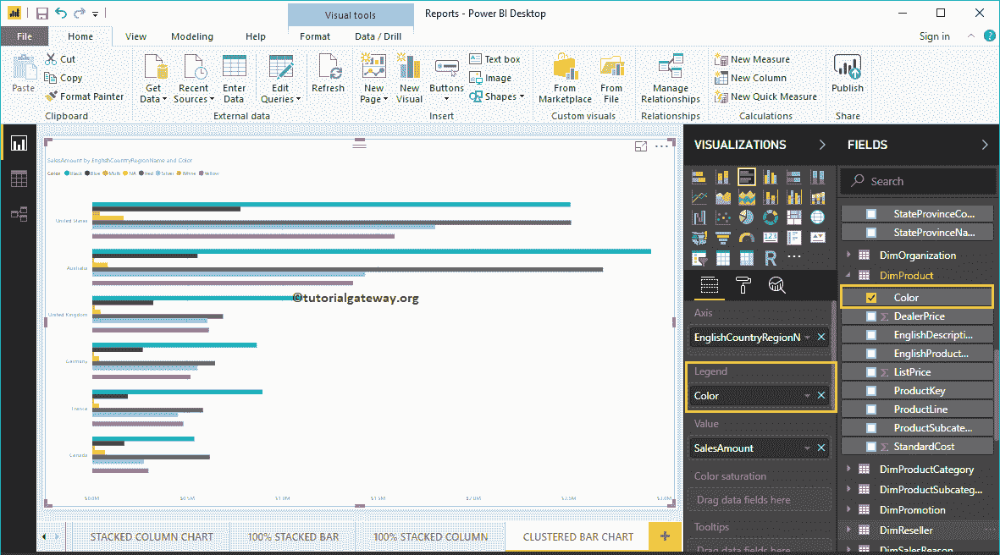
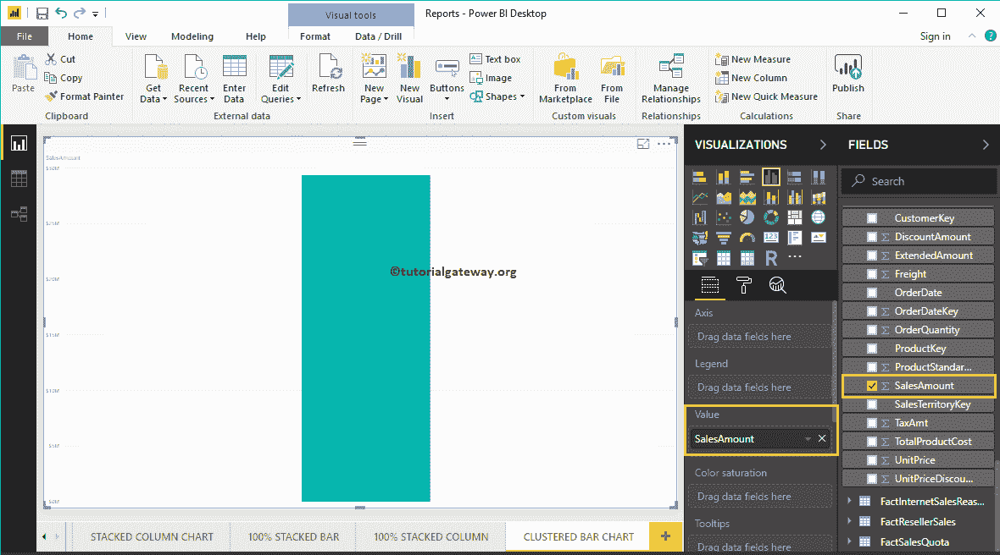
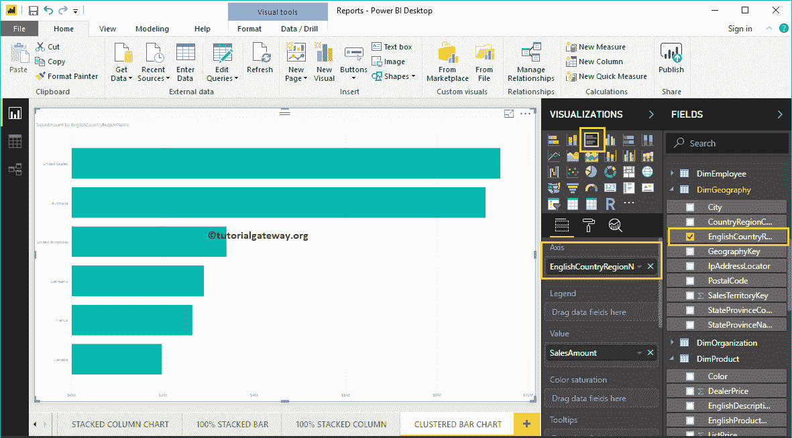
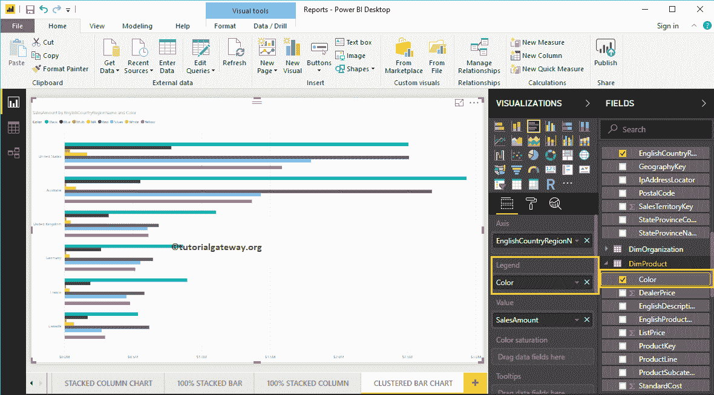
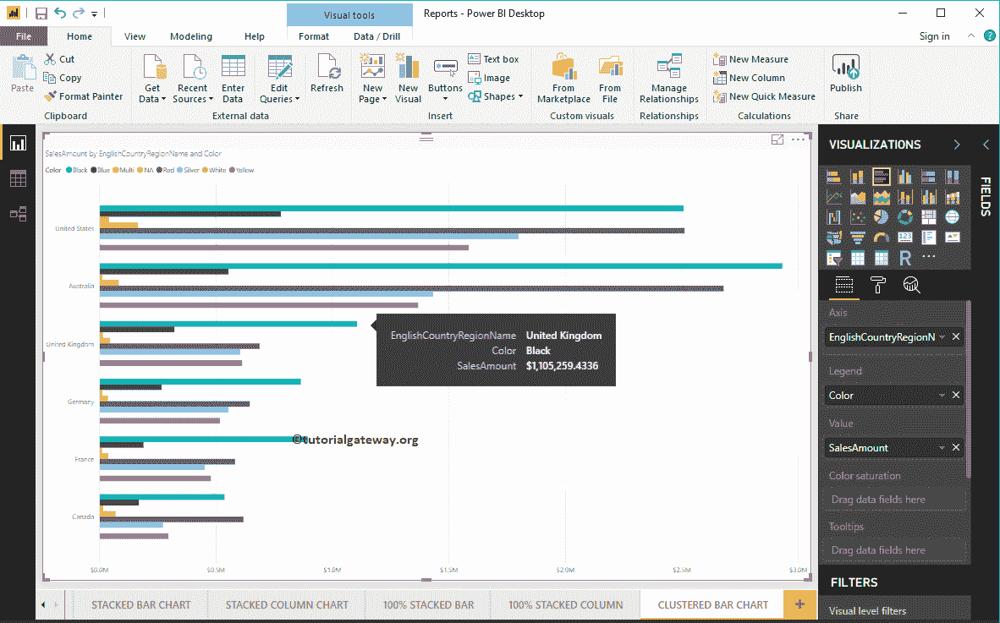
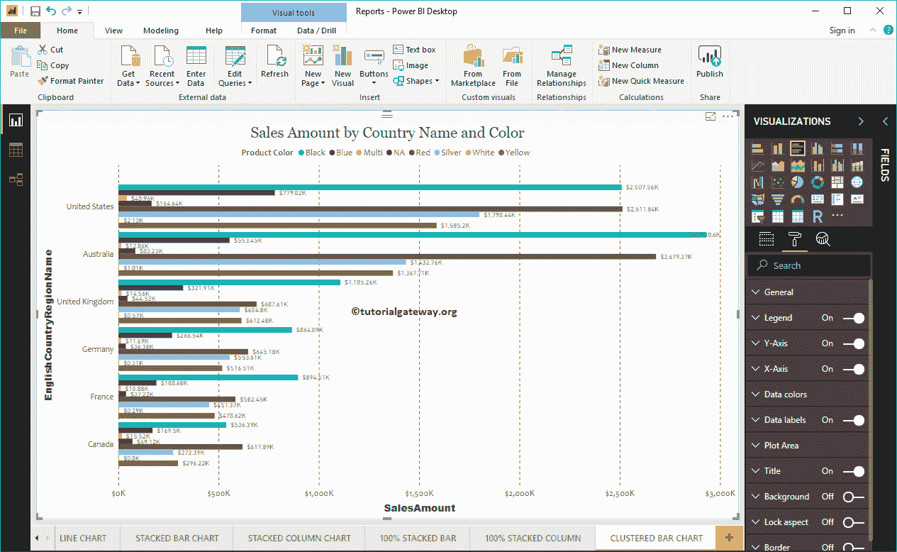

# 电力商业智能中的聚类条形图

> 原文：<https://www.tutorialgateway.org/clustered-bar-chart-in-power-bi/>

Power BI 聚类条形图用于显示多个数据区域(度量)相对于单个度量的水平条。让我用例子展示如何在 Power BI 中创建聚集条形图。

在这个 Power BI 集群条形图演示中，我们使用了我们在上一篇文章中创建的 SQL 数据源。所以，请参考[将 Power BI 连接到 SQL Server](https://www.tutorialgateway.org/connect-power-bi-to-sql-server/) 一文，了解 [Power BI](https://www.tutorialgateway.org/power-bi-tutorial/) 中的数据源。

## 如何在电力商业智能中创建聚类条形图

首先，单击可视化部分下的聚类条形图。它会自动创建一个包含虚拟数据的聚类条形图。

要向聚集条形图中添加数据，我们必须添加必需的字段:

*   轴:请指定代表水平轴的主列。
*   图例:指定代表水平条的第二列。
*   值:任何数值，如销售额、销售额、订单等。

让我将销售金额从字段部分拖动到值字段

接下来，让我将英文国家/地区名称添加到轴部分，以创建一个[条形图](https://www.tutorialgateway.org/power-bi-bar-chart/)。此图表按英语国家/地区名称显示销售额。

接下来，将尺寸产品表中的颜色添加到图例部分。

### 创建聚类条形图方法 2

要在 Power BI 中创建聚集条形图，首先将“字段销售额”部分拖放到“画布”区域。它会自动创建一个[柱形图](https://www.tutorialgateway.org/column-chart-in-power-bi/)。

接下来，让我将英语国家/地区名称添加到轴部分。接下来，点击可视化部分下的聚集条形图将柱形图转换为聚集条形图

让我将颜色添加到图例部分，创建一个按国家名称和颜色显示销售额的聚集条形图。

将鼠标悬停在任何水平条上，都会显示国家名称、产品颜色及其销售额的工具提示

让我快速格式化一下这个高级商务智能聚类条形图

注意:条形图和聚集条形图的格式选项是相同的。因此，我建议您参考[格式化条形图](https://www.tutorialgateway.org/format-bar-chart-in-power-bi/)文章，了解格式化聚集条形图的步骤。

