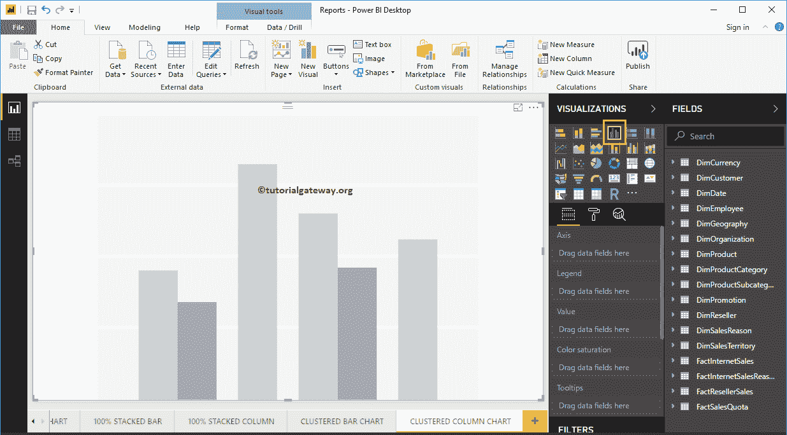
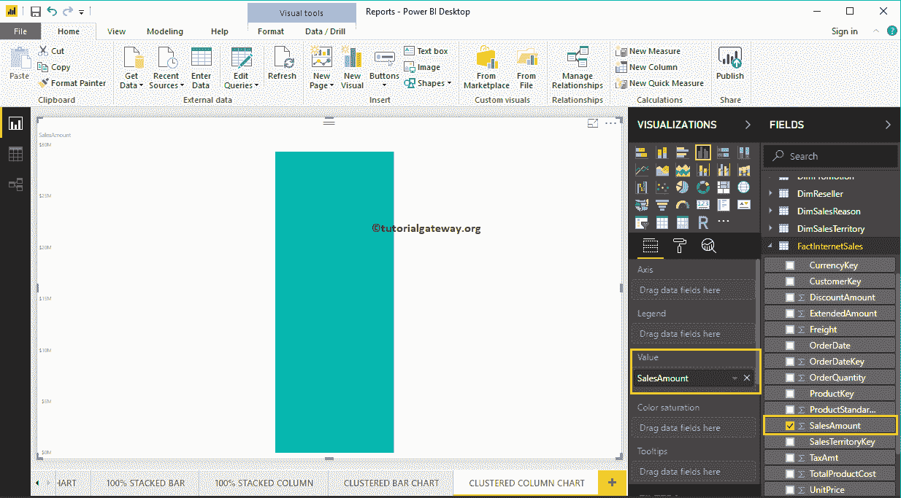
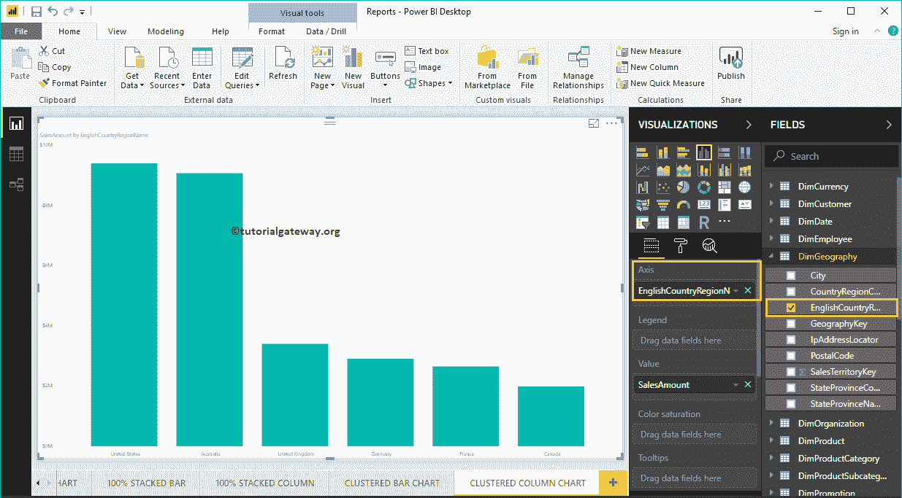
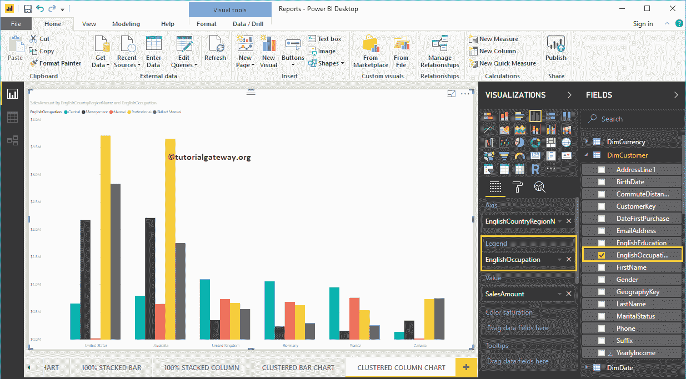
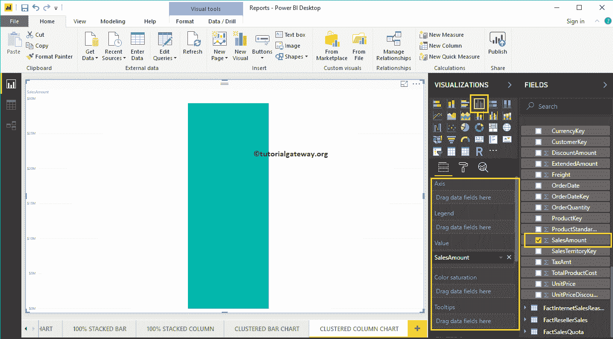
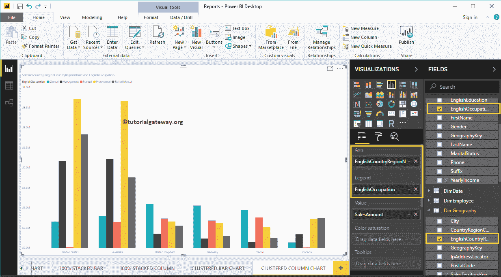
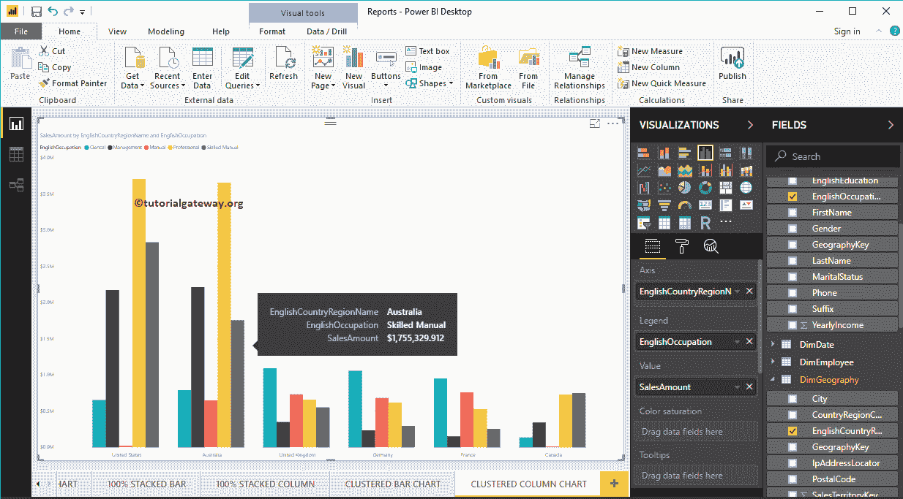
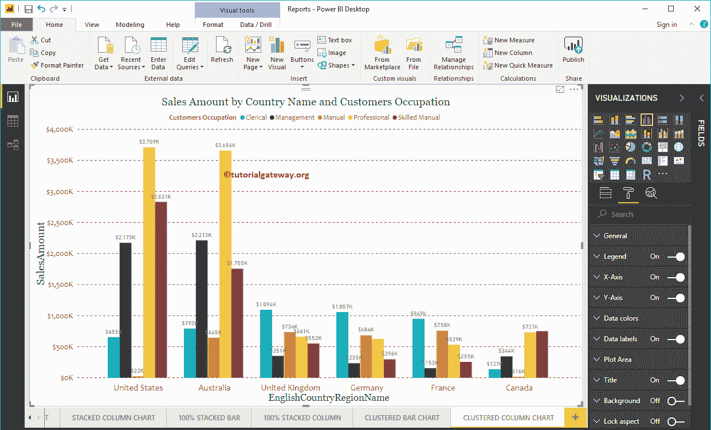

# PowerBI 中的聚类柱形图

> 原文：<https://www.tutorialgateway.org/clustered-column-chart-in-power-bi/>

Power BI 聚集柱形图用于显示多个数据区域(度量)相对于单个度量的竖线。让我用例子向你展示如何在 Power BI 中创建一个聚集柱形图。

在这个 Power BI 集群柱形图演示中，我们将使用我们在上一篇文章中创建的 SQL 数据源。所以，请参考[将 Power BI 连接到 SQL Server](https://www.tutorialgateway.org/connect-power-bi-to-sql-server/) 一文，了解 [Power BI](https://www.tutorialgateway.org/power-bi-tutorial/) 中的数据源。

## 如何在 PowerBI 中创建聚类柱形图

首先，单击可视化部分下的聚集柱形图。它将自动创建一个包含虚拟数据的聚集柱形图，如下图所示。

要将数据添加到 Power BI 聚集柱形图，我们必须添加必需的字段:

*   轴:请指定代表垂直轴的主列。
*   图例:指定代表竖线(或条形颜色)的第二列。
*   值:任何数值，如销售额、总销售额等。

让我将销售金额从字段部分拖动到值字段

接下来，让我将英语国家/地区名称添加到轴部分来创建柱形图。此图表按英语国家/地区名称显示销售额。

接下来，将“客户”表中的“英语职业”添加到“图例”部分。

### 创建聚集柱形图方法 2

要创建聚集柱形图，首先将“字段销售额”部分拖放到“画布”区域。它将创建一个[柱形图](https://www.tutorialgateway.org/column-chart-in-power-bi/)，如下图所示。

接下来，让我将英语国家/地区名称添加到轴部分，将英语职业添加到图例部分。它会使用国家和职业列自动为您创建一个聚集柱形图。

将鼠标悬停在任何竖线上将显示国家名称、客户职业和销售额的工具提示

让我对这个 Power BI 集群柱形图做一些快速格式化。

注意:柱形图和聚集柱形图的格式选项是相同的。因此，我建议您参考[格式化柱形图](https://www.tutorialgateway.org/format-power-bi-column-chart/)一文，了解格式化聚集列所涉及的步骤。

