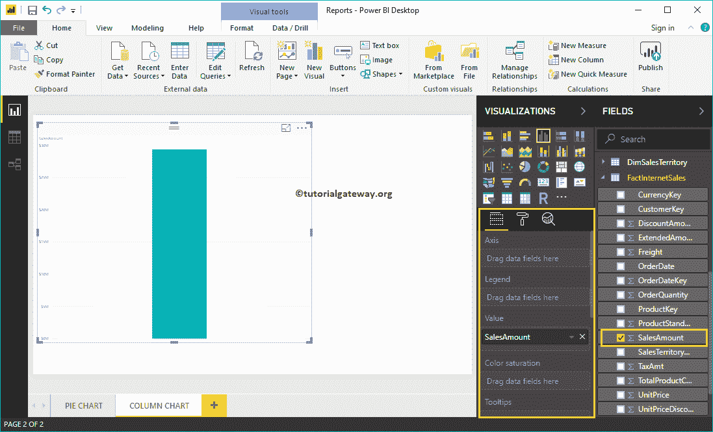
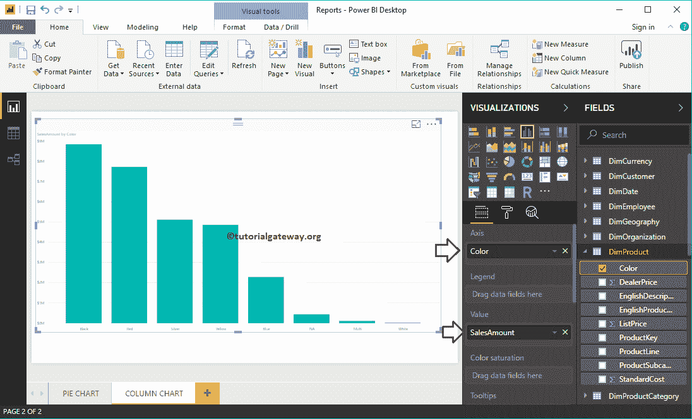
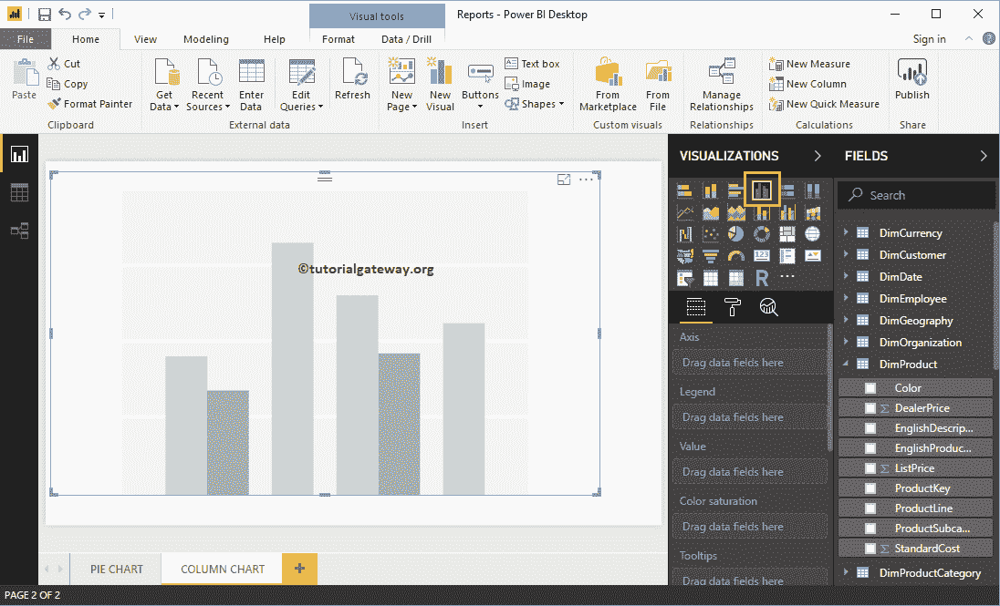
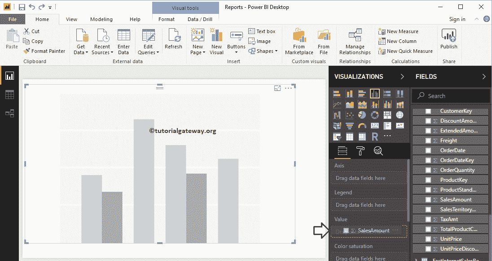
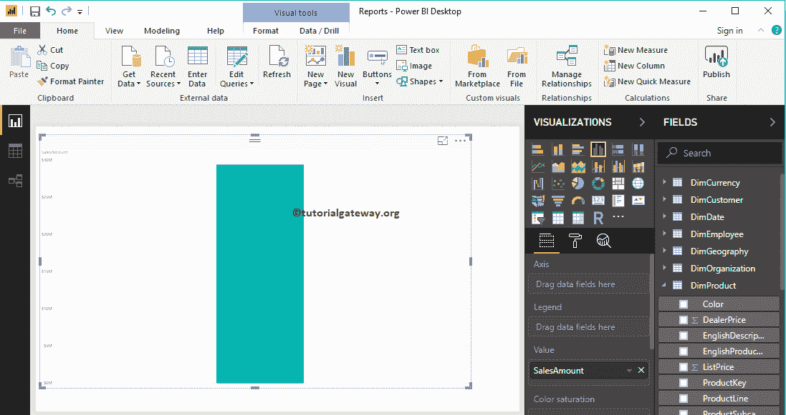
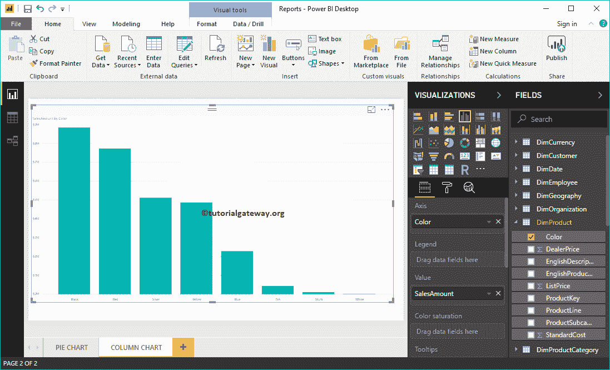
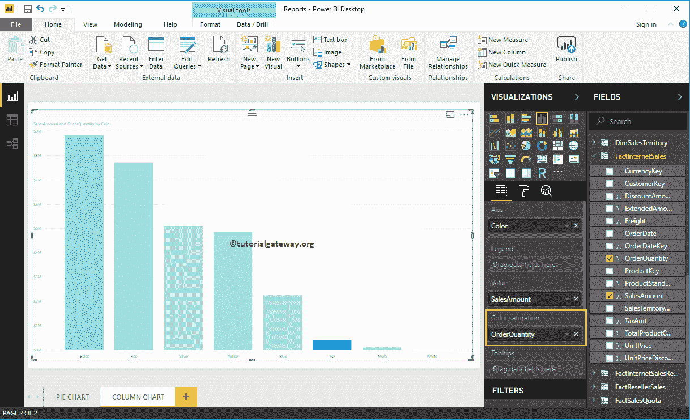
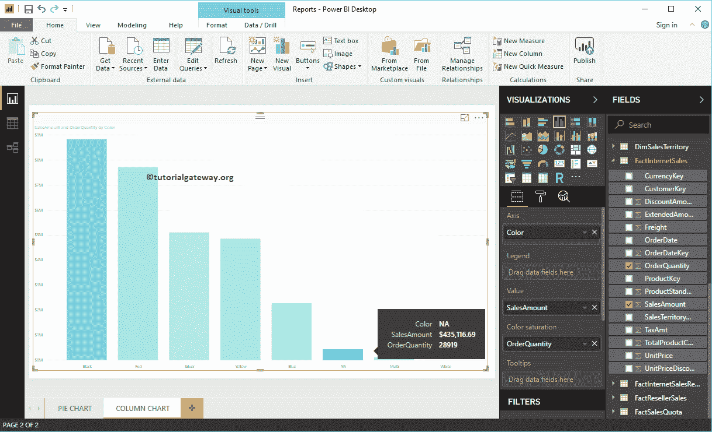
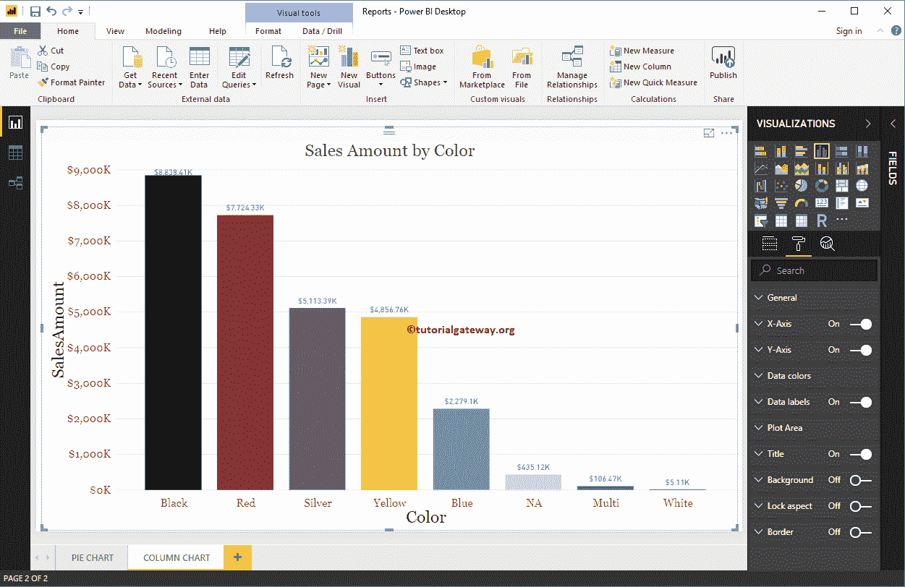

# PowerBI 中的柱形图

> 原文：<https://www.tutorialgateway.org/column-chart-in-power-bi/>

Power BI 柱形图对于直观地比较分类数据非常有用。例如，如果我们想按产品组或颜色比较销售额，那么我们可以使用这个 Power BI 柱形图。

在这个 Power BI 柱形图演示中，我们将使用我们在上一篇文章中创建的 SQL 数据源。

请参考[将 Power BI 连接到 SQL Server](https://www.tutorialgateway.org/connect-power-bi-to-sql-server/) 文章，了解 [Power BI](https://www.tutorialgateway.org/power-bi-tutorial/) 数据源。

## 如何在 PowerBI 中创建柱形图

将“字段中的销售额”部分拖放到画布上，自动创建一个 Power BI 柱形图，如下图所示。

接下来，让我将“颜色”字段添加到“轴”中，创建一个按产品颜色显示销售额的柱形图。

### 在 Power BI 2 中创建柱形图

当您单击可视化部分下的柱形图时，它会自动创建一个柱形图，如下图所示。

要向 Power BI 柱形图添加数据，我们必须添加必需的字段:

*   轴:请指定分隔条形的列。
*   值:任何数值，如销售额、总销售额、客户数量等。

让我将“销售额”从“字段”部分拖到“值”字段。

并且你可以看到，它已经为你创建了一个柱形图

接下来，将产品颜色添加到轴字段。您可以通过将“颜色”拖到“轴”部分，或者选中“颜色”列

Power BI 柱形图还有一个属性叫做色彩饱和度。让我添加订单数量，使颜色从浅到深变得饱和。从下面的截图可以看到，除了 NA 以外的所有产品颜色都是浅色

是因为 NA 色产品订单量高，但是销量很少。而黑色产品的销量很高，但订单很少。

让我快速格式化一下这个柱形图。建议大家参考[格式化柱形图](https://www.tutorialgateway.org/format-power-bi-column-chart/)一文，了解格式化条形颜色、数据颜色、背景颜色、标题、轴字体、颜色

所涉及的步骤