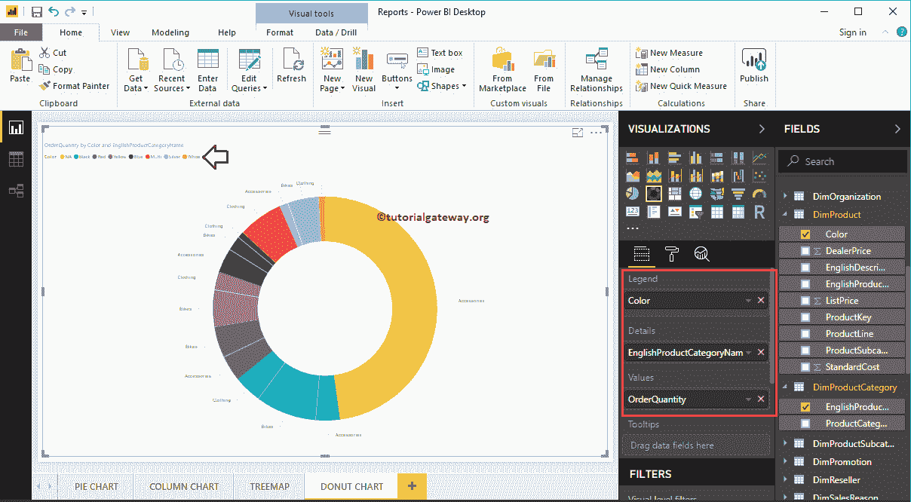

# 功率商业智能圆环图

> 原文：<https://www.tutorialgateway.org/power-bi-donut-chart/>

Power BI 圆环图类似于饼图，有助于可视化更高级别的数据。在本文中，我们将通过示例向您展示如何在 Power BI 中创建圆环图。

对于 Power BI 演示中的这个圆环图，我们将使用我们在上一篇文章中创建的 SQL 数据源。

请参考[将 Power BI 连接到 SQL Server](https://www.tutorialgateway.org/connect-power-bi-to-sql-server/) 文章，了解 [Power BI](https://www.tutorialgateway.org/power-bi-tutorial/) 数据源。

## 如何在PowerBI中创建圆环图

当您单击可视化部分下的这一点时，它会自动创建一个包含虚拟数据的圆环图。

要向 Power BI 圆环图添加数据，我们必须添加必需的字段:

*   图例:拖放要显示为图例的列。
*   详细信息:拖放要分区的列。
*   值:任何数值，如订单、销售额、总销售额、客户数量等。

让我将订单数量从字段部分拖放到值字段。

接下来，让我将 DimProductCategory 表中的英文产品类别名称添加到 Power BI 圆环图坐标轴部分。您可以通过将“类别”拖到“轴”上，或者选中“类别”列来完成此操作。

从上面的截图中，您可以看到按产品类别划分的订单数量圆环图。

### 在PowerBI中创建圆环图–方法 2

首先，将订单数量从字段部分拖放到画布上。它会自动创建一个[电源 BI 列](https://www.tutorialgateway.org/column-chart-in-power-bi/)。

接下来，让我将 DimProductCategory 表中的英文产品类别名称添加到 Axis 部分。为此，请将“类别”拖放到“轴”上，或者选中“类别”列。

通过点击可视化部分下显示的选项，自动将该列转换为环形图

通过向详细信息部分添加另一个字段，进一步划分功率商业智能圆环图。

让我对它做一些快速格式化。我建议您参考[格式](https://www.tutorialgateway.org/format-donut-chart-in-power-bi/)文章，了解格式化标题字体、标题对齐、数据标签、图例标题、切片颜色和背景颜色所涉及的步骤。

