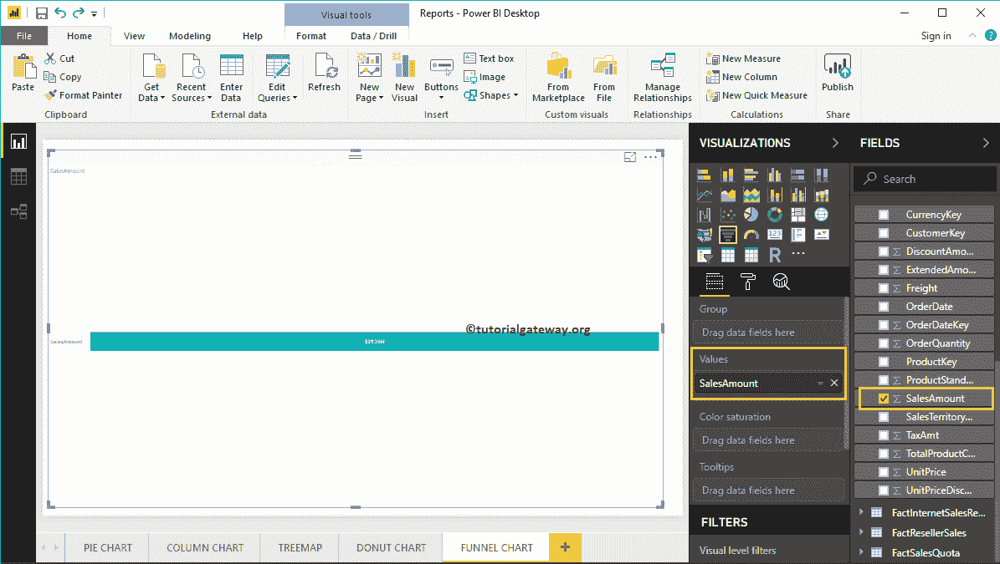

# PowerBI 漏斗图

> 原文：<https://www.tutorialgateway.org/power-bi-funnel-chart/>

Power BI 漏斗图对于分阶段显示数据非常有用。例如，我们可以使用这个例子来详细地可视化每个阶段的产品成本。

在这个 Power BI 漏斗图演示中，我们将使用我们在上一篇文章中创建的 SQL 数据源。所以，请参考[连接到 SQL Server](https://www.tutorialgateway.org/connect-power-bi-to-sql-server/) 文章了解 [Power BI](https://www.tutorialgateway.org/power-bi-tutorial/) 数据源。

## 如何在 PowerBI 中创建漏斗图

首先，单击可视化部分下的选定项。它会自动创建一个包含虚拟数据的漏斗图，如下图所示。

要在 Power BI 中向漏斗图添加数据，我们必须添加必需的字段:

*   组:请指定显示阶段的列。
*   值:任何数值，如销售额、总销售额、客户数量等。

让我将“销售额”从“字段”部分拖放到“值”字段。

接下来，将 DimProduct 表中的英文产品名称添加到组部分。您可以通过将“产品名称”拖到“组”部分来完成此操作，或者只需勾选“产品名称”列

现在，您可以看到每种产品的销售金额的 Power BI 漏斗图。将鼠标悬停在任何框上，会显示产品名称及其销售额的工具提示

### 在 PowerBI 方法 2 中创建漏斗图

首先，将销售额从字段部分拖放到画布上。它会自动创建一个[柱形图](https://www.tutorialgateway.org/column-chart-in-power-bi/)，如下图所示。

通过点击可视化部分下的标记，自动将柱形图转换为漏斗图

接下来，让我将销售区域从销售区域添加到集团部分。意思是每个方框代表一个地区

让我来快速格式化一下 Power BI 漏斗图

注:我建议您参考[格式](https://www.tutorialgateway.org/format-funnel-chart-in-power-bi/)文章，了解格式化标题字体、标题对齐、方框颜色、数据标签和颜色所涉及的步骤。

