# PowerBI 中的热图

> 原文：<https://www.tutorialgateway.org/heat-map-in-power-bi/>

PowerBI 热图有助于显示数据和颜色。通过看到颜色，人们可以很容易地理解利润。让我用一个例子向您展示如何在 Power BI 中创建热图。

在这个 Power BI 热图演示中，我们将使用我们在上一篇文章中创建的 SQL 数据源。所以，请参考[将 Power BI 连接到 SQL Server](https://www.tutorialgateway.org/connect-power-bi-to-sql-server/) 文章，了解 [Power BI](https://www.tutorialgateway.org/power-bi-tutorial/) 数据源。

## 如何在 PowerBI 中创建热图

要创建 Power BI 热图，首先，单击可视化部分下的矩阵。它自动用虚拟数据创建一个[矩阵](https://www.tutorialgateway.org/create-a-matrix-in-power-bi/)。

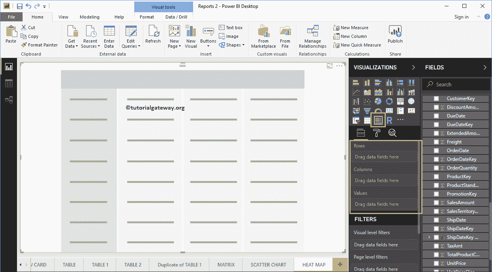

接下来，将英文国家/地区名称拖放到列组，将产品颜色拖放到行组。现在，你可以看到一个没有值的矩阵。

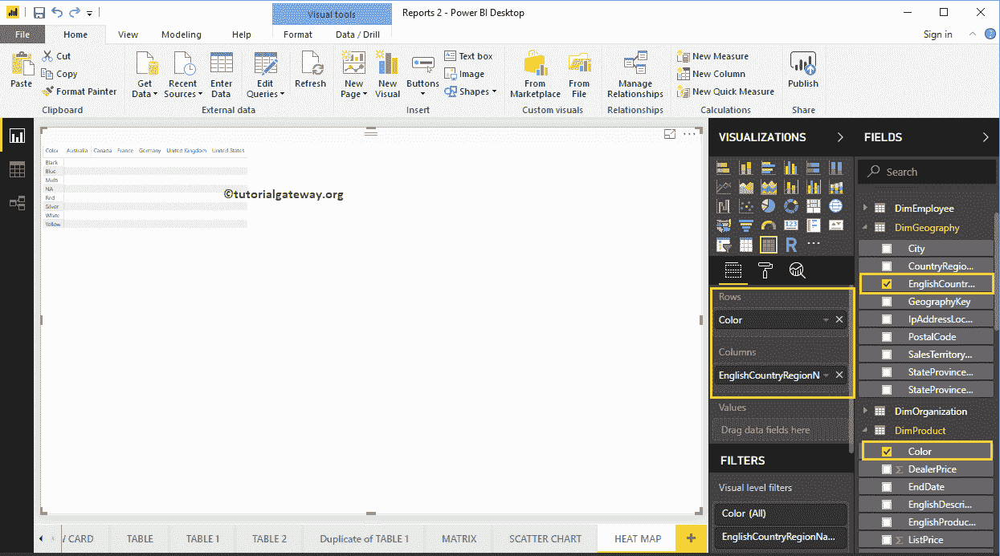

接下来，让我将销售金额拖到值部分。它自动启用行总计和总计

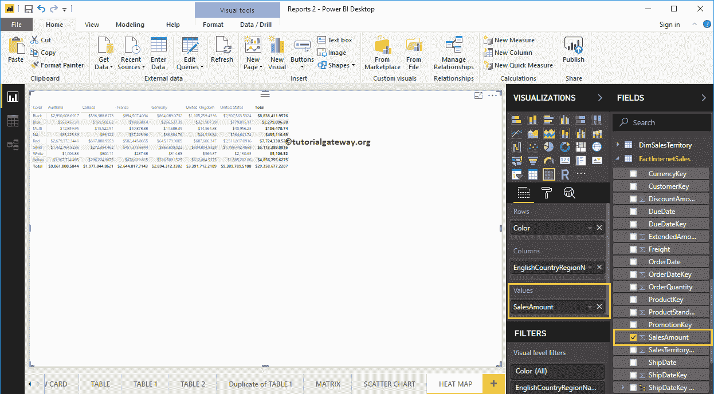

请单击“格式”按钮，将此矩阵转换为 Power BI 中的热图。建议大家参考[格式化矩阵](https://www.tutorialgateway.org/format-power-bi-matrix/)一文了解格式化选项。

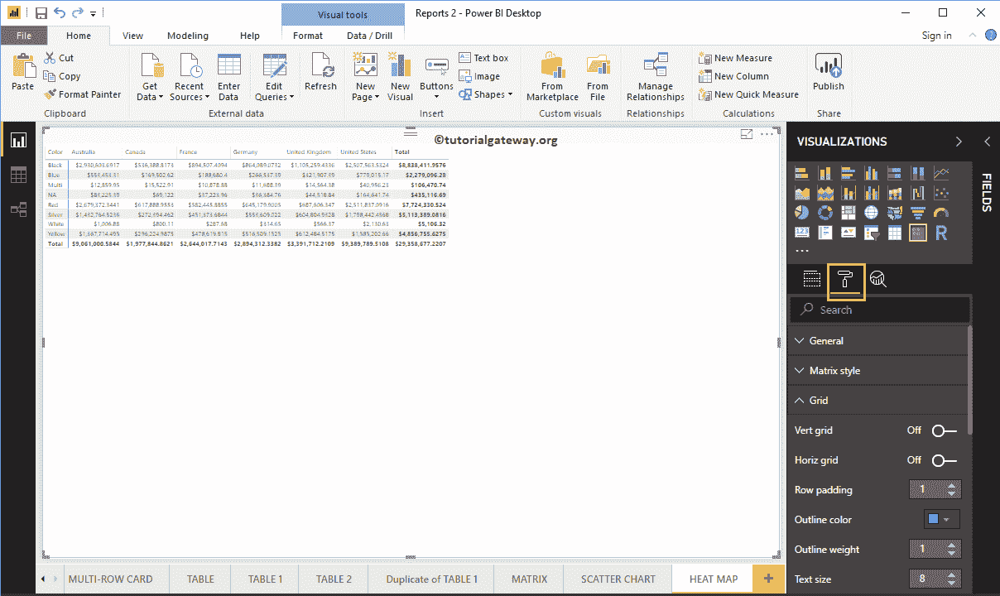

首先，转到网格部分。从下面的截图可以看到，我们将行填充改为 18，文本大小改为 15

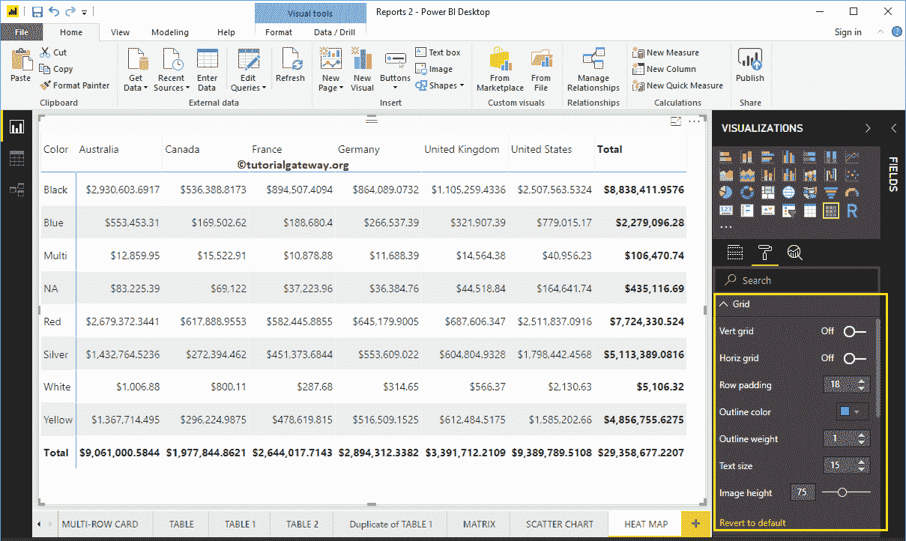

通过将“分类汇总”部分下的行分类汇总、列分类汇总切换到“关闭”，可以完全删除总计。所以，让我去掉它们

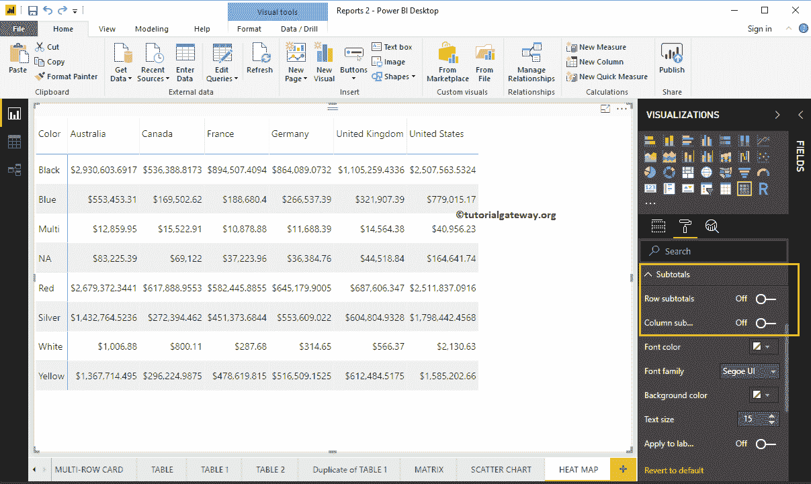

Power BI 热图的列标题部分帮助我们更改标题。从下面的截图中可以看到，我们将字体系列更改为 Cambria。接下来，大纲到顶部+底部(大纲添加到页眉的顶部和底部)，文本大小为 22，页眉文本对齐居中。

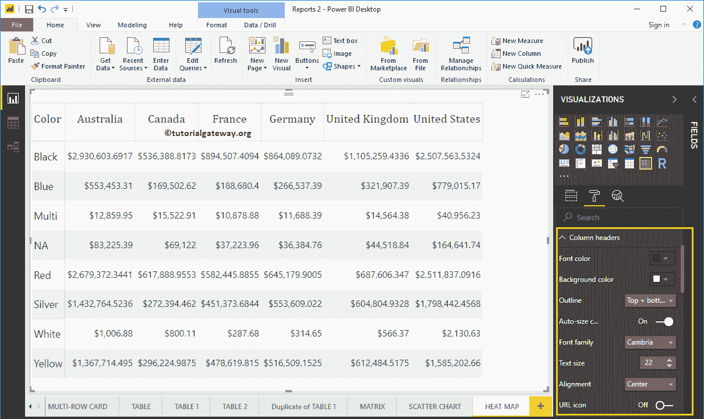

Power BI 热图的行标题部分帮助我们格式化行标题部分。这里，我们将大纲更改为左+右(大纲添加到标题列的左侧和右侧，即颜色)。接下来，将“字体系列”设置为“柬埔寨”，将“文本大小”设置为 22，并将文本对齐居中。

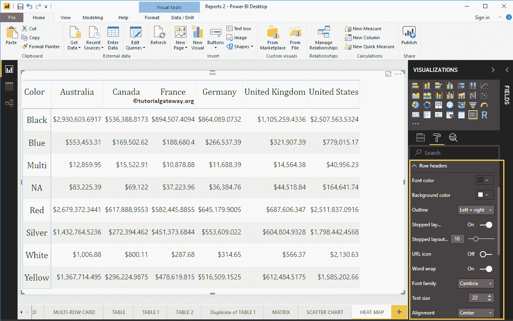

### PowerBI 热图示例

要将该矩阵连接到 Power BI 热图，请转到条件格式部分，为矩阵数值列添加颜色。

从下面的截图中可以看到，我们选择了“销售额”作为字段，并将背景色阶属性切换为“开”。它向矩阵添加默认颜色。我的意思是，默认颜色为 PowerBI 热图。

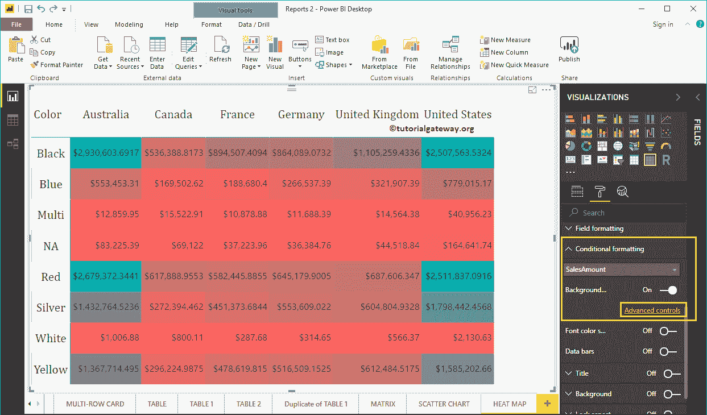

### 更改 PowerBI 热图颜色

要更改 Power BI 热图颜色，请单击高级选项。它将打开以下窗口。如果您对两种颜色感兴趣，请选择最小颜色和最大颜色。

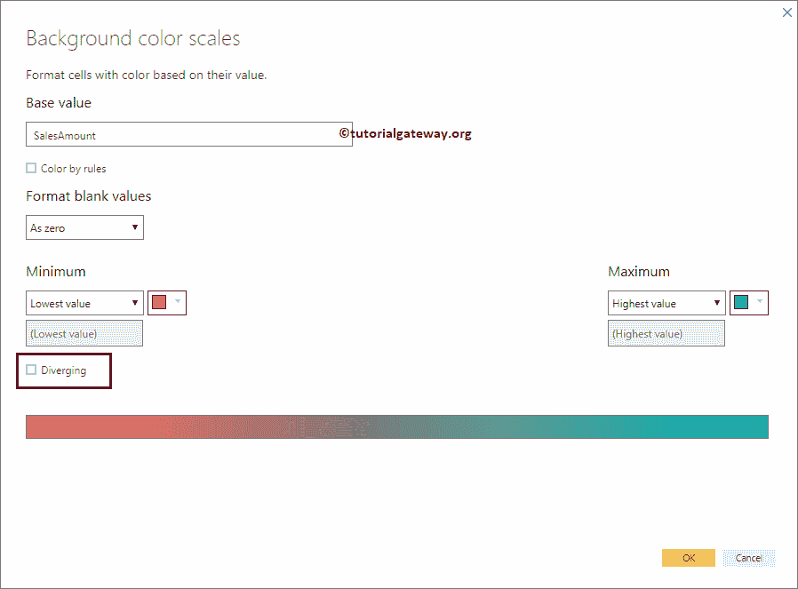

我们勾选了分叉选项。接下来，我们选择一些随机的颜色作为最小值、中心值和最大值。

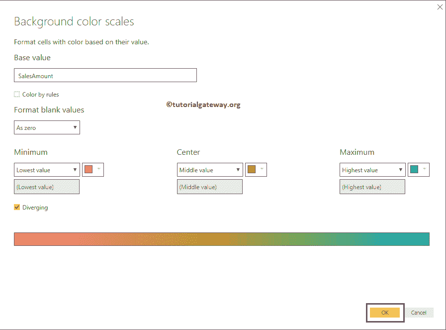

现在，您可以看到带有选定颜色的 PowerBI 热图。

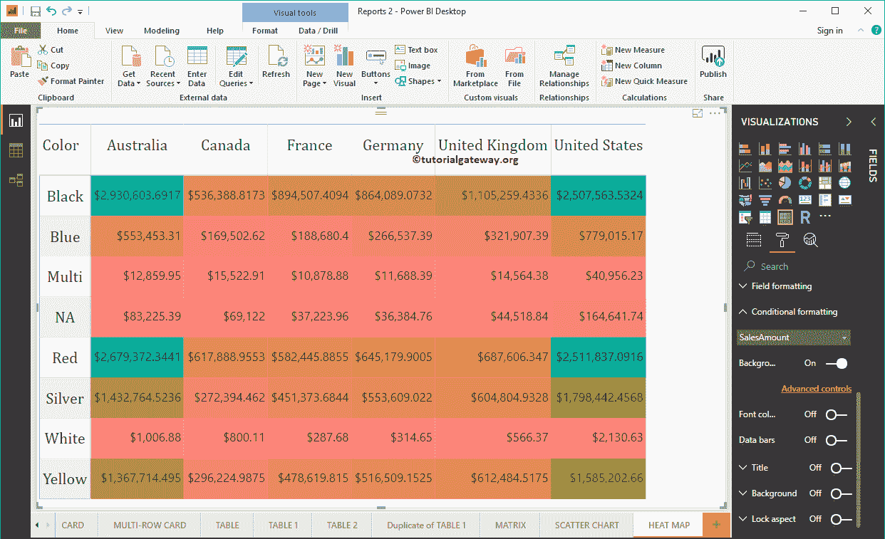