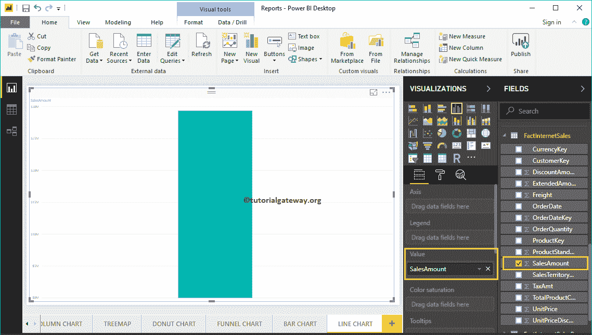
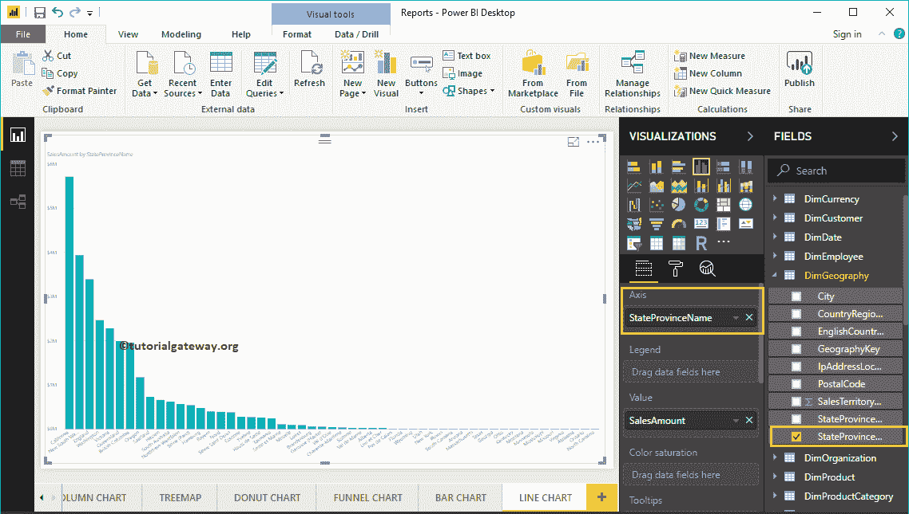
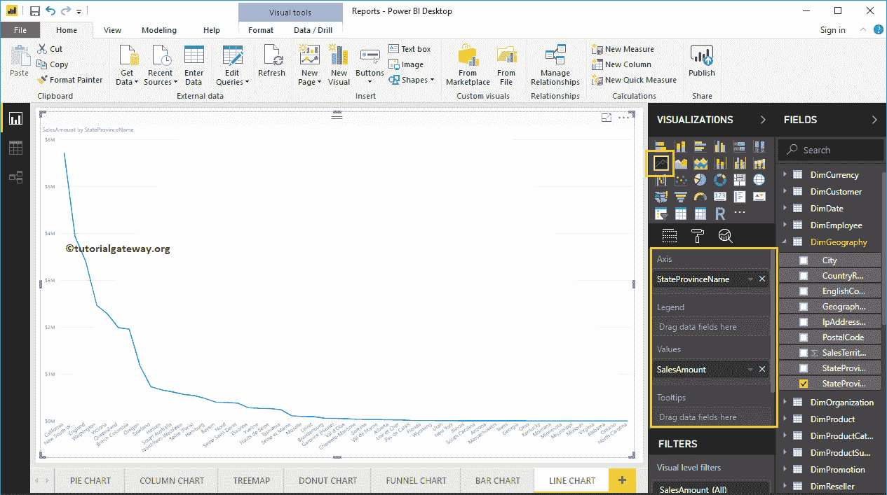
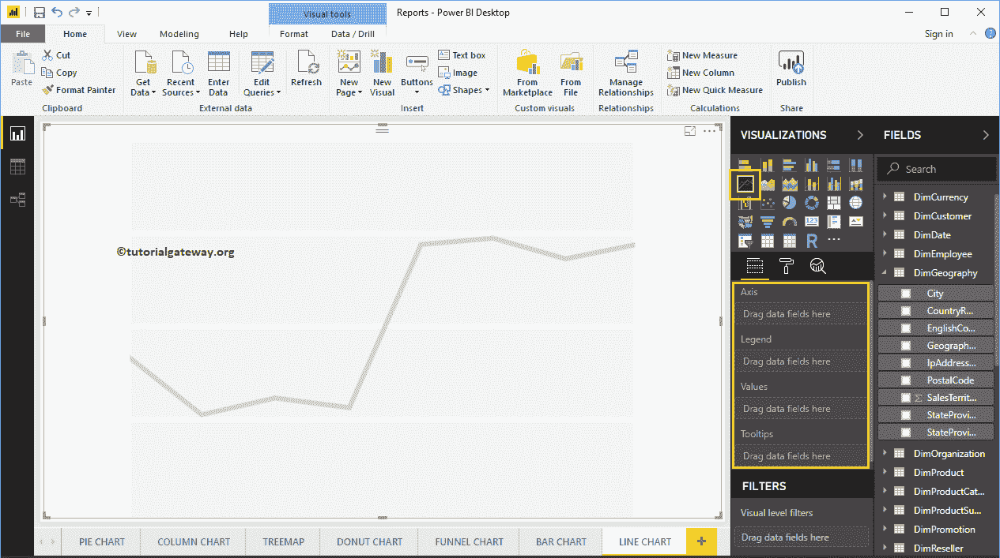
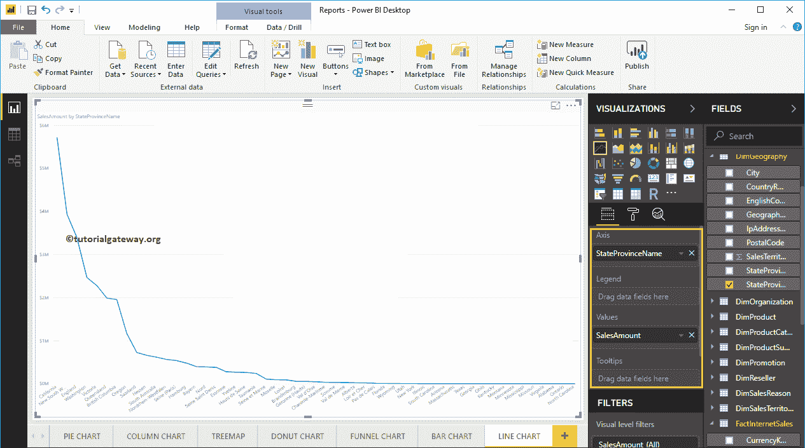
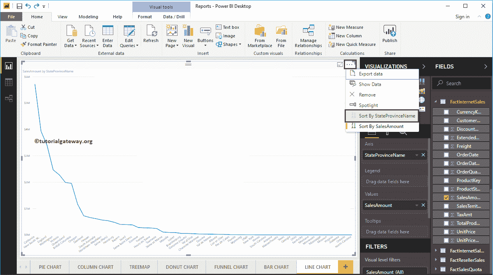
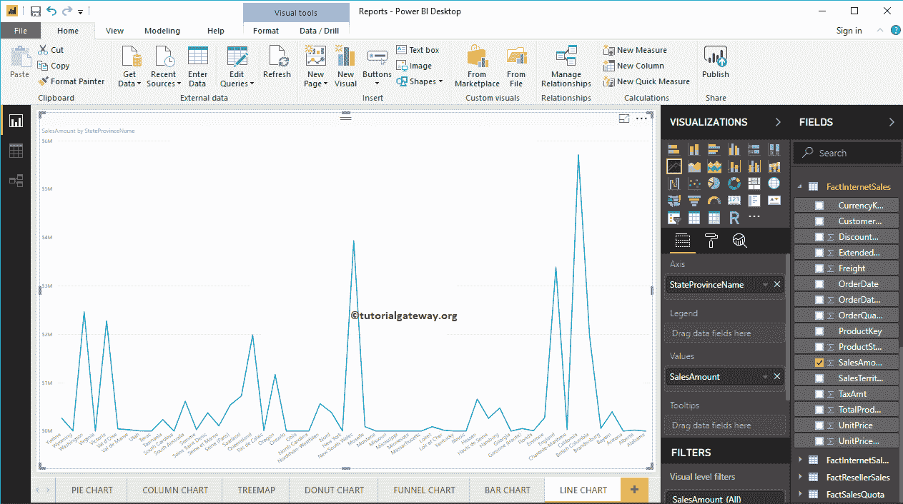
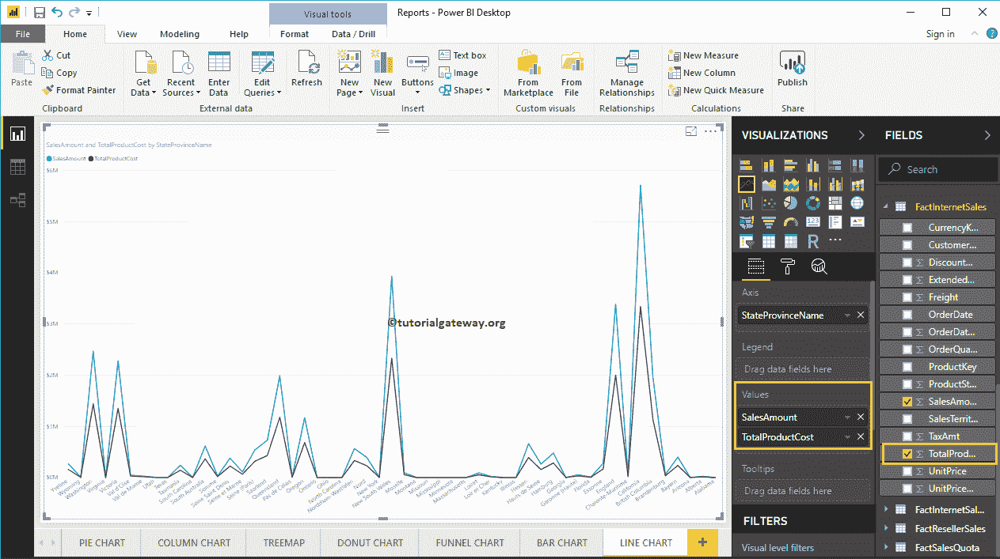
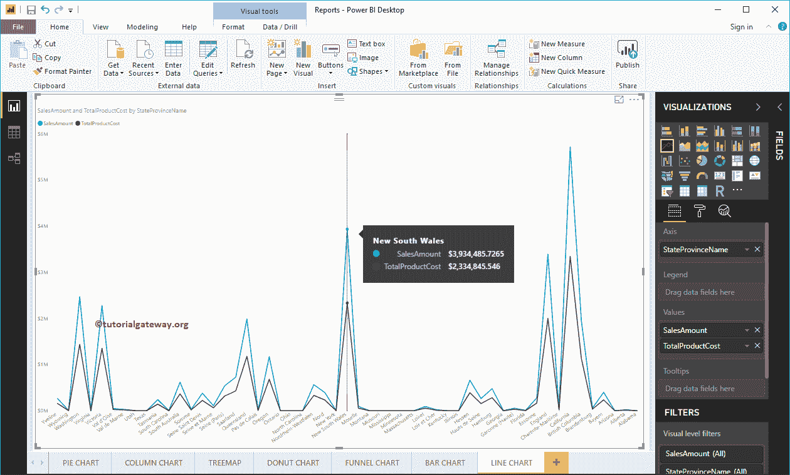
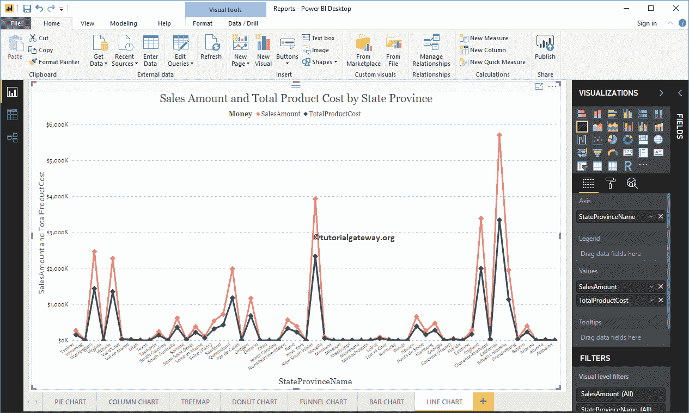

# 创建 PowerBI 折线图

> 原文：<https://www.tutorialgateway.org/create-a-power-bi-line-chart/>

PowerBI 折线图有助于可视化趋势。例如，您可以使用它来创建销售趋势、适度趋势等。让我用例子展示如何在 Power BI 中创建折线图。

对于这个 Power BI 折线图演示，我们将使用我们在上一篇文章中创建的 SQL 数据源。所以，请参考[连接到 SQL Server](https://www.tutorialgateway.org/connect-power-bi-to-sql-server/) 文章了解 [Power BI](https://www.tutorialgateway.org/power-bi-tutorial/) 数据源。

## 如何在 PowerBI 中创建折线图

要创建 PowerBI 折线图，首先将销售额从字段部分拖放到画布区域。它会自动创建一个[柱形图](https://www.tutorialgateway.org/column-chart-in-power-bi/)。

接下来，让我将州/省名称添加到轴部分。您可以通过将省/市/自治区拖到“轴”部分来完成此操作，或者只需选中省/市/市/自治区列。

通过单击可视化部分下显示的图标，它会自动将柱形图转换为折线图。

从下面的截图中，您可以看到按州/省名称显示销售趋势的 PowerBI 折线图。

### 在 PowerBI 方法 2 中创建折线图

首先，单击可视化部分下的折线图。它会自动用虚拟数据创建它。

为了向 PowerBI 折线图添加数据，我们必须添加必需的字段:

*   坐标轴:请指定代表趋势的列名。
*   值:任何数值，如销售额、总销售额等。

让我将“销售额”从“字段”部分拖到“值”字段，将“省/市/自治区名称”拖到“轴”部分。

让我按州/省名称对数据进行排序(默认情况下，按销售额排序)。为此，单击右上角的… (3 个点)并选择“按州/省名称排序”选项。

现在，您可以在 Power BI 折线图中看到正确的趋势。

让我再添加一个字段，即产品总成本到价值部分。它将比较销售金额与产品总成本的趋势。

将鼠标悬停在任何位置都会显示销售金额和产品总成本的工具提示

让我来快速格式化一下这个 PowerBI 折线图

注:我建议您参考[格式](https://www.tutorialgateway.org/format-line-chart-in-power-bi/)文章，了解格式化这些行所涉及的步骤。

