# PowerBI 中的折线图和聚类柱形图

> 原文：<https://www.tutorialgateway.org/line-and-clustered-column-chart-in-power-bi/>

Power BI 折线图和聚集柱形图对于可视化多个维度和度量非常有用。让我用例子展示如何在 Power BI 中创建折线图和聚集柱形图。

对于这个 Power BI 折线图和聚集柱形图演示，我们将使用我们在上一篇文章中创建的 Excel 数据源。

请参考[连接 Power BI 到 Excel 多张 Excel 表](https://www.tutorialgateway.org/connect-power-bi-to-multiple-excel-sheets/)文章了解 [Power BI](https://www.tutorialgateway.org/power-bi-tutorial/) 数据源。

## 如何在 PowerBI 中创建折线图和聚类柱形图

要在 Power BI 中创建折线图和聚集柱形图，首先将“字段销售额”部分拖放到画布区域。它会自动创建一个[柱形图](https://www.tutorialgateway.org/column-chart-in-power-bi/)，如下图所示。

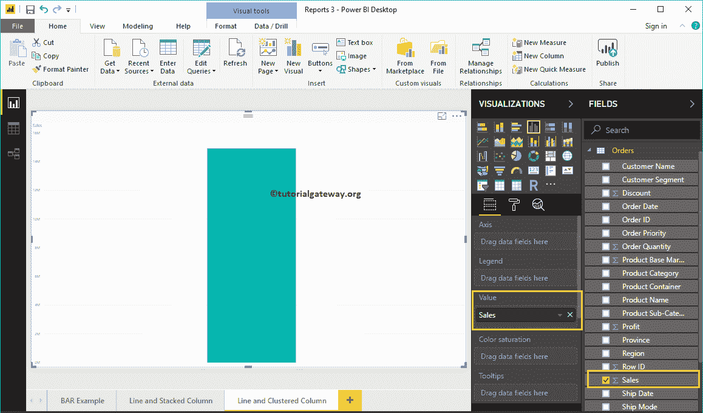

单击可视化部分下的折线图和聚集柱形图。它会自动将柱形图转换为折线图和聚集柱形图。目前，您看不到变化，因为您必须添加更多的字段。

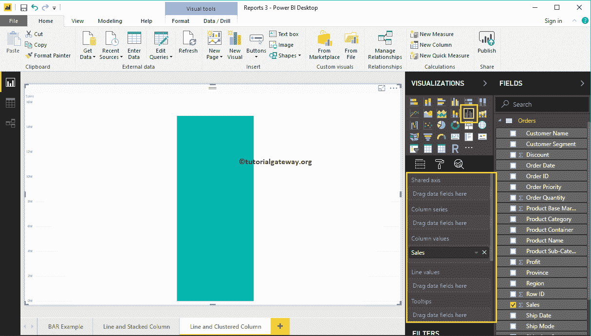

让我将区域添加到共享轴部分，将利润添加到线值部分，将其转换为[线](https://www.tutorialgateway.org/create-a-power-bi-line-chart/)和[聚集](https://www.tutorialgateway.org/clustered-column-chart-in-power-bi/)图表。

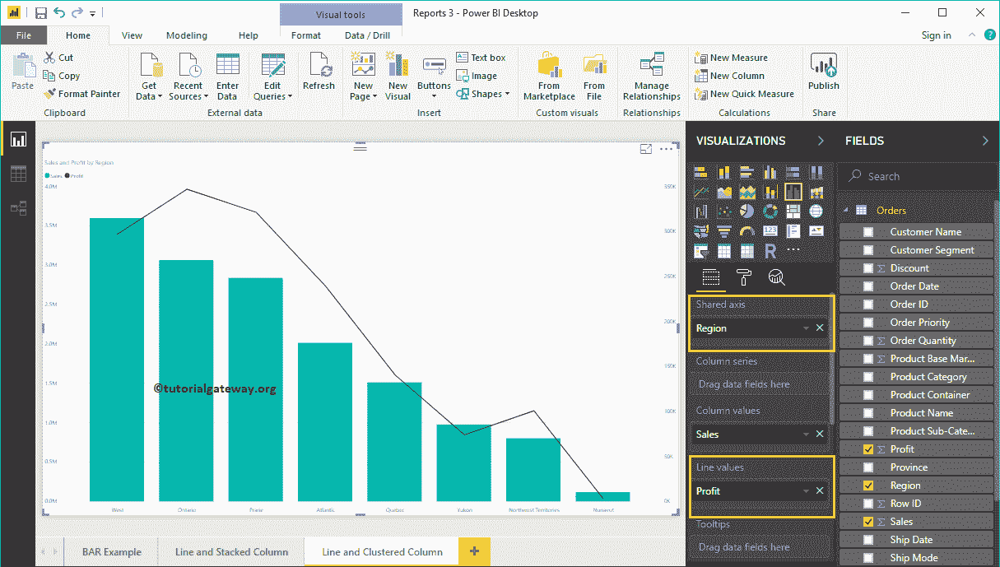

接下来，我们将客户细分添加到列系列部分，将其转换为[集群列](https://www.tutorialgateway.org/clustered-column-chart-in-power-bi/)。

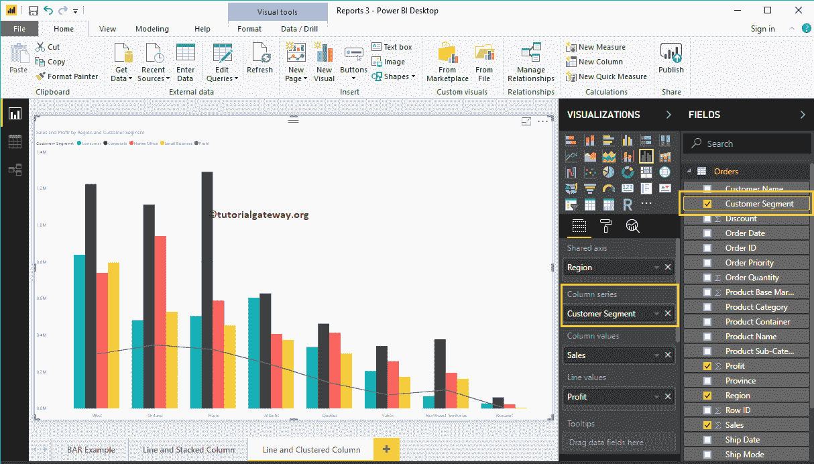

### 在 Power BI 方法 2 中创建折线图和聚类柱形图

首先，单击可视化部分下的折线图和聚集柱形图。它将创建一个带有虚拟数据的折线图和聚集柱形图，如下图所示。

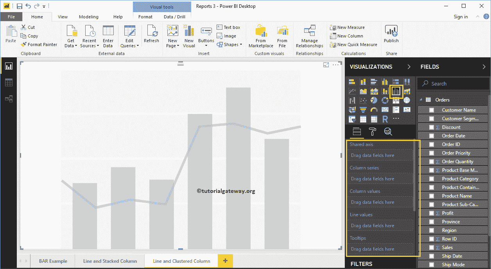

要向 Power BI 折线图和聚集柱形图添加数据，我们必须添加必需的字段:

*   共享轴:请指定代表垂直轴的轴。
*   列系列:指定代表聚集列条的系列。
*   列值:任何数值，如销售额、利润等。，表示竖线。
*   线值:表示线的任何数值。

让我将“销售从字段”部分拖到“列值”字段，将“区域”部分拖到“共享轴”部分。

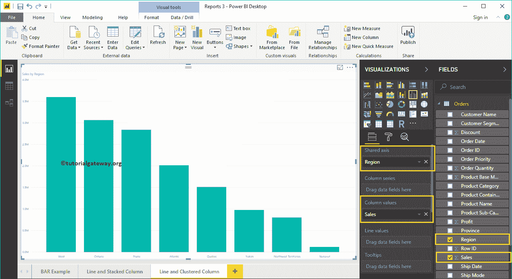

让我按地区对数据进行排序。为此，单击右上角的… (3 个点)，并选择“按区域排序”选项，如下所示。

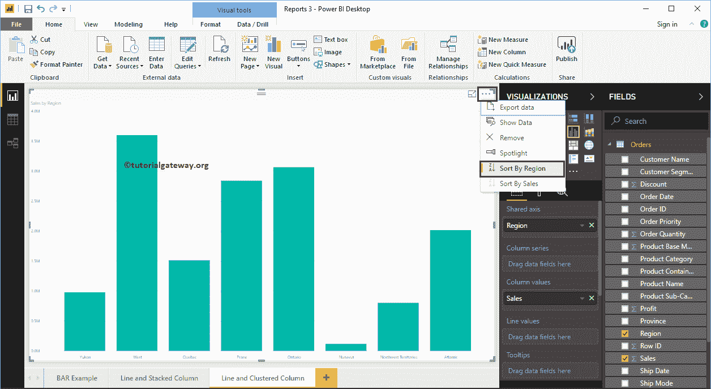

接下来，将产品类别添加到列系列部分

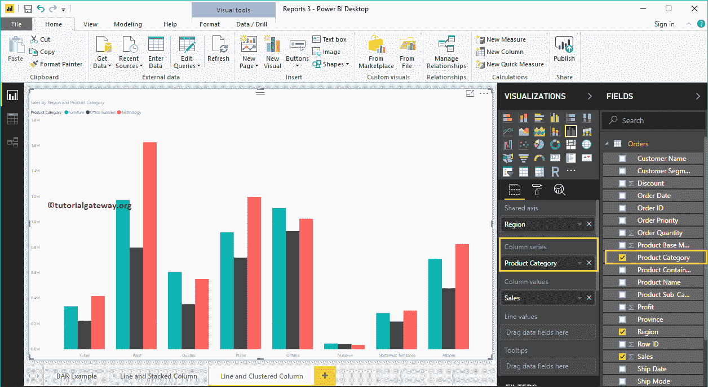

将“利润”字段拖放到“线值”部分。就是这样；我们得到了折线图和聚集柱形图。

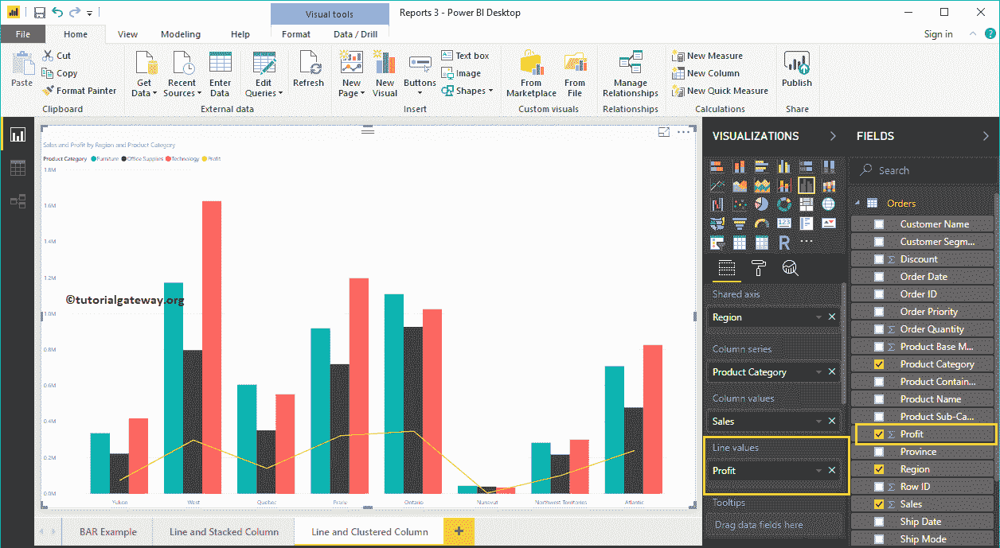

将鼠标悬停在任何竖线上都会显示地区、产品类别和销售额的工具提示。

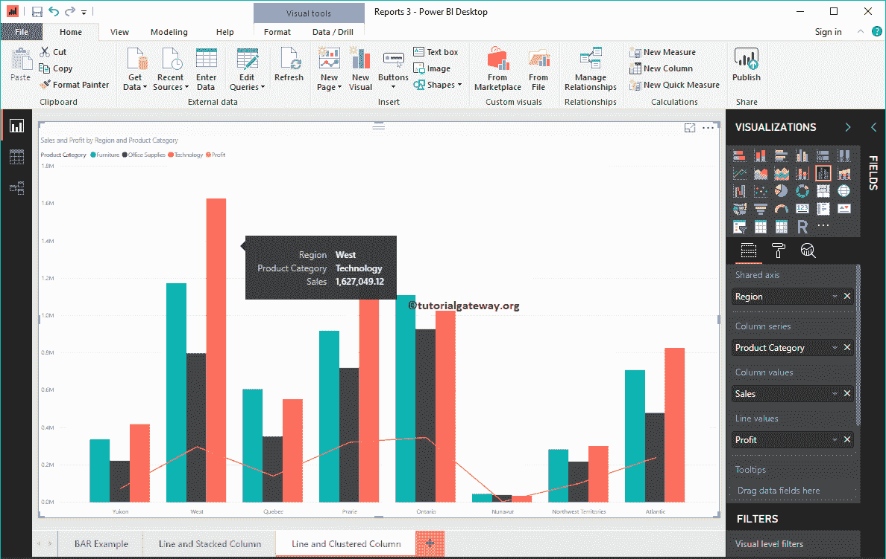

悬停在线的任何部分将显示区域和利润的工具提示。

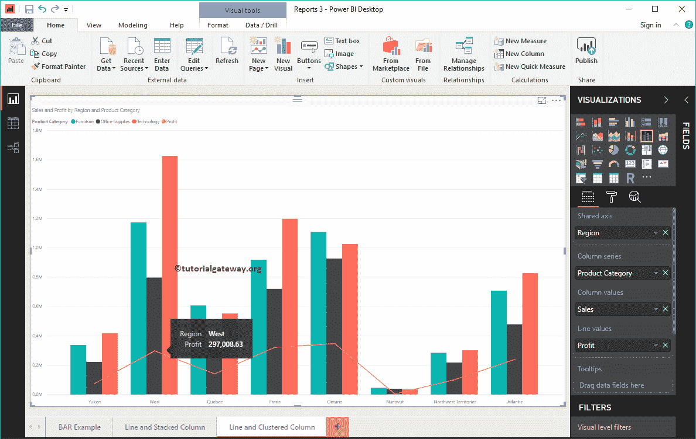

让我快速格式化一下这个折线图和聚集柱形图

注:我建议您参考[格式化线条和聚集图表](https://www.tutorialgateway.org/format-power-bi-line-and-clustered-column-chart/)文章，了解格式化聚集列、线条、标题等所涉及的步骤。

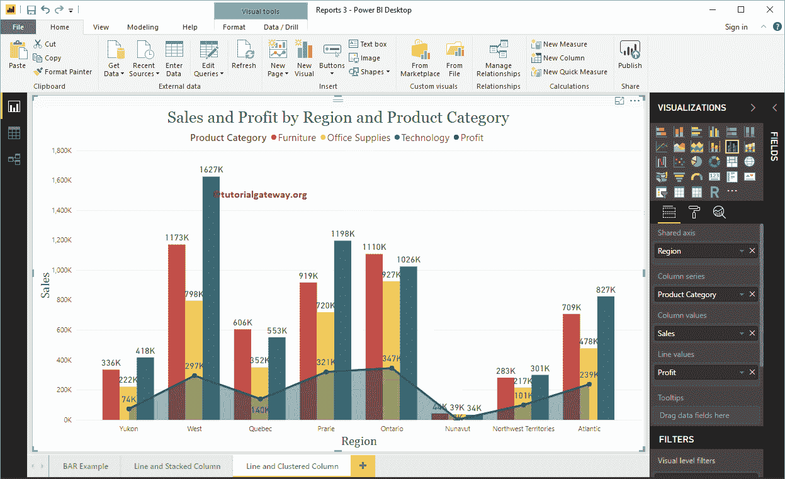