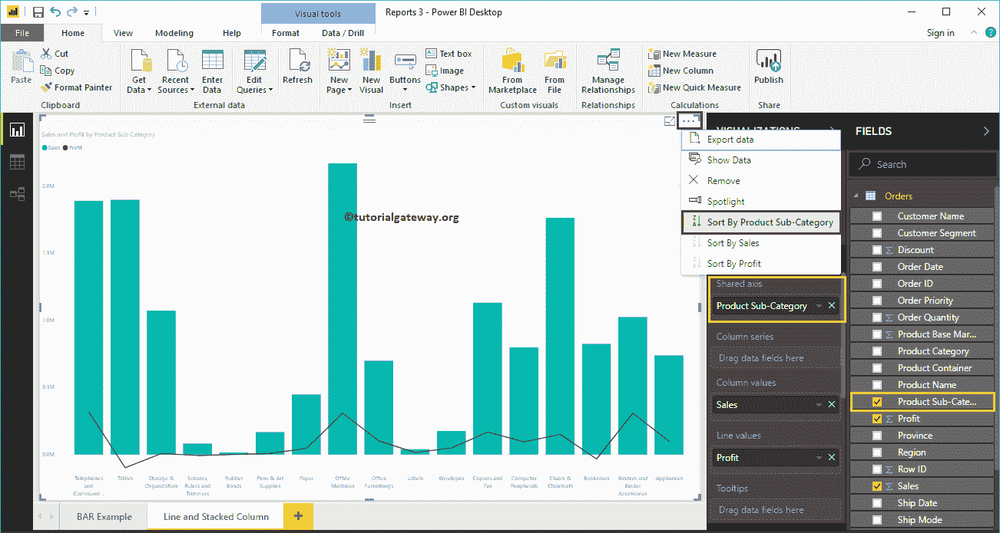
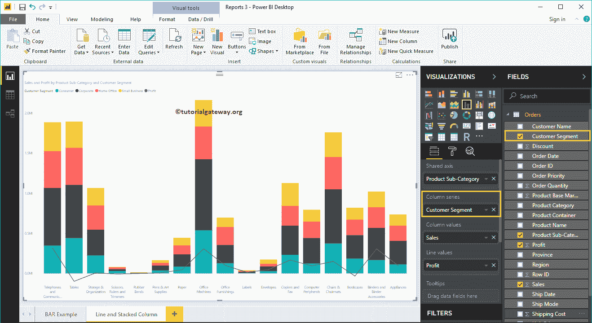

# PowerBI 中的折线图和堆积柱形图

> 原文：<https://www.tutorialgateway.org/line-and-stacked-column-chart-in-power-bi/>

Power BI 折线图和堆叠柱形图可帮助您可视化多个维度和度量。让我用例子展示如何在 Power BI 中创建折线图和堆叠柱形图。

对于这个 Power BI 折线图和堆叠柱形图演示，我们将使用我们在上一篇文章中创建的 Excel 数据源。

请参考[连接 Power BI 到 Excel 多张 Excel 表](https://www.tutorialgateway.org/connect-power-bi-to-multiple-excel-sheets/)文章了解 [Power BI](https://www.tutorialgateway.org/power-bi-tutorial/) 数据源。

## 如何在 PowerBI 中创建折线图和堆积柱形图

要在 Power BI 中创建折线图和堆叠柱形图，首先将“字段销售额”部分拖放到画布区域。它会自动创建一个[柱形图](https://www.tutorialgateway.org/column-chart-in-power-bi/)，如下图所示。

接下来，让我将产品子类别名称添加到轴部分。

让我按英文产品子类别名称对数据进行排序(默认按销售额排序)。为此，单击右上角的… (3 个点)并选择“按产品子类别名称排序”选项，如下所示。

单击可视化部分下的折线图和堆叠柱形图。它将柱形图转换为[线](https://www.tutorialgateway.org/create-a-power-bi-line-chart/)和[堆叠柱形图](https://www.tutorialgateway.org/stacked-column-chart-in-power-bi/)图表。从下面的截图来看，目前，你看不到变化，因为你必须添加更多的字段。

接下来，我们将向列系列部分添加一个客户细分，以将其转换为[堆积柱形图](https://www.tutorialgateway.org/stacked-column-chart-in-power-bi/)。

接下来，我们将利润添加到线值部分，将其转换为[线](https://www.tutorialgateway.org/create-a-power-bi-line-chart/)和堆叠柱形图。

### 在 Power BI 方法 2 中创建折线图和堆叠柱形图

首先，单击可视化部分下的折线图和堆叠柱形图。它将创建一个带有虚拟数据的折线图和堆叠柱形图，如下图所示。

要在 Power BI 中向折线图和堆叠柱形图添加数据，我们必须添加必需的字段:

*   共享轴:请指定代表垂直轴的列。
*   列系列:指定用于划分竖线的列。
*   列值:任何数值，如销售额、总销售额等。，表示竖线。
*   线值:表示线的任何数值。

让我将“销售额”从“字段”部分拖到“列值”字段，将“利润”字段拖到“行值”部分。

接下来，让我将产品子类别名称添加到共享轴部分。您可以通过将“产品子类别名称”拖到共享的“轴”部分来完成此操作。或者只需勾选“产品子类别名称”列。

让我按产品子类别名称对数据进行排序。为此，单击右上角的… (3 个点)并选择“按产品子类别名称排序”选项，如下所示。

接下来，将客户细分添加到列系列部分。就是这样；我们得到了我们的折线图和堆积柱形图

将鼠标悬停在竖线的任何部分上会显示产品子类别、客户细分和销售额的工具提示。

将鼠标悬停在线的任何部分上会显示产品子类别和利润的工具提示。

让我对 Power BI 中的折线图和堆叠柱形图做一些快速格式化。

注:建议大家参考[格式化线条和堆叠柱形图](https://www.tutorialgateway.org/format-power-bi-line-and-stacked-column-chart/)一文，了解格式化线条、堆叠柱形图颜色、标题等涉及的步骤。

