# 在PowerBI中创建矩阵

> 原文：<https://www.tutorialgateway.org/create-a-matrix-in-power-bi/>

Power BI 矩阵也称为交叉选项卡，用于显示两个或两个以上组之间的关系。让我用例子向你展示如何在 Power BI 中创建矩阵。

在这个 Power BI 矩阵演示中，我们将使用我们在上一篇文章中创建的 SQL 数据源。所以，请参考[连接到 SQL Server](https://www.tutorialgateway.org/connect-power-bi-to-sql-server/) 文章了解 [Power BI](https://www.tutorialgateway.org/power-bi-tutorial/) 数据源。

## 如何在PowerBI中创建矩阵

当您将任何尺寸字段拖到画布上时，Power BI 会自动创建一个[表](https://www.tutorialgateway.org/create-a-table-in-power-bi/)。让我将英文产品名称从字段部分拖放到画布上。你可以看到桌子。

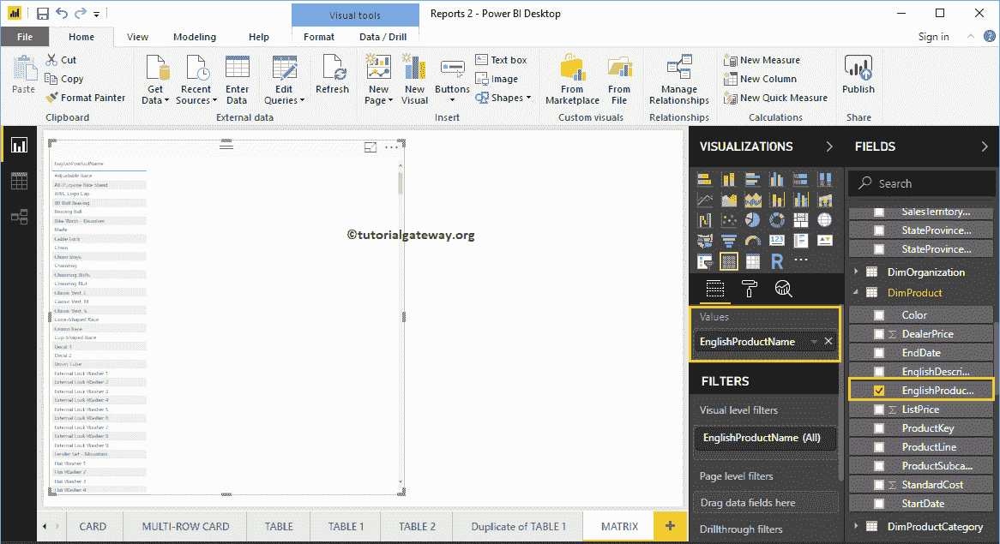

接下来，让我将一个指标值(销售额)拖到值部分，然后单击可视化部分下的矩阵。

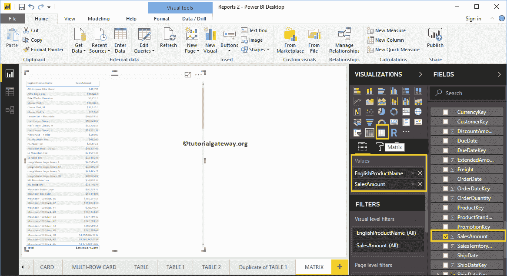

单击按钮将自动将表转换为矩阵。从下面的截图中，您可以看到英文产品名称和销售额的 corss 选项卡表示。

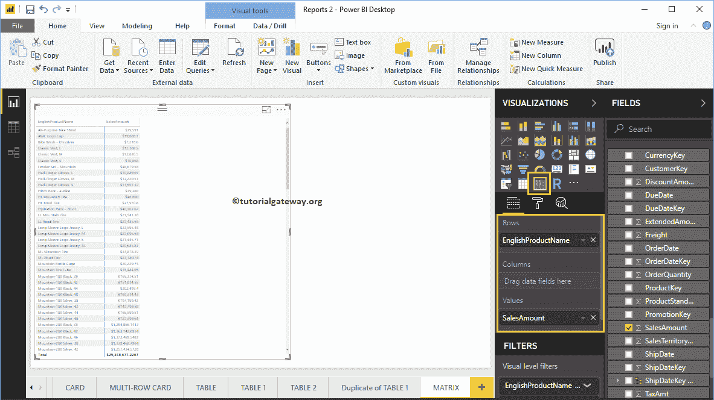

让我再添加一个列组，以便您可以理解交叉选项卡。如您所见，我们将客户性别添加到了列组中。

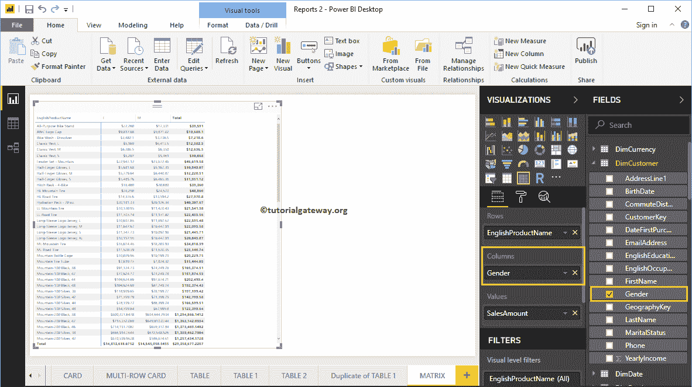

## 在 Power BI 方法 2 中创建一个交叉选项卡

如果您想将现有图表转换为 Power BI 矩阵，则可以执行此步骤。从下面的截图可以看到，我们创建了一个[柱形图](https://www.tutorialgateway.org/column-chart-in-power-bi/)，按英文产品子类表示订单数量。

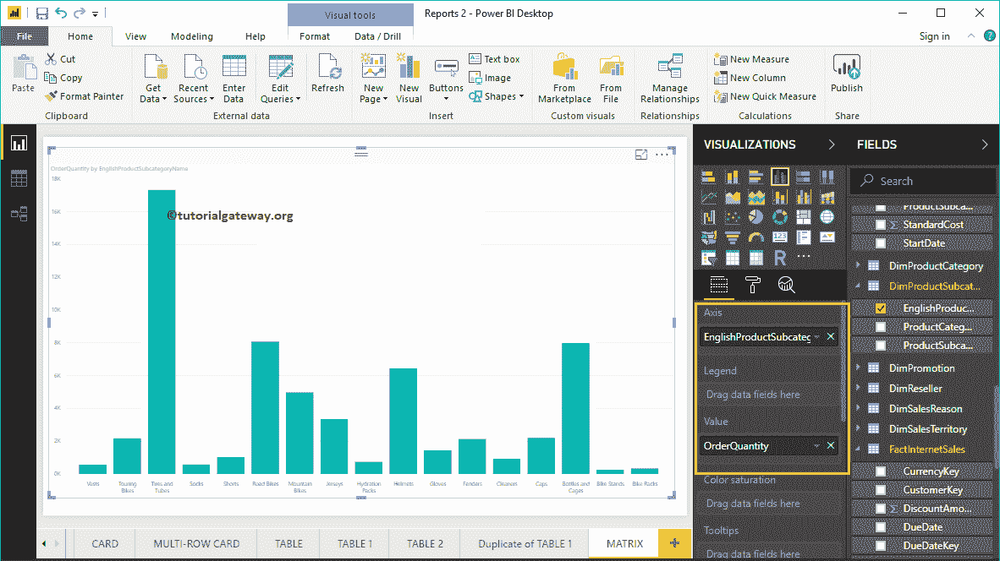

单击可视化部分下面显示的图标，自动将柱形图转换为十字选项卡。

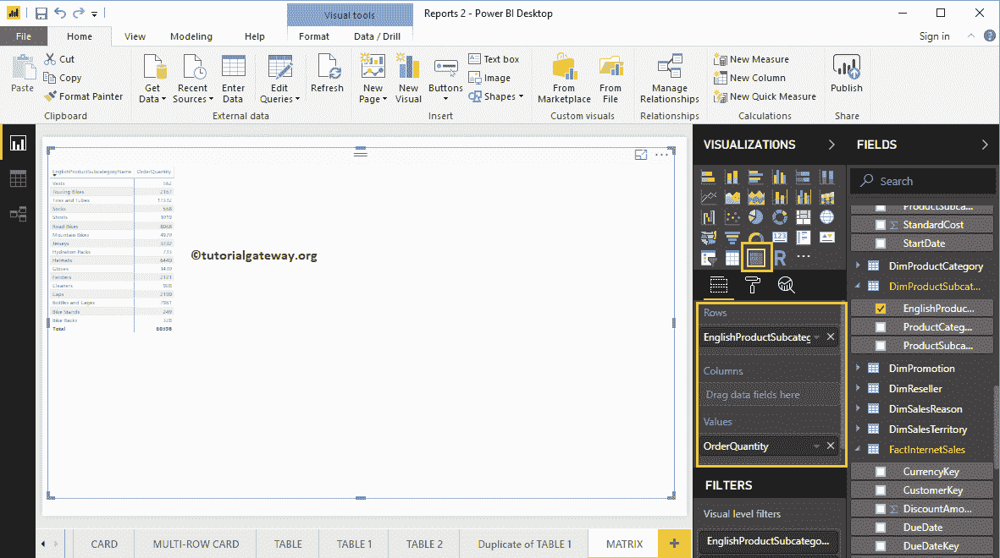

让我将产品颜色添加到列组

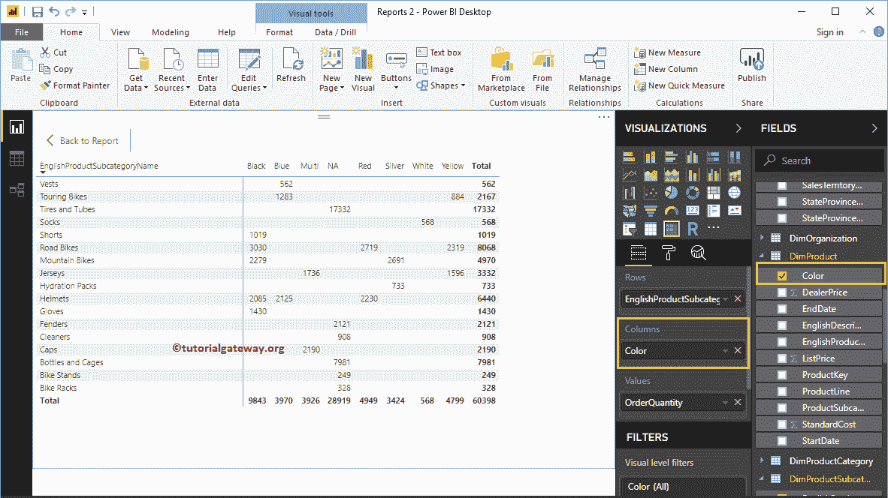

## 方法 3

要创建它，首先，单击可视化部分中的PowerBI矩阵。它会自动创建一个带有虚拟数据的交叉标签。接下来，让我添加产品颜色作为行组。

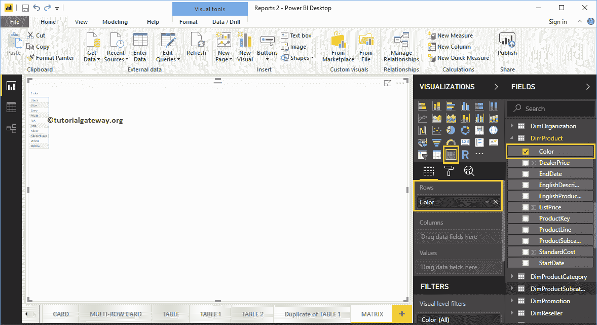

接下来，将英语职业拖放到列组中。现在，你可以看到十字标签。

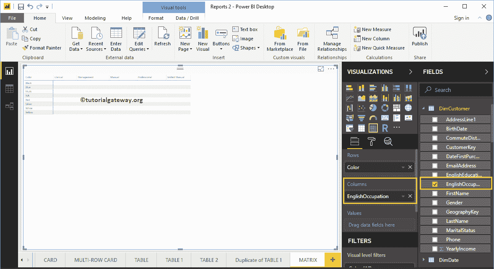

接下来，让我将销售金额拖到值部分。它会自动启用小计和总计。

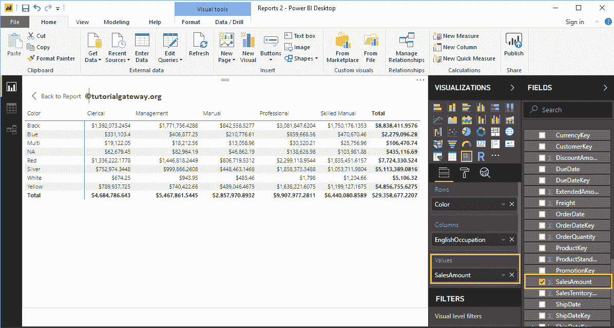

为此，我们在价值部分增加了一个度量字段，即产品总成本。

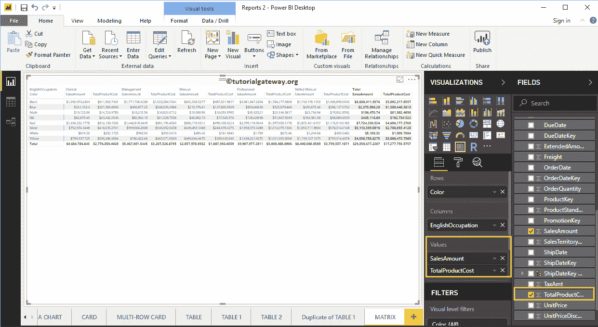

让我做一些快速格式化这个PowerBI矩阵

注意:我建议你参考[格式化交叉标签](https://www.tutorialgateway.org/format-power-bi-matrix/)文章来了解格式化选项。

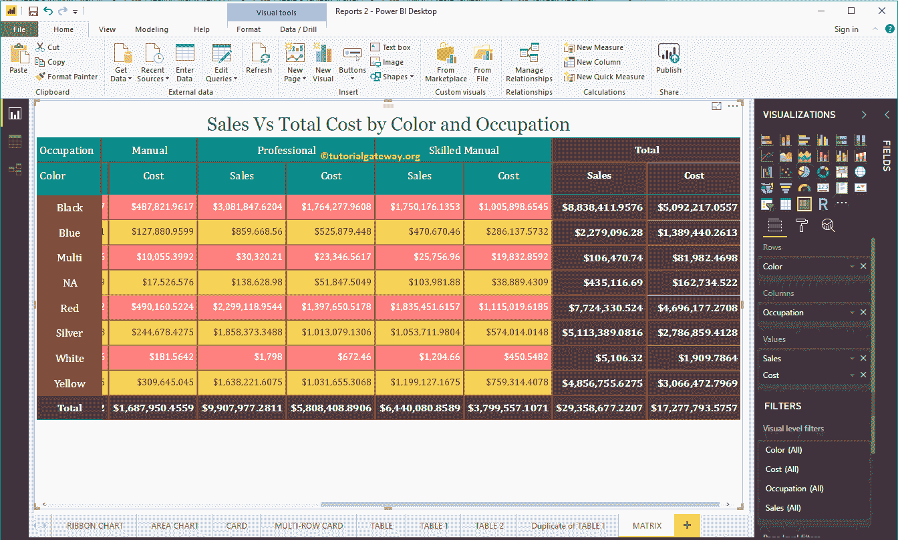