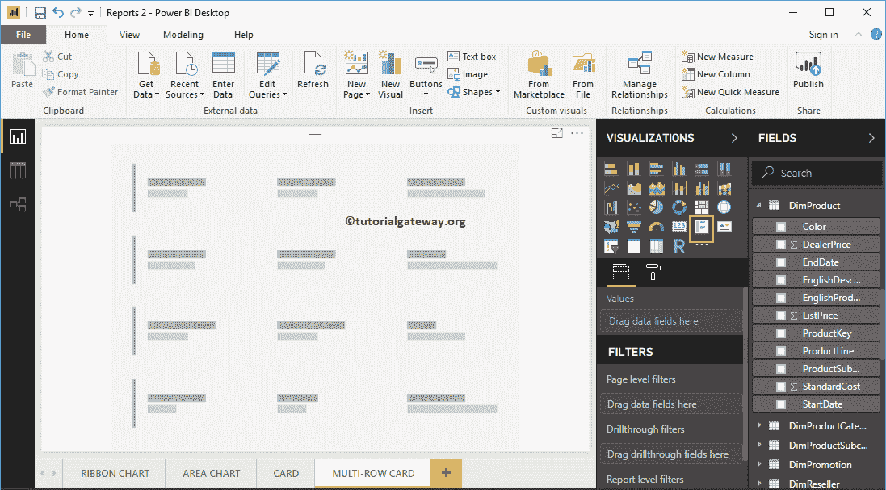

# 在 Power BI 中创建多行卡

> 原文：<https://www.tutorialgateway.org/create-a-multi-row-card-in-power-bi/>

Power BI 多行卡对于以组格式(或分段方式)显示数据非常有用。让我用一个例子向您展示如何在 Power BI 中创建多行卡。

对于这个 Power BI 多行卡演示，我们将使用我们在上一篇文章中创建的 SQL 数据源。所以，请参考[将 Power BI 连接到 SQL Server](https://www.tutorialgateway.org/connect-power-bi-to-sql-server/) 一文，了解 [Power BI](https://www.tutorialgateway.org/power-bi-tutorial/) 中的数据源。

## 如何在电力商业智能中创建多行卡

将销售金额从字段部分拖放到画布上，自动创建[柱形图](https://www.tutorialgateway.org/column-chart-in-power-bi/)，如下图截图所示。

接下来，让我将颜色字段添加到轴字段。它创建一个柱形图，按产品颜色显示销售额。

单击可视化部分下的多行卡片。它会自动将柱形图转换为多行卡片。从下面的截图中，您可以看到显示按产品颜色分组的总销售额的多行卡片。

### 在 Power BI 方法 2 中创建多行卡

首先，单击可视化部分下的多行卡片。它用虚拟数据创建了一个多行卡，如下图所示。

让我将产品颜色和销售额拖到字段部分。如您所见，它显示了产品颜色和销售额的多行卡片。

接下来，让我再拖动一个度量值，即产品总成本到字段部分。

让我也拖一下税额。

让我快速格式化这张多行卡片

注:建议大家参考[格式化多行卡片](https://www.tutorialgateway.org/format-power-bi-multi-row-card/)一文了解格式化选项。

