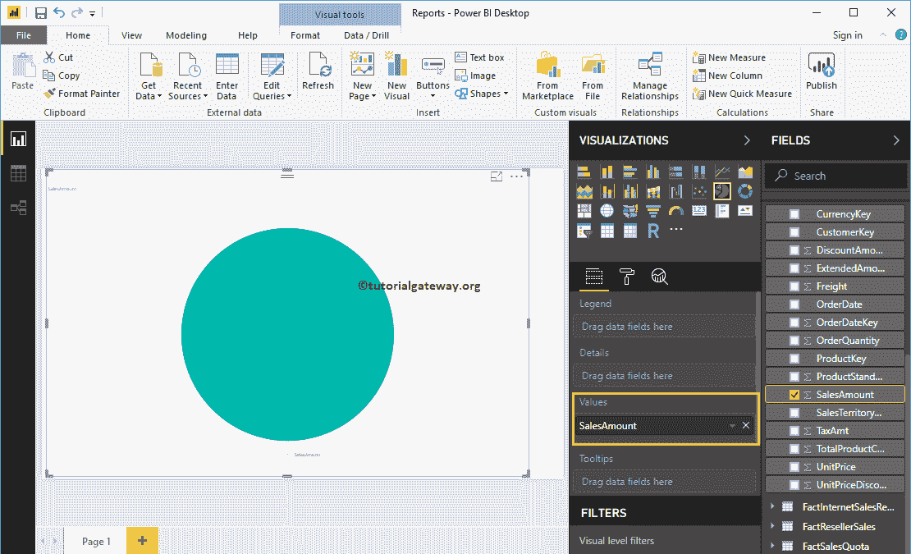

# 电力商业智能中的饼图

> 原文：<https://www.tutorialgateway.org/pie-chart-in-power-bi/>

Power BI 饼图对于可视化高级数据非常有用。例如，按洲或地区的销售、按国家的订单、按地区的客户或按主要产品组的销售等。让我们通过示例来看看如何在 Power BI 中创建饼图。对于 power bi 示例中的饼图，我们将使用我们在上一篇文章中创建的 SQL 数据源。

## 如何在电力商业智能中创建饼图

当您单击可视化部分下的饼图时，会自动创建一个饼图，如下图所示。

要向 Power Bi 饼图添加数据，我们必须添加必需的字段:

*   图例:拖动要显示为图例的列。
*   详细信息:请指定要对饼图进行分区的列名。基于此字段拆分的值。
*   值:任何数值，如销售额、总销售额、客户数量等。

在本例中，我们为按国家/地区名称列出的销售额创建了一个 Power BI 饼图。因此，将“销售额”列拖到“值”字段。请参考[将 Power BI 连接到 SQL Server](https://www.tutorialgateway.org/connect-power-bi-to-sql-server/) 文章，了解 [Power BI](https://www.tutorialgateway.org/power-bi-tutorial/) 数据源。

接下来，勾选英文国家/地区名称，或者将其拖放到图例区域，自动为您创建饼图。

将鼠标悬停在任何切片上，显示国家名称及其销售额的工具提示

### 在电力商业智能中创建饼图的第二种方法

将“字段中的销售额”部分拖放到画布上，自动创建一个条形图，如下图所示。

通过单击可视化效果中的饼图，将条形图转换为饼图。

将国家名称添加到图例中。请记住，我们没有在详细信息部分添加任何内容。因此，它将英语国家/地区名称(图例)视为详细信息。

如果我将州提供名称添加到详细信息中(显式)，则 Power BI 饼图显示按州/省名称列出的销售额，图例显示国家/地区名称。

让我来快速格式化一下这个 Power BI 饼图

注:我建议您参考[格式化饼图](https://www.tutorialgateway.org/format-power-bi-pie-chart/)文章，了解格式化图例、数据颜色、背景颜色、标题和切片颜色所涉及的步骤。

