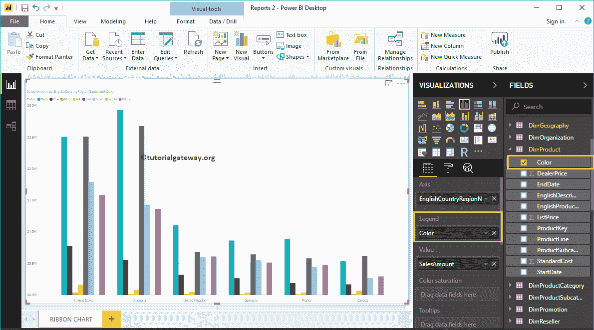
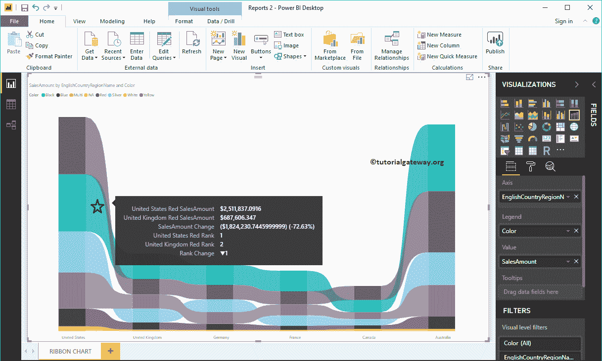

# 电力商业智能中的带状图

> 原文：<https://www.tutorialgateway.org/create-a-ribbon-chart-in-power-bi/>

Power BI 带状图有助于快速识别哪个分类数据具有最高等级(大值)。让我用例子展示如何在 Power BI 中创建带状图。

在这个 Power BI 功能区图表演示中，我们将使用我们在上一篇文章中创建的 SQL 数据源。所以，请参考[将 Power BI 连接到 SQL Server](https://www.tutorialgateway.org/connect-power-bi-to-sql-server/) 文章，了解 [Power BI](https://www.tutorialgateway.org/power-bi-tutorial/) 数据源。

## 如何在电力商业智能中创建带状图

要在 Power BI 中创建带状图，首先将“字段中的销售额”部分拖放到“画布”区域。它会自动创建一个[柱形图](https://www.tutorialgateway.org/column-chart-in-power-bi/)，如下图所示。

接下来，让我将英语国家/地区名称添加到轴部分。您可以通过将“国家/地区名称”拖到“轴”部分来完成此操作，或者只需选中“国家/地区”列。它会自动为您创建一个柱形图。

接下来，将尺寸产品表中的产品颜色添加到图例部分。

点击可视化部分下的带状图，将[聚类柱形图](https://www.tutorialgateway.org/clustered-column-chart-in-power-bi/)转换为带状图。从下面的截图中，您可以看到按国家和颜色显示销售额的 Power BI 功能区图表。

### 在电力商业智能方法 2 中创建带状图

首先，单击可视化部分下的功能区图表。它将创建一个带有虚拟数据的带状图，如下图所示。

让我将“销售金额从字段”部分拖到“值”字段，将“英语国家/地区名称”部分从“模糊地理”拖到“轴”字段。

接下来，将产品颜色添加到 Power BI 功能区图表图例部分。

让我按英文国家/地区名称对数据进行排序(默认情况下，按销售额排序)。为此，单击右上角的… (3 个点)，并选择“按英语国家/地区名称排序”选项，如下所示。

现在你可以看到正确的电力 BI 带状图

将鼠标悬停在任意栏上会显示国家名称、产品颜色和销售额的工具提示

将鼠标悬停在两个横条之间的任何位置将会显示“上一个国家/地区销售额”、“下一个国家/地区销售额”、“百分比差异”以及这两个国家/地区之间的排名(在本例中为

让我做一些快速格式化这个电力商业智能功能区图表

注:我建议您参考[格式化功能区图表](https://www.tutorialgateway.org/format-power-bi-ribbon-chart/)文章，了解格式化这些功能区、背景颜色、数据标签等所涉及的步骤。

