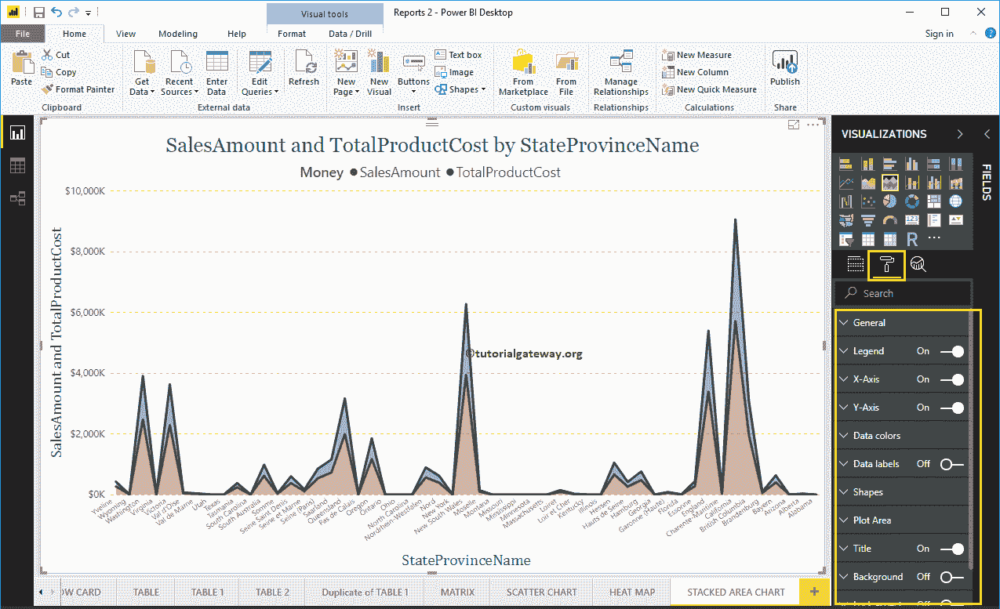

# PowerBI 中的堆叠区域图

> 原文：<https://www.tutorialgateway.org/stacked-area-chart-in-power-bi/>

如何用实例创建 PowerBI 中的堆叠区域图？。在这个 Power BI 堆叠区域图演示中，我们将使用之前创建的 SQL 数据源。

请参考[将 Power BI 连接到 SQL Server](https://www.tutorialgateway.org/connect-power-bi-to-sql-server/) 文章，了解 [Power BI](https://www.tutorialgateway.org/power-bi-tutorial/) 数据源。

## 如何在 PowerBI 中创建堆叠区域图

要在 Power BI 中创建堆叠区域图，首先将销售额从字段部分拖放到画布区域。它会自动创建一个[柱形图](https://www.tutorialgateway.org/column-chart-in-power-bi/)，如下图所示。

接下来，让我将州/省名称添加到轴部分。

单击可视化部分下的堆叠区域图。它会自动将柱形图转换为堆积区域图。从下面的截图中，您可以看到按州/省名称显示销售金额的堆叠区域图。

让我也把产品总成本加到价值上。这样，您就可以按州/省名称比较销售额与产品成本。

## 在 Power BI 中创建堆叠区域图–方法 2

首先，单击可视化部分下的堆叠区域图。它会自动创建一个带有虚拟数据的 PowerBI 堆叠区域图，如下图所示。

要将数据添加到堆叠区域图中，我们必须添加必需的字段:

*   轴:请指定代表堆叠区域的列名。
*   图例:进一步划分值的列
*   值:任何数值，如销售额、订单数量、总销售额等。

让我将“销售额”和“产品总成本”从“字段”部分拖到“值”字段。

接下来，让我将州/省名称添加到轴部分。您可以通过将省/市/自治区拖到“轴”部分来完成此操作，或者只需选中省/市/市/自治区列。

从上面的截图可以看出，堆叠区域图是按照销售额降序排列的。所以，让我[按照州省名对](https://www.tutorialgateway.org/how-to-sort-a-chart-in-power-bi/)数据进行排序。为此，单击右上角的… (3 个点)，并选择“按州/省名称排序”选项，如下所示。

让我做一些快速格式化这个 PowerBI 堆叠区域图。

注意:区域图和堆叠区域图的格式选项是相同的。因此，我建议您参考[格式化区域图](https://www.tutorialgateway.org/format-power-bi-area-chart/)文章，了解格式化此堆叠区域图所涉及的步骤。

让我将产品颜色添加到图例部分，以显示多个维度。

