# 电力商业智能中的散点图

> 原文：<https://www.tutorialgateway.org/scatter-chart-in-power-bi/>

Power BI 散点图或散点图对于可视化两组数据之间的关系非常有用。让我用例子向你展示如何在 Power BI 中创建散点图。

在这个 Power BI 散点图演示中，我们将使用我们在上一篇文章中创建的 SQL 数据源。所以，请参考[将 Power BI 连接到 SQL Server](https://www.tutorialgateway.org/connect-power-bi-to-sql-server/) 文章，了解 [Power BI](https://www.tutorialgateway.org/power-bi-tutorial/) 数据源。

## 如何在电力商业智能中创建散点图

要在 Power BI 中创建散点图，首先，将销售金额从字段部分拖放到画布区域。它会自动创建一个[柱形图](https://www.tutorialgateway.org/column-chart-in-power-bi/)，如下图所示。

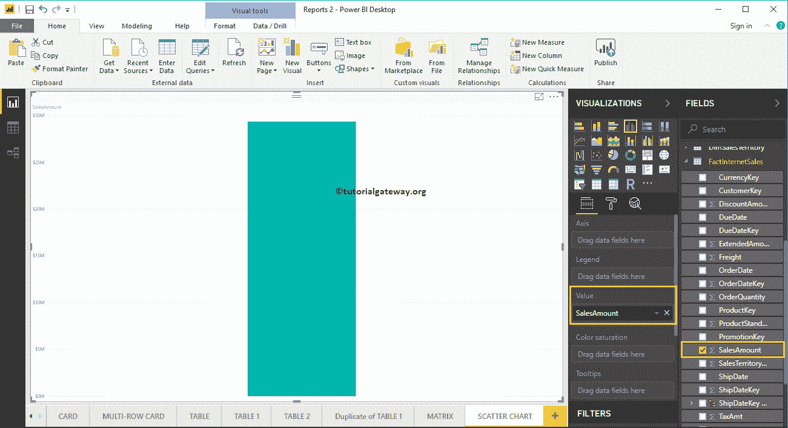

单击可视化部分下的散点图。它会自动将柱形图转换为散点图。

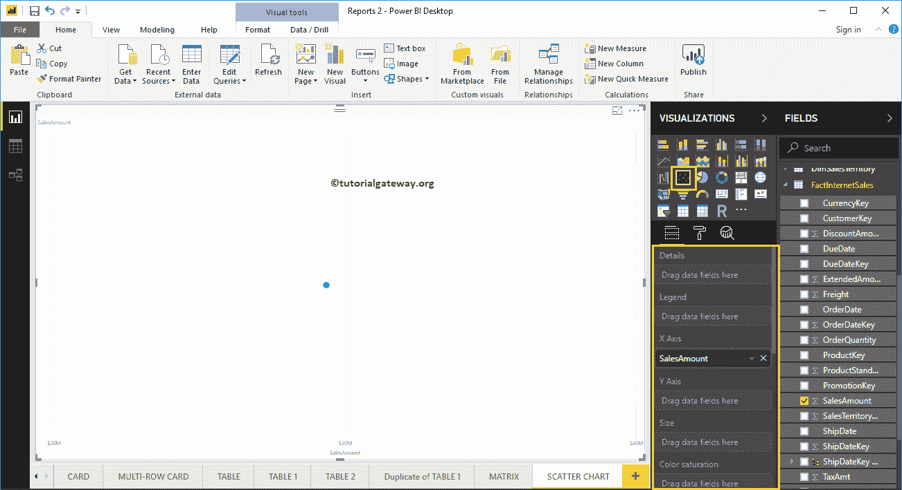

让我将邮政编码添加到详细信息部分。

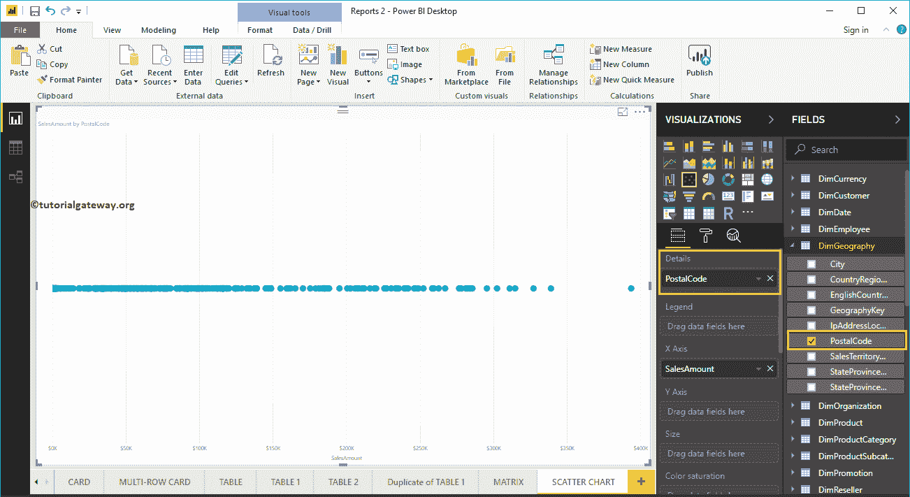

接下来，我们添加订单数量作为 Y 轴。现在你可以看到合适的散点图。

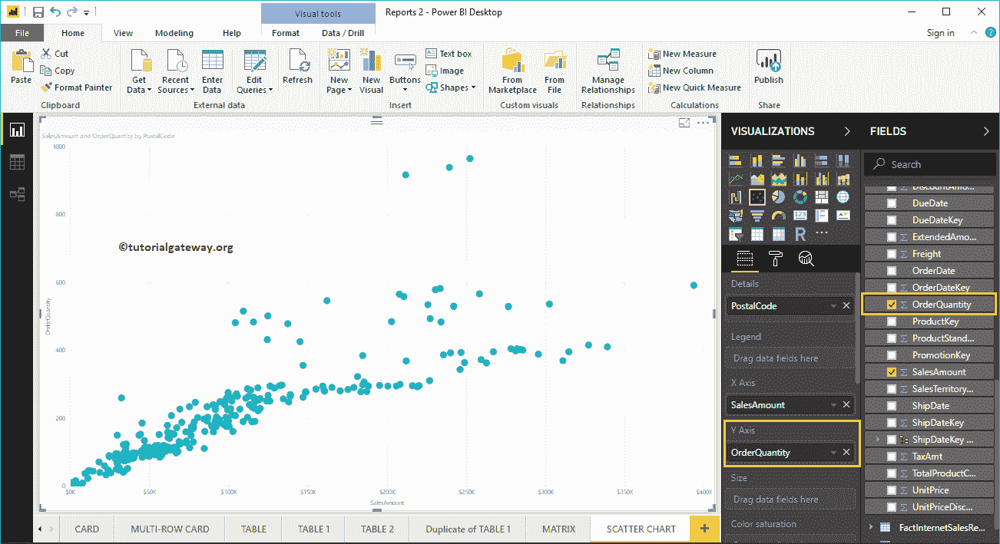

让我来快速格式化一下这个功率 BI 散点图

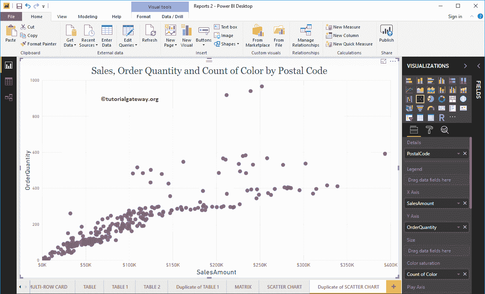

## 在电力商业智能方法 2 中创建散点图

首先，单击可视化部分下的散点图。它会自动创建一个包含虚拟数据的散点图，如下图所示。

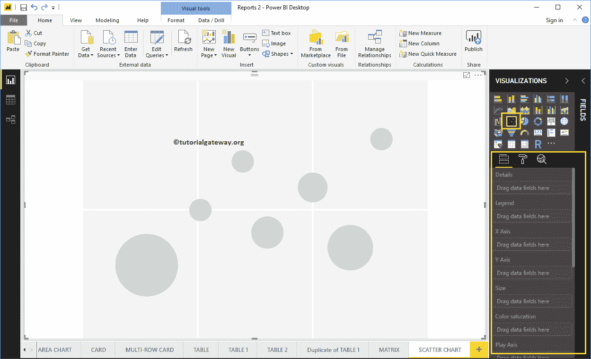

要将数据添加到功率商业智能散点图，我们必须添加必需的字段:

*   详细信息:请指定代表气泡的列。
*   图例:指定细分详细信息数据的列。
*   x 轴:请指定代表水平轴的列。
*   y 轴:表示垂直轴的列。
*   大小:指定代表气泡大小的列。
*   颜色饱和度:决定气泡颜色的任何数值。

让我将销售金额从字段部分拖到 X 轴部分，将订单数量拖到 Y 轴部分。

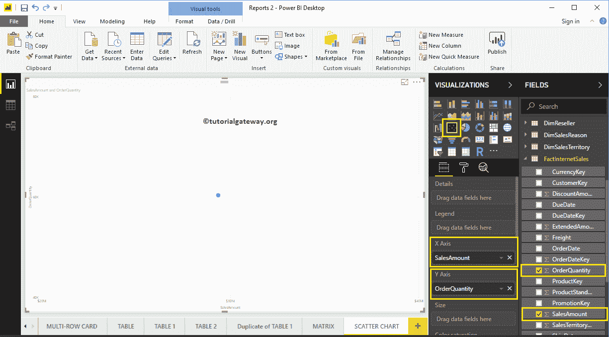

接下来，让我将英语国家/地区名称添加到详细信息部分。您可以通过将“国家/地区”拖到“详细信息”部分来完成此操作，或者只需选中“英语国家/地区名称”列。

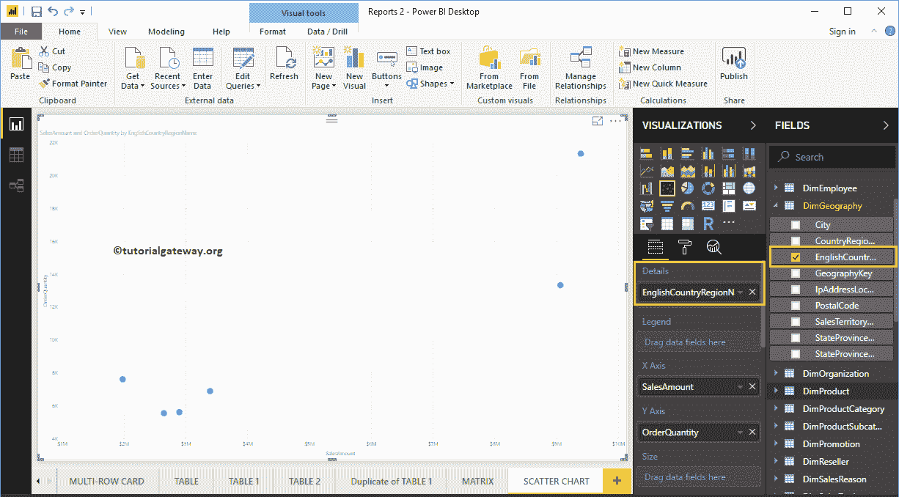

让我将客户英语职业添加到图例部分。将鼠标悬停在任何圆圈上都会显示有关国家、职业、销售额和产品总成本的信息。

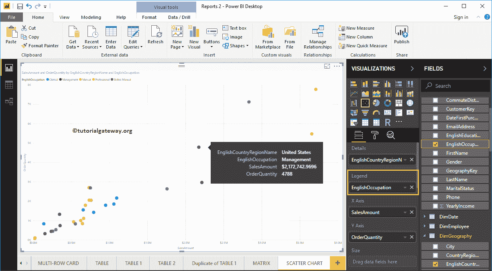

为了演示 Power BI 散点图的大小部分，我们从图例部分删除了英语职业。我们将订单数量添加到尺寸部分。

从下面的截图可以看到，圆圈的大小根据【订单数量】

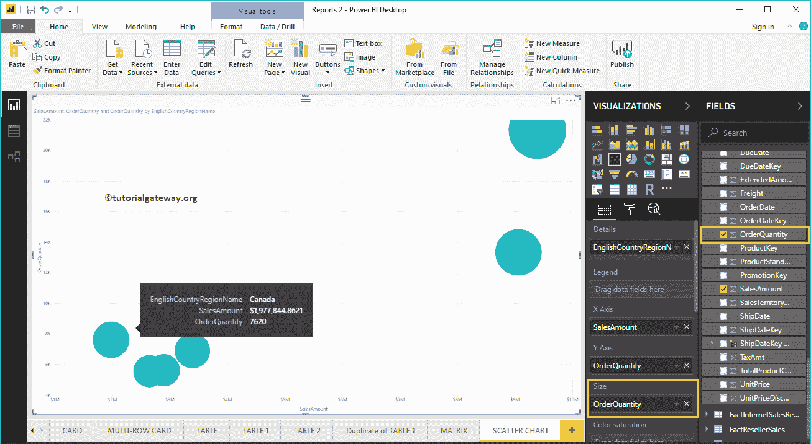

发生了变化

为了演示色彩饱和度部分，我们将销售额添加到色彩饱和度部分。从下面的截图可以看到，每个圆圈的颜色都根据【销售金额】

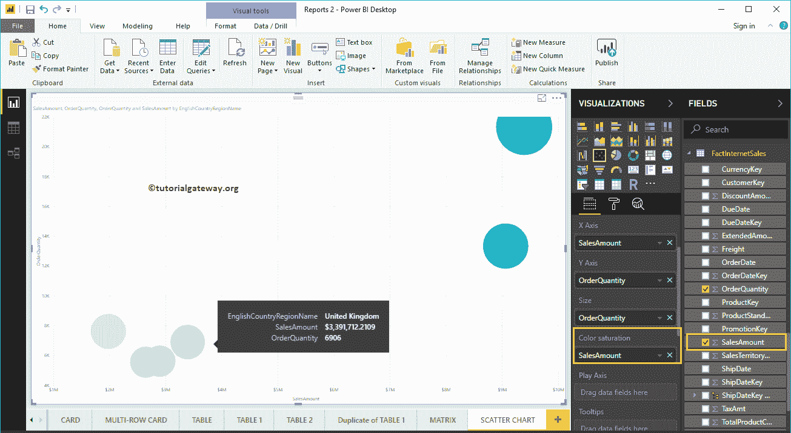

发生了变化

让我来快速格式化这个功率 BI 散点图

注:建议参考[格式散点图](https://www.tutorialgateway.org/format-power-bi-scatter-chart/)一文了解格式选项。

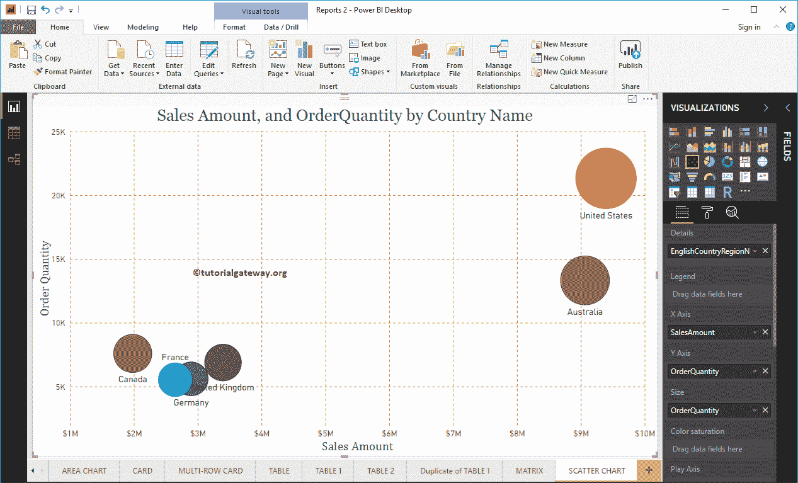