# PowerBI 堆叠条形图

> 原文：<https://www.tutorialgateway.org/power-bi-stacked-bar-chart/>

Power BI 堆叠条形图条形图可用于将多个维度与单个度量进行比较。让我用例子展示如何在 Power BI 中创建堆叠条形图。

在这个 Power BI 堆叠条形图演示中，我们将使用我们在上一篇文章中创建的 SQL 数据源。所以，请参考[将 Power BI 连接到 SQL Server](https://www.tutorialgateway.org/connect-power-bi-to-sql-server/) 文章，了解 [Power BI](https://www.tutorialgateway.org/power-bi-tutorial/) 数据源。

## 如何创建 PowerBI 堆叠条形图

要在 Power BI 中创建堆叠条形图，首先将“字段销售额”部分拖放到“画布”区域。它会自动创建一个[柱形图](https://www.tutorialgateway.org/column-chart-in-power-bi/)，如下图截图所示。

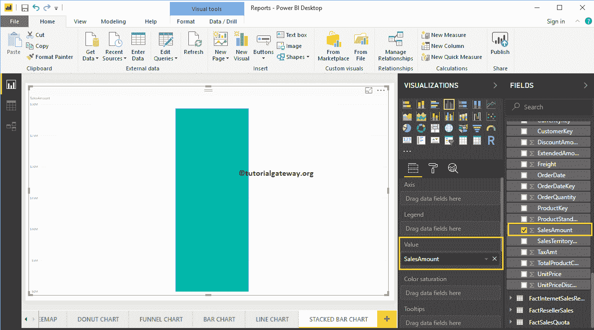

通过点击可视化部分下的堆叠条形图，它会自动将柱形图转换为堆叠条形图

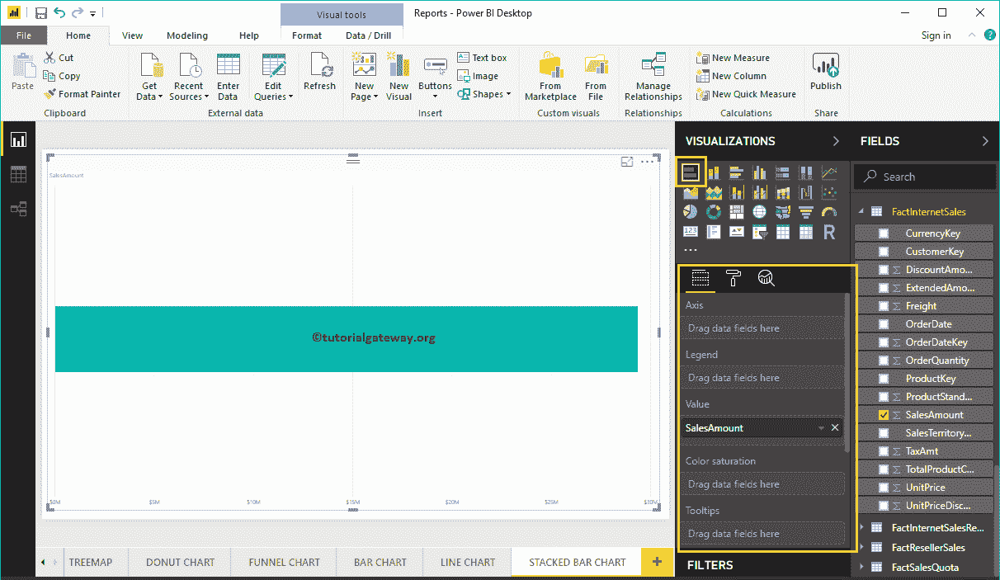

接下来，让我将颜色添加到轴部分，创建一个按颜色显示销售额的条形图。

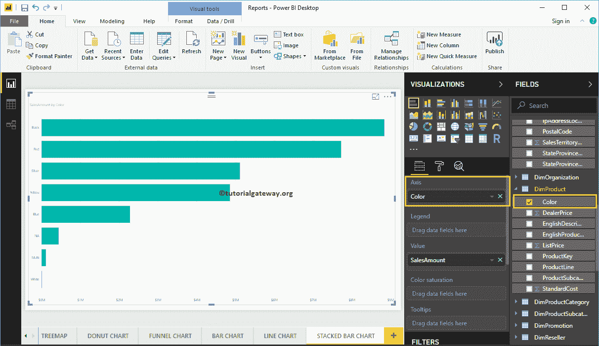

接下来，我们将英语国家/地区名称添加到图例部分，将其转换为堆叠条形图。

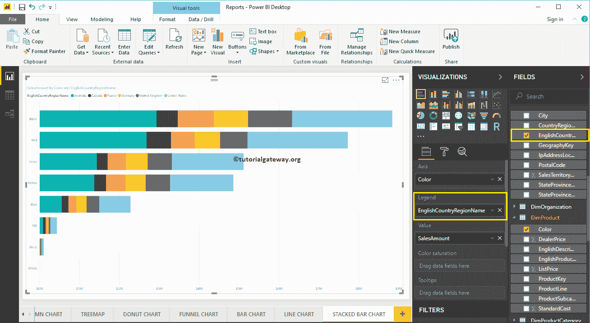

这一次，我们在轴上添加了州省名，在图例上添加了国家。从下面的截图中，您可以看到“国家/地区名称”作为条形颜色。这是因为您不能在一个州内对国家名称进行分组(从国家继承的州名)。当您使用堆叠条形图时，请记住这一点。

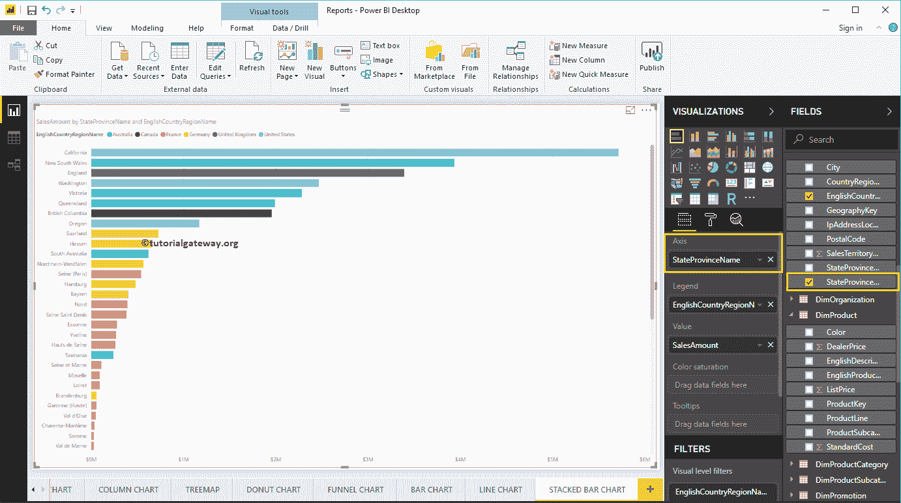

将鼠标悬停在任何堆叠栏上，都会显示州名、国家及其销售额

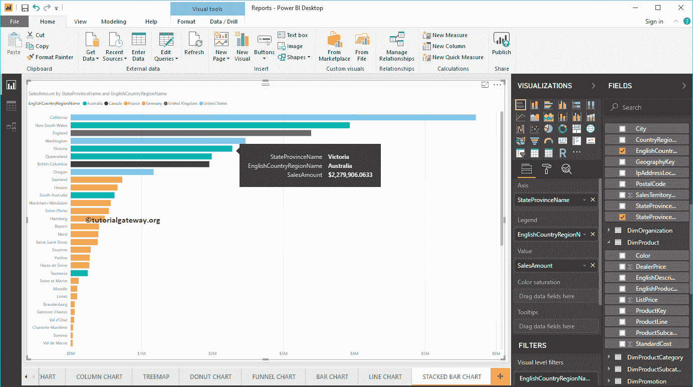

的工具提示

### 创建 PowerBI 堆叠条形图方法 2

首先，单击可视化部分下的堆叠条形图。它会自动创建一个包含虚拟数据的堆叠条形图，如下图所示。

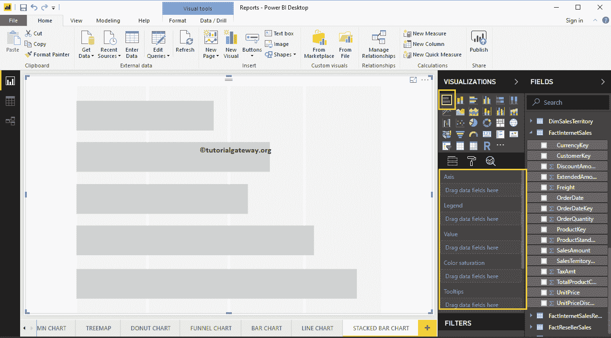

为了向 Power BI 堆叠条形图添加数据，我们必须添加必需的字段:

*   轴:请指定代表水平条的列。
*   图例:指定要分割水平条的列。
*   值:任何数值，如销售额、总销售额等。

让我将销售额从字段部分拖到值字段，将颜色字段拖到轴部分。

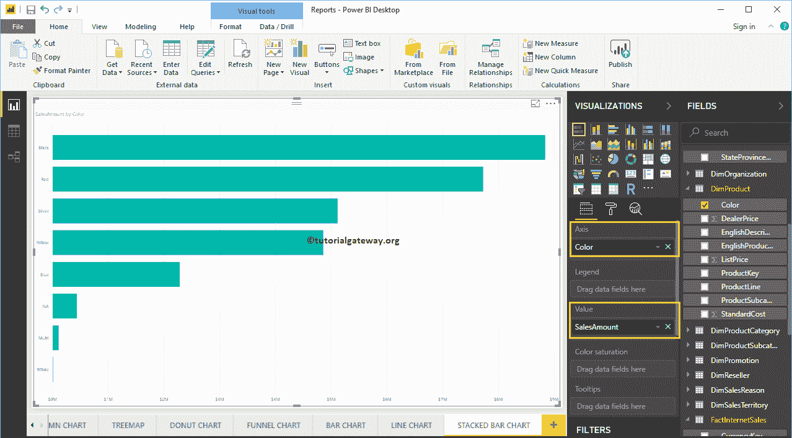

接下来，将“地理”表中的英语国家/地区名称添加到“图例”部分。您可以通过将“国家”拖到“图例”部分来完成此操作，或者只需选中英文“国家/地区名称”列

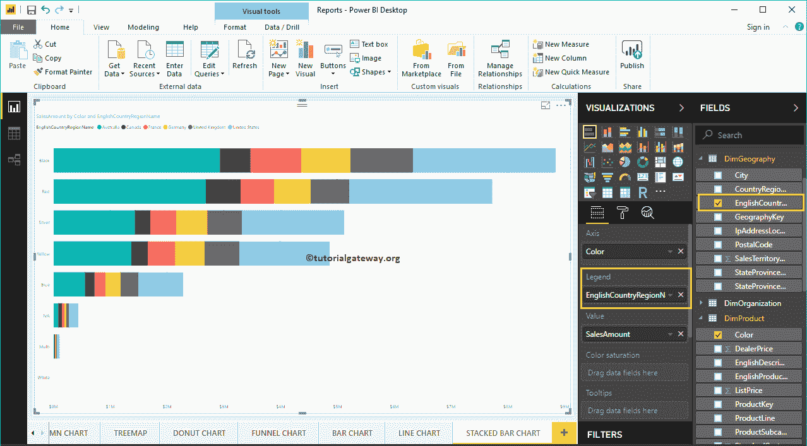

现在，您可以看到一个按颜色表示销售额的堆叠条形图，它进一步按国家/地区名称划分。将鼠标悬停在条形图的任何部分上会显示颜色、国家及其销售额的工具提示。

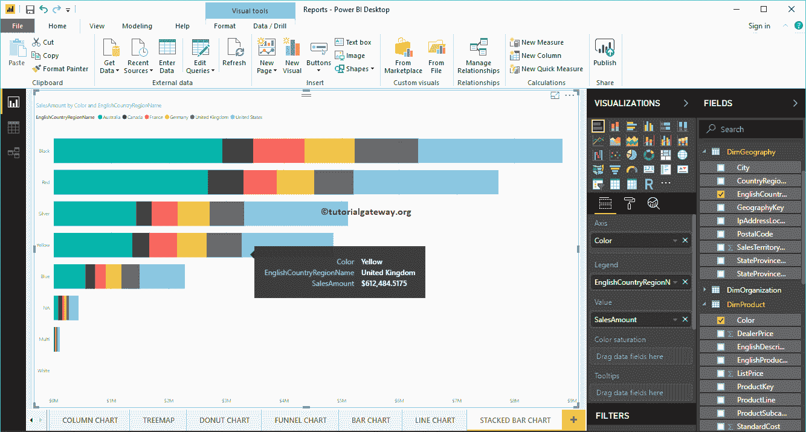

让我做一些快速格式化这个 PowerBI 堆叠条形图

注:建议大家参考[格式化堆叠条形图](https://www.tutorialgateway.org/format-stacked-bar-chart-in-power-bi/)一文，了解格式化堆叠条形图颜色、图表标题、数据颜色、背景颜色、坐标轴颜色、坐标轴字体样式和颜色等涉及的步骤。

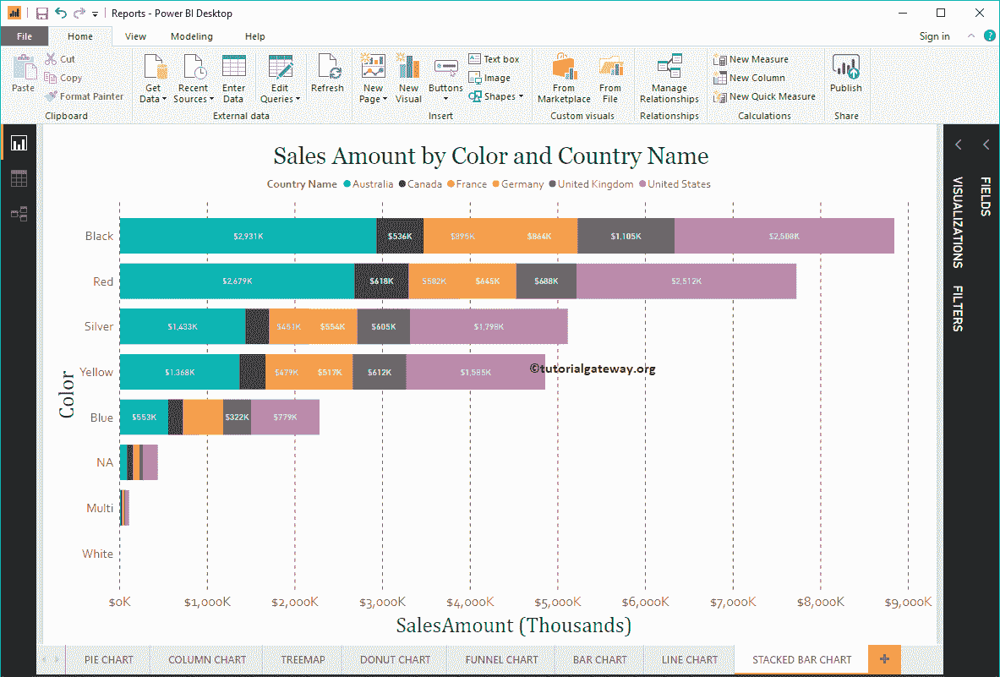