# PowerBI 中的堆叠柱形图

> 原文：<https://www.tutorialgateway.org/stacked-column-chart-in-power-bi/>

Power BI 堆积柱形图有助于针对单个度量可视化多个维度。让我用例子展示如何在 Power BI 中创建堆叠柱形图。

在这个 Power BI 堆叠柱形图演示中，我们将使用我们在上一篇文章中创建的 SQL 数据源。所以，请参考[将 Power BI 连接到 SQL Server](https://www.tutorialgateway.org/connect-power-bi-to-sql-server/) 一文，了解 [Power BI](https://www.tutorialgateway.org/power-bi-tutorial/) 中的数据源。

## 如何在 PowerBI 中创建堆叠柱形图

要在 Power BI 中创建堆叠柱形图，首先将“字段销售额”部分拖放到画布区域。它会自动创建一个[柱形图](https://www.tutorialgateway.org/column-chart-in-power-bi/)。

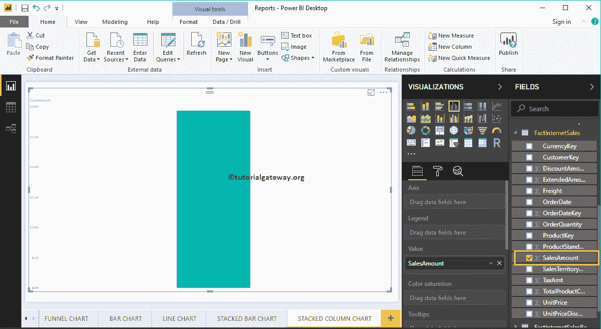

通过点击可视化部分下的堆叠柱形图，它会自动将柱形图转换为堆叠柱形图

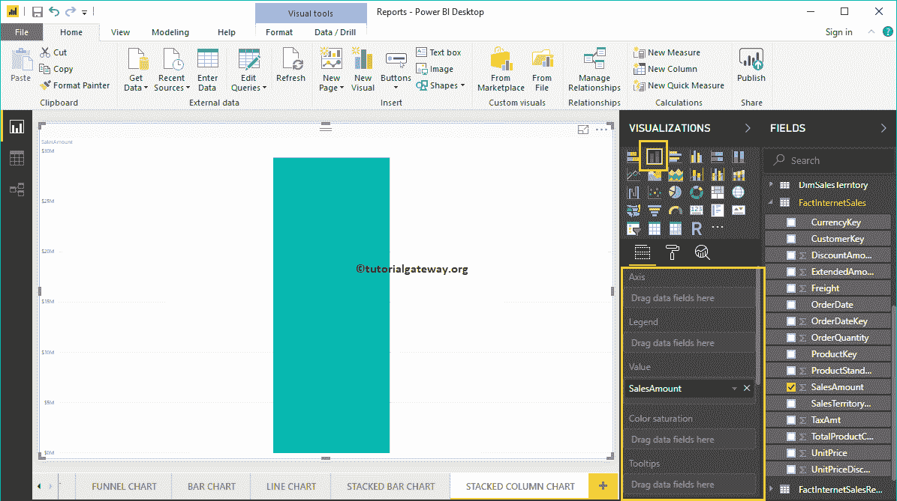

接下来，让我将颜色添加到轴部分，创建一个按颜色显示销售额的柱形图。

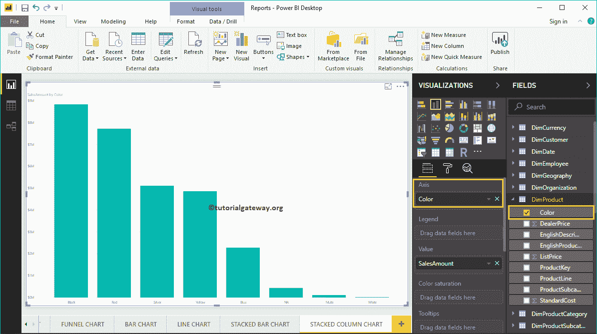

接下来，我们将销售区域区域名称添加到图例部分，将其转换为堆叠柱形图。

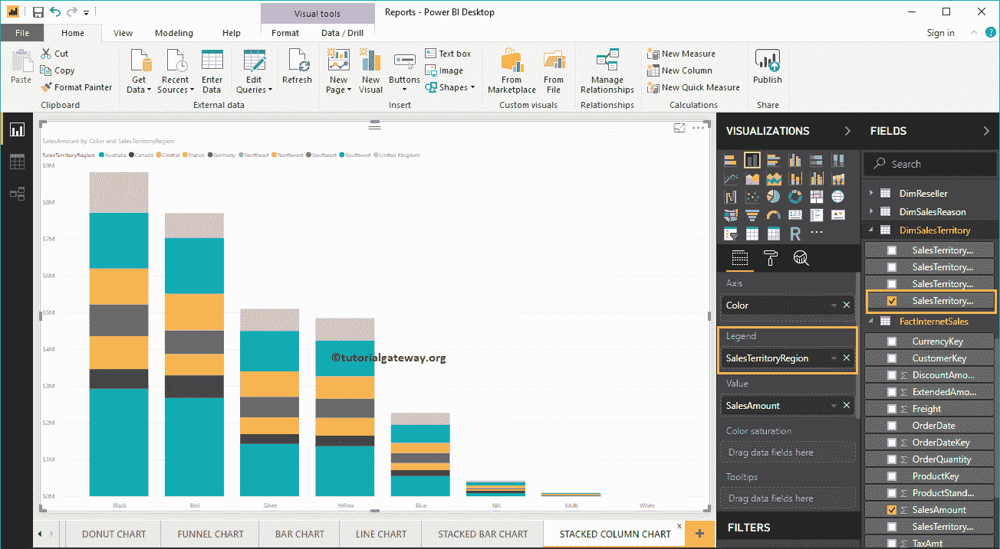

将鼠标悬停在竖线的任何部分上会显示区域、颜色及其销售额的工具提示

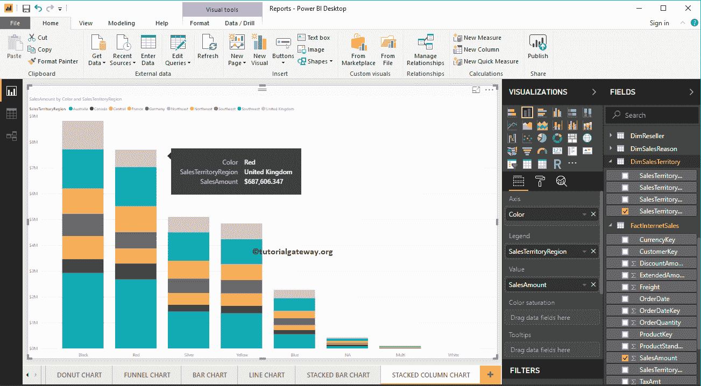

这一次，我们在轴部分用州省名替换了颜色。从下面的截图中，您可以看到，区域区域名称充当条形颜色。这是因为您不能将州内的地区分组(州名继承自地区)。

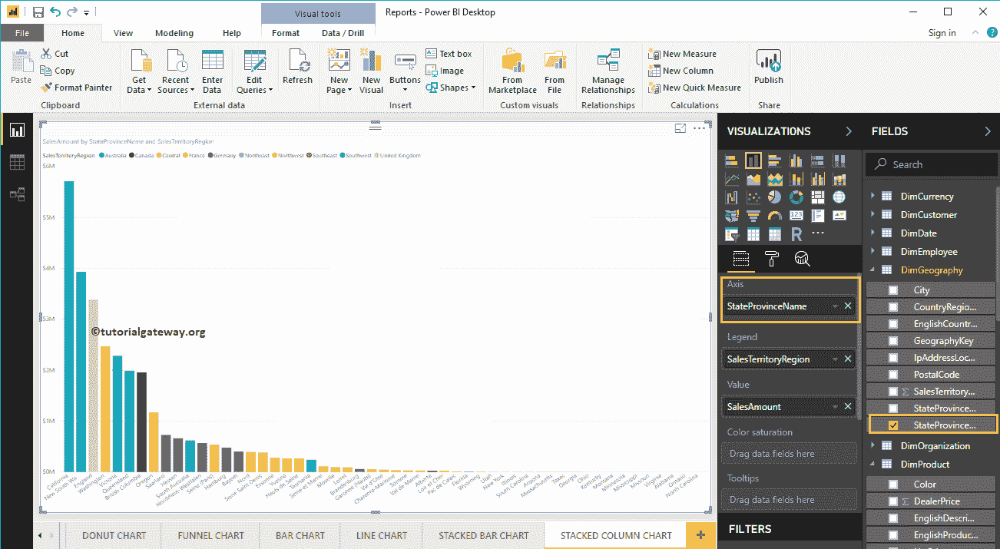

将鼠标悬停在任何竖线上都会显示州名、地区及其销售额

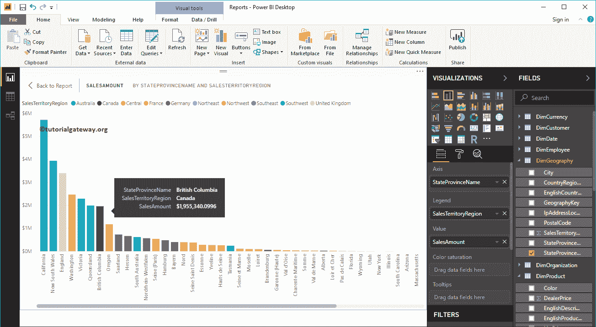

的工具提示

## 在 Power BI 方法 2 中创建堆叠柱形图

首先，单击可视化部分下的堆叠柱形图。它使用虚拟数据创建堆叠柱形图。

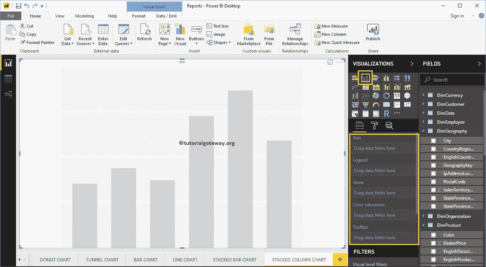

要向 Power BI 堆积柱形图添加数据，我们必须添加必需的字段:

*   轴:请指定代表竖线的列。
*   图例:指定用于划分竖线的列。
*   值:任何数值，如销售额、总销售额等。

让我将销售额从字段部分拖到值字段，将颜色字段拖到轴部分。

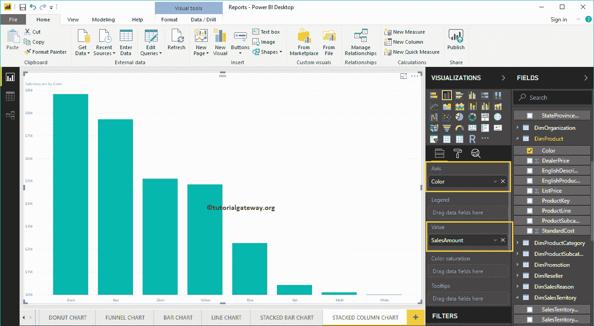

接下来，将销售区域表中的销售区域名称添加到图例部分。您可以通过将区域拖到图例部分来完成此操作，或者只需选中销售区域区域名称列

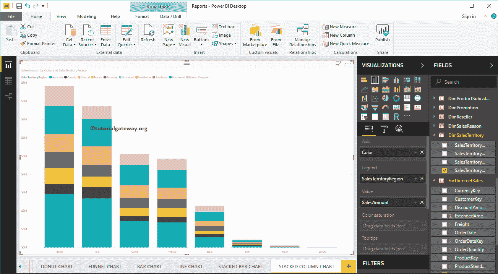

让我快速格式化一下这个堆叠柱形图

注:我建议您参考[格式化堆叠柱形图](https://www.tutorialgateway.org/format-power-bi-stacked-column-chart/)一文，了解格式化堆叠柱形图颜色、标题等所涉及的步骤。

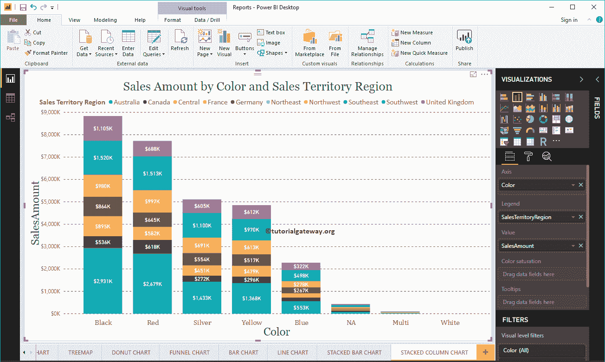