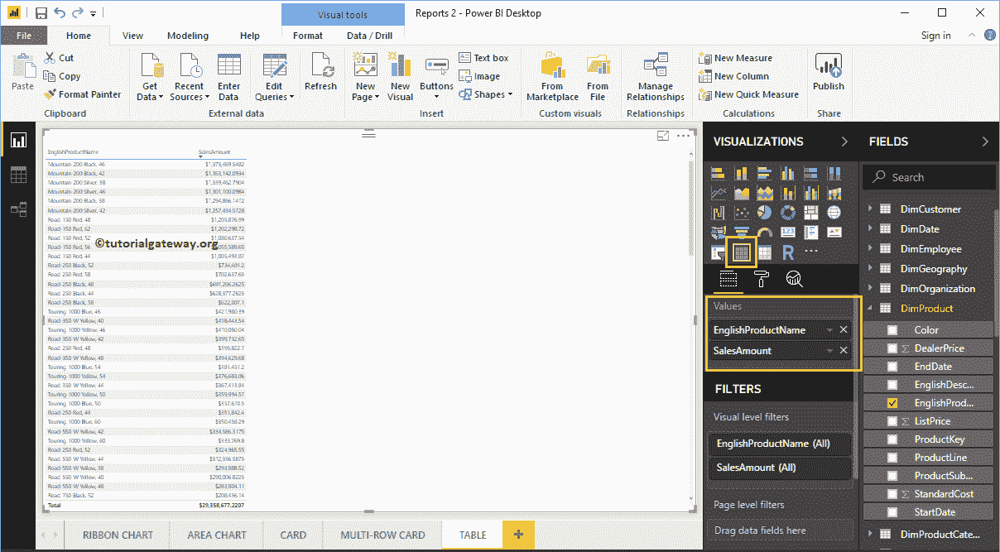

# 在 PowerBI 中创建表

> 原文：<https://www.tutorialgateway.org/create-a-table-in-power-bi/>

让我用例子向您展示如何在 Power BI 中创建一个表。对于这个 Power BI 表格报告演示，我们将使用我们在上一篇文章中创建的 SQL 数据源。

请参考[连接到 SQL Server](https://www.tutorialgateway.org/connect-power-bi-to-sql-server/) 文章了解 [Power BI](https://www.tutorialgateway.org/power-bi-tutorial/) 数据源。

## 如何在 PowerBI 中创建表

如果您拖放任何维度字段，Power BI 会自动为您创建一个表。

让我将英文产品名称从字段部分拖放到画布上，正如您从下面的截图中看到的，桌面会自动为您创建一个表。

### 方法 2

如果要将现有图表转换为表，则可以执行此步骤。我们创建了一个[柱形图](https://www.tutorialgateway.org/column-chart-in-power-bi/)，它通过产品名称表示销售金额。

单击可视化部分下显示的按钮。它会自动将柱形图转换为表。从下面的截图中，您可以看到产品名称及其销售额的表表示。

## 在 Power BI 方法 3 中创建表

首先，单击可视化部分中显示的图标。它会自动创建一个包含虚拟数据的表，如下图所示。

接下来，让我将英文产品子类别名称和销售额拖到值部分。现在，你可以看到实际的数据。

让我再添加几个度量值，如产品总成本、订单数量和税额

让我对此做一些快速格式化。建议大家参考[格式](https://www.tutorialgateway.org/format-power-bi-table/)文章了解格式选项。

