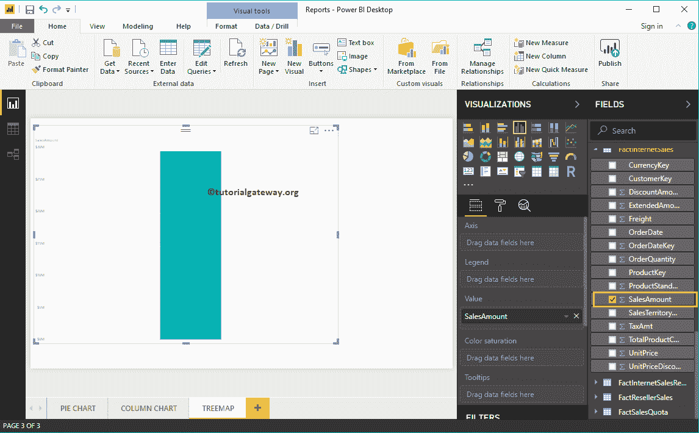
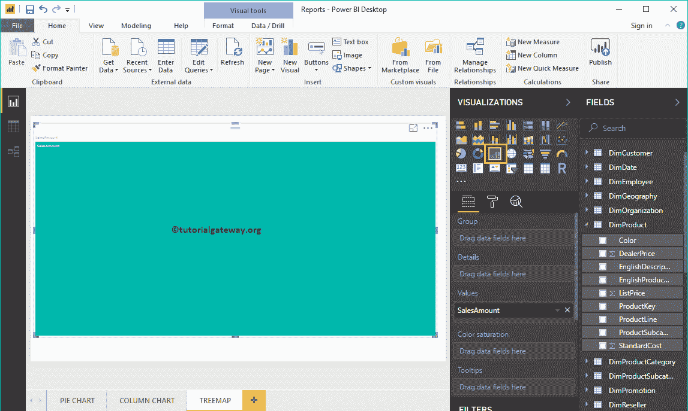
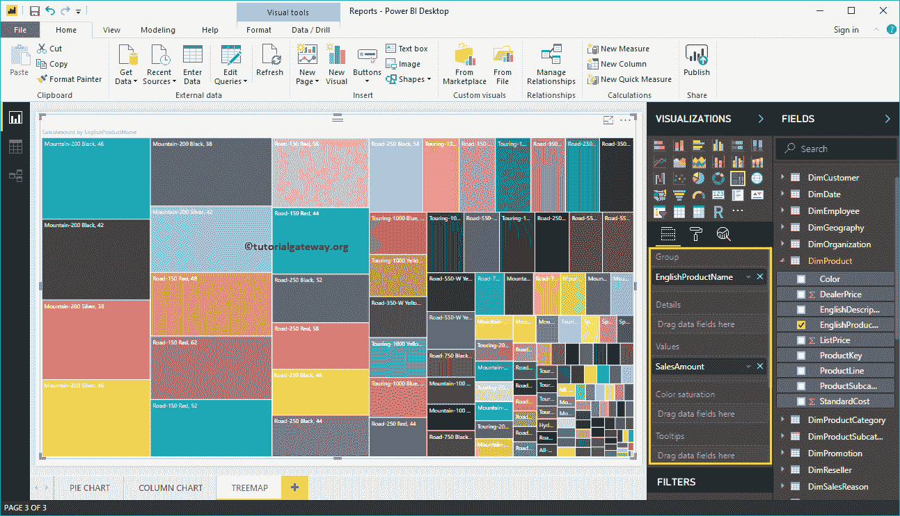
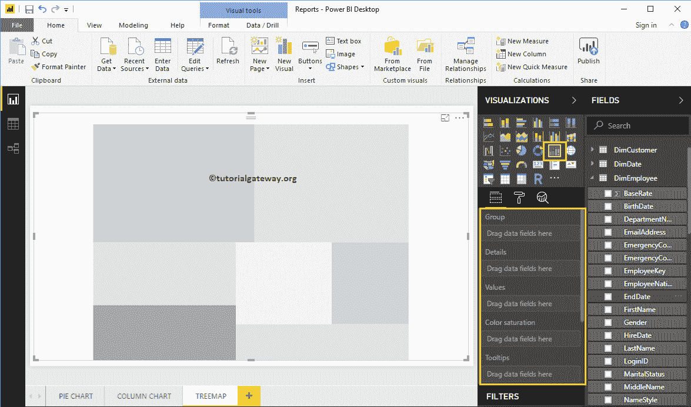
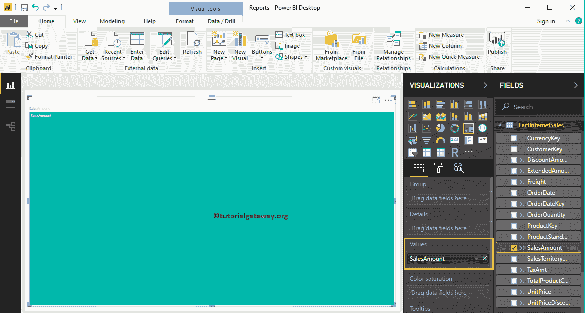
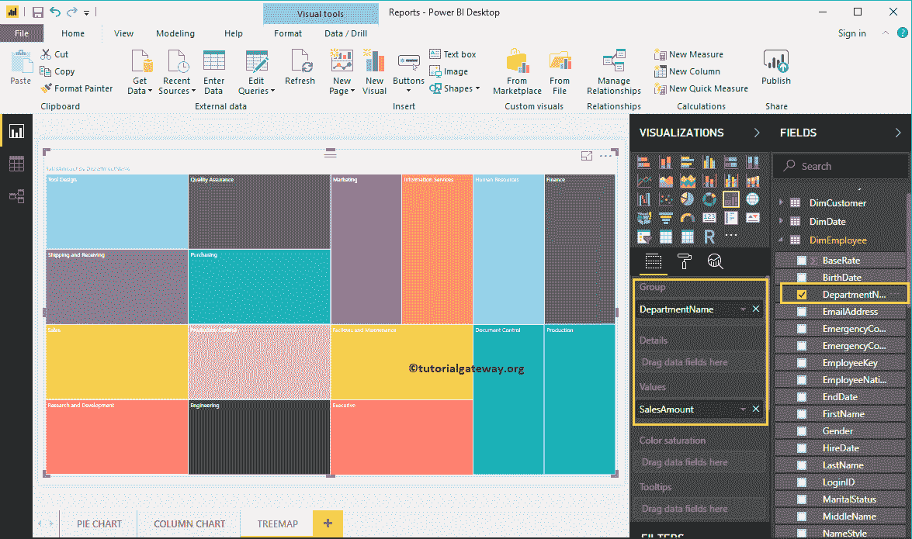
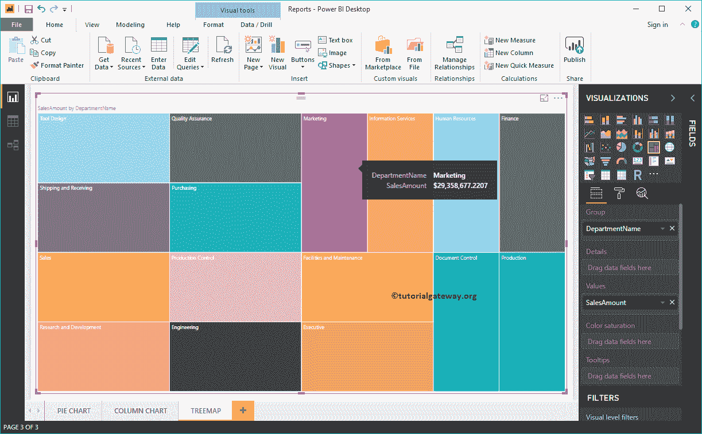
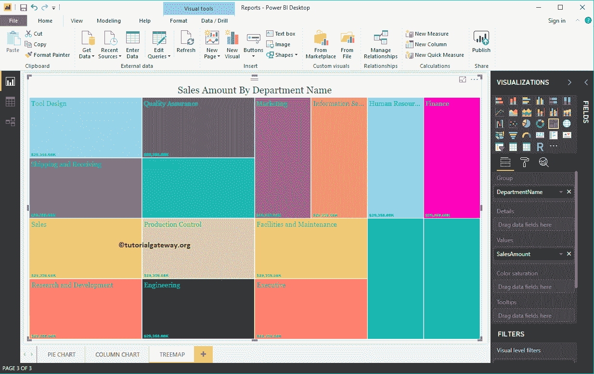

# 创建PowerBI树图

> 原文：<https://www.tutorialgateway.org/create-power-bi-treemap/>

Power BI 树形图用于显示矩形框中的数据。您可以使用任何“尺寸”列定义矩形框，并通过“测量”值定义其大小。

Power BI 中的树图对于显示小区域中最大的数据非常有用。对于这个在 Power BI 中创建树图的演示，我们将使用我们在上一篇文章中创建的 SQL 数据源。

## 如何创建PowerBI树形图

要创建 Power BI 树形图，首先，将“字段中的销售额”部分拖放到画布上。它会自动创建一个[柱形图](https://www.tutorialgateway.org/column-chart-in-power-bi/)。请参考[将 Power BI 连接到 SQL Server](https://www.tutorialgateway.org/connect-power-bi-to-sql-server/) 文章，了解 [Power BI](https://www.tutorialgateway.org/power-bi-tutorial/) 数据源。

通过点击可视化部分下的树形图自动将柱形图转换为树形图

接下来，让我将 DimProduct 表中的英文产品名称添加到组部分。它根据每个产品的销售额来划分矩形框。

### 创建PowerBI树形图方法 2

当您单击可视化部分中的树图时，它会创建一个包含虚拟数据的树图。

要向 Power BI 树形图添加数据，我们必须添加必需的字段:

*   组:请指定分隔矩形框的列。
*   值:任何数值，如销售额、总销售额、客户数量等。

让我将销售从字段部分拖放到值字段。

接下来，将“部门名称”从“员工”表添加到组部分。您可以通过将“部门名称”拖到“组”部分，或者勾选“部门名称”列

现在，您可以看到销售金额除以员工部门名称的树形图。将鼠标悬停在任何框上都会显示部门名称及其销售额的工具提示

让我做一些快速格式化的PowerBI树图

注:我建议您参考[格式化树形图](https://www.tutorialgateway.org/format-tree-map-in-power-bi/)文章，了解格式化 Power BI 树形图框颜色、标题字体、标题对齐、数据标签和颜色所涉及的步骤。

