# PowerBI 中的瀑布图

> 原文：<https://www.tutorialgateway.org/waterfall-chart-in-power-bi/>

Power BI 瀑布图对于可视化一段时间内的销售或利润非常有用。让我用例子展示如何在 Power BI 中创建瀑布图。

对于这个 Power BI 瀑布图演示，我们将使用我们在上一篇文章中创建的 Excel 数据源。所以，请参考[连接 Power BI 到 Excel 多张 Excel 表](https://www.tutorialgateway.org/connect-power-bi-to-multiple-excel-sheets/)一文了解 [Power BI](https://www.tutorialgateway.org/power-bi-tutorial/) 数据源。

## 如何在 PowerBI 中创建瀑布图

要在 Power BI 中创建瀑布图，首先，将“字段利润”部分拖放到“画布”区域。它会自动创建一个[列](https://www.tutorialgateway.org/column-chart-in-power-bi/)，如下图所示。

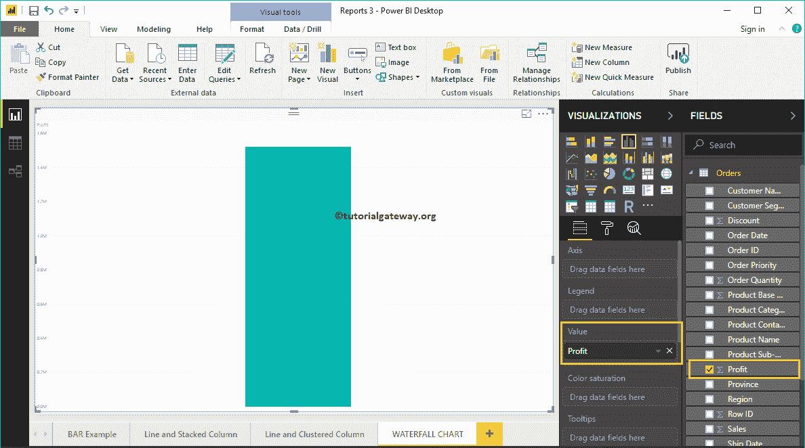

让我将产品子类别添加到轴部分。

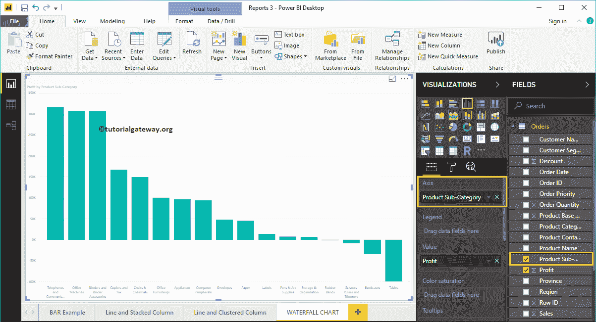

单击可视化部分下的瀑布图。它会自动将柱形图转换为瀑布图。

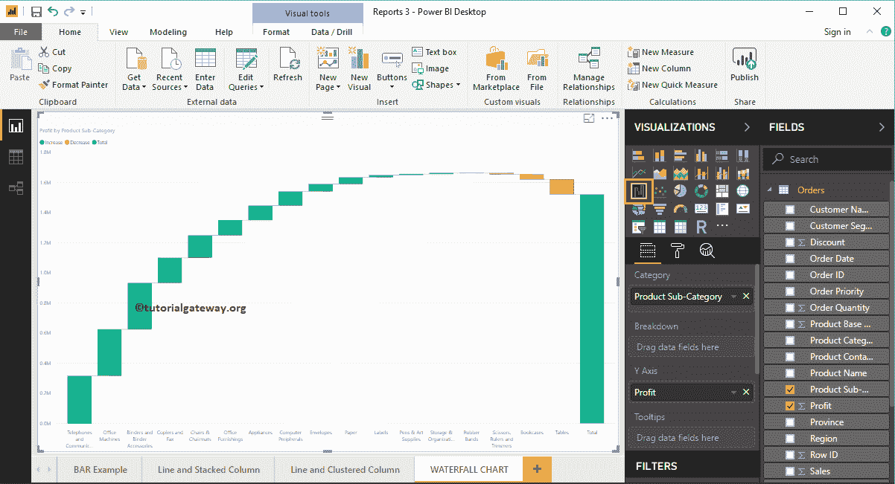

接下来，我们添加了数据标签，以便您可以看到增加或减少的利润金额。在情绪颜色下，你也可以改变这些条形颜色。

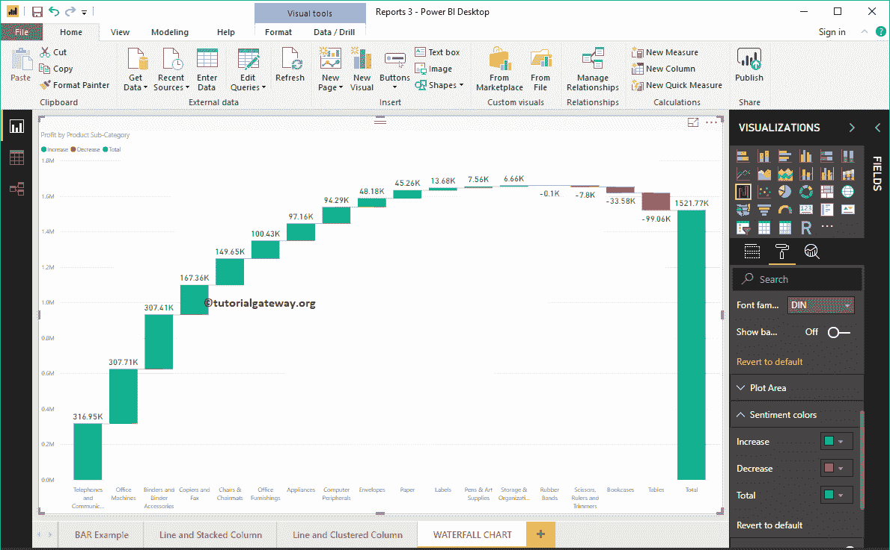

## 在 PowerBI 方法 2 中创建瀑布图

首先，点击可视化部分下的瀑布图。它会自动用虚拟数据创建它，如下图所示。

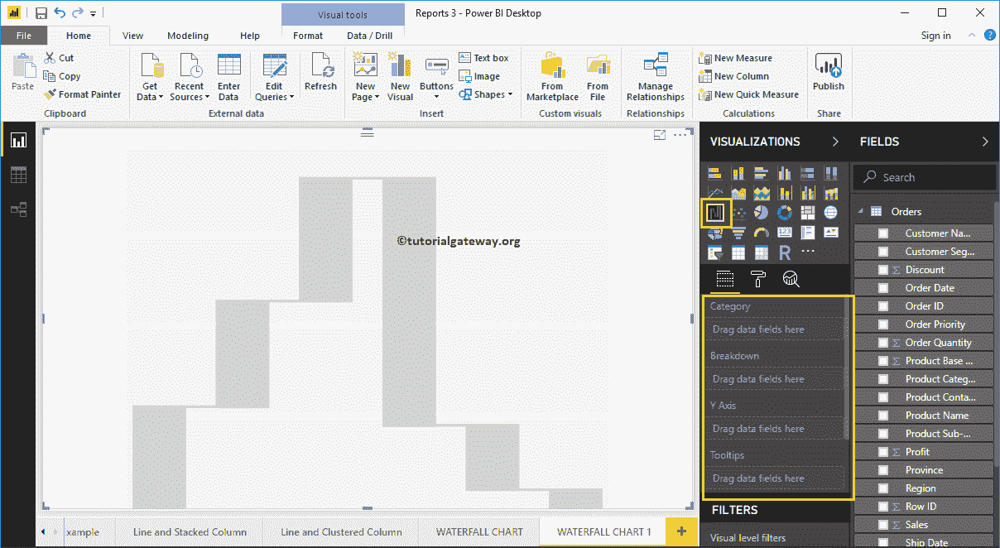

要向 Power BI 瀑布图添加数据，我们必须添加必需的字段:

*   类别:请指定划分此图的列(横轴列)。
*   情绪完全失控
*   y 轴:请指定代表垂直轴的公制列。

让我把利润从字段部分拖到 Y 轴部分。

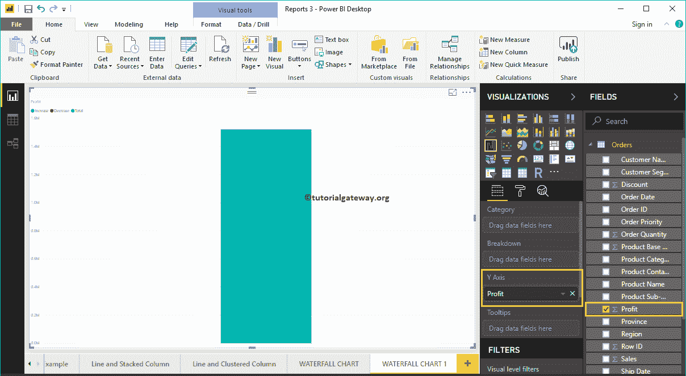

接下来，让我将产品容器添加到类别部分。您可以通过将“产品容器”拖到“类别”部分来完成此操作，或者只需选中“产品容器”列。

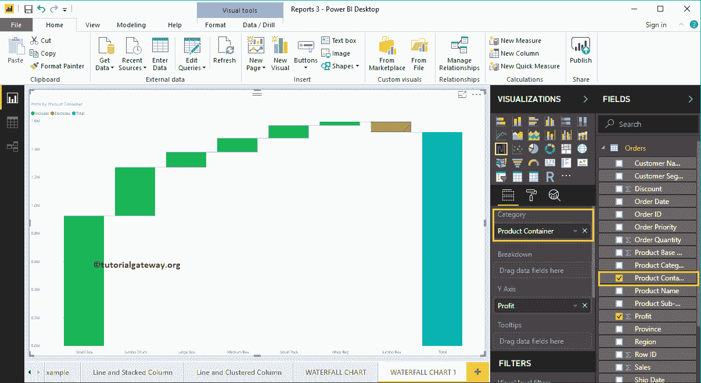

接下来，我们添加了数据标签，以便您可以看到增加的利润。

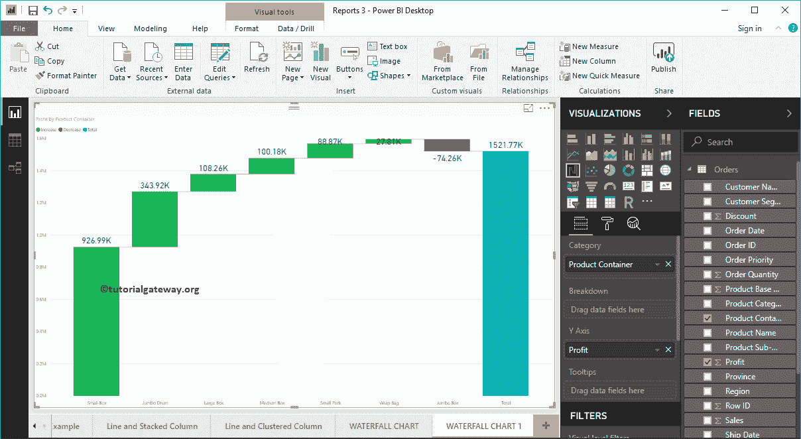

从上面的截图可以看出，是按利润降序排序的。所以，让我按利润升序排序图表。为此，单击右上角的… (3 个点)，并选择“按利润排序”选项的左上角，如下所示。

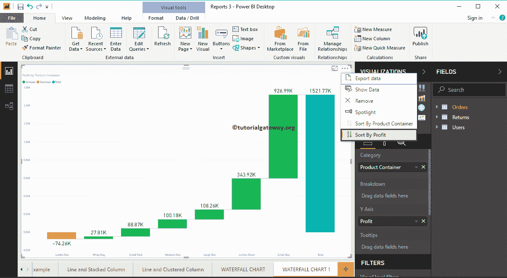

这次我们[按照产品容器降序排列](https://www.tutorialgateway.org/how-to-sort-a-chart-in-power-bi/)数据。

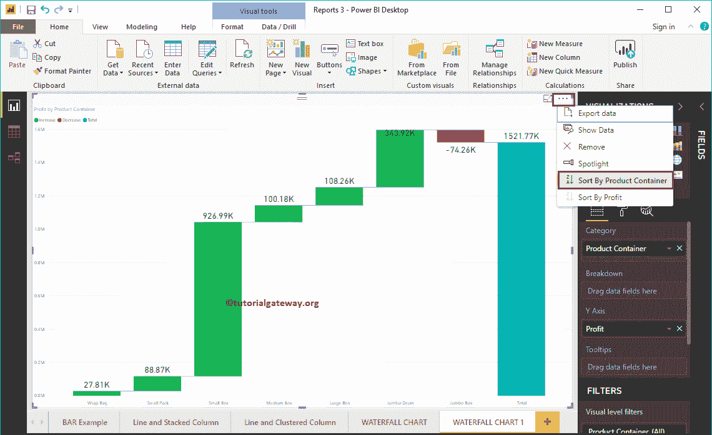

这次我们[按照产品容器升序对](https://www.tutorialgateway.org/how-to-sort-a-chart-in-power-bi/)数据进行排序。

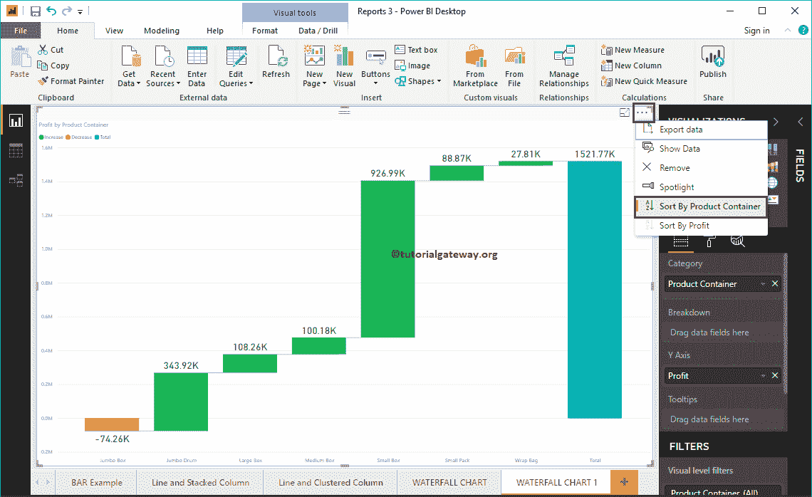

### 瀑布图分解

让我将客户细分添加到细分部分。从下面的截图中可以看出，它根据客户细分进一步细分。

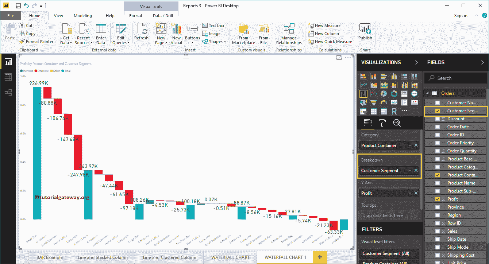

让我快速格式化这个瀑布图

注:建议大家参考[格式瀑布图](https://www.tutorialgateway.org/format-power-bi-waterfall-chart/)文章了解格式选项。

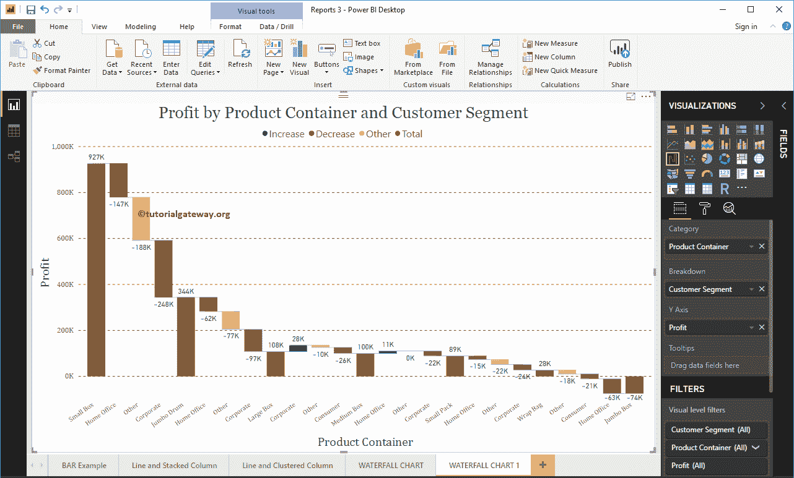