# 在 Power BI 中创建 100%堆叠条形图

> 原文：<https://www.tutorialgateway.org/create-100-stacked-bar-chart-in-power-bi/>

Power BI 100%堆叠条形图以百分比形式显示指标信息。让我用例子展示如何在 Power BI 中创建 100%堆叠条形图。

在这个 Power BI 100%堆叠条形图演示中，我们将使用我们在上一篇文章中创建的 SQL 数据源。所以，请参考[将 Power BI 连接到 SQL Server](https://www.tutorialgateway.org/connect-power-bi-to-sql-server/) 文章，了解 [Power BI](https://www.tutorialgateway.org/power-bi-tutorial/) 数据源。

## 如何在PowerBI中创建 100%堆叠条形图

要创建 Power BI 100%堆叠条形图，首先将“销售额”从“字段”部分拖放到“画布”区域。它会自动创建一个[柱形图](https://www.tutorialgateway.org/column-chart-in-power-bi/)，如下图所示。

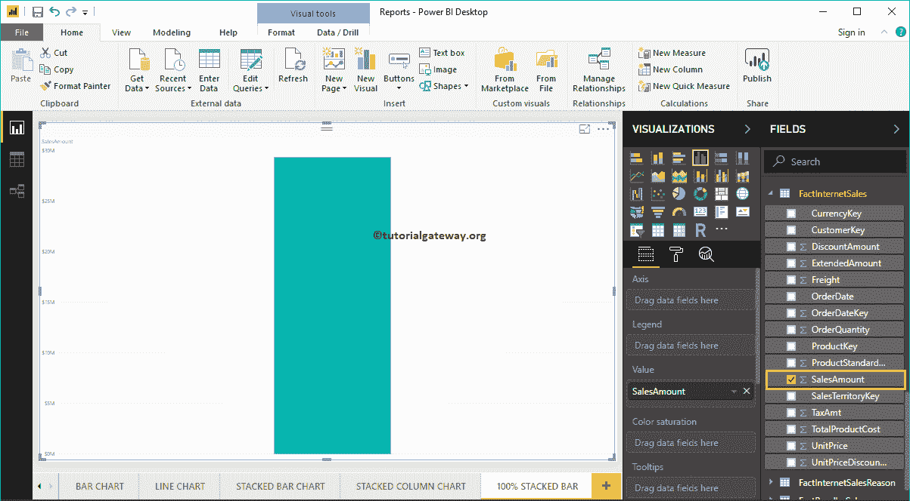

通过点击可视化部分下的 100%堆叠条形图，自动将柱形图转换为 100%堆叠条形图

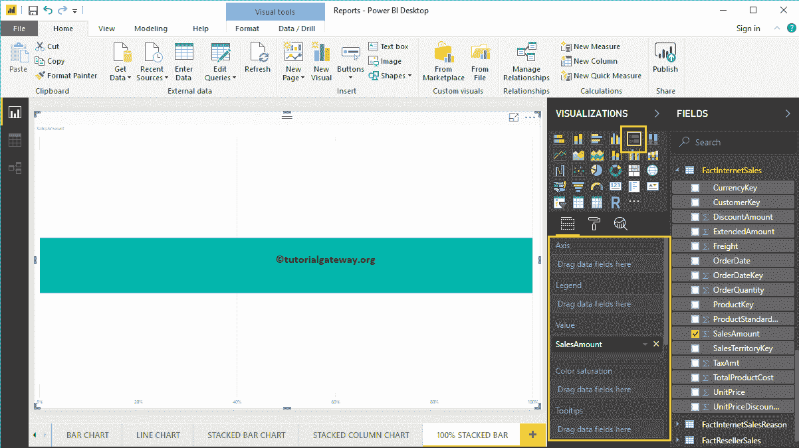

接下来，让我将英语国家/地区名称添加到轴部分，以创建 100%条形图。此图表按英语国家/地区名称显示销售额(百分比)。

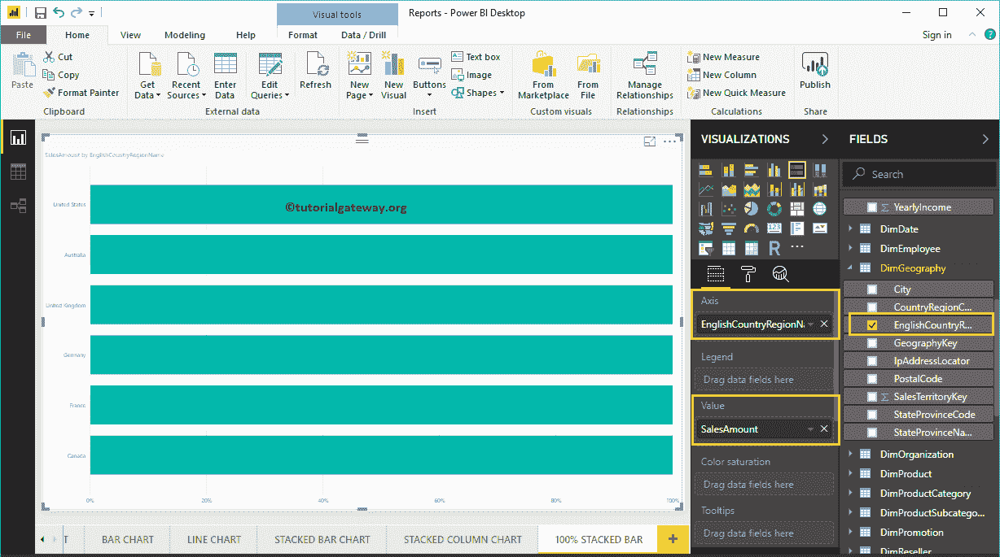

接下来，我们将职业添加到图例部分，将其转换为 100%堆叠条形图。

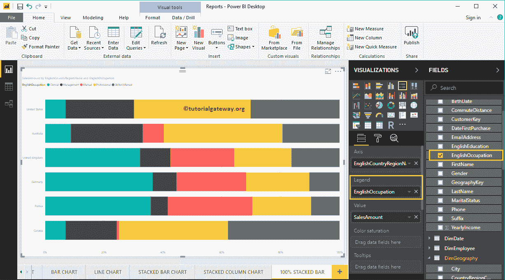

将鼠标悬停在条形图的任何部分，都会显示国家/地区名称、客户职业和销售额等工具提示。

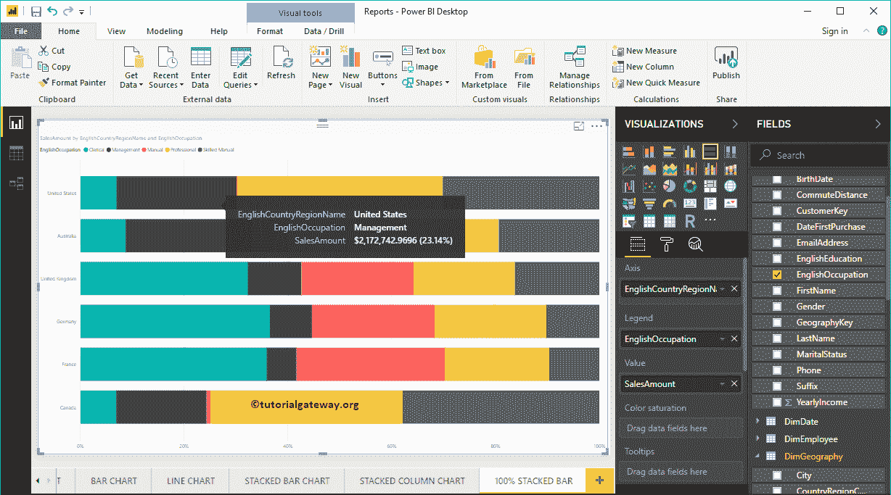

### 在 Power BI 方法 2 中创建 100%堆叠条形图

首先，单击可视化部分下的 100%堆叠条形图。它会自动创建一个包含虚拟数据的 100%堆叠条形图，如下图所示。

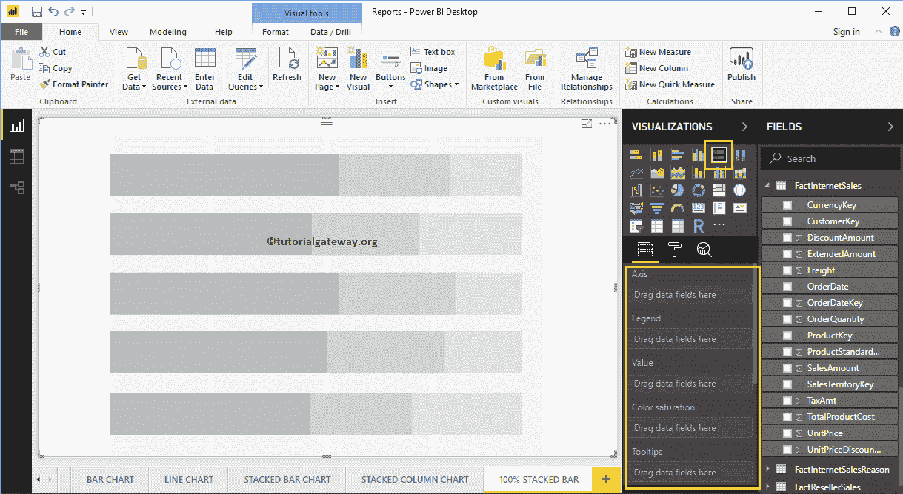

要将数据添加到 100%堆积条形图，我们必须添加必填字段:

*   轴:请指定代表水平条的列。
*   图例:指定要分割水平条的列。
*   值:任何度量值，如销售额、总销售额等。

让我将“销售额”从“字段”部分拖到“值”字段，将“英语国家/地区名称”字段拖到“轴”部分。

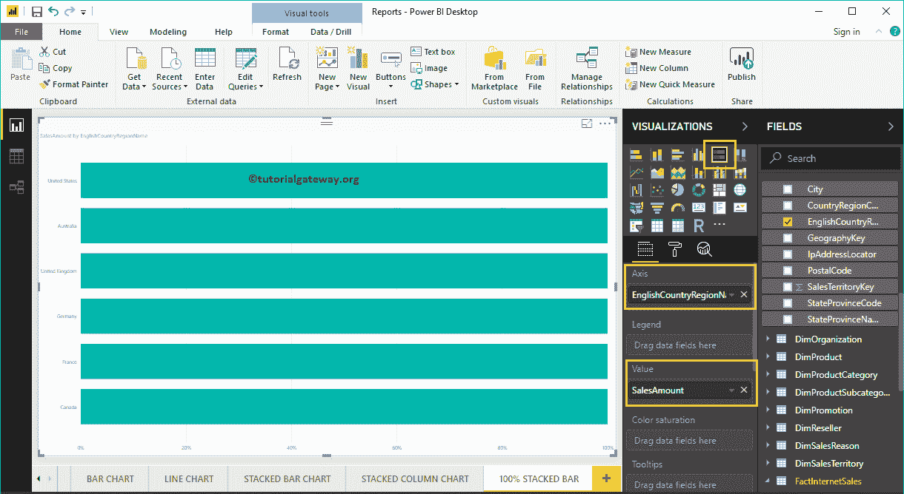

接下来，将“客户”表中的英语职业添加到“图例”部分。您可以通过将“职业”拖到“图例”部分来完成，或者只需选中“英语职业”列。

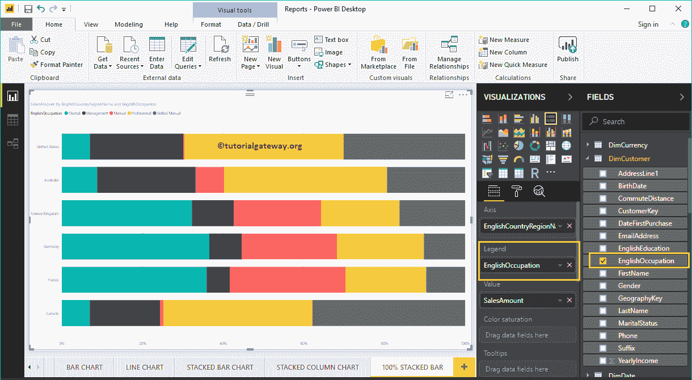

数据标签显示每组横条(国家)的信息。在这种情况下，它显示每个职业的销售额(百分比)。让我启用数据标签，以便您可以看到每个组的百分比。

要启用数据标签，请转到“格式”选项卡，并将“数据标签”选项切换到“打开”。让我将颜色改为白色，字体系列改为 DIN，文本大小改为 18

现在你可以看到 100%堆叠条形图，带有百分比值

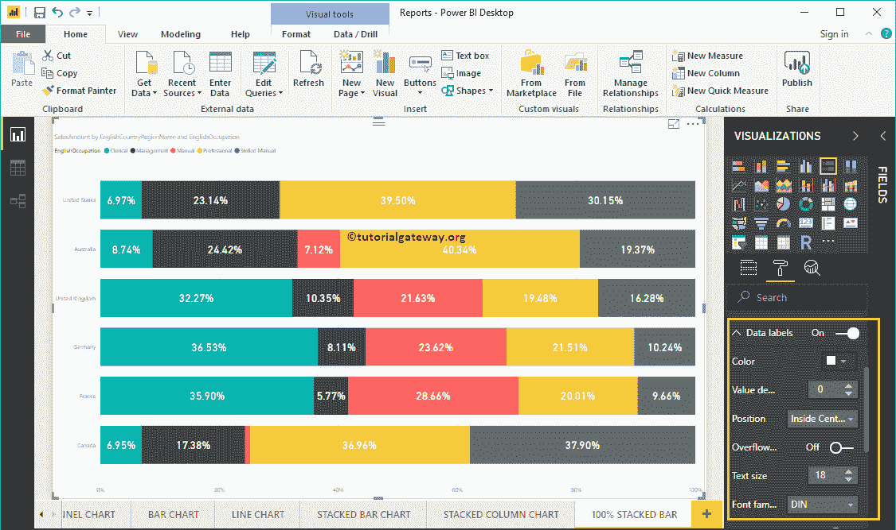

让我做一些快速格式化这个 Power BI 100%堆叠条形图

注意:堆积条形图和 100%堆积条形图的格式选项是相同的。因此，我建议您参考[格式化堆叠条形图](https://www.tutorialgateway.org/format-stacked-bar-chart-in-power-bi/)文章，了解格式化 100%堆叠条形图颜色所涉及的步骤。

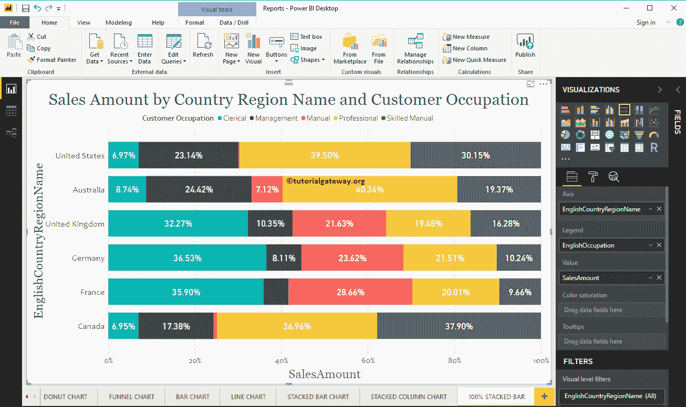

这一次，我们将州/省名称添加到轴，将国家/地区添加到图例，以获得 100%堆叠的条形图。从下面的截图中，您可以看到“国家/地区名称”作为条形颜色。这是因为您不能将一个州内的国家名称分组(从国家继承的州名)。

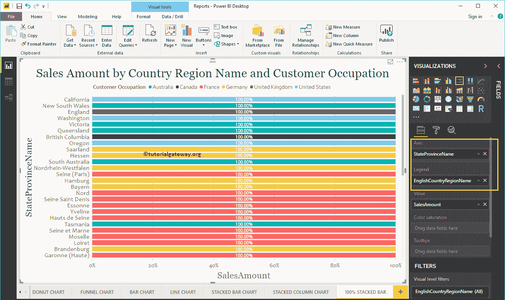