# 在 Power BI 中创建 100%堆叠柱形图

> 原文：<https://www.tutorialgateway.org/create-100-stacked-column-chart-in-power-bi/>

Power BI 100%堆叠柱形图以百分比形式显示指标信息。让我用例子向您展示如何在 Power BI 中创建 100%堆叠柱形图。

在这个 Power BI 100%堆叠柱形图演示中，我们将使用我们在上一篇文章中创建的 SQL 数据源。所以，请参考[将 Power BI 连接到 SQL Server](https://www.tutorialgateway.org/connect-power-bi-to-sql-server/) 文章，了解 [Power BI](https://www.tutorialgateway.org/power-bi-tutorial/) 数据源。

## 如何在 PowerBI 中创建 100%堆叠柱形图

要创建 Power BI 100%堆叠柱形图，首先将销售额从字段部分拖放到画布区域。它会自动创建一个[柱形图](https://www.tutorialgateway.org/column-chart-in-power-bi/)。

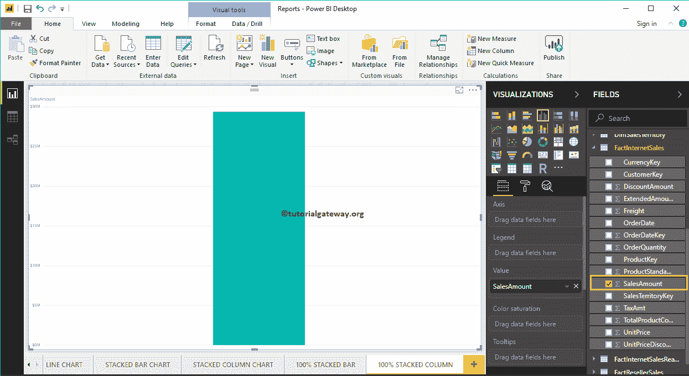

接下来，让我将销售区域区域名称添加到轴部分。此柱形图按销售区域区域名称显示销售金额。

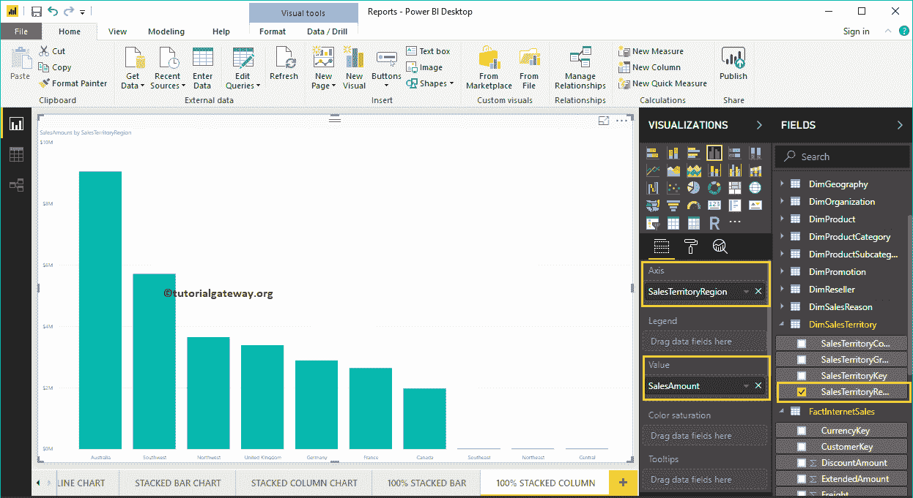

单击可视化部分下的 100%堆叠柱形图。它会自动将柱形图转换为 100%堆叠柱形图。

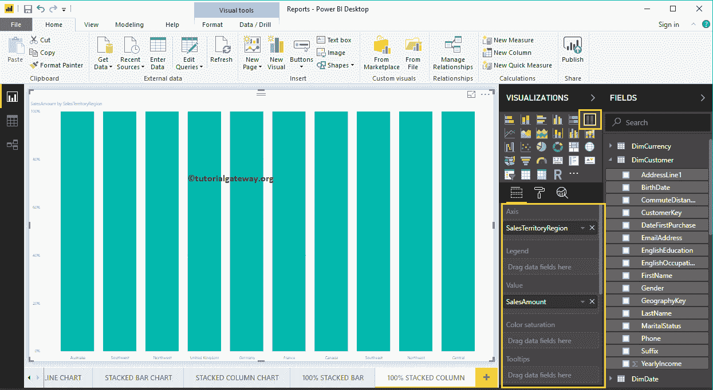

接下来，我们将客户职业添加到图例部分，将其转换为 100%堆积柱形图。

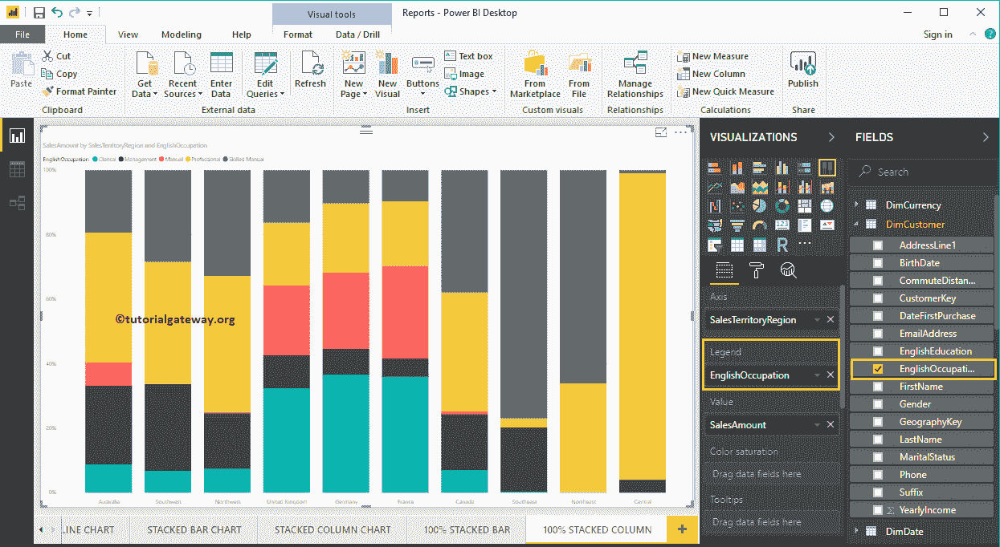

将鼠标悬停在条形图的任何部分上会显示销售区域名称、客户职业和销售金额(百分比)

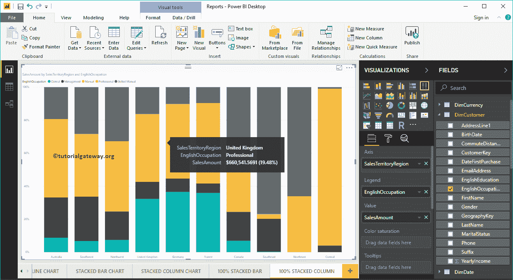

的工具提示

### 在 Power BI 方法 2 中创建 100%堆叠柱形图

首先，单击可视化部分下的 100%堆叠柱形图。它会自动创建一个 100%堆叠柱形图，并带有虚拟数据，如下图所示。

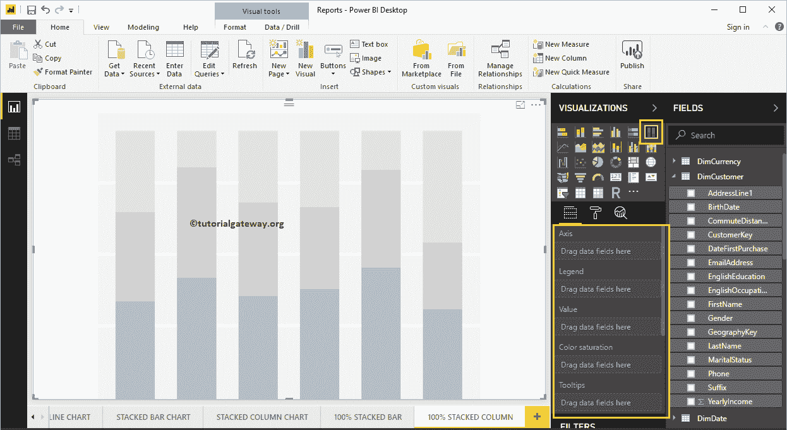

要向 Power BI 100%堆叠柱形图添加数据，我们必须添加必需的字段:

*   轴:请指定代表竖线的列。
*   图例:指定用于划分竖线的列。
*   值:任何度量值，如销售额、总销售额等。

让我将“销售额”从“字段”部分拖到“值”字段，将“销售区域名称”字段拖到“轴”部分。

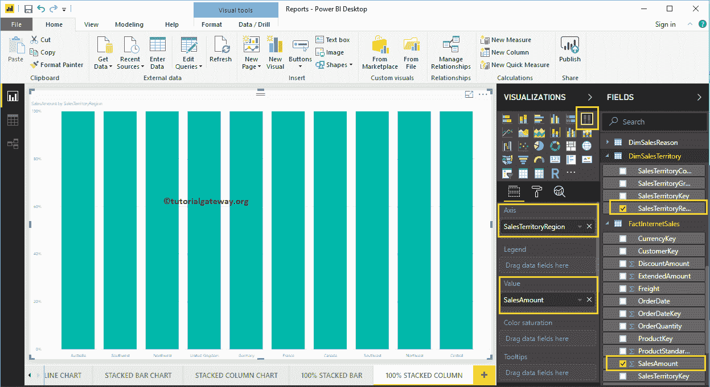

接下来，将“客户”表中的英语职业添加到“图例”部分。您可以通过将“职业”拖到“图例”部分来完成，或者只需选中“英语职业”列。

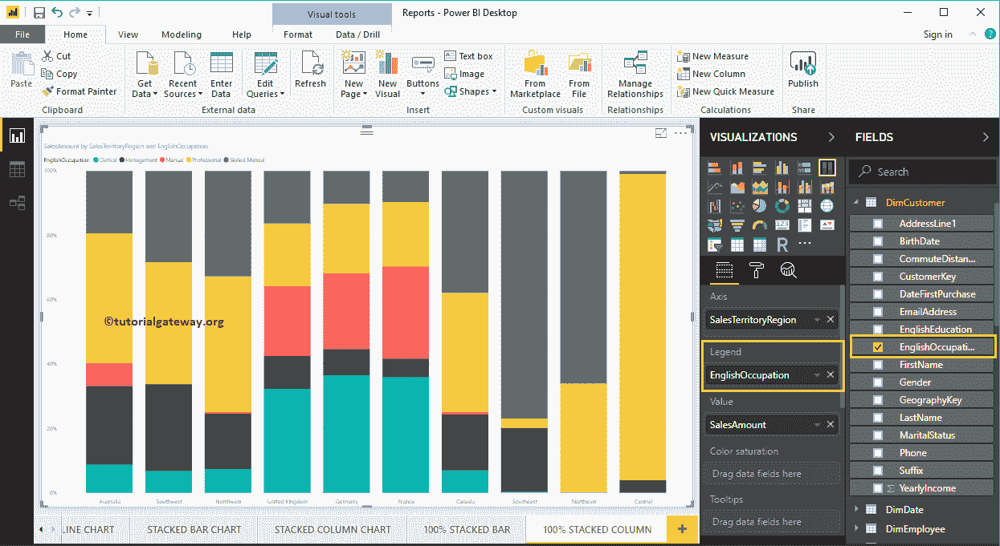

在 PowerBI 图表中，数据标签显示竖线(销售区域)中每个单独组的信息。在这种情况下，它显示每个职业的销售额(百分比)。让我启用数据标签，以便您可以看到每个组的百分比。

要启用数据标签，请转到“格式”选项卡，并将“数据标签”选项切换到“打开”。让我将颜色改为白色，字体系列改为 DIN，文本大小改为 20

现在你可以看到 100%堆叠柱形图，带有百分比值

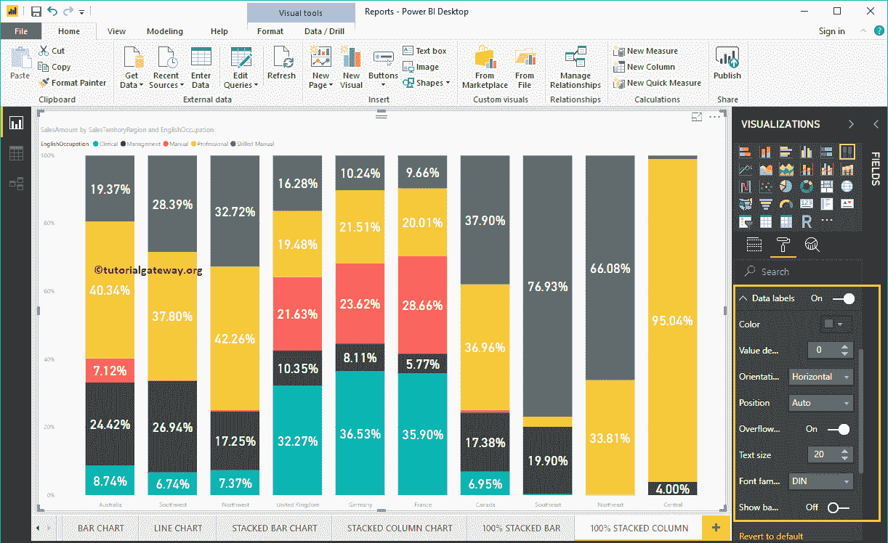

让我做一些快速格式化这个 Power BI 100%堆叠柱形图

注意:堆积柱形图和 100%堆积柱形图的格式选项是相同的。因此，我建议您参考[格式化堆叠柱形图](https://www.tutorialgateway.org/format-power-bi-stacked-column-chart/)文章，了解格式化 100%堆叠柱形图属性所涉及的步骤。

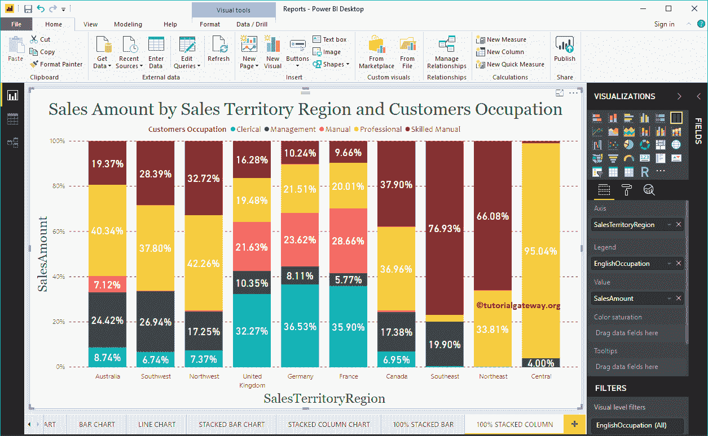

这一次，我们将州/省名称添加到轴，将销售区域区域添加到图例，以获得 100%堆叠柱形图。从下面的截图中，您可以看到，销售区域区域充当条形颜色。这是因为您不能在州内对销售地区区域进行分组(州名继承自地区)。

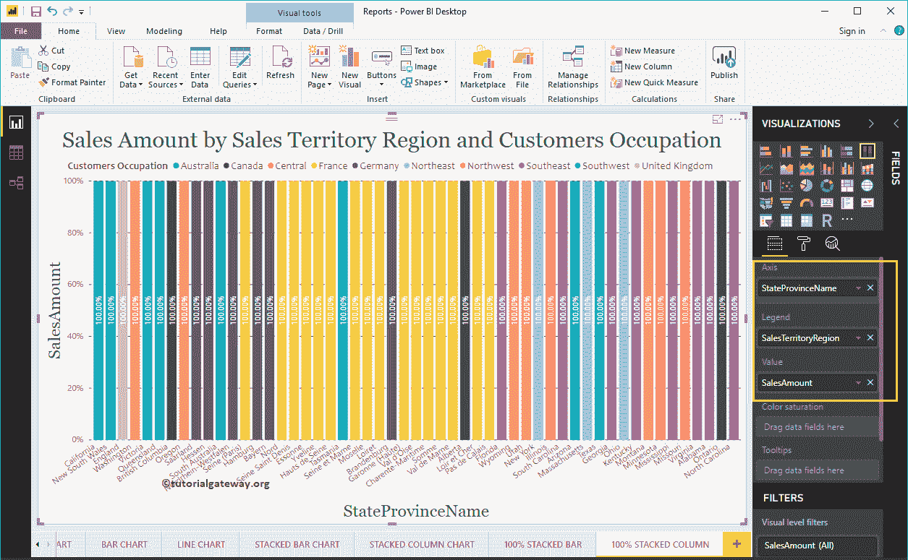