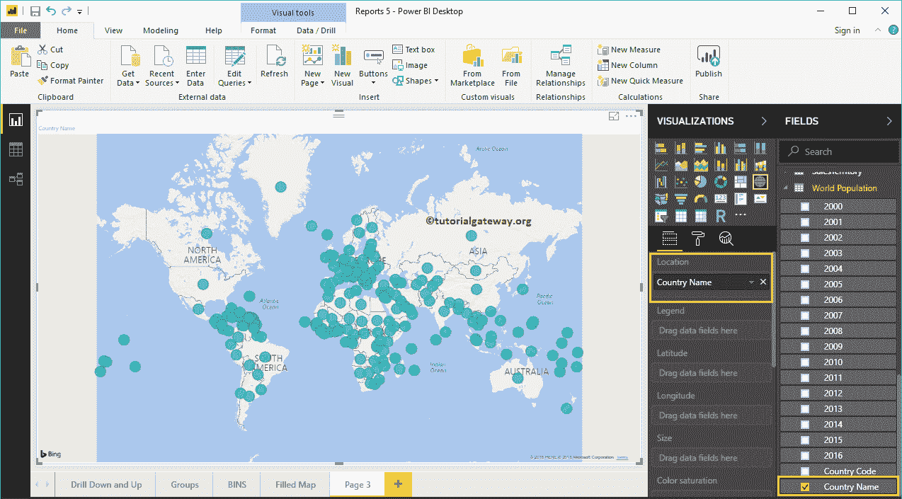
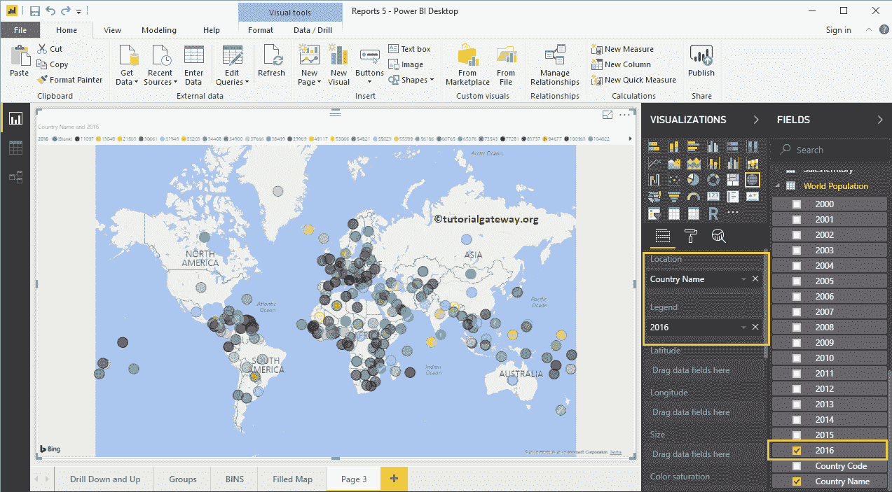
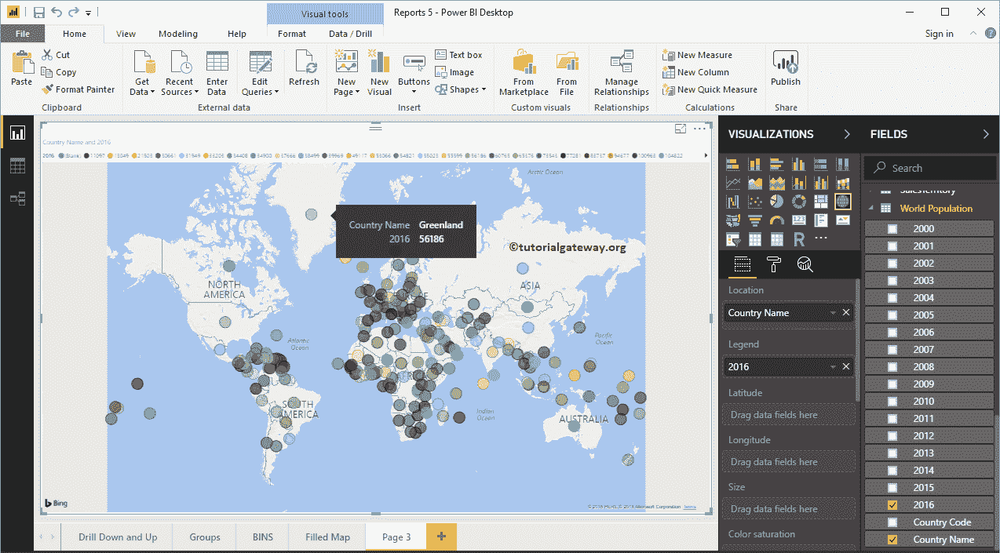
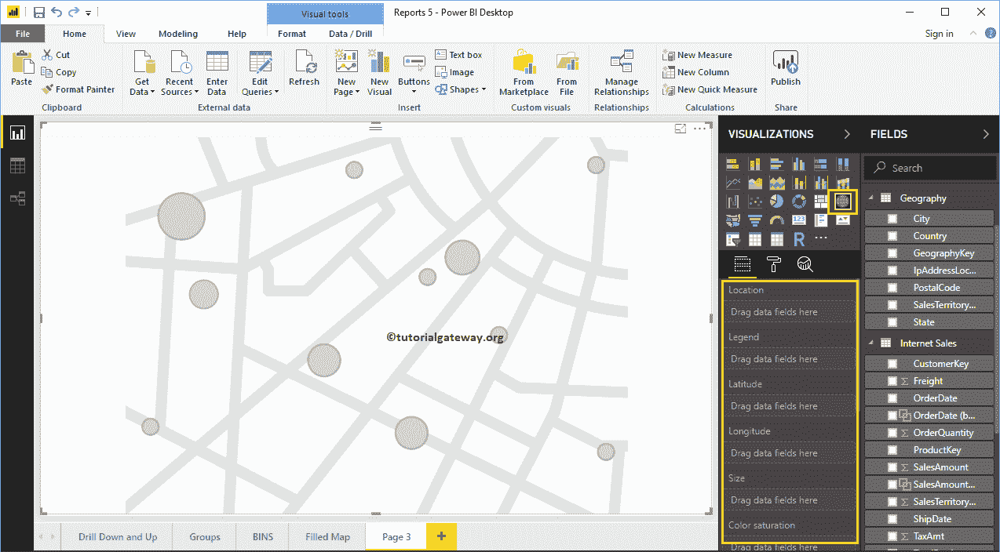
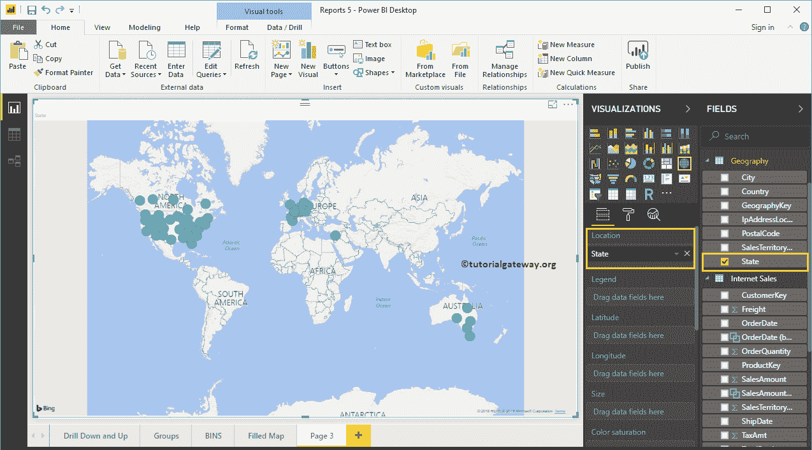
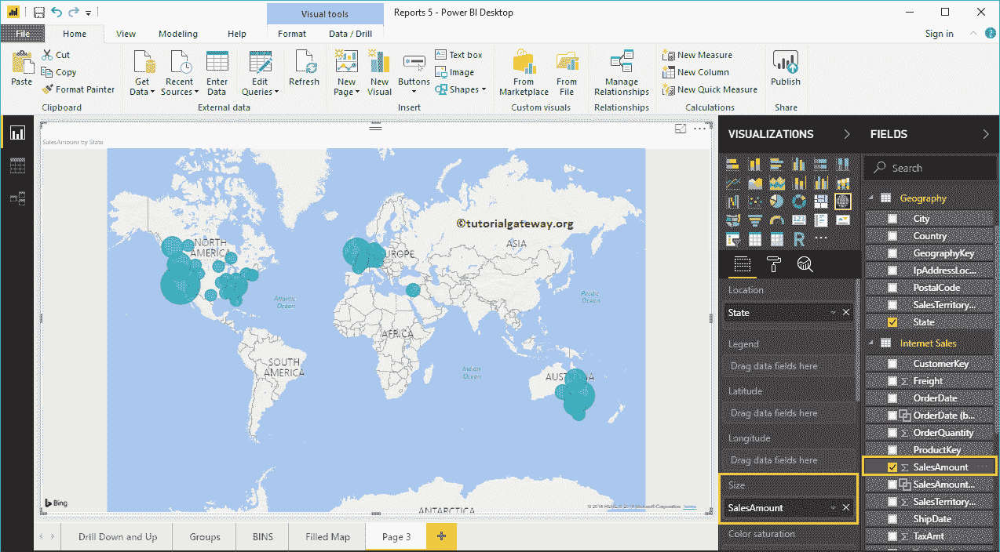
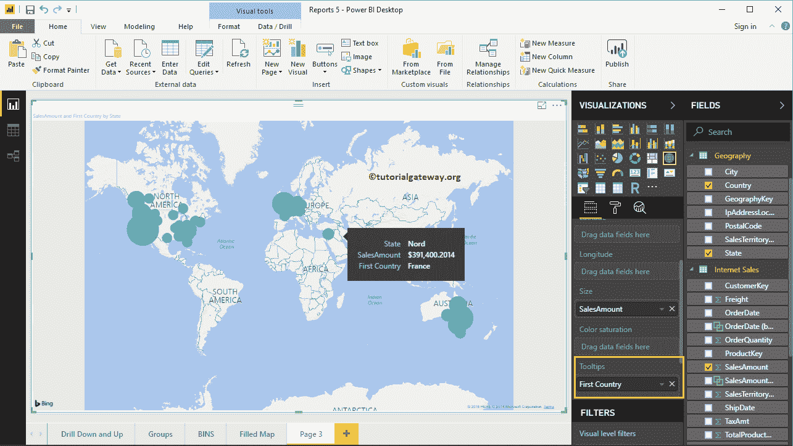
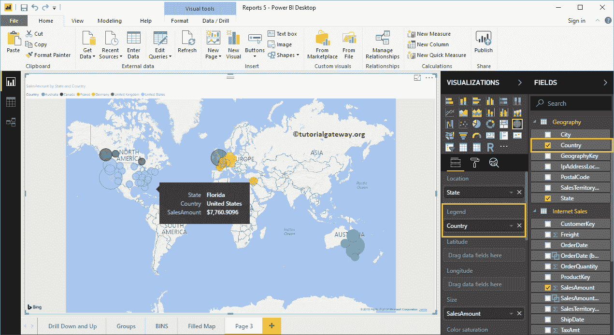
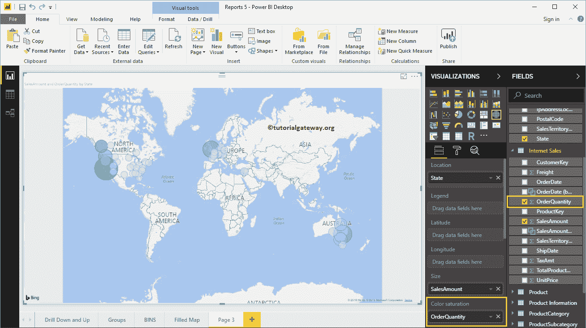
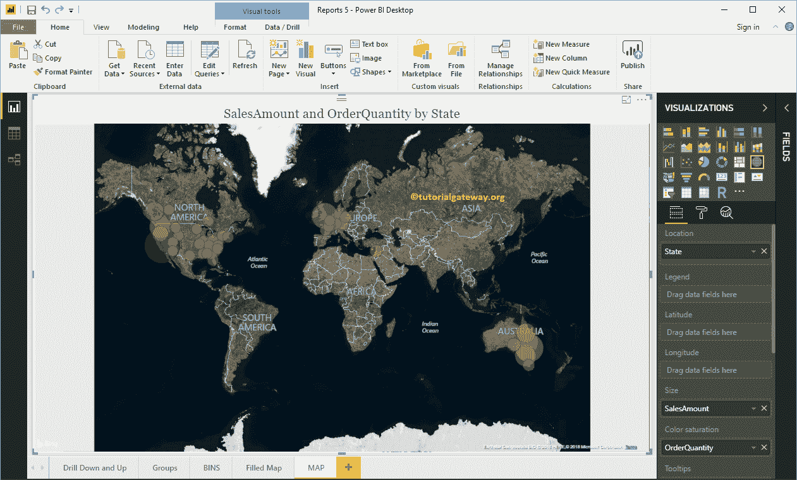

# 创建 PowerBI 地图

> 原文：<https://www.tutorialgateway.org/create-a-map-in-power-bi/>

PowerBI 地图帮助您可视化地质数据。让我们通过一个实际的例子来看看在 Power BI 中创建地图的分步方法。

对于 Power BI 地图演示，我们使用从数据库下载的世界人口 Excel 数据文件。

请访问[连接到 Excel](https://www.tutorialgateway.org/get-data-from-excel-to-power-bi/) 了解使用 Excel 的步骤。

## 如何在 PowerBI 中创建地图

将任何地理数据拖放到画布区域会自动创建地图。例如，让我将世界人口表中的国家名称拖放到画布上。

从下面的截图中，您可以注意到 power bi 已经为您创建了一个地图。

接下来，将 2016 年人口从 [Power BI](https://www.tutorialgateway.org/power-bi-tutorial/) 字段区域拖动并释放到图例部分。

将鼠标悬停在任何泡沫上，查看它所代表的国家和国家人口。

## PowerBI 中创建地图的第二种方法

首先，在可视化部分下，单击地图。它使用模型数据自动创建，如下图所示。

要向 Power BI 中的地图添加数据，我们应该添加必需的字段:

*   位置:请提供绘制气泡的地质柱名称。
*   图例:在“位置”部分细分数据的列名。类似于国家、地区、领地或大陆的东西
*   纬度和经度:如果数据包含纬度和经度信息，您可以使用它们来检索准确的位置。
*   大小:定义描述气泡大小的列。
*   颜色饱和度:任何决定 Power BI 贴图气泡颜色的数值数据。

让我将状态从字段区域拖到位置部分。您可以通过将“状态”列拖到“位置”部分或选中“状态”列来实现这一点。

接下来，将“销售额”添加到“大小”部分。现在，你认识到气泡

的大小差异了

接下来，让我将国家名称添加到工具提示部分。此后，如果您将鼠标悬停在任何气泡上，将显示有关国家、州及其销售额的信息。

让我将国家名称添加到图例部分。如你所见，气泡的颜色会根据它们所代表的国家而改变。

为了演示 Power BI 地图的“颜色饱和度”部分，我们将“订单数量”添加到“颜色饱和度”部分。从下面的截图来看，每个圆圈的颜色根据订单数量而变化。请记住，您不能同时使用图例和颜色饱和度。

让我做一些快速格式化这个 PowerBI 地图

注意:我建议你参考[格式化](https://www.tutorialgateway.org/format-power-bi-map/)文章了解格式化选项。

