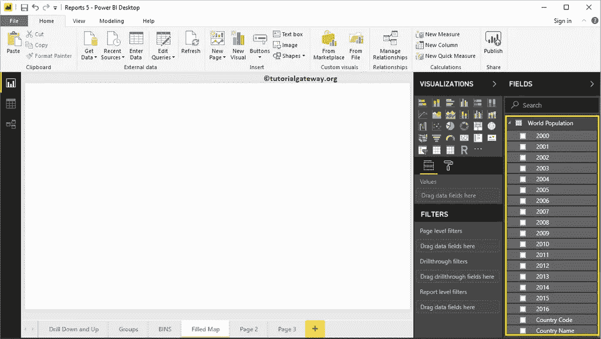
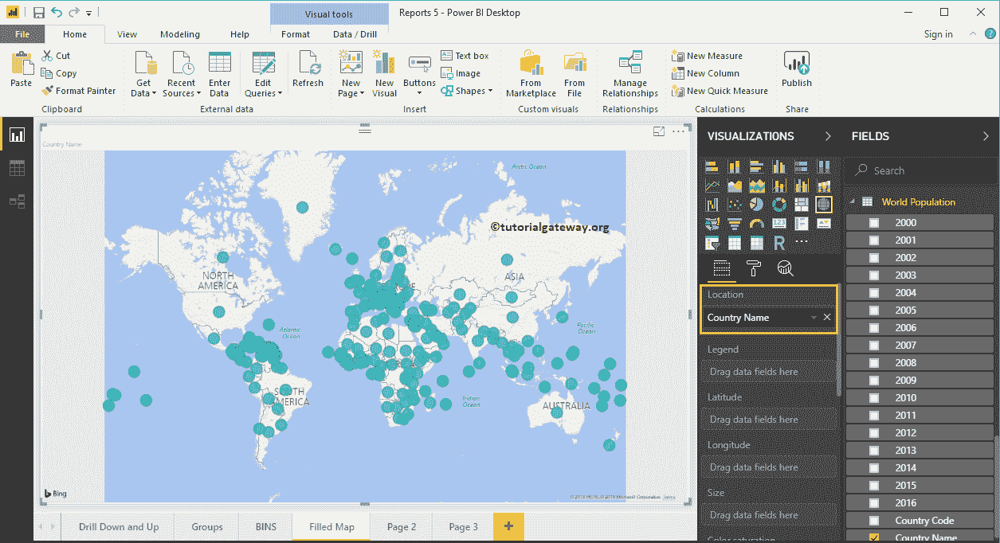
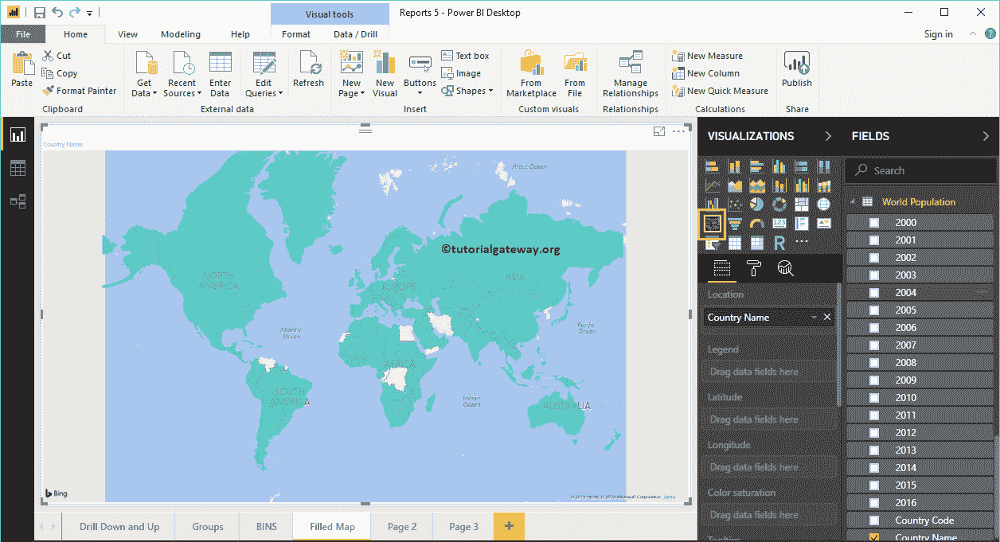
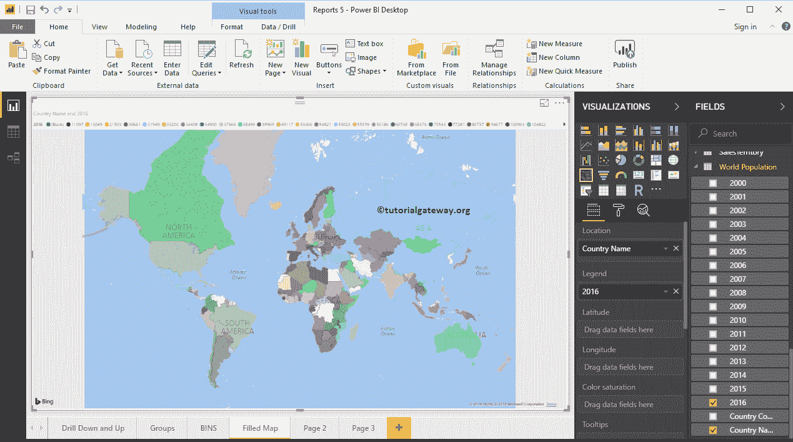
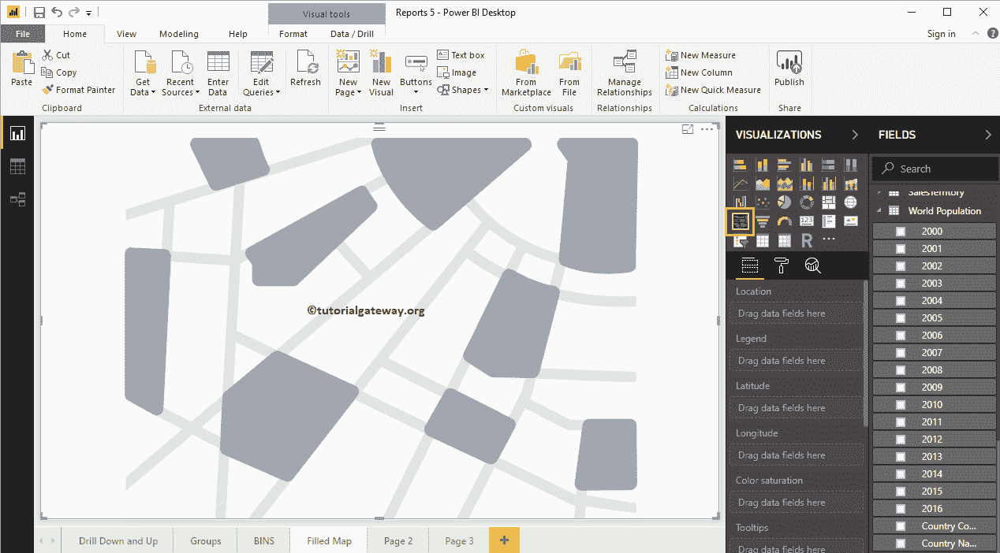
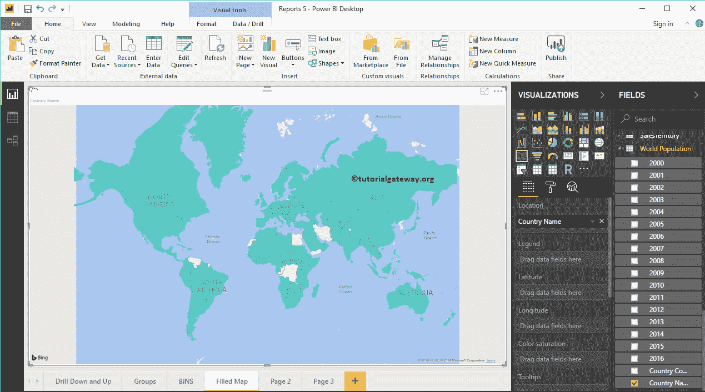
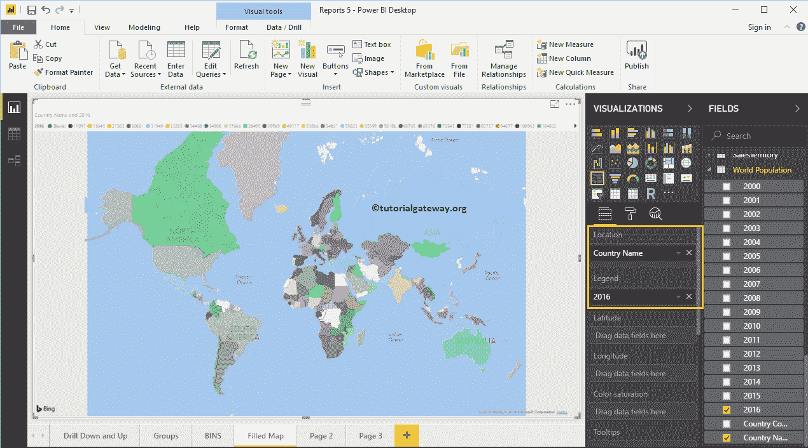
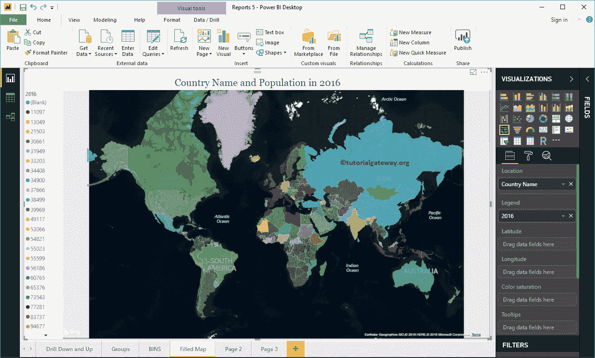
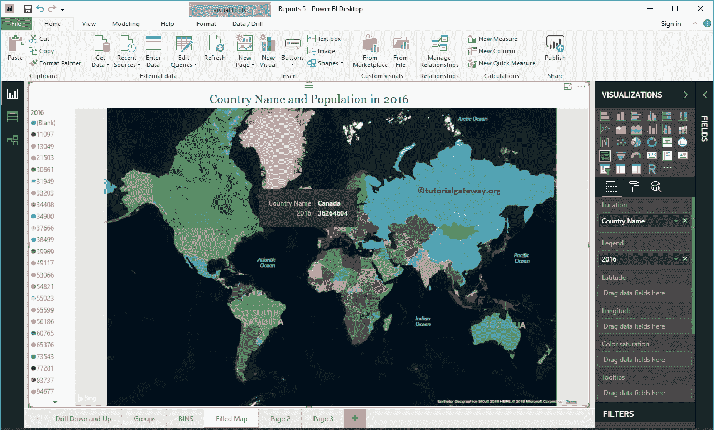

# PowerBI 中的填充地图

> 原文：<https://www.tutorialgateway.org/filled-map-in-power-bi/>

Power BI 填充地图根据您提供的地质数据用颜色填充地图。让我用例子向你展示如何在 Power BI 中创建填充地图。

在这个充满力量的商业智能地图演示中，我们将使用从数据库下载的世界人口数据(Excel 格式)。

请参考[连接到 Excel](https://www.tutorialgateway.org/get-data-from-excel-to-power-bi/) 文章，了解使用 Excel 所涉及的 [Power BI](https://www.tutorialgateway.org/power-bi-tutorial/) 步骤。

## 如何在 PowerBI 中创建填充地图

将任何地理数据拖动到画布区域将自动为您创建一个[地图](https://www.tutorialgateway.org/create-a-map-in-power-bi/)。首先，让我将国家名称从世界人口表拖到画布上。

单击可视化部分下的填充地图。它将地图转换为填充地图。

接下来，将 2016 年人口从字段部分拖放到图例区域。

从上面的截图中，你可以看到 2016 年在全国人口中所代表的填充地图

## 在 PowerBI 方法 2 中创建填充地图

首先，单击可视化部分下的填充地图。它会自动创建一个填充了虚拟数据的地图，如下图所示。

要向 PowerBI 填充地图添加数据，我们必须添加必需的字段:

*   位置:请指定代表气泡的地质柱。
*   图例:指定细分位置数据的列。比如领土、国家、地区或大陆
*   纬度和经度:如果你的数据有纬度和经度信息，那么你可以使用它们来获得准确的位置。
*   大小:指定代表气泡大小的列。
*   颜色饱和度:决定气泡颜色的任何数值。

让我将国家名称从字段部分拖到位置部分。您可以通过将国家/地区名称拖到“位置”部分来完成此操作，或者只需在“国家/地区名称”列打勾。

接下来，让我将 2016 年的人口添加到图例部分。现在你看到的是填充地图

让我做一些快速格式化这个 PowerBI 填充地图

注意:我建议你参考[格式填充地图](https://www.tutorialgateway.org/format-power-bi-filled-map/)一文了解格式选项。

将鼠标悬停在任何区域上，查看国家名称和国家人口。

