# 格式化 PowerBI 区域图

> 原文：<https://www.tutorialgateway.org/format-power-bi-area-chart/>

如何用例子格式化 PowerBI 区域图？。格式化 Power BI 区域图包括更改面积颜色、图表标题文本、标题位置、X 轴详细信息、Y 轴详细信息、数据标签和背景图像等。

为了演示这些 Power BI 区域图格式选项，我们将使用之前创建的区域图。请参考电力 BI 文章中的[区域图。](https://www.tutorialgateway.org/area-chart-in-power-bi/)

## 如何格式化 PowerBI 区域图

请单击“格式”按钮查看该区域图可用的格式选项列表。

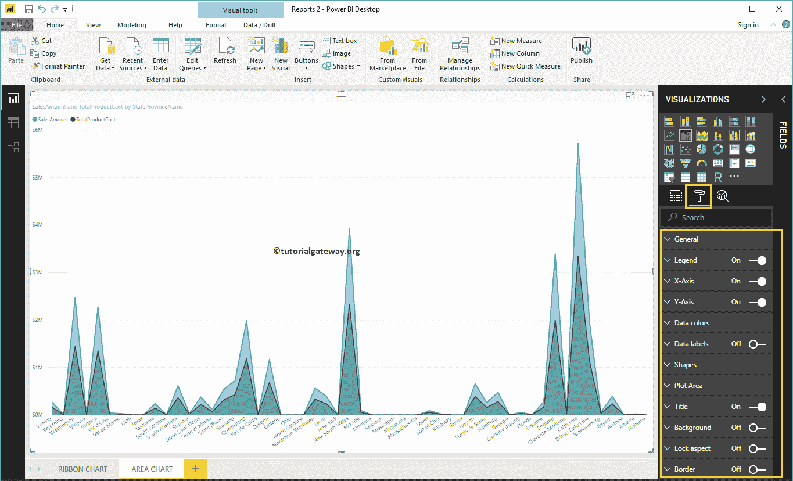

### 区域图格式常规设置

使用此常规部分更改区域图的 X、Y 位置、宽度和高度

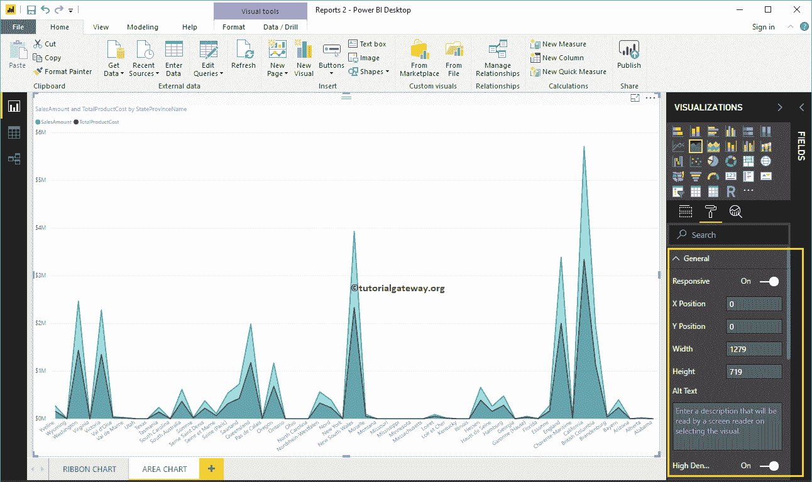

### PowerBI 中区域图的格式图例

请选择[PowerBI](https://www.tutorialgateway.org/power-bi-tutorial/) 图例区域，并将选项从关闭切换到打开以启用图例。

从下面的截图中可以看到，我们使用了位置下拉框将图例位置更改为顶部中心。我们还将图例标题添加为货币，将颜色添加为砖红色，将字体系列添加为 Candara，并将文本大小添加为 15。

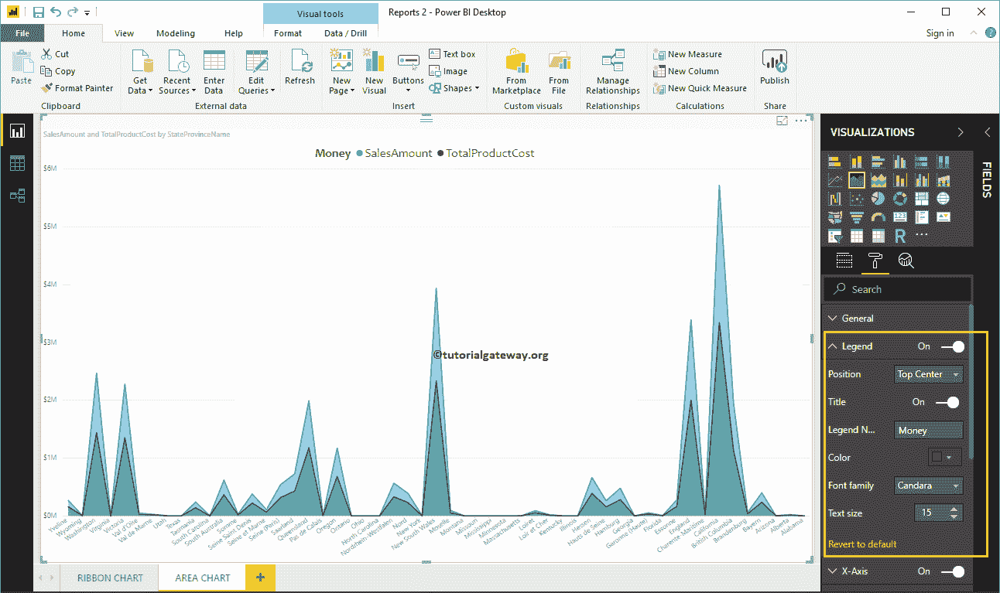

### PowerBI 中区域图的 X 轴格式

以下是可用于格式化区域图水平轴或 X 轴的选项列表。这里，我们将颜色更改为棕色，文本大小更改为 12。

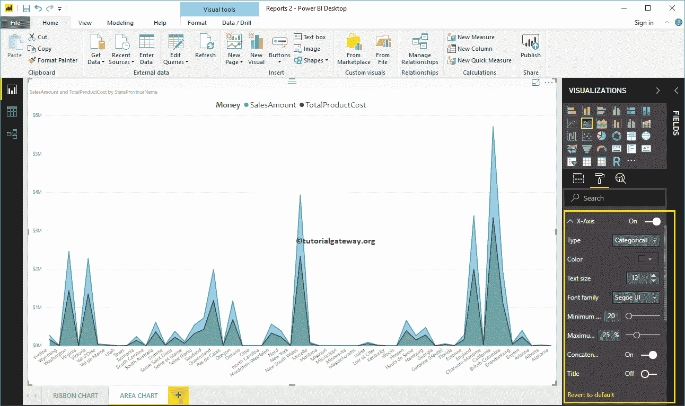

默认情况下，区域图的 X 轴标题设置为关闭，但您可以通过将标题切换为打开来启用它。让我将标题颜色更改为绿色，字体样式更改为红色，字体大小更改为 25。

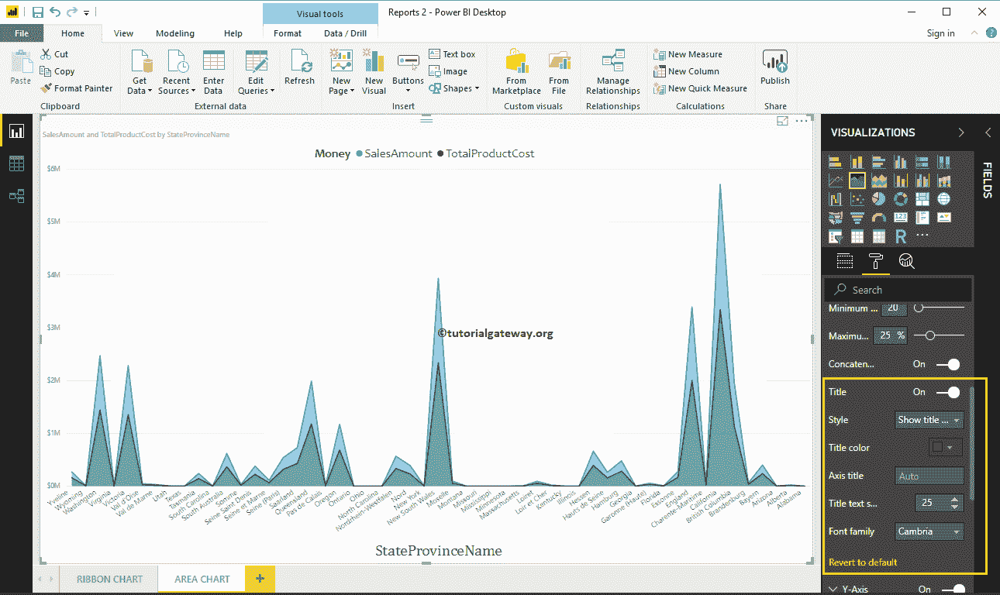

### PowerBI 区域图的 Y 轴格式

如您所见，我们将 Y 轴标签颜色更改为棕色，文本大小更改为 15，显示单位更改为千。

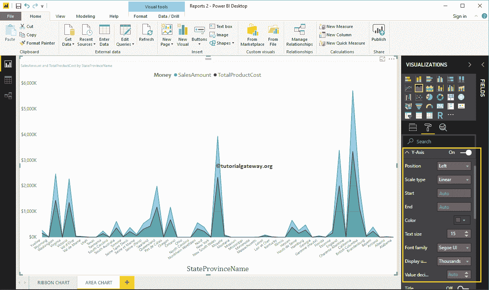

让我将刻度类型更改为日志。从下面的截图中，您可以看到它正在显示日志刻度。

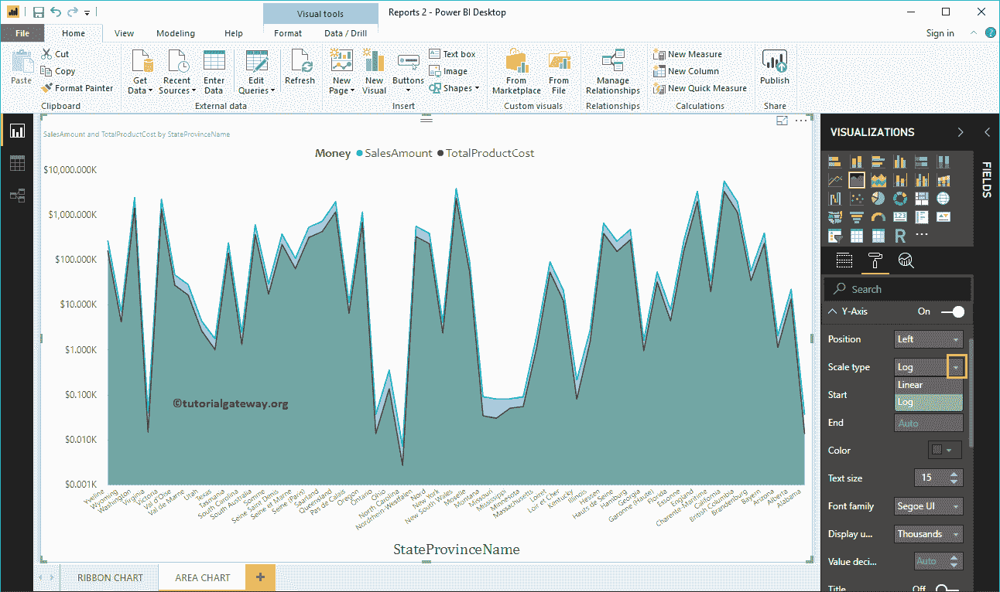

默认情况下，区域图 Y 轴标题设置为关闭。但是，您可以通过将“Y 轴”部分下的“标题”切换为“开”来启用它。让我将标题颜色更改为绿色，文本大小更改为 25，字体系列更改为 Cambria。

通过将区域图网格线选项从打开切换到关闭，可以禁用网格线。

*   颜色:您可以更改网格线颜色。
*   描边宽度:用它来改变网格线的宽度。
*   线条样式:选择线条样式，如实线、虚线和虚线。

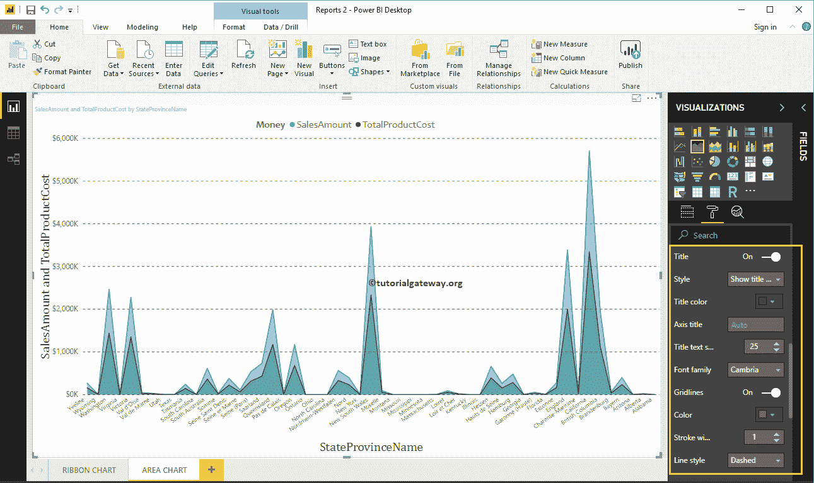

### 设置 PowerBI 区域图数据颜色的格式

默认情况下，区域图用默认颜色填充轴和线之间的空间。让我将销售金额行颜色更改为绿色，将产品总成本颜色更改为红色。

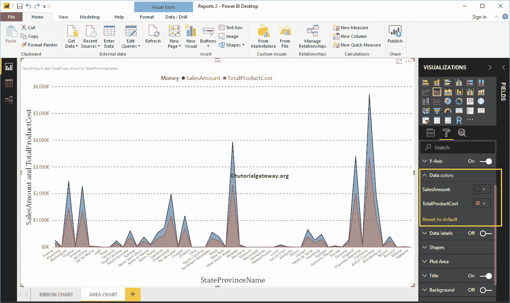

### 格式化区域图的数据标签

数据标签显示值(每个点的销售额和产品总成本)。从下面的截图中可以看到，我们启用了数据标签，并将颜色改为黑色。

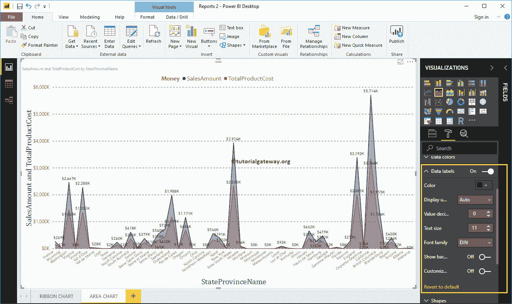

### 在 PowerBI 形状中格式化区域图

使用此部分更改线条或标记形状。

从下面的截图中可以看到，我们将笔画宽度(线宽)更改为 4，标记形状(连接点形状)更改为菱形，标记大小更改为 7，标记颜色更改为樱桃红。

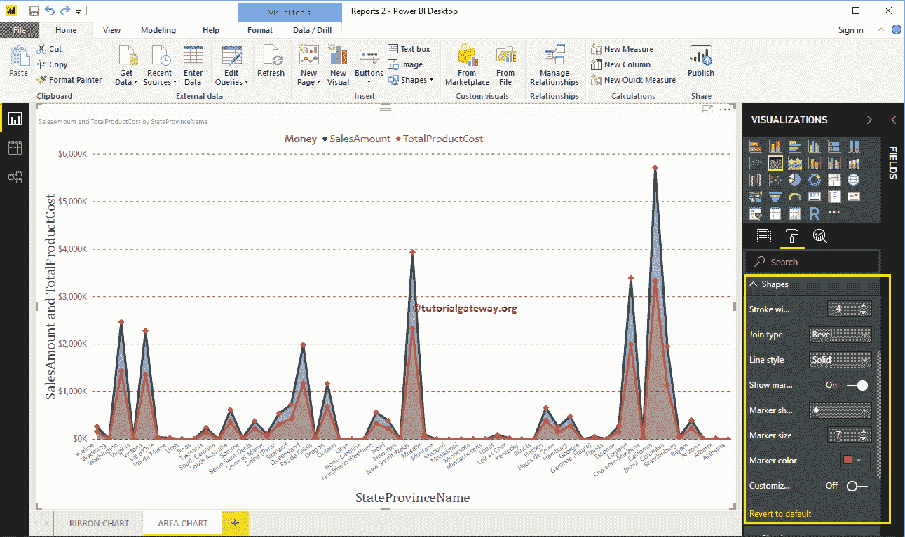

### 格式化区域图绘图区域

使用此绘图区域属性，您可以添加自定义图像作为区域图的背景。出于演示目的，我们添加了一个图像作为绘图区域背景。

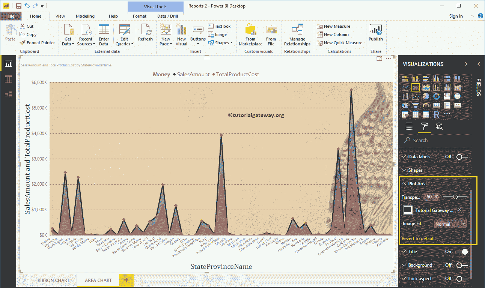

### 设置 PowerBI 区域图标题的格式

通过将标题选项从打开切换到关闭，您可以禁用区域图标题。

从下面的截图中，您可以看到，我们将标题文本更改为按州名列出的销售额和产品总成本。我们还将字体颜色更改为绿色，字体系列更改为乔治亚，文本大小更改为 25，标题对齐方式更改为居中。如果需要，您也可以将背景颜色添加到标题中。

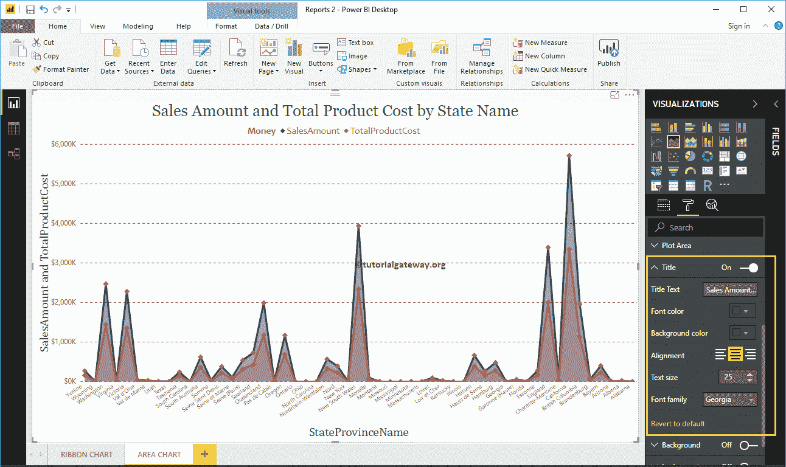

### 设置商务智能区域图背景颜色和边框的格式

通过将“背景”选项切换为“开”，可以将背景颜色添加到区域图中。出于演示目的，我们添加了透明度为 28%的黄色。

同样，您可以通过将“边框”选项从“关闭”切换到“打开”来将边框添加到区域图中。

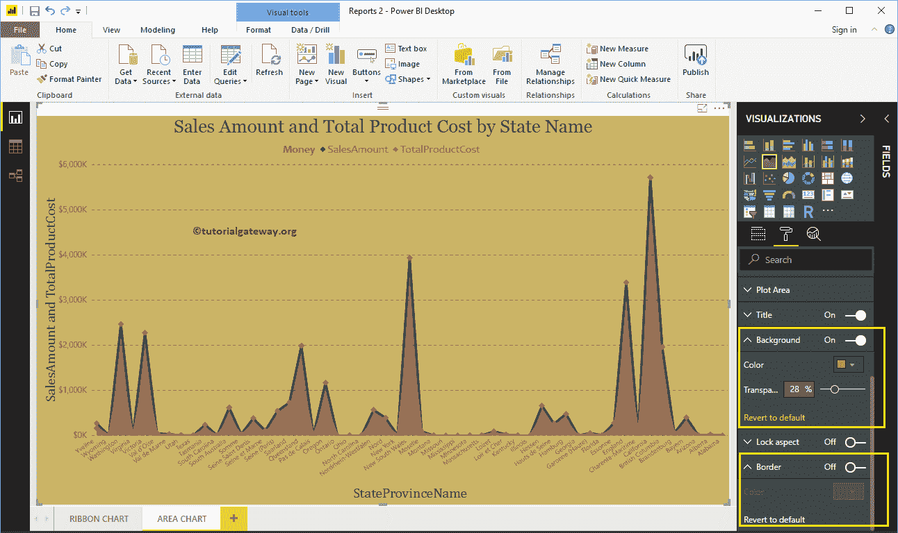