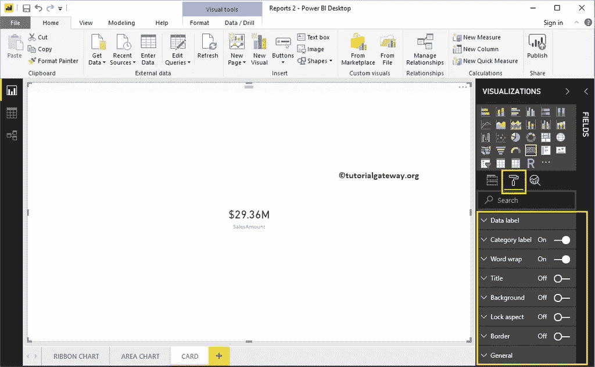
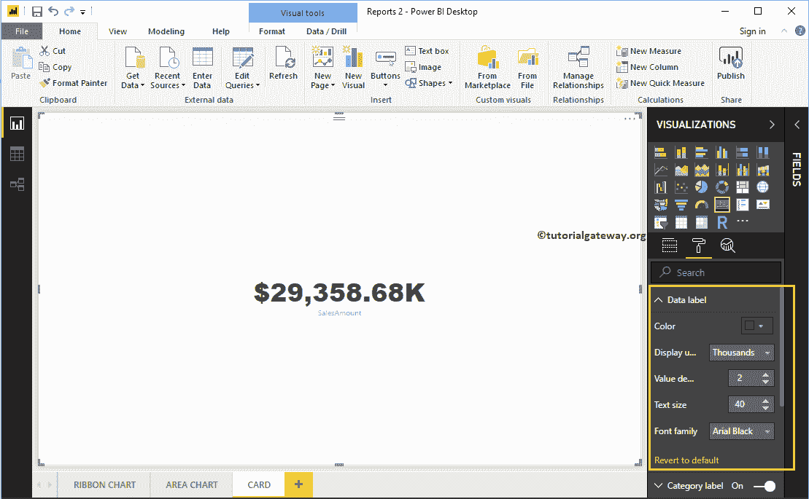
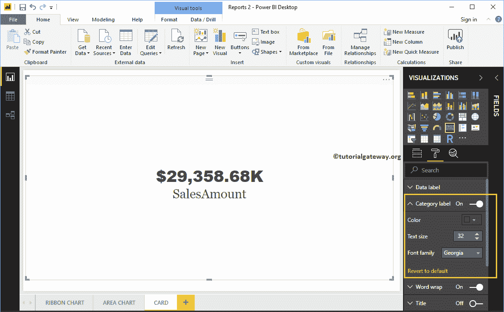
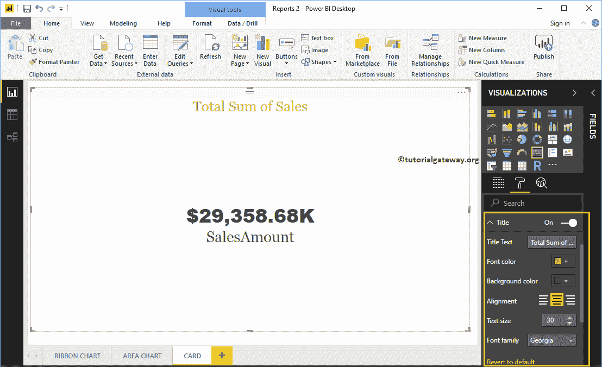
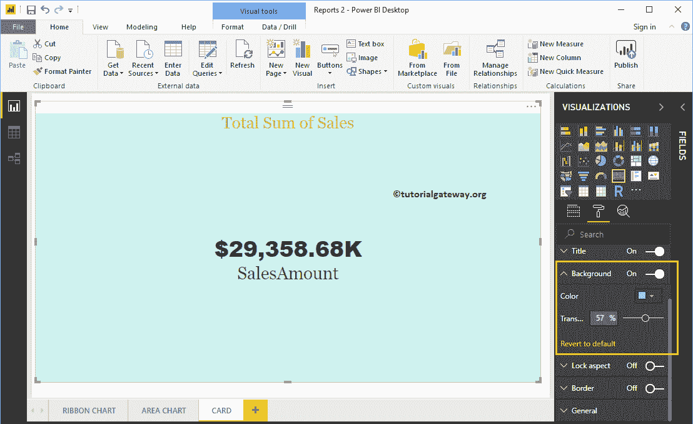
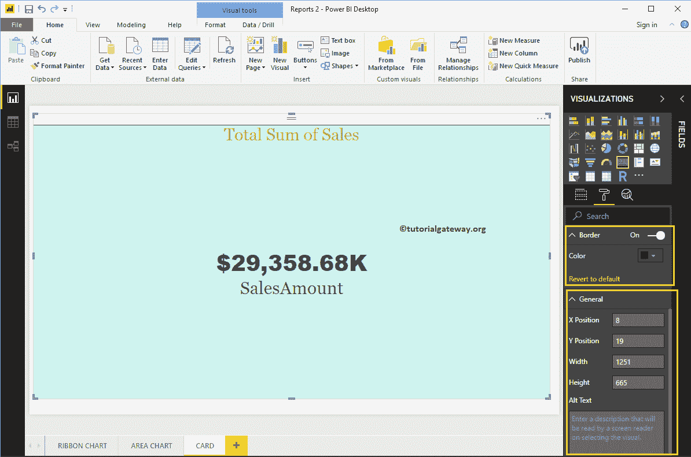

# 格式化电源商业智能卡

> 原文：<https://www.tutorialgateway.org/format-power-bi-card/>

如何用例子格式化电源 BI 卡？。格式化 Power BI 卡包括更改类别标签颜色、启用卡标题、背景颜色等。

为了演示卡片格式选项，我们将使用之前创建的卡片。有关创建 [Power BI](https://www.tutorialgateway.org/power-bi-tutorial/) 卡的步骤，请参考 Power BI 文章中的[卡。](https://www.tutorialgateway.org/create-a-card-in-power-bi/)

## 如何格式化电源 BI 卡

请单击“格式”按钮查看此卡可用的格式选项列表。

### 电力商业智能中卡的格式数据标签

数据标签是数值(销售额、产品总成本等)。)由卡片显示。从下面的截图中可以看到，我们将颜色更改为绿色，显示单位更改为千，文本大小更改为 40，字体系列更改为 Arial Black。

### 卡片的格式类别标签

类别标签是指我们在卡片中使用的列名。从下面的截图中，你可以看到，我们将颜色更改为砖红色，字体系列更改为乔治亚，文本大小更改为 35。

### 格式化电源商业智能卡标题

通过将标题选项从关闭切换到打开，您可以启用卡片的标题。

从下面的截图中，你可以看到，我们将标题文本改为销售总额。我们还将字体颜色改为金色，标题对齐改为居中，字体系列改为乔治亚，文本大小改为 30。

### 格式化电源 BI 卡背景色

您可以通过将“背景”选项切换到“开”来为卡片添加背景颜色。出于卡片演示的目的，我们添加了一些透明度为 57%的随机颜色。

### 格式化卡片边框和常规设置

您可以通过将“边框”选项从“关闭”切换到“打开”来为卡片添加边框。

使用常规部分更改卡片的 X、Y 位置、宽度和高度

