# 格式化 PowerBI 中条形图

> 原文：<https://www.tutorialgateway.org/format-bar-chart-in-power-bi/>

如何用例子格式化 Power BI 中的条形图？。格式化 Power BI 条形图包括更改横条颜色、标题文本、标题位置、数据标签、轴详细信息和背景颜色等。

为了演示这些 Power BI 条形图格式选项，我们将使用之前创建的条形图。请参考 [Power BI 条形图](https://www.tutorialgateway.org/power-bi-bar-chart/)文章，了解创建 [Power BI](https://www.tutorialgateway.org/power-bi-tutorial/) 条形图的步骤。

## 如何在 PowerBI 中格式化条形图

请单击“格式”按钮查看该条形图可用的格式选项列表。

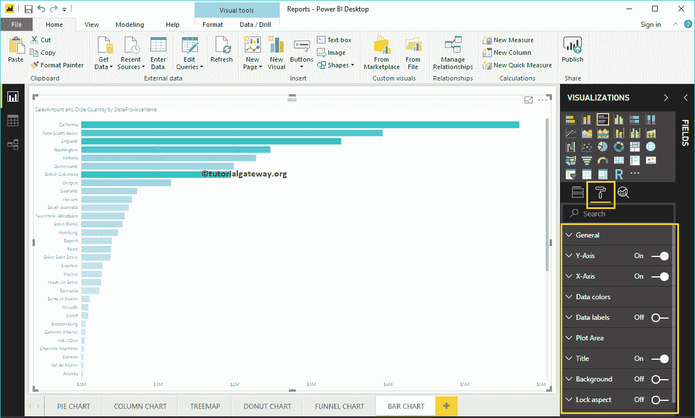

### PowerBI 常规部分中的条形图格式

使用此常规部分更改条形图的 X、Y 位置、宽度和高度

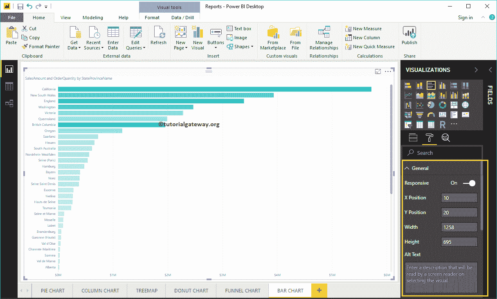

### 设置幂指数条形图的 Y 轴格式

以下是可用于格式化垂直轴或 Y 轴的选项列表。

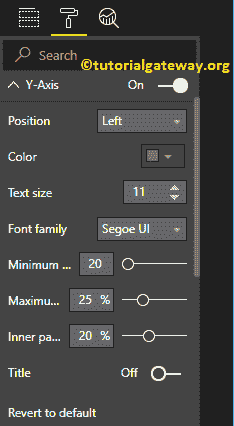

您可以从下面的截图中看到，我们将 Y 轴标签颜色更改为绿色，文本大小更改为 12，字体样式更改为 Cambria。您可以使用“最小类别宽度”、“最大大小”和“内部填充”选项来更改水平栏宽度。

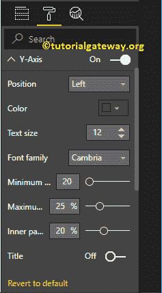

默认情况下，Y 轴标题设置为关闭，但您可以通过将 Y 轴部分下的标题切换为打开来启用它。让我将标题颜色更改为砖红色，标题文本大小更改为 25，字体样式更改为乔治亚。

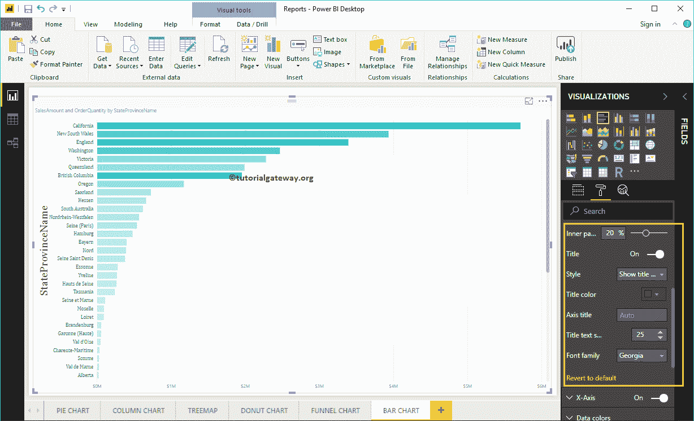

### PowerBI 中条形图的 X 轴格式

以下是可用于格式化横轴或 X 轴

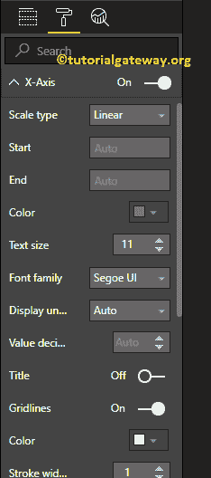

的选项列表

正如你从下面的截图中看到的，我们将颜色改为绿色，字体样式改为红色，文本大小改为 13，显示单位改为千(默认为自动)。

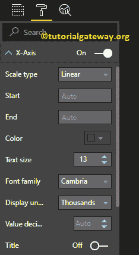

默认情况下，X 轴标题设置为关闭，但您可以通过将标题切换为打开来启用它。让我将标题颜色更改为砖红色，字体样式更改为乔治亚，字体大小更改为 25。

通过将条形图网格线选项从打开切换到关闭，可以禁用网格线。

*   颜色:您可以更改网格线颜色。
*   描边宽度:用它来改变网格线的宽度。这里，我们将宽度从默认的 1 笔画更改为 2 笔画。
*   线条样式:选择线条样式，如实线、虚线和虚线。

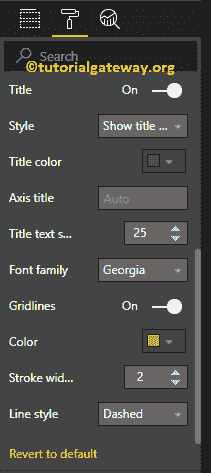

从下面的截图中，您可以看到我们对 X 轴所做的更改。

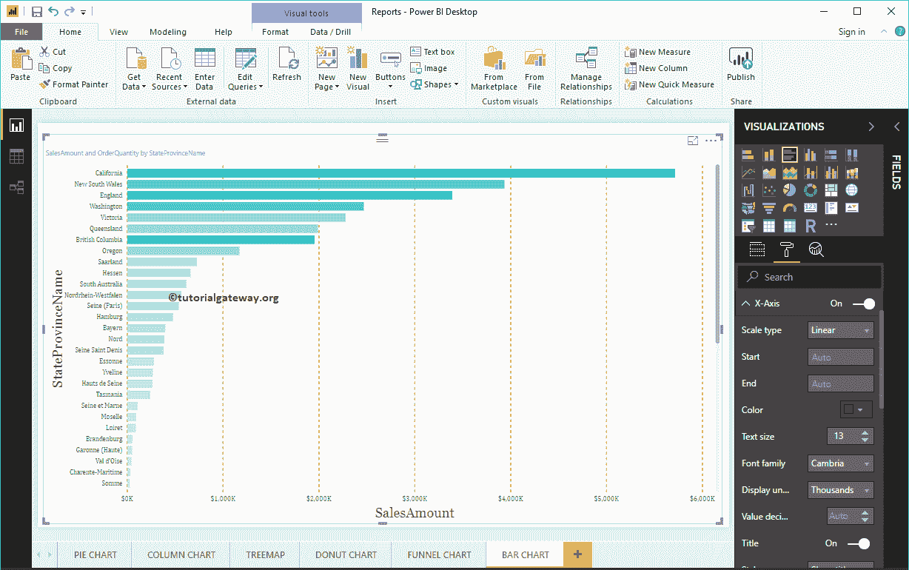

### 在 Power BI 中格式化条形图的数据颜色

如果在“颜色饱和度”字段中添加了任何有效的列，则可以使用此发散选项向条形图中添加颜色。默认情况下，它设置为关闭，但您可以通过切换到关闭

来启用这些分叉选项

如果您尚未在“颜色饱和度”部分下添加任何“文件”，则“数据颜色”部分下的“发散”选项将替换为默认颜色选项，如下所示

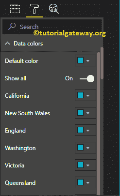

让我添加最小，中心和最大颜色。请记住，您还可以选择添加最小值、中心值和最大值。

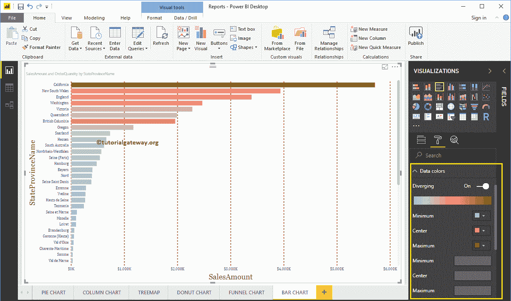

### 为 PowerBI 条形图启用数据标签

条形图数据标签显示每个单条横条的信息。在这种情况下，它显示每个条形的销售额。要启用或格式化 PowerBI 条形图数据标签，请将数据标签选项切换为打开。

让我将颜色更改为绿色，显示单位从自动更改为千，字体系列更改为 DIN，文本大小更改为 10，背景颜色更改为具有 90%透明度的黑色

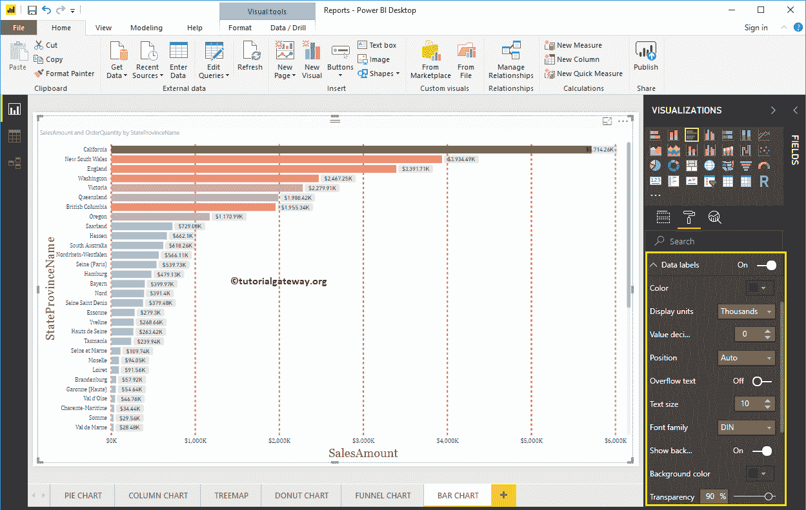

### 在 PowerBI 绘图区格式化条形图

您可以使用此绘图区域部分添加图像作为条形图的背景。出于演示目的，我们添加了一个图像作为绘图区域背景。

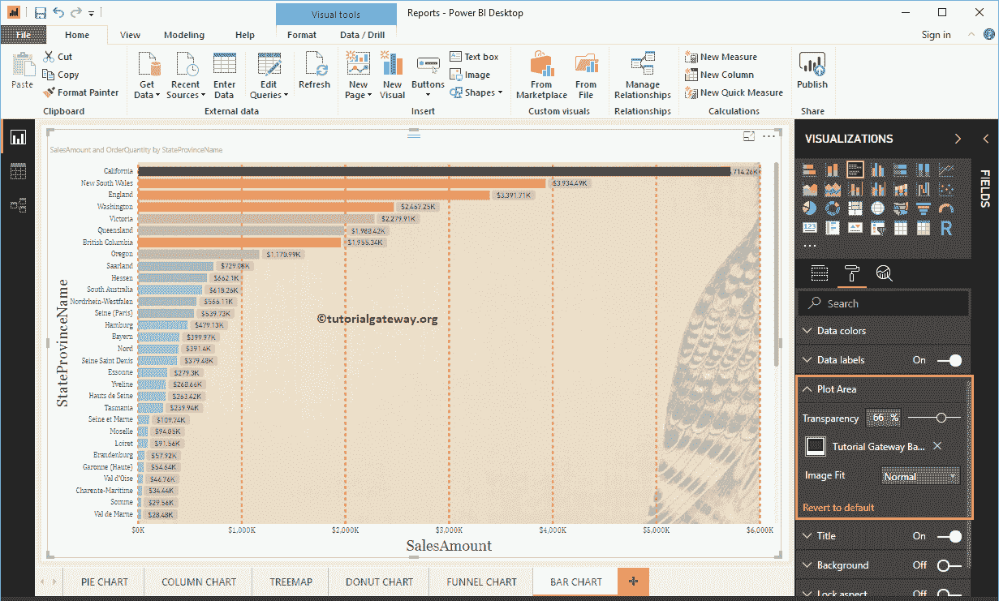

### PowerBI 标题中的条形图格式

通过将标题选项从打开切换到关闭，您可以禁用条形图标题。

从下面的截图中可以看到，我们将标题文本更改为按州/省名称列出的销售额和订单数量。我们还将字体颜色改为绿色，字体系列改为乔治亚，字体大小改为 23，标题对齐改为居中。如果你愿意，你也可以给标题加上背景色。

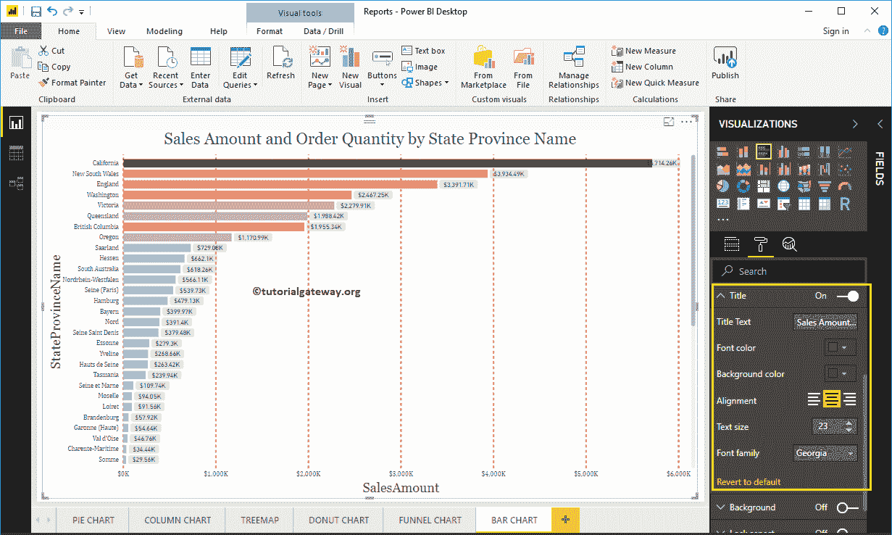

### 在 Power BI 中格式化条形图的背景色和边框

通过将“背景”选项切换为“开”，可以将背景颜色添加到条形图中。此外，您可以通过将“边框”选项从“关闭”切换到“打开”来将边框添加到条形图中。

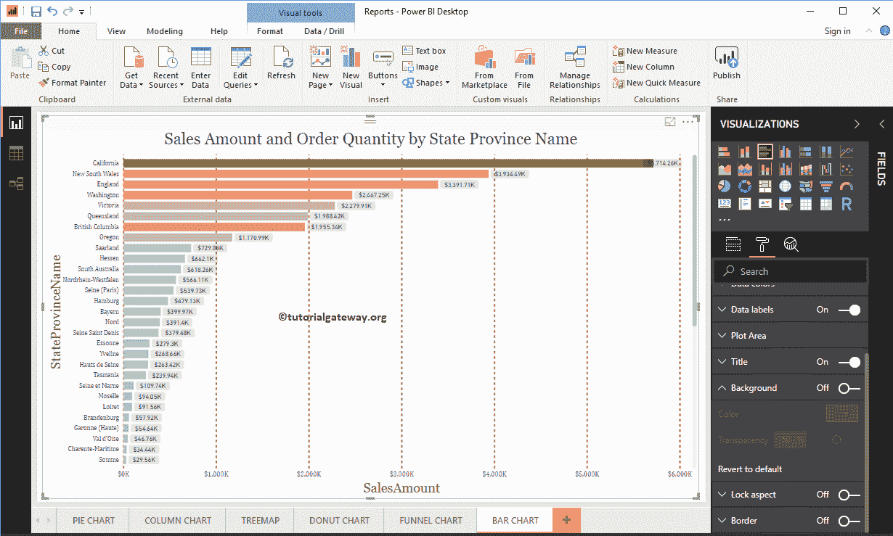