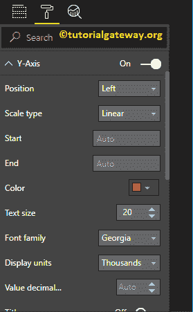

# 格式化 PowerBI 柱形图

> 原文：<https://www.tutorialgateway.org/format-power-bi-column-chart/>

如何用实例格式化 Power BI 柱形图？。格式化 Power BI 柱形图包括更改条形图颜色、标题位置、背景颜色以及添加数据标签等。

为了演示这些柱形图格式选项，我们将使用之前创建的柱形图。请参考 Power BI 文章中的[柱形图，了解创建](https://www.tutorialgateway.org/column-chart-in-power-bi/) [Power BI](https://www.tutorialgateway.org/power-bi-tutorial/) 柱形图的步骤。

## 如何格式化 PowerBI 柱形图

请单击“格式”按钮查看此柱形图的可用格式选项列表。

使用常规部分更改柱形图的 X、Y 位置、宽度和高度

### PowerBI 柱形图的 X 轴格式

将 X 轴选项从关闭切换到打开，以格式化 X 轴标签。以下是可用于格式化横轴

的选项列表

从下面的截图中可以看到，我们将颜色更改为砖红色，字体样式更改为乔治亚，文本大小更改为 20。最小类别、最大大小和内部填充选项用于更改栏宽

默认情况下，X 轴标题设置为关闭。但是您可以通过将“标题”切换到“打开”来启用它。让我将标题颜色更改为深灰色，字体样式更改为乔治亚，标题文本大小更改为 30

从下面的截图中，您可以看到我们对 X 轴所做的更改。

### Y 轴格式 PowerBI 柱形图

通过将 Y 轴选项从关闭切换到打开，可以格式化 Y 轴标签。以下是可用于格式化垂直轴或 Y 轴的选项列表。

从下面的截图中，您可以看到我们将 Y 轴标签颜色更改为砖红色，文本大小更改为 20，字体样式更改为乔治亚，显示单位更改为千。

默认情况下，Y 轴标题设置为关闭。但是您可以通过将“Y 轴”部分下的“标题”切换为“开”来启用它。让我将标题颜色更改为深灰色，字体样式更改为乔治亚，标题文本大小更改为 30。

通过将“网格线”选项从“开”切换到“关”，可以禁用网格线。

*   颜色:您可以更改网格线颜色。
*   描边宽度:用它来改变网格线的宽度。这里，我们将宽度从默认的 1 笔画更改为 2 笔画。
*   线条样式:选择实线、虚线等线条样式。

从下面的截图中，您可以看到我们到目前为止对 Y 轴所做的所有更改。

### 设置 PowerBI 柱形图数据颜色的格式

默认情况下，柱形图中的所有条形图都以单一默认颜色显示。此数据颜色部分用于更改条形颜色。

首先，将“显示所有选项”从“关闭”切换到“打开”。它允许您为每个小节选择单独的颜色。

出于演示目的，我们更改了所有现有条形的颜色。

### 为 PowerBI 柱形图启用数据标签

数据标签显示关于栏的信息。在这种情况下，它显示每个条形的销售额。要启用数据标签，请将数据标签选项切换为打开。

让我将颜色更改为绿色，将显示单位从自动更改为千，将位置更改为外端(条的顶部)，将文本大小更改为 12，并将字体系列更改为 DIN。您也可以通过启用显示背景

来为数据标签添加背景颜色

### 格式化 PowerBI 柱形图绘图区域

您可以使用“绘图区域”部分添加图像作为背景。出于演示目的，我们添加了一个图像作为绘图区域背景。

### 设置 PowerBI 柱形图标题的格式

请选择标题，并将选项从关闭更改为打开以显示柱形图标题。从下面的截图中可以看到，我们将标题文本更改为按颜色显示的销售额。接下来，将字体颜色设置为绿色，将字体样式设置为乔治亚，将字体大小设置为 23，将标题对齐居中。如果你愿意，你也可以给标题加上背景色。

### 在 Power BI 中为柱形图添加背景色

通过将“背景”选项切换为“开”，可以将背景颜色添加到柱形图中。出于演示的目的，我们添加了背景色。在这里，您也可以更改透明度百分比。

看起来不太好。让我通过单击恢复到默认选项来删除背景颜色

### 在 Power BI 中启用边框到柱形图

通过将边框选项从关闭切换到打开，可以将边框添加到柱形图。出于演示目的，我们启用了边框，并添加了深灰色作为边框颜色。

下图为

格式化后的柱状图