# 在PowerBI中格式化圆环图

> 原文：<https://www.tutorialgateway.org/format-donut-chart-in-power-bi/>

如何用例子格式化 Power BI 中的圆环图？。格式化圆环图包括启用图例、定位图例、标题位置、切片颜色和背景颜色等。

为了演示这些格式选项，我们将使用之前创建的圆环图。请参考 [Power BI 圆环图](https://www.tutorialgateway.org/power-bi-donut-chart/)文章，了解创建 [Power BI](https://www.tutorialgateway.org/power-bi-tutorial/) 圆环图的步骤。

## 如何在PowerBI中格式化圆环图

请单击“格式”按钮查看此圆环图的可用格式选项列表。

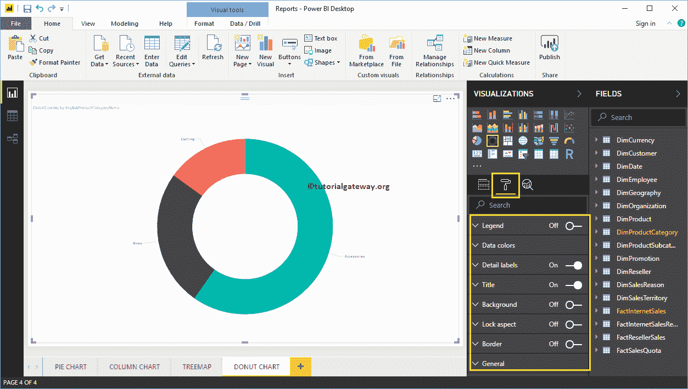

### PowerBI中环形图的格式图例

要显示或启用图例，请选择图例区域，并将选项从关闭切换到打开。从下面的截图中，你可以看到传奇

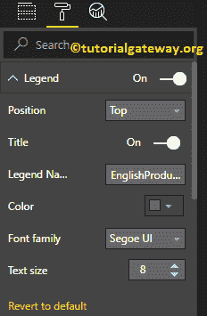

的可用属性列表

位置:使用下拉框根据您的要求更改圆环图图例位置。目前，我们正在选择顶部中心。

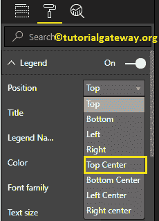

从下面的截图中可以看到，我们将图例标题更改为产品类别，将颜色更改为绿色，将字体系列更改为乔治亚，并将文本大小更改为 20。

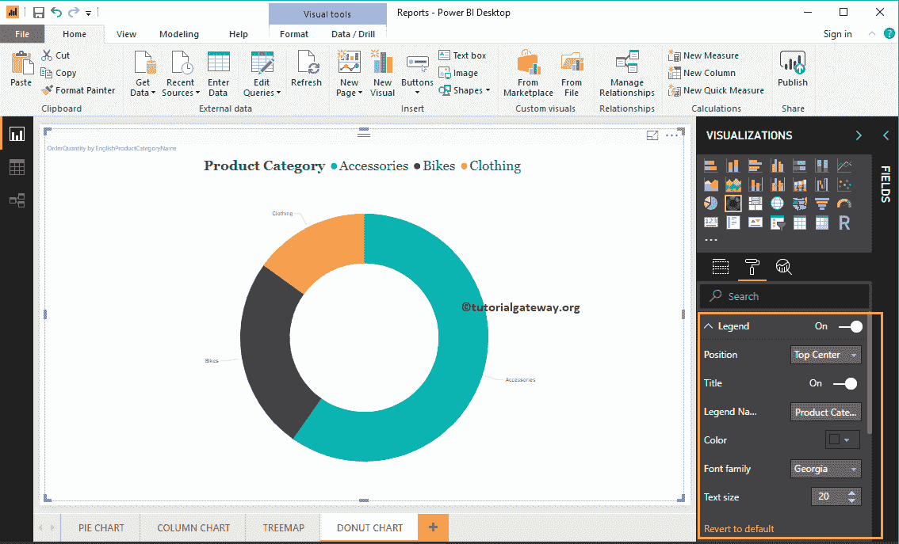

### 在 Power BI 中格式化圆环图的数据颜色

数据颜色对于更改切片颜色很有用。使用此部分将默认切片颜色更改为所需的颜色。

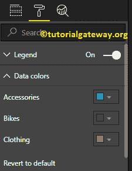

出于演示的目的，我们将自行车的颜色改为黄色。

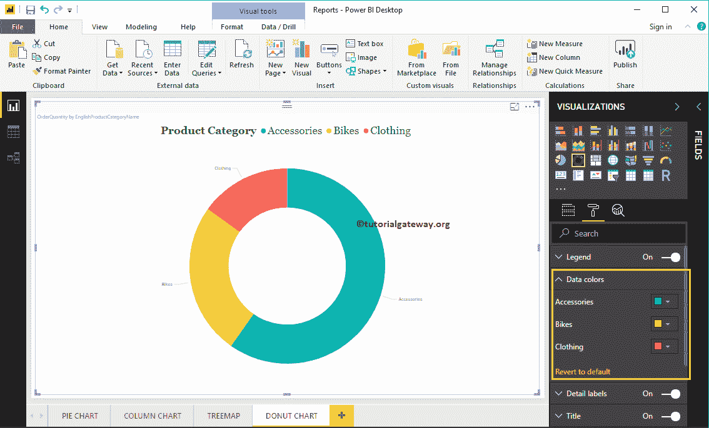

### PowerBI圆环图的格式详细信息标签

细节标签显示每个切片的信息。默认情况下，它将类别名称显示为标签。让我将标签样式更改为所有细节。这意味着每个切片都显示了关于类别名称、订单数量和合计百分比的信息。

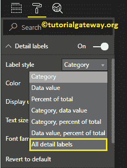

从下面的截图中可以看到，我们还将标签的颜色更改为绿色，并将字体大小更改为 18。您也可以将显示单位从自动更改为百万或万亿。

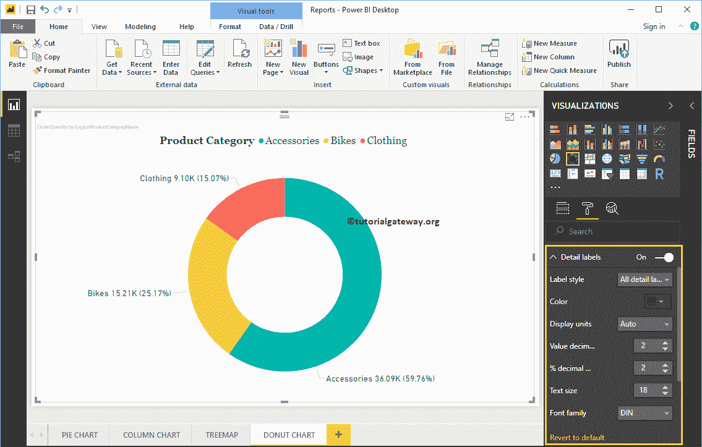

### 在PowerBI标题中格式化圆环图

要显示饼图标题，请选择标题，并将选项从关闭更改为打开。以下是可用于格式化圆环图标题的选项列表。

从下面的截图中可以看到，我们将标题文本更改为按产品类别名称的订单数量。接下来，字体颜色为砖红色，字体样式为牛腿，字体大小为 32，标题对齐居中。

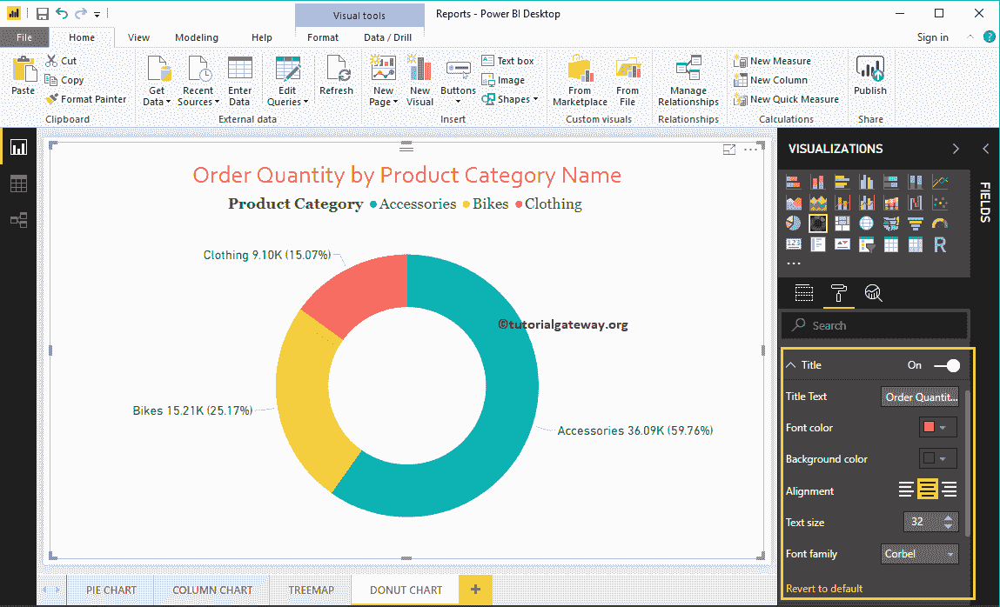

### 在 Power BI 中为圆环图添加背景色

您可以通过将“背景”选项从“关闭”切换到“打开”来为圆环图添加背景颜色。出于演示的目的，我们添加了背景色。在这里，您也可以更改透明度百分比。

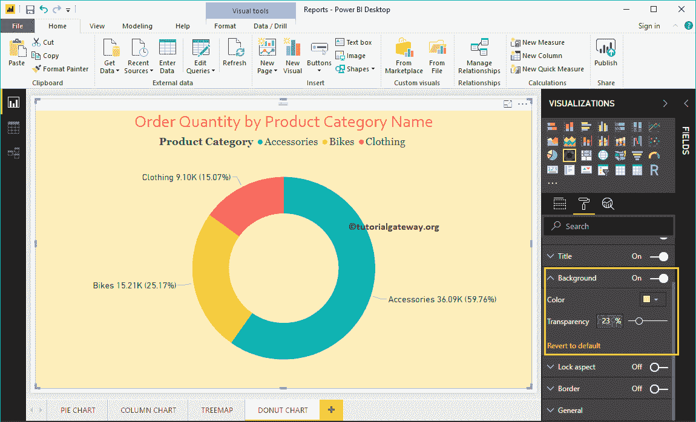

### 在 Power BI 中为圆环图添加边框颜色

将边框选项从关闭切换到打开允许您将边框添加到圆环图。出于演示目的，我们启用了它，并添加了黑色作为边框颜色。

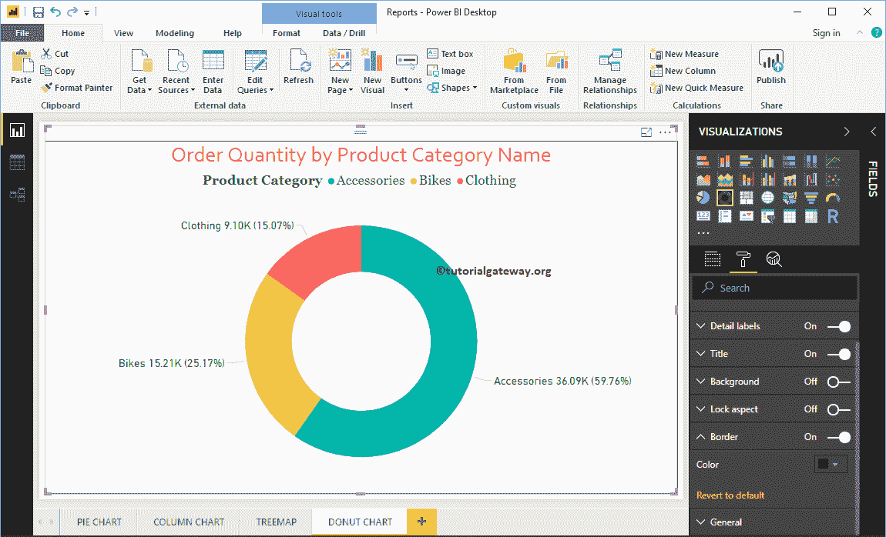

您可以使用此常规部分来更改圆环图的 X、Y 位置、宽度和高度

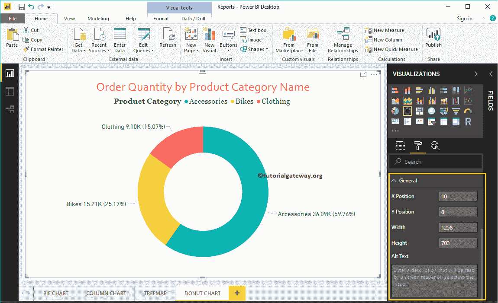