# PowerBI 中漏斗图的格式

> 原文：<https://www.tutorialgateway.org/format-funnel-chart-in-power-bi/>

如何用实例格式化电力 BI 中的漏斗图？。在 Power BI 中格式化漏斗图包括更改漏斗图标题、方框颜色、标题位置、数据标签和背景颜色等。

为了演示这些 Power BI 漏斗图格式选项，我们将使用之前创建的漏斗图。请参考 [Power BI 漏斗图](https://www.tutorialgateway.org/power-bi-funnel-chart/)文章，了解创建 [Power BI](https://www.tutorialgateway.org/power-bi-tutorial/) 漏斗图的步骤。

## PowerBI 中如何格式化漏斗图

请单击“格式”按钮查看此漏斗图可用的格式选项列表。

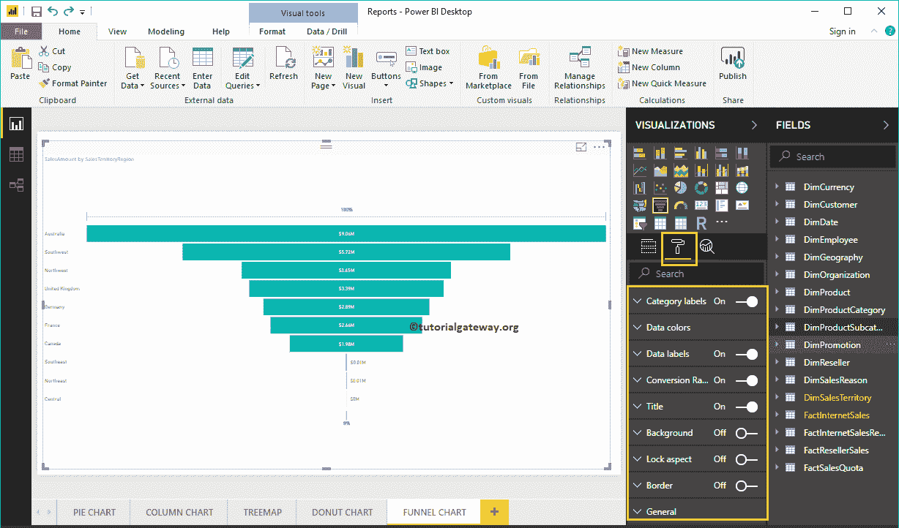

### 在 Power BI 中格式化漏斗图的类别标签

类别标签显示每个框的信息(此处为销售区域名称)。您可以使用此部分来设置这些标签的格式。从下面的截图中，您可以看到，我们将标签的颜色更改为砖红色，文本大小更改为 14，字体系列更改为牛腿。

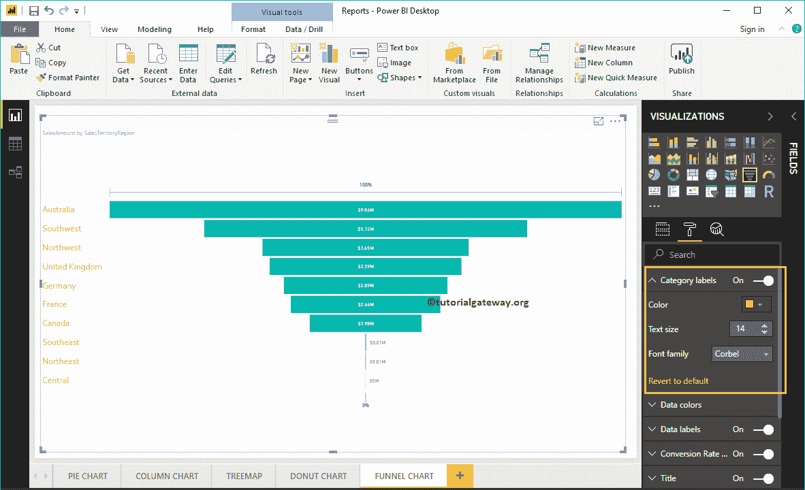

### 格式化 Power BI 漏斗图数据颜色

默认情况下，所有漏斗图框都以单一默认颜色显示。您可以使用此数据颜色部分来更改框颜色。

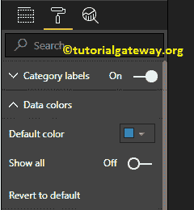

首先，将“显示所有选项”从“关闭”切换到“打开”。它允许你为每个盒子选择特定的颜色。

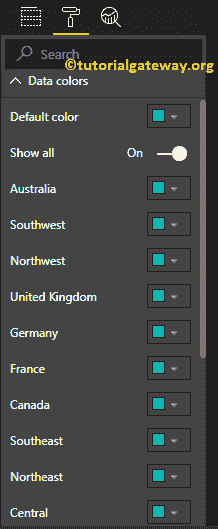

出于演示目的，我们更改了所有现有盒子的颜色。

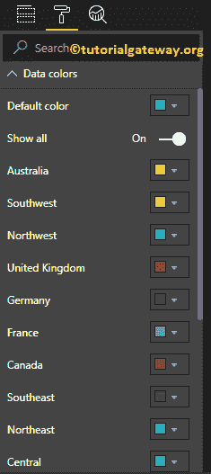

并且可以看到

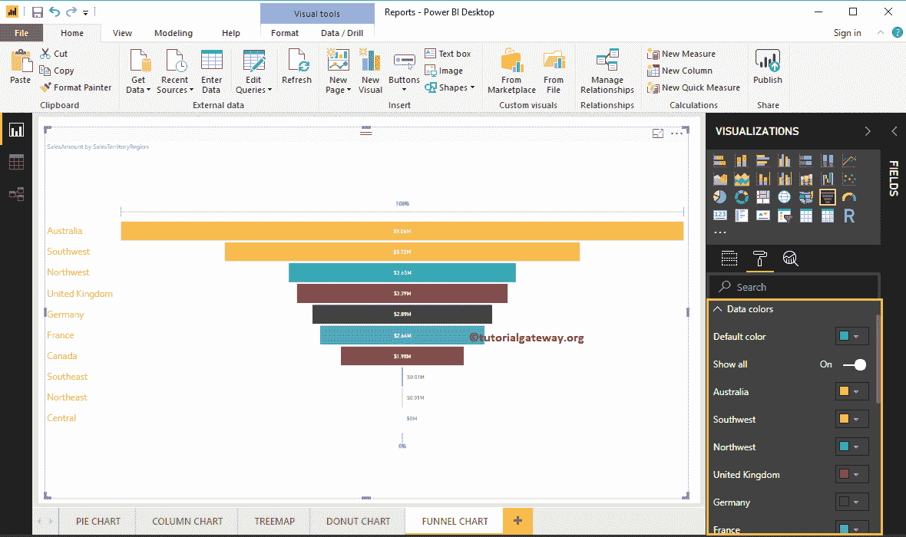

的结果

### 在 PowerBI 中格式化漏斗图的数据标签

数据标签显示了关于该条的指标信息(每个条的销售额)。

从下面的截图中可以看到，我们将数据标签颜色更改为深灰色，显示单位从自动更改为千。我们还将“标签位置”改为“内部居中”，将“文本大小”改为“20”，将“字体系列”改为“DIN”。

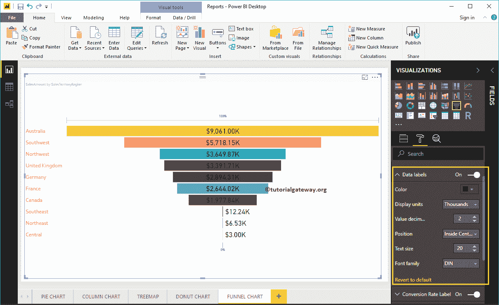

### 格式化 Power BI 漏斗图转化率标签

请选择兑换率标签，并将选项从关闭切换到打开。它在顶部显示 100%，在漏斗图底部显示 0%。

从下面的截图中可以看到，我们将颜色改为绿色，字体样式改为 DIN，字体大小改为 15。一般来说，您可以禁用此功能。

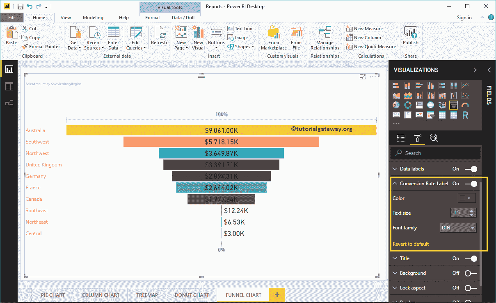

### 设置商务智能漏斗图标题的格式

通过将标题选项从打开切换到关闭，您可以禁用漏斗图的标题。

从下面的截图中可以看到，我们将标题文本更改为按销售区域地区列出的销售额。我们还将字体颜色改为绿色，字体样式改为牛腿，字体大小改为 27，标题对齐改为居中。如果你愿意，你也可以给标题加上背景色。

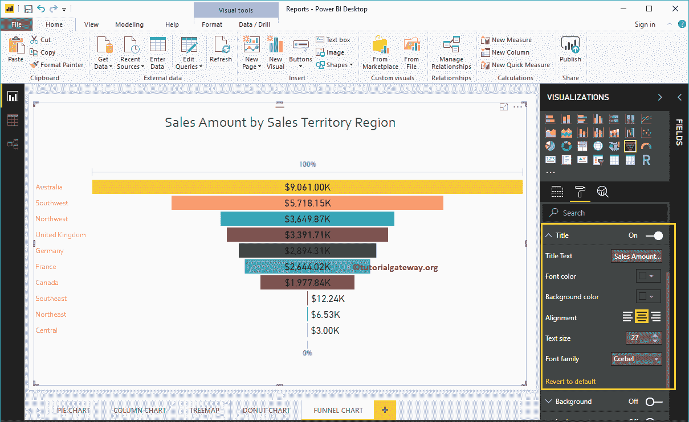

### 在 Power BI 中为漏斗图添加背景色

通过将“背景”选项切换为“开”，可以将背景颜色添加到漏斗图中。出于演示目的，我们正在启用此功能并添加背景色。在这里，您也可以更改透明度百分比。

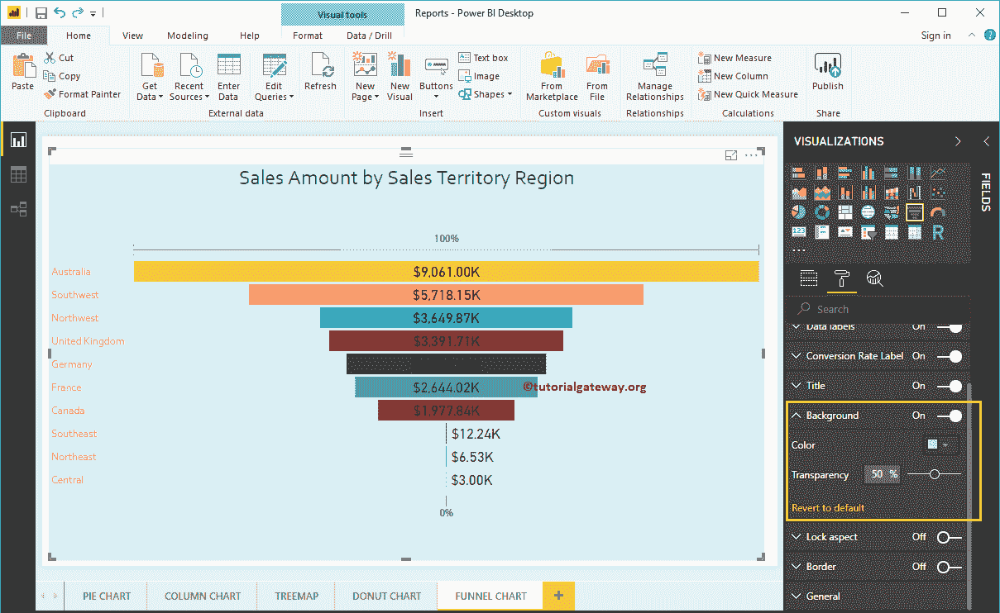

让我通过单击恢复为默认选项来移除背景颜色

### 在 Power BI 中为漏斗图添加边框

通过将边框选项从关闭切换到打开，可以将边框添加到漏斗图中。出于演示目的，我们启用了边框，并添加了黑色作为边框颜色。

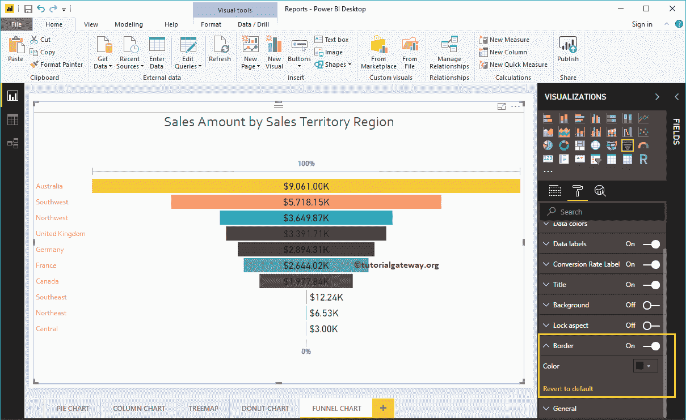

使用常规部分更改漏斗图的 X、Y 位置、宽度和高度

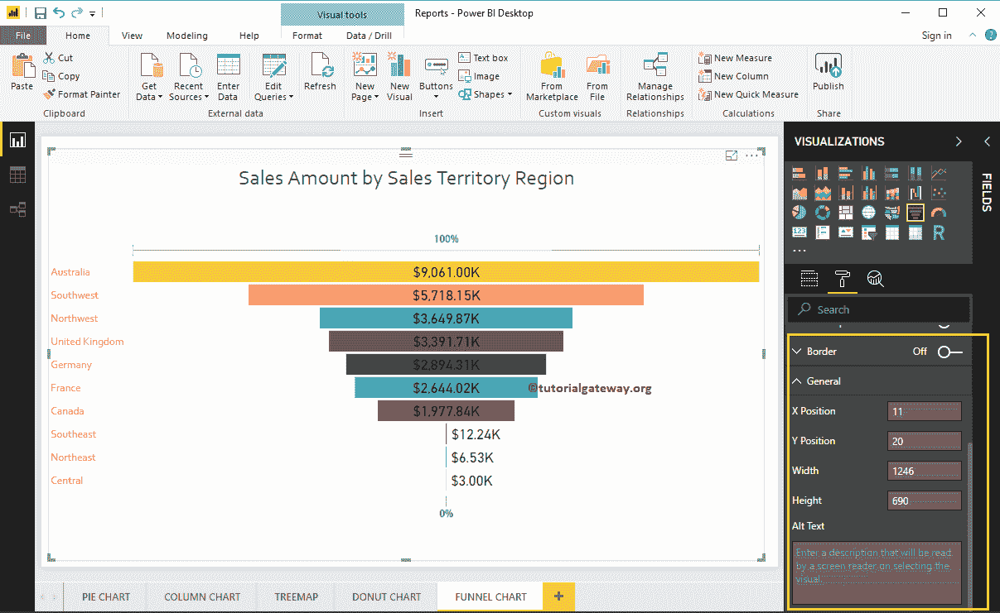

### PowerBI 漏斗图中的发散选项

如果在“颜色饱和度”字段中添加了任何有效的列，则可以使用此发散选项向漏斗图框中添加颜色。为了演示相同的内容，我们将销售金额添加到颜色饱和度

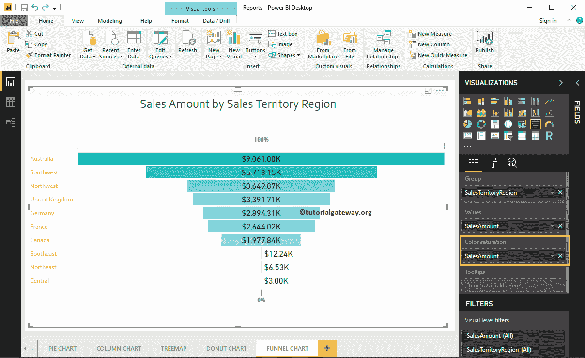

现在，您可以看到“数据颜色”部分下的“默认颜色”选项被“发散”选项替换。让我添加最小，中心和最大颜色。请记住，您还可以选择添加最小值、中心值和最大值。

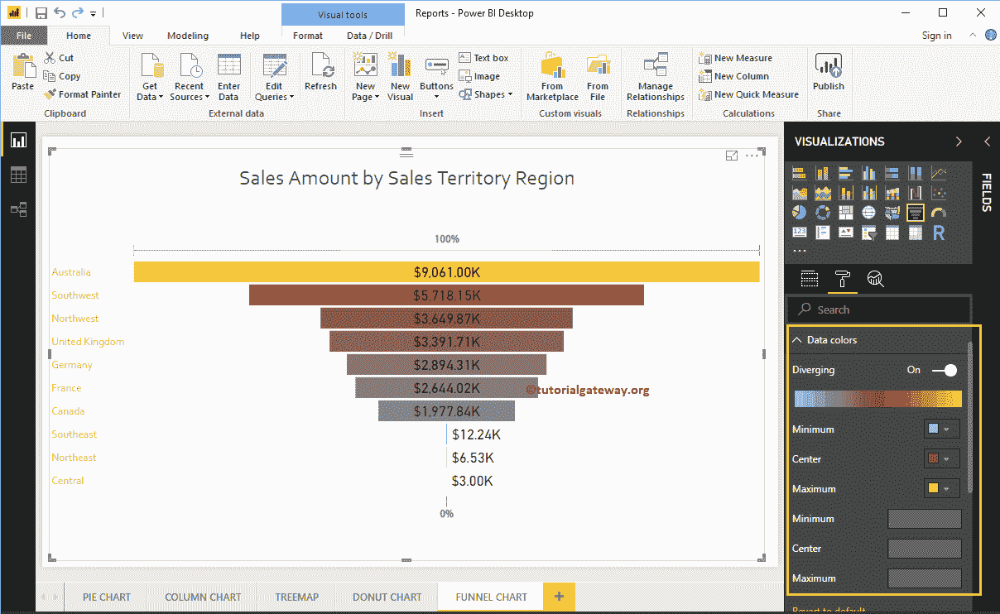