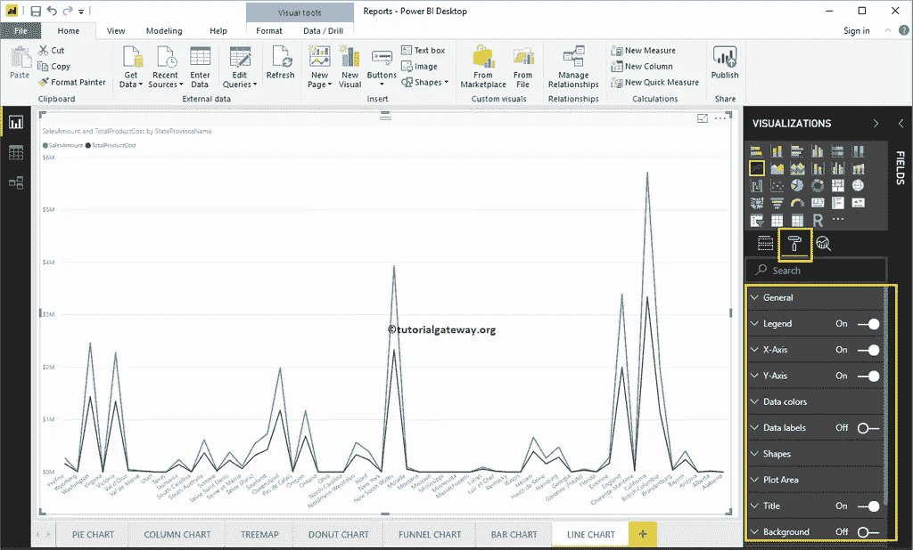

# 格式化 PowerBI 折线图

> 原文：<https://www.tutorialgateway.org/format-line-chart-in-power-bi/>

如何在 PowerBI 中格式化折线图？举例说明？。格式化 Power BI 折线图包括更改线条颜色、标题文本、标题位置、轴详细信息、数据标签和背景图像等。

为了演示这些 Power BI 折线图格式选项，我们使用之前创建的折线图。请参考[PowerBI 线图](https://www.tutorialgateway.org/create-a-power-bi-line-chart/)一文。

## PowerBI 中折线图的格式

请单击“格式”按钮查看该折线图可用的格式选项列表。

### 设置折线图格式常规设置

使用此常规部分更改折线图的 X、Y 位置、宽度和高度

### PowerBI 中折线图的格式图例

要显示或启用图例，请选择[PowerBI](https://www.tutorialgateway.org/power-bi-tutorial/) 图例区域，并将选项从关闭切换到打开。使用位置下拉框更改图例位置。

如您所见，我们将传奇头衔添加为金钱，传奇职位添加为顶级中心。我们还将颜色更改为砖红色，字体系列更改为乔治亚，文本大小更改为 20。

### PowerBI 中折线图的 X 轴格式

以下是可用于格式化水平轴或 X 轴的选项列表。从下面的截图中可以看到，我们将颜色改为深灰色，字体样式改为 Candara，文本大小改为 12。

默认情况下，X 轴标题设置为关闭，但您可以通过将标题切换为打开来启用它。让我将标题颜色更改为绿色，字体样式更改为乔治亚，字体大小更改为 20。

### 设置幂指数折线图的 Y 轴格式

以下是可用于格式化垂直轴或 Y 轴的选项列表。从下面的截图中，您可以看到我们将 Y 轴标签颜色更改为深灰色，文本大小更改为 15，字体样式更改为 Candara。

让我将刻度类型更改为日志。从下面的截图中，您可以看到它正在显示日志刻度。

默认情况下，Y 轴标题设置为关闭，但您可以通过将 Y 轴部分下的标题切换为打开来启用它。让我将标题颜色更改为绿色，标题文本大小更改为 20，字体系列更改为牛腿。

通过将“网格线”选项从“开”切换到“关”，可以禁用折线图网格线。

*   颜色:您可以更改网格线颜色。
*   描边宽度:用它来改变网格线的宽度。这里，我们将宽度从默认的 1 笔画更改为 2 笔画。
*   线条样式:选择线条样式，如实线、虚线和虚线。

### 设置 PowerBI 折线图数据颜色的格式

默认情况下，折线图将以默认颜色显示。让我将销售金额行颜色更改为砖红色，将总产品成本颜色更改为绿色。

### PowerBI 中折线图的数据标签格式

数据标签显示关于生产线的指标或价值信息(每个点的销售额)。我认为你不需要趋势的数据标签，但是你有一个选择。

从下面的截图中可以看到，我们启用了它来显示属性。

### 在 PowerBI 形状中格式化折线图

使用此部分更改线条或连接。

如下图所示，我们将笔画宽度(线宽)更改为 4，标记形状(连接点处的形状)更改为菱形，标记大小更改为 8。

无论您在上述步骤中做了什么更改，都会反映在这两条线上。但是，您有一个名为“自定义系列”的选项，如果启用此选项，您可以自定义单个线条。

### 格式化折线图绘图区

您可以使用此绘图区域部分添加图像作为折线图的背景。出于演示目的，我们添加了一个图像作为绘图区域背景。

### 设置 PowerBI 折线图标题的格式

通过将标题选项从打开切换到关闭，您可以禁用折线图的标题。

从下面的截图中可以看到，我们将标题文本更改为按州/省名称列出的销售额和产品总成本。接下来，我们还将字体颜色更改为绿色，字体系列更改为乔治亚，字体大小更改为 20，标题对齐更改为居中。如果需要，您也可以将背景颜色添加到标题中。

### 设置折线图的背景色和边框格式

通过将“背景”选项切换为“开”，可以将背景颜色添加到折线图中。此外，您可以通过将“边框”选项从“关闭”切换到“打开”来为折线图添加边框。

