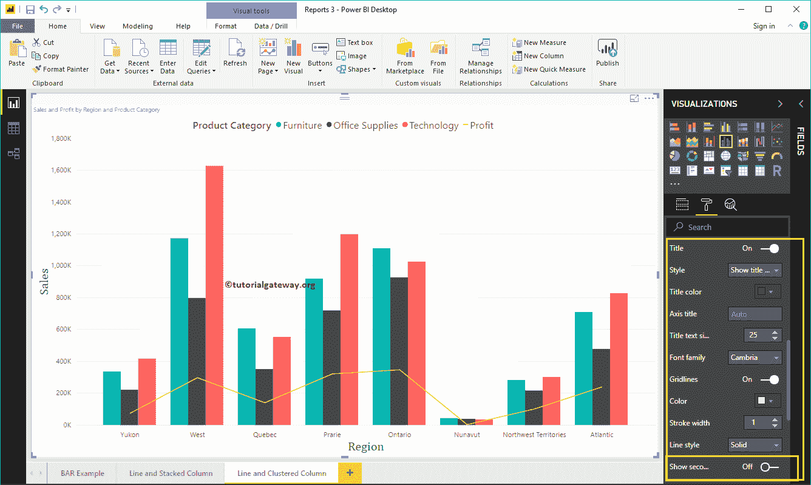

# 设置电源商业智能折线图和聚集柱形图的格式

> 原文：<https://www.tutorialgateway.org/format-power-bi-line-and-clustered-column-chart/>

如何用例子格式化 Power BI 折线图和聚类柱形图？。格式化 Power BI 折线图和聚集柱形图包括更改聚集柱形图的颜色、线条、标题位置、轴详细信息等。

为了演示折线图和聚集柱形图格式选项，我们将使用前面创建的折线图和聚集柱形图。请参考 [Power BI](https://www.tutorialgateway.org/power-bi-tutorial/) 中的[Power BI](https://www.tutorialgateway.org/line-and-clustered-column-chart-in-power-bi/)文章中的[折线图和聚集柱形图，以了解创建它所涉及的步骤。](https://www.tutorialgateway.org/line-and-clustered-column-chart-in-power-bi/)

## 如何格式化PowerBI折线图和聚类柱形图

请单击“格式”按钮，查看折线图和聚集柱形图中可用格式选项的列表。

### 格式化折线图和聚集柱形图常规设置

使用此常规部分更改[线](https://www.tutorialgateway.org/create-a-power-bi-line-chart/)和[聚集柱形图](https://www.tutorialgateway.org/clustered-column-chart-in-power-bi/)

的 X、Y 位置、宽度和高度

### Power BI 中折线图和聚集柱形图的格式图例

首先，我们使用位置下拉菜单将图例位置更改为顶部中心。接下来，我们将颜色更改为棕色，文本大小更改为 15。

### Power BI 中折线图和聚集柱形图的 X 轴格式

以下是可用于格式化 X 轴的选项列表。在这里，我们将颜色更改为棕色，并将文本大小更改为 14。

从上面的截图中可以看到，默认情况下，折线图和聚集柱形图的 X 轴标题设置为关闭。但是您可以通过将“标题”切换到“打开”来启用它。让我将标题颜色更改为绿色，字体样式更改为红色，字体大小更改为 25。

### 格式化折线图和聚集柱形图的 Y 轴

如您所见，我们将 Y 轴标签颜色更改为棕色，文本大小更改为 14，显示单位更改为千。

默认情况下，折线图和聚集柱形图 Y 轴标题设置为关闭，但您可以将标题切换为打开。让我将标题颜色更改为绿色，文本大小更改为 25，字体系列更改为 Cambria。

通过将折线图和聚集图网格线选项从打开切换到关闭，可以禁用网格线。

*   颜色:您可以更改网格线颜色。
*   描边宽度:用它来改变网格线的宽度。
*   线条样式:选择线条样式，如实线、虚线和虚线。

### 设置 Power BI 折线图和聚集柱形图数据颜色的格式

默认情况下，折线图和聚集柱形图将使用默认颜色填充聚集的列和线。为了演示的目的，让我把它们换一下。

### 设置 Power BI 折线图和聚集柱形图数据标签的格式

数据标签显示指标值(每个点的销售额和利润)。从下面的截图中可以看到，我们启用了数据标签，并将颜色更改为绿色，并将文本大小更改为 15。

### 在 Power BI 形状中格式化折线图和聚集柱形图

您可以使用此部分来更改线条或标记形状。通过启用“阴影区域”属性，可以共享 x 轴和直线之间的区域。接下来，我们将描边宽度(线条宽度)更改为 4，将连接类型更改为圆形，并将线条样式更改为实心。

通过启用“显示标记”属性，可以在每个点显示标记。在这里，我们将标记大小更改为 6。

### 格式化折线图和聚集柱形图绘图区域

使用此绘图区域属性，您可以添加自定义图像作为折线图和聚集柱形图的背景。出于演示目的，我们添加了一个图像作为绘图区域背景。

### 格式化折线图和聚集柱形图标题

如您所见，我们将字体颜色更改为绿色，字体系列更改为乔治亚，文本大小更改为 25，标题对齐方式更改为居中。如果需要，您也可以将背景颜色添加到标题中。

### 设置 Power BI 折线图和聚集柱形图背景色和边框的格式

通过将“背景”选项切换为“开”，可以将背景颜色添加到折线图和聚集柱形图中。出于演示目的，我们添加了透明度为 25%的淡黄色。

同样，通过将边框选项从关闭切换到打开，可以将边框添加到折线图和聚集柱形图。

