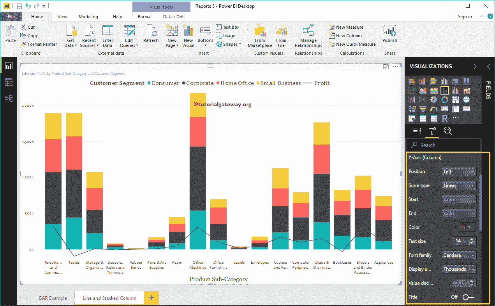

# 设置 PowerBI 折线图和堆叠柱形图的格式

> 原文：<https://www.tutorialgateway.org/format-power-bi-line-and-stacked-column-chart/>

如何用例子形成 Power BI 折线图和堆叠柱形图？。格式化 Power BI 折线图和堆叠柱形图包括更改线条、堆叠柱形图颜色、标题位置、轴详细信息等。

为了演示 Power BI 折线图和堆叠柱形图格式选项，我们将使用之前创建的折线图和堆叠柱形图。

请参考 Power BI 文章中的[折线图和堆叠柱形图，了解创建它所涉及的步骤。](https://www.tutorialgateway.org/line-and-stacked-column-chart-in-power-bi/)

## 如何格式化 PowerBI 折线图和堆叠柱形图

请单击“格式”按钮查看该折线图和堆积柱形图可用的格式选项列表。

### PowerBI 折线图和堆叠柱形图常规设置

使用此 [Power BI](https://www.tutorialgateway.org/power-bi-tutorial/) 通用部分更改[线](https://www.tutorialgateway.org/create-a-power-bi-line-chart/)和[堆叠柱形图](https://www.tutorialgateway.org/stacked-column-chart-in-power-bi/)的 X、Y 位置、宽度和高度。

### Power BI 中折线图和堆叠柱形图的格式图例

首先，我们使用位置下拉框将图例位置更改为顶部中心。接下来，我们将颜色更改为砖红色，字体系列更改为柬埔寨，文本大小更改为 16。

### PowerBI 中折线图和堆积柱形图的 X 轴

以下是可用于格式化 X 轴的选项列表。这里，我们将颜色更改为棕色，字体系列更改为 Candara，文本大小更改为 14。

从上面的截图中可以看到，默认情况下，折线图和堆叠柱形图的 X 轴标题设置为关闭。但是您可以通过将“标题”切换到“打开”来启用它。让我将标题颜色更改为绿色，字体样式更改为乔治亚，字体大小更改为 20。

### 设置 PowerBI 折线图和堆叠柱形图的 Y 轴格式

如您所见，我们将 Y 轴标签颜色更改为棕色，字体样式更改为 Candara，文本大小更改为 14，显示单位更改为千。

默认情况下，折线图和堆叠柱形图 Y 轴标题设置为关闭，但您可以通过将标题切换为打开来启用它。让我将标题颜色更改为绿色，文本大小更改为 24，字体系列更改为佐治亚。

通过将“网格线”选项从“开”切换到“关”，可以禁用折线图和堆积柱形图网格线。

*   颜色:您可以更改网格线颜色。
*   描边宽度:用它来改变网格线的宽度。
*   线条样式:选择线条样式，如实线、虚线和虚线。

从上面的截图可以看到，在 Y 轴下有一个选项叫做显示副轴。通过启用此功能，您还可以显示辅助 Y 轴。

### 设置 Power BI 折线图和堆叠柱形图数据颜色的格式

默认情况下，折线图和堆叠柱形图使用默认颜色填充堆叠的列和线。为了演示的目的，让我把它们换一下。

### 格式化折线图和堆叠柱形图的数据标签

数据标签显示指标值(组的销售额和每个点的利润)。从下面的截图中可以看到，我们启用了数据标签，并将颜色更改为白色。

### 在 Power BI 形状中格式化折线图和堆叠柱形图

您可以使用此部分来更改线条或标记形状。

从下面的截图中可以看到，我们将笔画宽度(线宽)更改为 4，将连接类型更改为斜角，并将线条样式更改为实线。

通过启用“显示标记”属性，可以在每个点显示标记。

首先，我们将标记形状(连接点形状)更改为菱形，标记大小更改为 7，标记颜色更改为白色。

### PowerBI 绘图区的折线图和堆叠柱形图

使用此绘图区域属性，可以添加自定义图像作为折线图和堆叠柱形图的背景。出于演示目的，我们添加了一个图像作为绘图区域背景。

### 设置 Power BI 折线图和堆叠柱形图标题的格式

如您所见，我们将字体颜色更改为绿色，字体系列更改为乔治亚，文本大小更改为 22，标题对齐方式更改为居中。如果需要，您也可以将背景颜色添加到标题中。

### 设置折线图和堆积柱形图背景色和边框的格式

通过将“背景”选项切换为“开”，可以将背景颜色添加到折线图和堆积柱形图中。出于演示目的，我们添加了透明度为 25%的天蓝色。

同样，通过将“边框”选项从“关闭”切换到“打开”，可以将边框添加到折线图和堆积柱形图中。

