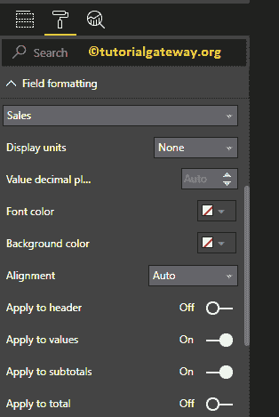

# 格式化 PowerBI 矩阵

> 原文：<https://www.tutorialgateway.org/format-power-bi-matrix/>

如何用例子格式化 PowerBI 矩阵报告？。Power BI 格式矩阵包括更改矩阵网格颜色、行格式、列格式、行和列颜色、矩阵标题文本和背景颜色等。

为了演示这些 Power BI 矩阵格式选项，我们将使用之前创建的矩阵。请参考[在 Power BI](https://www.tutorialgateway.org/create-a-matrix-in-power-bi/) 中创建矩阵一文，了解创建 [Power BI](https://www.tutorialgateway.org/power-bi-tutorial/) 矩阵的步骤。

## 如何格式化 PowerBI 矩阵

请单击“格式”按钮，查看 Power BI 中可用的矩阵格式选项列表。

### 格式化 PowerBI 矩阵常规设置

使用此常规部分更改矩阵的 X、Y 位置、宽度和高度

### 格式 PowerBI 矩阵样式

从下面的截图，你可以看到样式列表，可用于样式这个矩阵。请根据您的要求选择任何款式。

现在，我们从下拉列表中选择交替行选项。它添加了可选的行颜色，并将黑色添加到标题、小计和总计中。

以下是可用于格式化 PowerBI 矩阵网格的选项列表。

*   垂直网格:将此属性从关闭切换到打开将垂直网格添加到矩阵。除了启用垂直线来分隔每一列之外，别无他法。
*   水平网格:添加水平网格。除了启用水平线来分隔每行之外，别无他法。
*   水平网格颜色:更改矩阵水平网格的颜色。
*   水平网格厚度:矩阵水平网格线宽度
*   行填充:行与行之间的空间。

从下面的截图中可以看到，w 将网格颜色改为金色，网格厚度改为 2，行填充改为 10

*   轮廓颜色:标题和行组后的颜色。我们使用默认的绿色作为轮廓颜色。
*   轮廓粗细:矩阵线宽。我们将线条改为 4
*   文本大小:表值的字体大小。让我把文本大小改为 9

从下面的截图中可以看到，我们启用了垂直网格并分配了一些随机的颜色。

*   垂直网格颜色:更改矩阵垂直网格的颜色。
*   垂直网格厚度:矩阵垂直网格线宽度或笔画

为了调整空间，我们在 values 部分下重命名了列名。如您所见，我们将销售金额名称更改为销售，将产品总成本更改为成本

### 在 Power BI 中格式化矩阵的列标题

本节将更改标题颜色。从下面的截图中可以看到，我们将字体颜色改为白色，背景颜色改为绿色。接下来，将“字体系列”设置为“圆形”，将“轮廓”设置为“顶部+底部”(将轮廓添加到页眉的顶部和底部)，将“文本大小”设置为 15，并将页眉文本对齐居中。

### 在 Power BI 中格式化矩阵的行标题

此部分用于更改或格式化行标题部分。这里，我们将字体颜色更改为白色，背景颜色更改为红色，轮廓更改为顶部+底部(轮廓添加到每行的顶部和底部)，字体系列更改为坎布里亚，文本大小更改为 15，文本对齐方式更改为居中。

从上面的截图中可以看到，虽然我们更改了所有行的背景色(行标题)，但是只有总背景色发生了变化。这是因为我们将在下一步中解释的带状行样式属性

### 幂指矩阵的格式值

您可以使用此部分更改矩阵值。从下面的截图中可以看到，我们更改了偶数行和奇数行的字体颜色和背景颜色。

带状行样式:默认情况下，它设置为“开”。这意味着行标题颜色将与其余行字段相同。

让我把这个关掉。它将行标题背景颜色更改为紫色。这是因为，我们在上面的步骤中应用了这种颜色，即

行标题部分

在行上显示:启用此选项显示行上的总数

如您所见，我们删除了轮廓并将字体更改为坎布里亚，文本大小为 13

### 幂商业智能中矩阵的分类汇总格式

使用此分类汇总部分更改分类汇总的文本和背景颜色。通过将行分类汇总、列分类汇总切换为关闭，可以完全删除总计。

### PowerBI 中矩阵的总计格式

使用此总计部分更改总计的文本和背景颜色。正如您从下面的截图中看到的，我们将总计字体颜色更改为白色，背景颜色更改为紫色，字体系列更改为红色，文本大小更改为 14。

应用于标签:通过将此选项切换为“开”，将背景色应用于合计的标题。可以看到，Power Bi 更改了【Total】

一个表头的文字背景色

### 设置商务智能矩阵格式–字段格式

使用此部分设置矩阵中单个列的格式。

例如，您可以使用此部分为一列指定完全不同的颜色。这里，我们选择销售。

出于格式化 Power BI 矩阵演示的目的，我们仅将此栏的背景颜色更改为粉色。

### 格式化 PowerBI 矩阵–条件格式

使用此部分可以格式化矩阵中的度量列(数值)。例如，为一个完整的列添加背景色，或者添加数据条等。我们将单独写一篇文章来解释这些设置

### 格式化 PowerBI 矩阵标题

通过将矩阵选项从关闭切换到打开，可以启用矩阵标题。

从下面的截图中，您可以看到我们添加了标题文本，如按产品颜色和职业列出的销售额与产品总成本。接下来，我们将字体颜色更改为绿色，字体系列更改为乔治亚，文本大小更改为 25，标题对齐方式更改为居中。如果需要，您也可以将背景颜色添加到矩阵标题中。

### 设置商务智能矩阵背景色和边框的格式

通过将“背景”选项切换为“开”，可以向矩阵添加背景颜色。为了演示格式矩阵，我们添加了透明度为 34%的天空淡黄色。

同样，通过将边框选项从关闭切换到打开，可以将边框添加到矩阵中。

