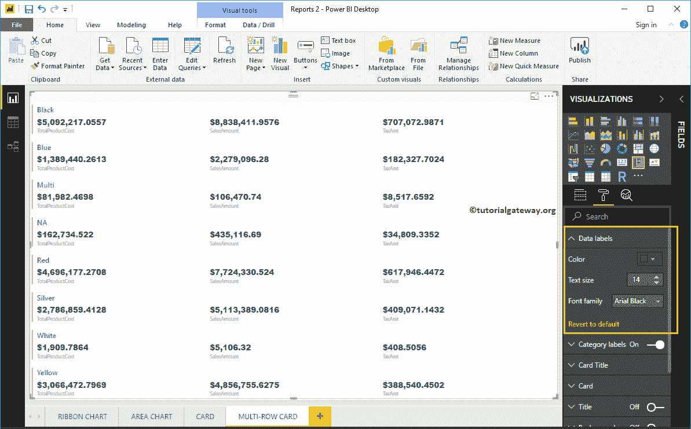

# 格式化PowerBI 多行卡

> 原文：<https://www.tutorialgateway.org/format-power-bi-multi-row-card/>

如何用实例格式化 Power BI 多排卡？。格式化 Power BI 多行卡片包括数据标签、类别标签颜色、启用图表标题、格式化卡片、背景颜色、位置等。

为了演示这些 Power BI 多行卡格式选项，我们将使用之前创建的多行卡。请参考[Power BI](https://www.tutorialgateway.org/create-a-multi-row-card-in-power-bi/)文章中的多行卡片，了解创建它所涉及的步骤。

## 如何格式化PowerBI 多排卡

请单击“格式”按钮查看此多行卡可用的格式选项列表。

### 在PowerBI中格式化多行卡的数据标签

数据标签显示指标值(销售金额、订单数量或产品总成本)。从下面的 [Power BI](https://www.tutorialgateway.org/power-bi-tutorial/) 截图中可以看到，我们将数据标签颜色改为绿色，文本大小改为 14，字体系列改为 Arial Black。

### 格式化多行卡片的类别标签

类别标签是指我们在多行卡中使用的指标值的列名。从下面的截图中，您可以看到，我们将类别标签的颜色更改为棕色，并将文本大小更改为 15。

### PowerBI 多行卡的格式卡标题

卡片标题是指多行卡片组名称。从下面的截图中，你可以看到，我们将颜色改为金色，字体系列改为坎布里亚，文本大小改为 25。

### 多行卡的格式卡

使用此部分更改单个卡的外观。以下是此卡部分中可用的选项列表。

轮廓属性对于启用单个卡片周围的线条很有用。从下面的截图中可以看到，我们启用了“仅底部轮廓”。

接下来，我们更改了一条线的颜色和一条线的权重(笔画宽度)

显示栏是指左侧的栏。我们将颜色改为红色，条形厚度改为 6，填充(空间)改为 18。

### 格式化 Power BI 多行卡标题

通过将标题选项从关闭切换到打开，您可以启用多行卡片的标题。

从下面的截图中，您可以看到，我们将标题文本更改为按产品颜色销售。接下来，我们将字体颜色改为粉色，标题对齐改为居中，字体系列改为乔治亚，文本大小改为 25。

### 格式化PowerBI 多行卡背景色

您可以通过将“背景”选项切换为“开”来为多行卡片添加背景颜色。出于多行演示的目的，我们添加了一些透明度为 30%的随机颜色。

同样，您可以通过将“边框”选项从“关闭”切换到“打开”来将边框添加到多行卡片。

### 格式化多行卡常规设置

使用常规部分更改多行卡片的 X、Y 位置、宽度和高度。目前，我们让他们保持原样。

