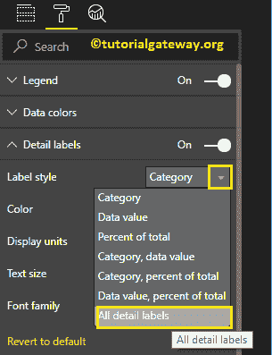

# 设置 PowerBI 饼图的格式

> 原文：<https://www.tutorialgateway.org/format-power-bi-pie-chart/>

如何用例子格式化 Power BI 饼图？。格式化 Power BI 饼图包括更改图例和标题位置、切片和背景颜色等。

为了演示这些格式选项，我们将使用之前创建的饼图。请参考 Power BI 文章中的[饼图，了解创建](https://www.tutorialgateway.org/pie-chart-in-power-bi/) [Power BI](https://www.tutorialgateway.org/power-bi-tutorial/) 饼图的步骤。

## 如何格式化 PowerBI 饼图

请单击“格式”按钮查看此饼图的可用格式选项列表。

### 幂双饼图的格式图例

要显示图例，请选择图例区域并将选项从关闭更改为打开。从下面的截图中，可以看到传说

图例位置:使用下拉框根据您的要求更改饼图图例位置。目前，我们正在选择顶部中心。

标题:打开显示图例标题，即英语国家地区名称
图例名称:您可以更改图例名称。在这里，我们正在更改其国家名称
颜色:使用颜色托盘为图例

添加颜色

从下面的截图可以看到，我们把字体家族改成了 Comic Sans，字体大小改成了 14

### 设置 PowerBI 饼图的数据颜色格式

数据颜色意味着更改切片颜色。使用此部分将默认切片颜色更改为所需的颜色。

出于演示目的，我们将法国色改为紫色。

### 设置 PowerBI 饼图的详细信息标签的格式

细节标签也称为数据标签。使用此部分格式化切片信息

标签样式:默认情况下，它将类别(列值)显示为标签。在这里，我们将其更改为所有详细信息标签。这意味着每个切片都显示了关于“归档名称”、“销售金额”和“合计百分比”的信息。

让我把标签的颜色改为绿色。您也可以将显示单位从自动更改为百万或万亿。

我们将总额和总额百分比的十进制值更改为 2，字体系列更改为漫画无，文本大小更改为 12

从下面的截图中，您可以看到我们到目前为止所做的所有更改。

### 功率双饼图的格式标题

要显示饼图标题，请选择标题，并将选项从关闭更改为打开。

从下面的截图中可以看到，我们将标题文本、颜色、字体样式、字体大小和标题对齐方式改为居中

### 在 Power BI 中为饼图添加背景色

通过将“背景”选项切换到“开”，可以将背景颜色添加到饼图中。出于演示的目的，我们添加了背景色。在这里，您也可以更改透明度百分比。

### 在 Power BI 中为饼图添加边框颜色

通过将“边框”选项切换到“开”，可以将边框添加到饼图中。出于演示目的，我们添加绿色作为边框颜色。

使用常规部分更改饼图的 X、Y 位置以及宽度和高度

