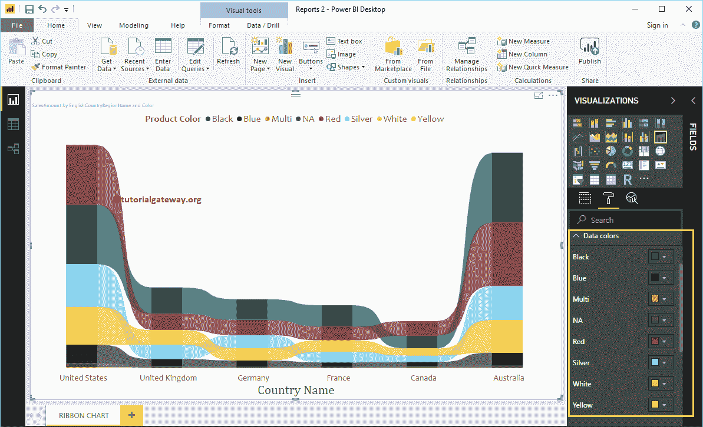

# 设置商务智能功能区图表的格式

> 原文：<https://www.tutorialgateway.org/format-power-bi-ribbon-chart/>

如何用例子格式化 Power BI 带状图？。格式化 Power BI 功能区图表包括更改功能区颜色、功能区图表标题文本、标题位置等。

为了演示 Power BI 功能区图表格式选项，我们将使用之前创建的功能区图表。请参考 Power BI 文章中的[带状图，了解创建](https://www.tutorialgateway.org/create-a-ribbon-chart-in-power-bi/) [Power BI](https://www.tutorialgateway.org/power-bi-tutorial/) 带状图的步骤。

## 如何格式化电力商业智能带状图

请单击“格式”按钮查看此功能区图表可用的格式选项列表。

### 格式化功能区图表常规设置

使用此常规部分更改带状图的 X、Y 位置、宽度和高度

### 格式化电源 BI 功能区图表图例

要显示或启用图例，请选择图例区域，并将选项从关闭切换到打开。

从下面的截图中可以看到，我们将图例标题更改为产品颜色，图例位置更改为顶部中心。我们还将颜色改为棕色，字体系列改为 Candara，文本大小改为 17。

### 在电力商业智能中格式化带状图的 X 轴

以下是可用于格式化功能区图表水平轴或 X 轴的选项列表。从下面的截图中可以看到，我们将颜色改为棕色，字体样式改为 Candara，文本大小改为 20。

默认情况下，功能区图表 X 轴标题设置为关闭，但您可以通过将标题切换为打开来启用它。让我将标题颜色更改为绿色，字体样式更改为红色，文本大小更改为 30。

### 格式化功能区图表数据颜色

默认情况下，功能区图表将为所有功能区选择默认颜色。但是，您可以根据自己的要求进行更改。

让我换几个缎带颜色给你看看区别。

### 在 Power BI 中格式化带状图的数据标签

功能区图表数据标签在条形图中显示指标值(每个组的销售额)。从下面的截图中可以看到，我们为此功能区图表启用了数据标签，并将颜色更改为白色。

### 格式化功能区图表绘图区

使用此绘图区域属性，可以添加自定义图像作为功能区图表的背景。出于演示目的，我们添加了一个图像作为绘图区域背景。

### 格式化电源 BI 功能区图表功能区

以下是可用于格式化功能区的选项列表。

从下面的截图中，您可以看到，我们将间距属性更改为 10(每个功能区之间的间距)并将透明度更改为 52%(条形之间或国家之间的功能区间距)。

### 电源商业智能功能区图表标题

使用此部分根据您的要求设置功能区图表标题的格式。

从下面的截图中可以看到，我们将标题文本更改为按国家和颜色列出的销售额。接下来，我们将字体颜色改为绿色，字体系列改为坎德拉，字体大小改为 27，标题对齐改为居中。如果你愿意，你也可以给标题加上背景色。

### 用高级商务智能背景色和边框格式化功能区图表

通过将“背景”选项切换为“开”，可以将背景颜色添加到功能区图表中。为了演示带状图，我们添加了透明度为 38%的浅黄色。

同样，您可以通过将“边框”选项从“关闭”切换到“打开”来向功能区图表添加边框。

