# 设置商务智能散点图的格式

> 原文：<https://www.tutorialgateway.org/format-power-bi-scatter-chart/>

如何用例子格式化 PowerBI 散点图？。设置散点图格式包括更改散点图(圆形)、颜色、散点图标题文本、标题位置、X 轴和 Y 轴详细信息、数据颜色和背景图像等。

为了演示这些散点图格式选项，我们将使用之前创建的散点图。请参考 Power BI 文章中的[散点图，了解创建](https://www.tutorialgateway.org/scatter-chart-in-power-bi/) [Power BI](https://www.tutorialgateway.org/power-bi-tutorial/) 散点图的步骤。

## 如何格式化 PowerBI 散点图

请单击“格式”按钮查看此散点图可用的格式选项列表。

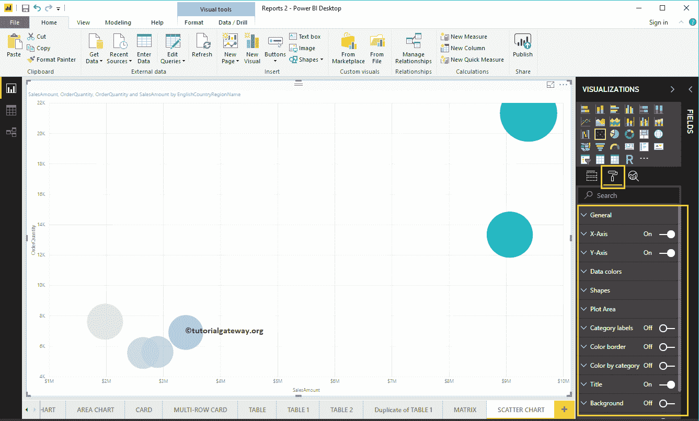

### 设置 PowerBI 散点图的格式常规设置

使用此常规部分更改散点图的数据量、图表响应性、X、Y 位置、宽度和高度。

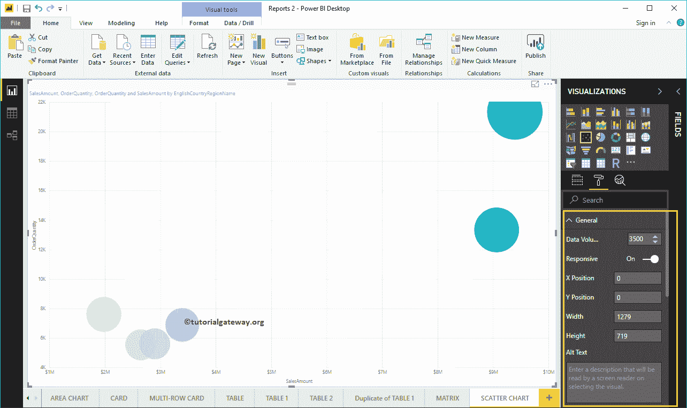

### PowerBI 中散点图的 X 轴格式

以下是可用于格式化水平轴或 X 轴的选项列表。在这里，您可以提到起始值和结束值。

从下面的截图中可以看到，我们将颜色更改为棕色，文本大小更改为 19，字体系列更改为 DIN。

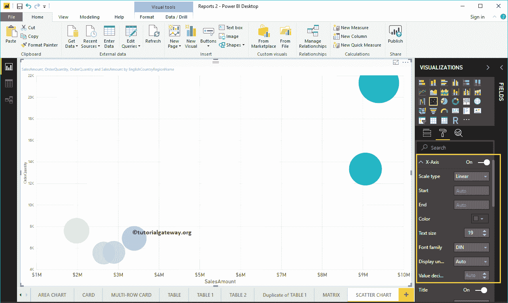

让我将轴标题从销售额更改为销售额，标题颜色更改为绿色，字体样式更改为红色，字体大小更改为 25。

通过将散点图网格线选项从打开切换到关闭，可以禁用网格线。

*   颜色:您可以更改网格线颜色。
*   描边宽度:用它来改变网格线的宽度。
*   线条样式:选择线条样式，如实线、虚线和虚线。

这里，我们将颜色改为金色，线条样式改为虚线。

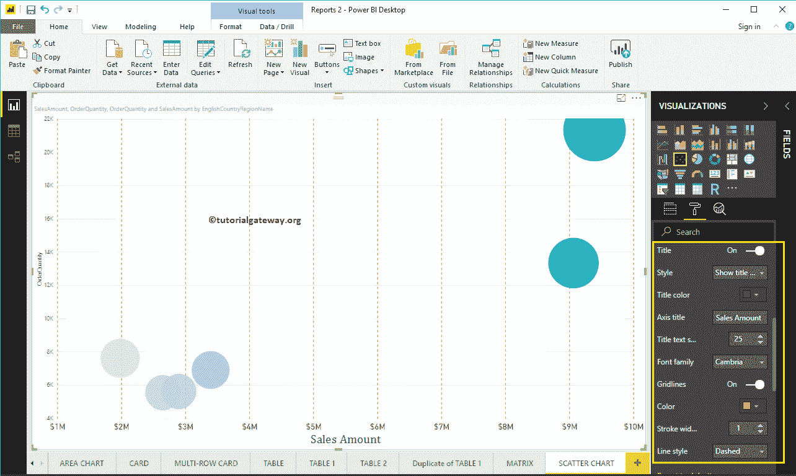

### PowerBI 散点图的 Y 轴格式

如您所见，我们将 Y 轴的起始值更改为 2000，结束值更改为 25000，标签颜色更改为棕色，文本大小更改为 18。

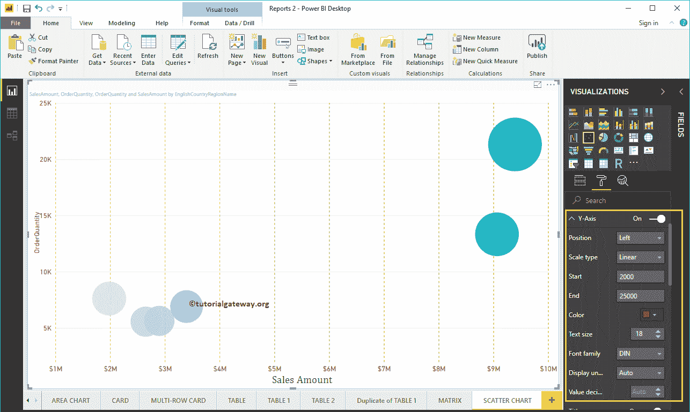

让我将 Y 轴标题从订单数量更改为订单数量，标题颜色更改为绿色，文本大小更改为 24，字体系列更改为柬埔寨。这里，这里，我们还将网格线颜色改为金色，线条样式改为虚线。

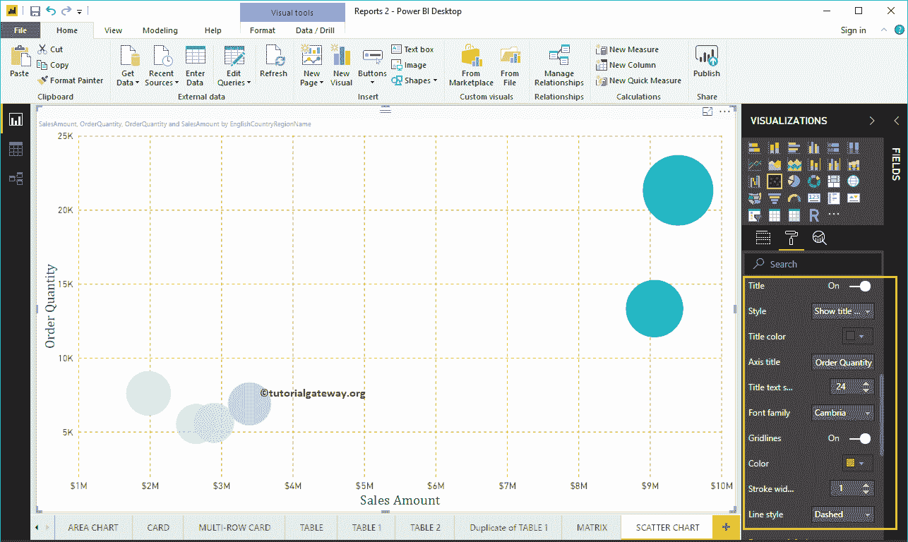

### 设置商务智能散点图数据颜色的格式

当我们创建这个散点图时，我们添加了销售额作为颜色饱和度，这就是为什么我们在数据颜色下看到发散选项。请根据您的要求更改最小、中心和最大颜色。

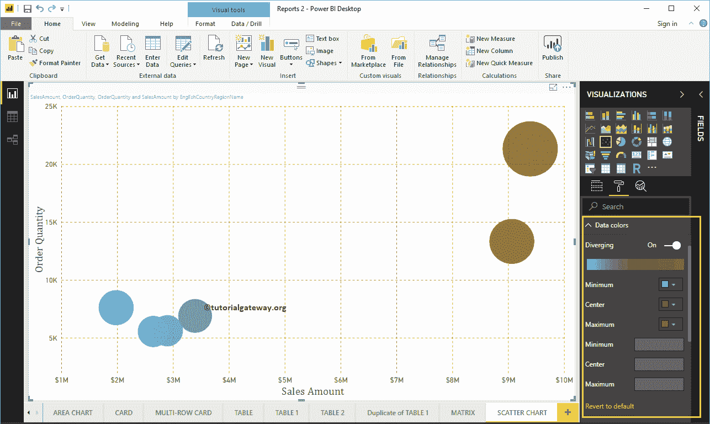

### 在幂 BI 形状中格式化散点图

使用此部分更改散点图默认圆。

从下面的截图中可以看到，出于演示目的，我们将标记形状更改为菱形。

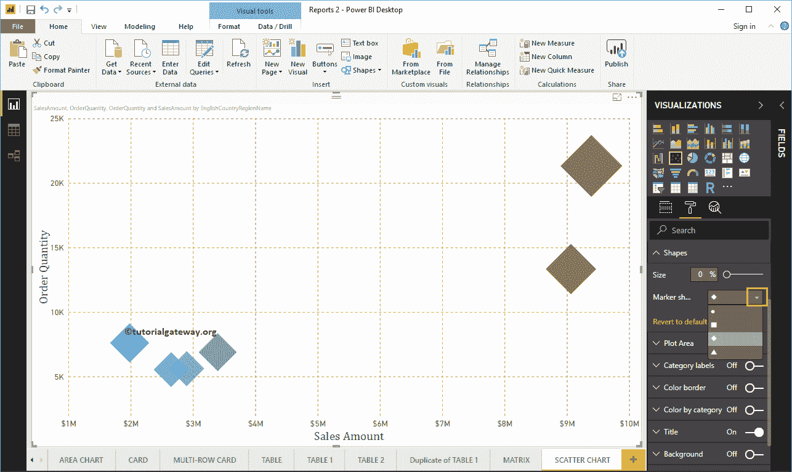

### 在 PowerBI 绘图区格式化散点图

使用此绘图区域属性，您可以添加自定义图像作为散点图的背景。出于演示目的，我们添加了一个图像作为绘图区域背景。

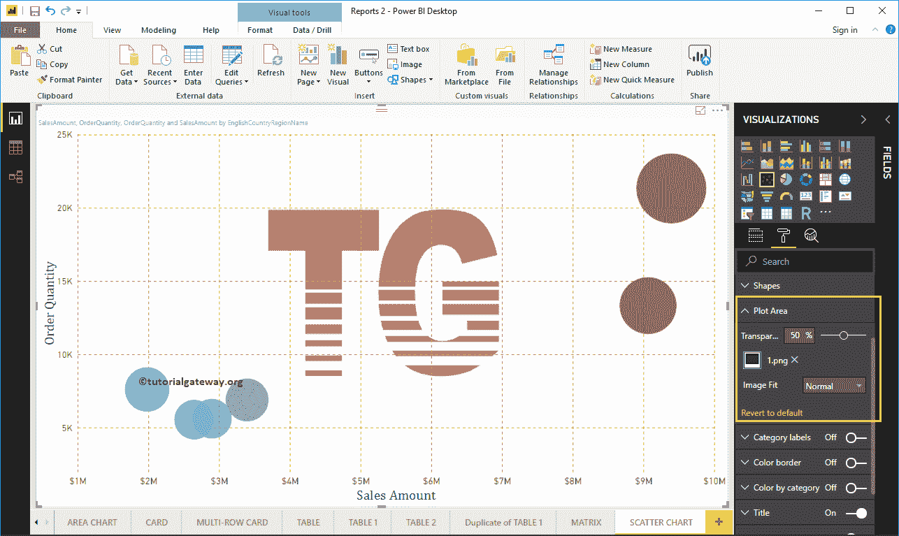

### 设置商务智能散点图类别标签的格式

类别标签表示代表每个圆的名称。通过将类别标签选项从关闭切换到打开，您可以启用这些标签。

从下面的截图中，你可以看到，我们将颜色改为紫色，文本大小改为 15，字体系列改为 DIN。如果你愿意，你也可以添加背景色。

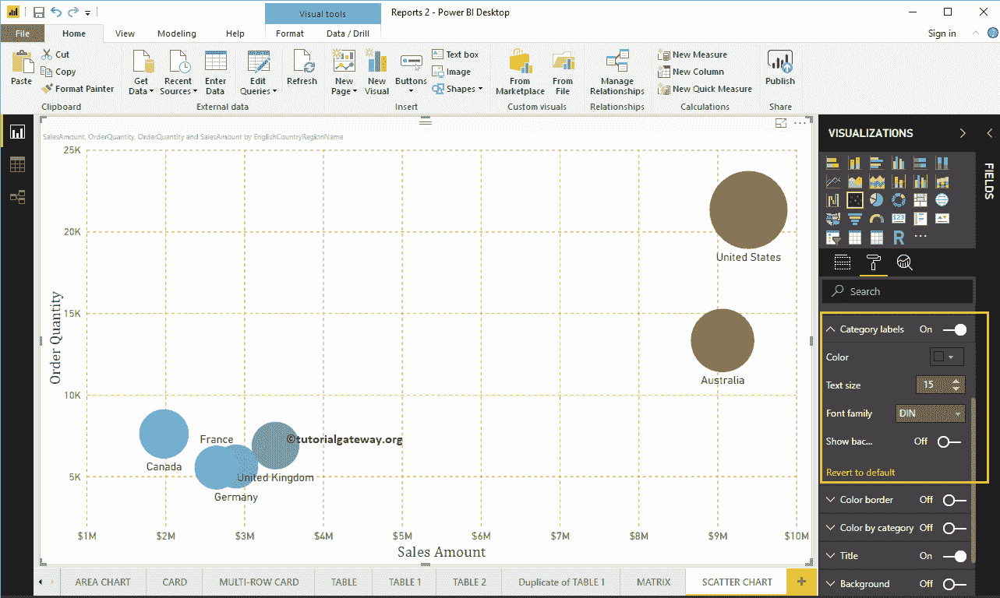

### 设置商务智能散点图边框颜色

通过将“颜色边框”选项从“关闭”切换到“打开”，您可以启用圆形(或您选择的任何形状)的边框。

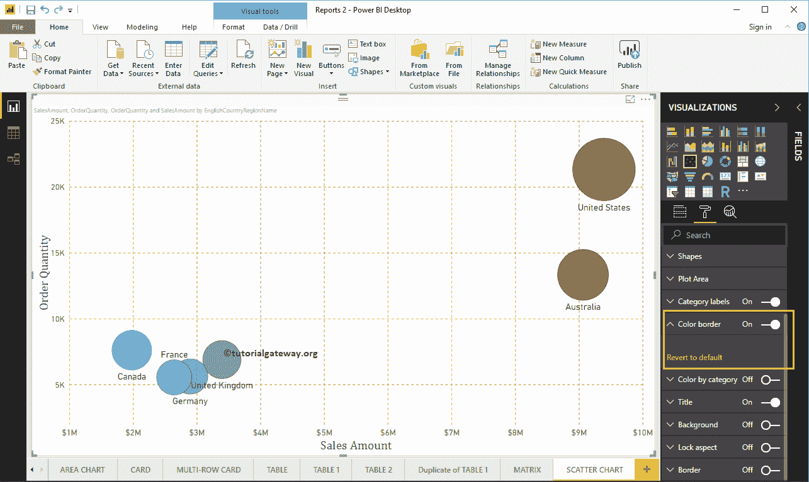

### 设置商务智能散点图标题的格式

通过将标题选项从打开切换到关闭，您可以禁用散点图标题。

从下面的截图中，您可以看到我们将标题文本更改为按国家/地区名称列出的销售金额和订单数量。接下来，将字体颜色设置为绿色，将文本大小设置为 25，将字体系列设置为乔治亚，将标题对齐居中。如果你愿意，你也可以给标题加上背景色。

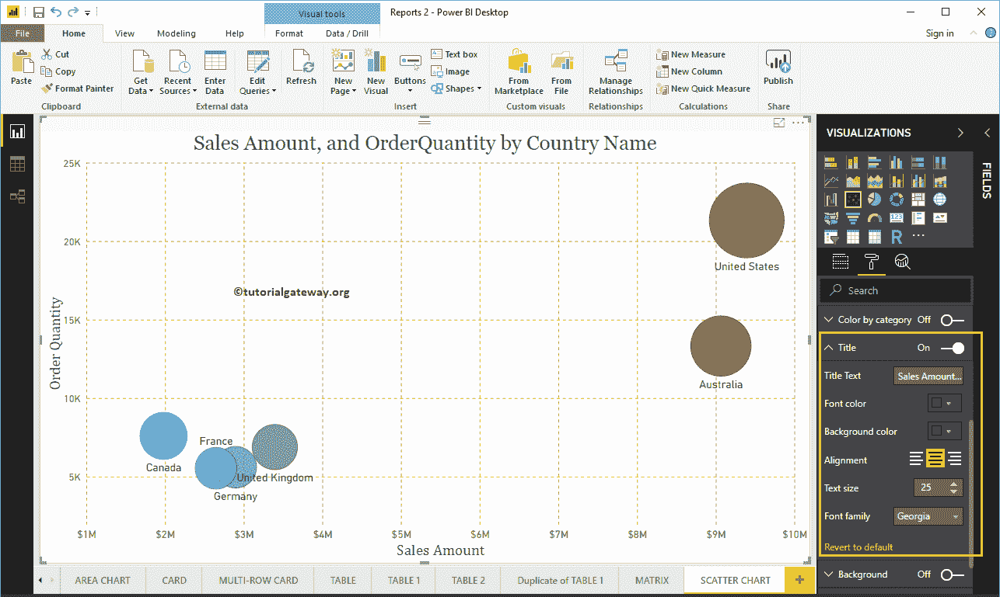

### 设置商务智能散点图背景色和边框的格式

通过将“背景”选项切换为“开”，可以将背景颜色添加到散点图中。出于演示目的，我们添加了透明度为 40%的黄色。

同样，您可以通过将“边框”选项从“关闭”切换到“打开”来向散点图添加边框。

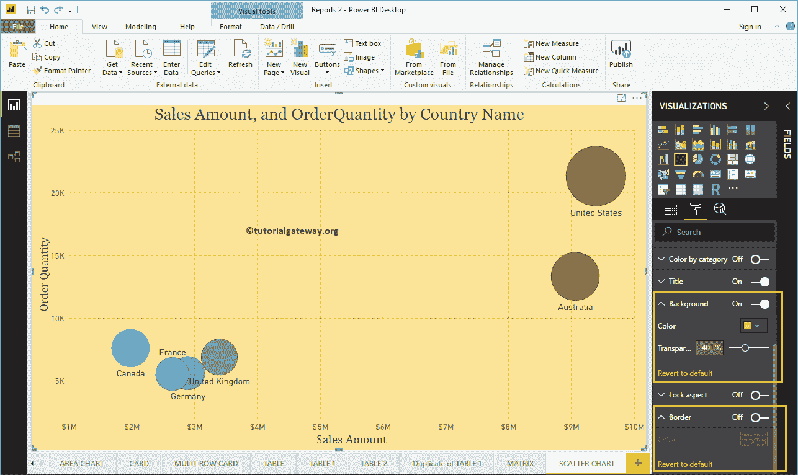

### 格式化 PowerBI 散点图数据颜色–第 2 部分

如果您在设计散点图时没有将任何测量值放入“颜色饱和度”部分，则“数据颜色”部分会显示以下选项。默认情况下，它会选择一些随机的颜色，但您可以根据自己的要求进行更改。

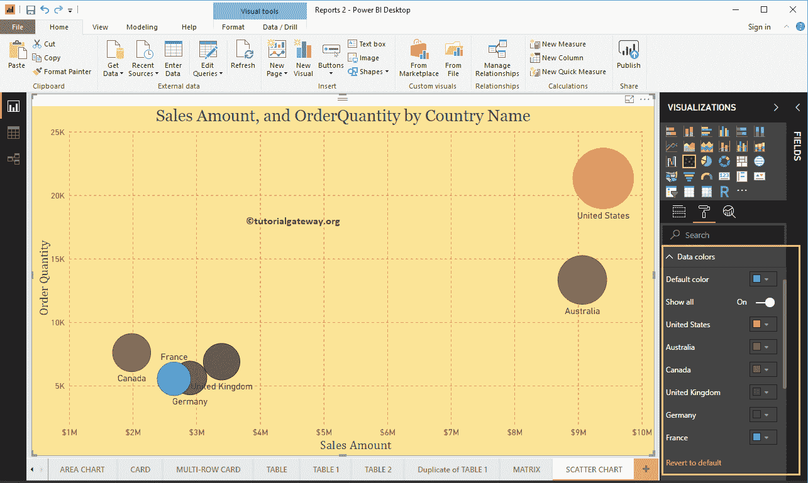