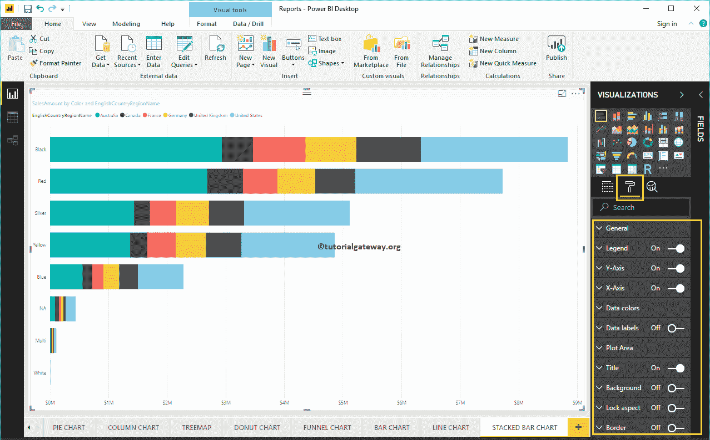
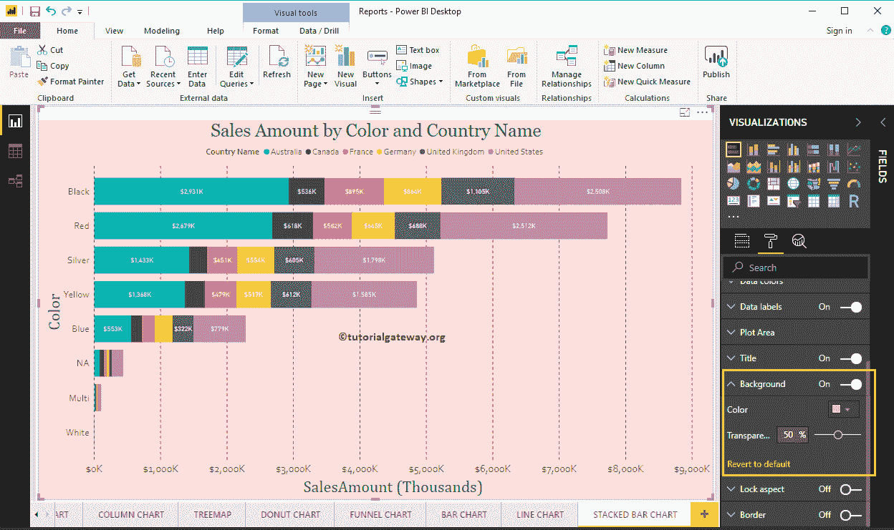

# 格式化 PowerBI 中堆叠条形图

> 原文：<https://www.tutorialgateway.org/format-stacked-bar-chart-in-power-bi/>

如何用实例格式化 Power BI 中的堆叠条形图？。格式化 Power BI 堆叠条形图包括更改堆叠条形图颜色、标题文本、位置、数据标签、轴字体和背景颜色等。

为了演示 Power BI 堆叠条形图格式选项，我们将使用之前创建的堆叠条形图。请参考[PowerBI 堆叠条形图](https://www.tutorialgateway.org/power-bi-stacked-bar-chart/)一文。

## 如何在 PowerBI 中格式化堆叠条形图

请单击“格式”按钮查看适用于此堆积条形图的格式选项列表。

### 格式化堆叠条形图常规部分

使用此常规部分更改堆叠条形图的 X 位置、Y 位置、宽度和高度

### Power BI 中堆叠条形图的格式图例

要显示或启用图例，请选择[PowerBI](https://www.tutorialgateway.org/power-bi-tutorial/) 图例区域，并将选项从关闭切换到打开。您可以使用“位置”下拉框来更改图例位置。

从下面的截图中可以看到，我们添加了图例标题作为国家名称，图例位置作为顶部中心。接下来，我们还将颜色更改为棕色，字体系列更改为牛腿，文本大小更改为 12。

### PowerBI 堆积条形图的 Y 轴

正如您从下面的截图中看到的，我们将 Y 轴标签颜色更改为棕色，文本大小更改为 18，字体样式更改为牛腿。您可以使用最小类别宽度、最大大小和内部填充选项来更改栏宽

默认情况下，Y 轴标题设置为关闭，但您可以通过将 Y 轴部分下的标题切换为打开来启用它。让我将标题颜色更改为绿色，标题文本大小更改为 30，字体样式更改为柬埔寨。

### PowerBI 中堆叠条形图的 X 轴格式

从下面的截图可以看到，我们将颜色改为棕色，字体样式改为牛腿，文本大小改为 20，显示单位改为千(默认为自动)。

默认情况下，X 轴标题设置为关闭，但您可以通过将标题切换为打开来启用它。让我将标题颜色更改为绿色，字体样式更改为红色，字体大小更改为 30。

通过将“网格线”选项从“开”切换到“关”，可以禁用堆积条形图网格线。

*   颜色:您可以更改网格线颜色。
*   描边宽度:用它来改变网格线的宽度。
*   线条样式:选择线条样式，如实线、虚线和虚线。

### 设置 PowerBI 堆叠条形图数据颜色的格式

默认情况下，Power BI 会为每个条形分配一些默认颜色。让我把美国的颜色改成粉色。

### 为 PowerBI 堆叠条形图启用数据标签

堆积条形图数据标签显示关于每个单组水平条形图的信息。在这种情况下，它显示每个国家的销售金额。要启用数据标签，请将数据标签选项切换为打开。

让我将颜色更改为白色，字体系列更改为 DIN，文本大小更改为 10

### 在 PowerBI 绘图区设置堆叠条形图的格式

您可以使用此绘图区域部分添加图像作为堆叠条形图的背景。出于演示目的，我们添加了一个图像作为绘图区域背景。

### 在 Power BI 标题中设置堆叠条形图的格式

通过将标题选项从打开切换到关闭，您可以禁用条形图标题。

从下面的截图中可以看到，我们将标题文本更改为按颜色和国家/地区名称的销售额。我们还将字体颜色改为绿色，字体系列改为乔治亚，字体大小改为 25，标题对齐改为居中。如果你愿意，你也可以给标题加上背景色。

### Power BI 中堆叠条形图的格式背景色

通过将“背景”选项切换为“开”，可以将背景颜色添加到条形图中。为了演示，我们添加了背景色。

### 设置堆叠条形图的边框格式

通过将边框选项从关闭切换到打开，可以将边框添加到折线图中。

